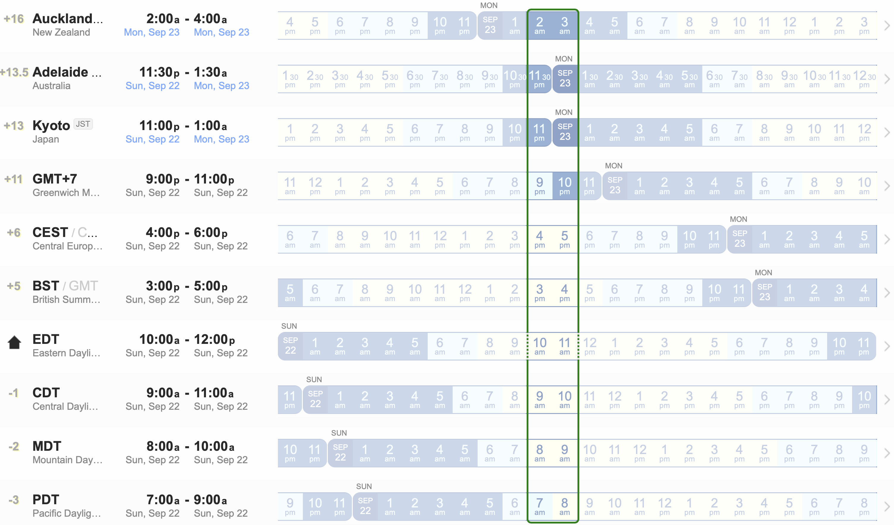

Welcome to the 2024 - 2025 School Year of the Math Club & Competitions!

Please read carefully the content below. If you have any personal question, send it directly the club. if you have any general question that might be concern of other students, send it to the mailing list.

### A. Level Groups

There are 4 level groups for students from grades 4 to 12:

| Level | a.k.a        | for whom?                                                                                                                                                                    |
|-------|--------------|------------------------------------------------------------------------------------------------------------------------------------------------------------------------------|
| G1    | beginners    | absolute no prerequisite is required for joining this group. All students will learn basic approach to mathematics and problem solving.                                      |
| G2    | intermediate | who have an understanding of basic mathematical concepts and obtained a few skills to solve math problem. They are capable of writing their own solution to a given problem. |
| G3    | advance      | who are ready to go on the track to master enough knowledge and skills to solve any math problems in school and willing to go the distance for national competitions.        |
| G4    | olympiad     | who are about to be ready or already proven themselves in competitions and now preparing for upcoming and new challenges.                                                    |

### B. Official Curriculum

The student will use the official [2024-2025 curriculum](https://drive.google.com/file/d/13mwcNV9et5dG1OMAAgAIPAQ3TFU9wjVL/view?usp=sharing) for to study in Semester 1.

What part of the curriculum the student learns is based on his/her level group as follow:

| Level | Chapters          | Part                          |
|:-----:|:-----------------:|:-----------------------------:|
|   G1  | Chapters 03 to 10 | Part II - Beginner Level      |
|   G2  | Chapters 11 to 18 | Part III - Intermediate Level |
|   G3  | Chapters 19 to 26 | Part IV - Advanced Level      |
|   G4  | Chapters 27 to 34 | Part V - Olympiad Level       |

You can also checkout the official solutions for the entrance test day 1 & 2 in Part I of the book.

### C. Programs

#### C.1. Fundamental program

In every week of the first 4 weeks of every 6-week cycle, the student attends a 30-minute seminar on a topic on Sunday, then practicing on home assignment from the content of the seminar, then a 90-minutes test on the following Saturday In short, every week from Sunday to Saturday, students need about 7 hours, equivalent to 1 hour/day.

#### C.2. Enrichment program

This is an *optional program,* offering for students G2, G3, and G4 only, to help them to study more deeply and work with teammates
- In every 6 weeks, a team challenge consisting of a number of problems are issued. The members of a team will work together solve and submit solutions at deadlines. Teams submitted great solutions will be invited for presentation in seminars.
- In addition, the team will be participating a team test in every 6 weeks. Everybody should work together online during the 90-minute test and submit together the solution.
It is expected that participating student needs to invest an additional 7 hours/week for this program.

Where the teams can find the Team Challenge in the curriculum: Part VI - Monthly Challenges

#### C.3. Grading team submission

It is impossible to balance teams for a fair contest, especially when allowing self-organized teams to be formed.
We will use two different measures: (i) absolute score: and (2) relative score. Below is an example (not related anyhow to the current team compositions.)

*Assume that the team test containing 10 problems: 4 at G2 difficulty, 4 at G3, and 2 at G4. Each problem is worth of 10 points.*

*The team strength is the sum of the product of the numbers of each members at each difficulty (G2-3-4) multiply with a weight (1, 2, 3).*
For example Team T2 has a mix of 2 G2, 4 G3, and 0 G4 members, their team strength is: `2 * 1.0 + 4 * 2.0 = 10.`
Team T4 has 3 G2, 1 G3, and 1 G4 members, their team strength is: `3 * 1.0 + 1 * 2.0 + 1 * 3.0 = 8.`

*The absolute score is the sum of the points the team earn from solving the problem, without any modification by weight.*
For example Team T2 has solved of 3 G2, 4 G3, their absolute score is 70.
Team T4 has solved 3 G2, 2 G3, and 2 G4, their absolute score is also 70.

*For relative score is the the sum of the points the team earn from solving the problem weighted by the difficulties of the problems (1, 1.5, 2), then divided by their team strength.*
Team T2 has achieved `(3 * 1.0 + 4 * 1.5) * 10 / 10 = 9.`
Team T4 has achieved `(3 * 1.0 + 2 * 1.5  + 2 * 2.0) * 10 / 8 = 12.5.`

### C.4. Learning calendar

<table class="tg"><thead>
  <tr>
    <th class="tg-trlr" rowspan="2">6-week cycle</th>
    <th class="tg-trlr" rowspan="2">Program</th>
    <th class="tg-trlr" rowspan="2">Session</th>
    <th class="tg-trlr" rowspan="2">Seminar Day</th>
    <th class="tg-trlr" rowspan="2">Q&amp;A Day</th>
    <th class="tg-trlr" rowspan="2">Individual Test Day</th>
    <th class="tg-trlr" rowspan="2">Team Test Day</th>
    <th class="tg-trlr" rowspan="2">Team Challenge Day</th>
    <th class="tg-trlr" colspan="2">Grading</th>
    <th class="tg-trlr" colspan="2">Review</th>
  </tr>
  <tr>
    <th class="tg-trlr">Begin</th>
    <th class="tg-trlr">End</th>
    <th class="tg-trlr">Begin</th>
    <th class="tg-trlr">End</th>
  </tr></thead>
<tbody>
  <tr>
    <td class="tg-trlr" rowspan="6">Cycle 1</td>
    <td class="tg-trlr" rowspan="4">Fundamental</td>
    <td class="tg-2qwx">S1</td>
    <td class="tg-2qwx">Sep 22</td>
    <td class="tg-hrrh"></td>
    <td class="tg-2qwx">Sep 28</td>
    <td class="tg-hrrh"></td>
    <td class="tg-hrrh"></td>
    <td class="tg-2qwx">Sep 29</td>
    <td class="tg-2qwx">Oct 3</td>
    <td class="tg-2qwx">Oct 4</td>
    <td class="tg-2qwx">Oct 5</td>
  </tr>
  <tr>
    <td class="tg-2qwx">S2</td>
    <td class="tg-2qwx">Sep 29</td>
    <td class="tg-hrrh"></td>
    <td class="tg-2qwx">Oct 5</td>
    <td class="tg-hrrh"></td>
    <td class="tg-hrrh"></td>
    <td class="tg-2qwx">Oct 6</td>
    <td class="tg-2qwx">Oct10</td>
    <td class="tg-2qwx">Oct 11</td>
    <td class="tg-2qwx">Oct 12</td>
  </tr>
  <tr>
    <td class="tg-2qwx">S3</td>
    <td class="tg-2qwx">Oct 6</td>
    <td class="tg-hrrh"></td>
    <td class="tg-2qwx">Oct 12</td>
    <td class="tg-hrrh"></td>
    <td class="tg-hrrh"></td>
    <td class="tg-2qwx">Oct 13</td>
    <td class="tg-2qwx">Oct 17</td>
    <td class="tg-2qwx">Oct 18</td>
    <td class="tg-2qwx">Oct 19</td>
  </tr>
  <tr>
    <td class="tg-2qwx">S4</td>
    <td class="tg-2qwx">Oct 13</td>
    <td class="tg-hrrh"></td>
    <td class="tg-2qwx">Oct 19</td>
    <td class="tg-hrrh"></td>
    <td class="tg-hrrh"></td>
    <td class="tg-2qwx">Oct 20</td>
    <td class="tg-2qwx">Oct 24</td>
    <td class="tg-2qwx">Oct 26</td>
    <td class="tg-2qwx">Oct 26</td>
  </tr>
  <tr>
    <td class="tg-trlr" rowspan="2">Enrichment</td>
    <td class="tg-2qwx">S5</td>
    <td class="tg-hrrh"></td>
    <td class="tg-2qwx">Oct 20</td>
    <td class="tg-hrrh"></td>
    <td class="tg-2qwx">Oct 26</td>
    <td class="tg-hrrh"></td>
    <td class="tg-2qwx">Oct 27</td>
    <td class="tg-2qwx">Oct 31</td>
    <td class="tg-2qwx">Nov 1</td>
    <td class="tg-2qwx">Nov 2</td>
  </tr>
  <tr>
    <td class="tg-2qwx">S6</td>
    <td class="tg-hrrh"></td>
    <td class="tg-2qwx">Oct 27</td>
    <td class="tg-hrrh"></td>
    <td class="tg-hrrh"></td>
    <td class="tg-2qwx">Nov 2</td>
    <td class="tg-2qwx">Nov 3</td>
    <td class="tg-2qwx">Nov 7</td>
    <td class="tg-2qwx">Nov 8</td>
    <td class="tg-2qwx">Nov 9</td>
  </tr>
  <tr>
    <td class="tg-hrrh"></td>
    <td class="tg-hrrh"></td>
    <td class="tg-hrrh"></td>
    <td class="tg-hrrh"></td>
    <td class="tg-hrrh"></td>
    <td class="tg-hrrh"></td>
    <td class="tg-hrrh"></td>
    <td class="tg-hrrh"></td>
    <td class="tg-hrrh"></td>
    <td class="tg-hrrh"></td>
    <td class="tg-hrrh"></td>
    <td class="tg-hrrh"></td>
  </tr>
  <tr>
    <td class="tg-trlr" rowspan="6">Cycle 2</td>
    <td class="tg-trlr" rowspan="4">Fundamental</td>
    <td class="tg-2qwx">S7</td>
    <td class="tg-2qwx">Nov 3</td>
    <td class="tg-hrrh"></td>
    <td class="tg-2qwx">Nov 9</td>
    <td class="tg-hrrh"></td>
    <td class="tg-hrrh"></td>
    <td class="tg-2qwx">Nov 10</td>
    <td class="tg-2qwx">Nov 14</td>
    <td class="tg-2qwx">Nov 15</td>
    <td class="tg-2qwx">Nov 16</td>
  </tr>
  <tr>
    <td class="tg-2qwx">S8</td>
    <td class="tg-2qwx">Nov 10</td>
    <td class="tg-hrrh"></td>
    <td class="tg-2qwx">Nov 16</td>
    <td class="tg-hrrh"></td>
    <td class="tg-hrrh"></td>
    <td class="tg-2qwx">Nov 17</td>
    <td class="tg-2qwx">Nov 21</td>
    <td class="tg-2qwx">Nov 22</td>
    <td class="tg-2qwx">Nov 23</td>
  </tr>
  <tr>
    <td class="tg-2qwx">S9</td>
    <td class="tg-2qwx">Nov 17</td>
    <td class="tg-hrrh"></td>
    <td class="tg-2qwx">Nov 23</td>
    <td class="tg-hrrh"></td>
    <td class="tg-hrrh"></td>
    <td class="tg-2qwx">Nov 24</td>
    <td class="tg-2qwx">Nov 28</td>
    <td class="tg-2qwx">Nov 29</td>
    <td class="tg-2qwx">Nov 30</td>
  </tr>
  <tr>
    <td class="tg-2qwx">S10</td>
    <td class="tg-2qwx">Nov 24</td>
    <td class="tg-hrrh"></td>
    <td class="tg-2qwx">Nov 30</td>
    <td class="tg-hrrh"></td>
    <td class="tg-hrrh"></td>
    <td class="tg-2qwx">Dec 1</td>
    <td class="tg-2qwx">Dec 5</td>
    <td class="tg-2qwx">Dec 6</td>
    <td class="tg-2qwx">Dec 7</td>
  </tr>
  <tr>
    <td class="tg-trlr" rowspan="2">Enrichment</td>
    <td class="tg-2qwx">S11</td>
    <td class="tg-hrrh"></td>
    <td class="tg-2qwx">Dec 1</td>
    <td class="tg-hrrh"></td>
    <td class="tg-2qwx">Dec 7</td>
    <td class="tg-hrrh"></td>
    <td class="tg-2qwx">Dec 8</td>
    <td class="tg-2qwx">Dec 12</td>
    <td class="tg-2qwx">Dec 13</td>
    <td class="tg-2qwx">Dec 14</td>
  </tr>
  <tr>
    <td class="tg-2qwx">S12</td>
    <td class="tg-hrrh"></td>
    <td class="tg-2qwx">Dec 8</td>
    <td class="tg-hrrh"></td>
    <td class="tg-hrrh"></td>
    <td class="tg-2qwx">Dec 14</td>
    <td class="tg-2qwx">Dec 15</td>
    <td class="tg-2qwx">Dec 29</td>
    <td class="tg-2qwx">Dec 20</td>
    <td class="tg-2qwx">Dec 21</td>
  </tr>
</tbody></table>

#### C.4.1. 6-week Cycles

The school calendar is divided into 6-week cycle. In the first semester, we have 2 cycles. See above.

Each cycle contains 6 sessions, each is intended to be within a week:
- On the first day of the cycle, if the student registered for the Enrichment program, his/her team will receive a Team Challenge consisting a set of problems to be solved. The deadline is the last Saturday of the cycle (Saturday of week 6.)
- In the first 4 weeks, the student starts the week by:
    + On Sunday (Seminar Day): attending to the lecture seminar (see below about scheduled times of the seminars),
    + From Monday to Friday: practicing what was learned on additional examples and problems. Note that all problems have accompanied solutions. Try solve by yourself before reading the solutions.
    + On Saturday (Individual Test Day): take an individual test and submit the solutions to assigned Google folder (see below about the scheduled times of the individual tests).
- In week 5:
    + On Sunday (Q&A Day): attending to the Q&A seminar, where some problems of individual tests are discussed (see below about scheduled times of the seminars), attending students and parents can ask any questions.
    + From Monday to Friday: Teams (of Enrichment students) work on the Team Challenge
    + On Saturday (Team Test Day): Teams (of Enrichment students) take a Team Test together with their team members. Each team submits a single set of solutions.
- In week 6:
    + On Sunday: attending to the Q&A seminar, where some problems of team tests are discussed (see below about scheduled times of the seminars), attending students and parents can ask any questions.
    + From Monday to Friday: Teams (of Enrichment students) continue to work on the Team Challenge
    + On Saturday (Team Challenge Day): Each team submits a single set of solutions for a Team Challenge (see below about scheduled times of the tests).

Above, you can see that periods when the submissions will be graded and reviewed.

#### C.4.2. Seminar Times

Use **[this link](https://www.worldtimebuddy.com/?qm=1&lid=2193733,2078025,1857910,127,12,14,305,306,307,308&h=305&date=2024-9-22&sln=10-12&hf=1&c=1444)** to see what time in your timezone corresponds to the times in other zones.

Each seminar lasts for 30 minutes. The timezone for each student is on the list of all admitted students:

| Level |               Time               |
|:-----:|:--------------------------------:|
|   G1  | 10:00 AM - 10:30 AM Eastern Time |
|   G2  | 10:30 AM - 11:00 AM Eastern Time |
|   G3  | 11:00 AM - 11:30 AM Eastern Time |
|   G4  | 11:30 AM - 12:00 PM Eastern Time |

Zoom links to each of the seminars will be provided.

#### C.4.3. Test Times

Students with in a group of timezones, see below, will participate both individual and team tests at the same time:

| Timezone group |               Time               |
|:--------------:|:--------------------------------:|
|   VN+AU+JP+NZ  | 00:00 AM - 01:30 AM Eastern Time |
|    UK+FR+ES    | 05:00 AM - 06:30 AM Eastern Time |
|      CA+US     | 10:00 AM - 11:30 AM Eastern Time |
|       N/A      | 10:00 AM - 11:30 PM Eastern Time |

All the test problems are sent directly to the student emails. All submissions must be uploaded to individual folders - if it is an individual test,
a captain's or lieutenant's folder - if it is a team test.
