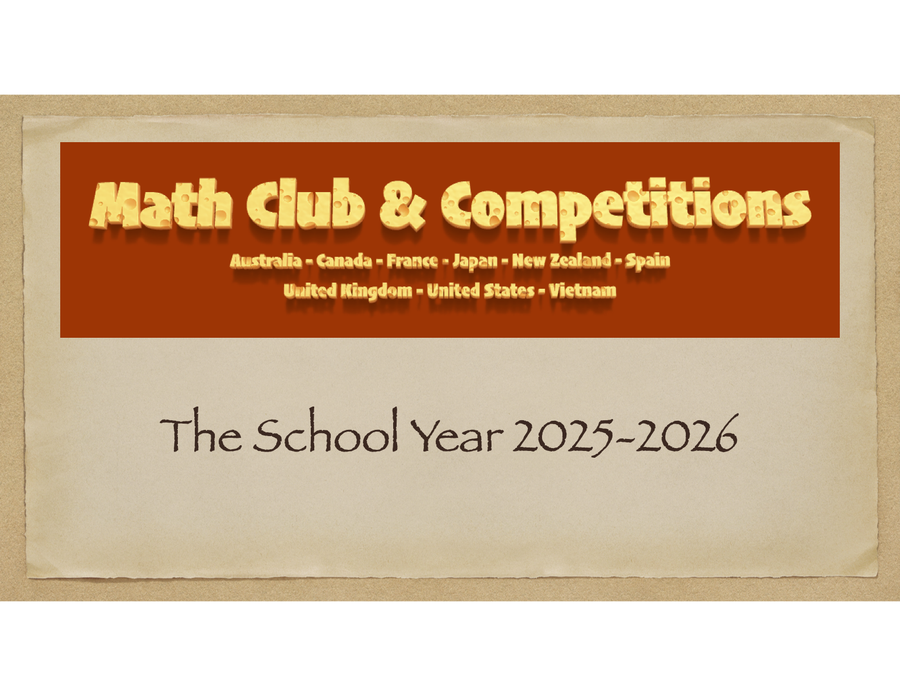

**Read the [Summary of School Programs](https://drive.google.com/file/d/1H0kACqZgDTLDe3hWgxSFv9U9aHrNVtHf/view?usp=sharing).**

# [The School Year 2025-2026](#the-school-year-2025-2026)

## A. Individual Tracks

### **I1.**

This is the entry point into serious mathematical problem-solving. Students begin learning how to carefully read problem statements, recognize key ideas, and take systematic first steps. The track follows the Art of Problem Solving Introductory Curriculum (Algebra, Counting & Probability, Geometry, and Number Theory). The focus is on building a strong foundation: understanding concepts, practicing all types of exercises, and starting to write clear, step-by-step solutions.

Follow [Individual One](./i1.md) for more information.

### **I2.**

This track continues and deepens the work of I1. Students now handle problems with more steps and slightly higher complexity. The emphasis is on developing independence in problem-solving, gaining speed, and tackling challenge problems beyond the basics. By the end of I2, students are expected to be comfortable with the full AoPS Introductory series and prepared to transition into the first level of contest training.

Follow [Individual Two](./i2.md) for more information.

## B. Team Tracks

### **T1.**

This is the entry point into collaborative contest training. Students begin working in pairs (or teams of three with approval) and learn how to approach multi-step, contest-style problems. The emphasis is on teamwork: discussing ideas, structuring full solutions together, and learning from mistakes. T1 bridges the Introductory Curriculum into team-based contest preparation, helping students gain confidence in reasoning, writing, and presenting solutions.

Follow [Team One](./t1.md) for more information.

### **T2.**

At this level, teams tackle more demanding contest problems across algebra, number theory, combinatorics, and geometry. Students are expected to see connections between ideas, sustain longer arguments, and improve their proof-writing skills. The problems are comparable to AMC10/12 and early national contest qualifiers. T2 emphasizes persistence, strategy, and collaboration as teams learn to refine solutions under time limits.

Follow [Team Two](./t2.md) for more information.

### **T3.**

This track trains students for national olympiad-level problem solving. Problems now require deeper insight, standard olympiad theorems, and creative synthesis across multiple areas. Teams practice breaking down unfamiliar problems, planning approaches, and writing rigorous, complete solutions. T3 emphasizes flexibility in strategy, clarity of explanation, and collaborative review — all key skills for higher-level contests.

Follow [Team Three](./t3.md) for more information.

### **T4.**

The most advanced training level, for teams already capable of solving olympiad problems. The focus is on mastery: learning advanced techniques, polishing solution writing to the highest standard, and developing stamina for multi-hour contests. Students are guided to think strategically about whole problem sets, manage time effectively, and present solutions at the level expected in international olympiads. T4 is the preparation ground for those aiming at the IMO level and beyond.

Follow [Team Four](./t4.md) for more information.

&nbsp;

## B. Competitions & Awards

🥇 **The MCC Championship**  
Awarded to the **top 5 teams** with the highest average score across all weekly contests throughout the school year. This is the premier recognition of sustained teamwork, consistency, and excellence.  

💯 **Top Perfect-Scorers**  
Recognizes the **top 5 teams** that achieve the most perfect scores during the year. This award highlights accuracy, persistence, and mastery across contests.  

❄ **Snowflake Cup** (just before Christmas)  
“Every solution, like every snowflake, is unique.”  
Recognizes the **top 5 teams/individuals** with the most elegant and well-written solutions, celebrating creativity and clarity in mathematical reasoning.  

🥚 **The Mystical Egg** (just before Easter)  
“Every problem hides a clever trick—can you find it?”  
Recognizes the **top 5 teams/individuals** with outstanding performance on puzzle-style problems, rewarding ingenuity and outside-the-box thinking.  

📜 **ICLT Achievement Certificates**  
Granted to all students who successfully pass any **ICLT test**, serving as a personal mark of individual mastery and progress.  

📖 **Pi Challenge (Monthly)**  
From September onward, every MCC student receives **e-readership to *Pi Magazine***.  
- Each month, students receive the translated **Pi problem-solving challenge** in English.  
- Submissions must be written in English and sent both to *Pi Magazine* (for international recognition) and to MCC teachers (for record-keeping).  
- Winners of the Pi Challenge will be formally announced in June.  
This competition trains students to write polished, international-standard solutions.  

🌍 **Purple Comet! Math Meet**  
MCC teams participate in the international **Purple Comet! Math Meet** each April.  
Top-performing MCC teams will be recognized publicly on [PurpleComet.org](https://purplecomet.org) for their international achievement.  

🎁 **Special Recognition – “100 Problems for Absolute Beginners”**  
Any **individual or team** that achieves **three perfect scores** across contests will receive a complimentary copy of *100 Problems for Absolute Beginners*, personally dedicated by the teacher.  
This book may be kept or gifted to a friend — a lasting mark of problem-solving achievement.  

&nbsp;

## C. Competitions & Awards Timeline (2025–2026)

📖 **September – June (Monthly)**  
- **Pi Challenge (Pi Magazine)**  
  Students receive and solve the monthly *Pi Magazine* problem set.  
  Submissions in English to both *Pi* and MCC teachers.  
  Winners announced in **June**.  

🥇 **September – June (Throughout Year)**  
- **MCC Championship & Top Perfect-Scorers**  
  Every team test contributes to these year-long awards.  
  Results tallied at the end of the school year.  

❄ **December (just before Christmas)**  
- **Snowflake Cup**  
  Celebrates the most elegant and original solutions of the first semester.  

🥚 **April (just before Easter)**  
- **The Mystical Egg**  
  Rewards ingenuity and clever tricks in problem solving.  

🌍 **April**  
- **Purple Comet! Math Meet**  
  MCC teams compete internationally.  
  Top teams recognized on PurpleComet.org.  

📜 **June**  
- **ICLT Achievement Certificates**  
  Awarded to students who successfully pass any ICLT test.  

🎁 **June**  
- **Special Recognition**  
  Any individual or team with **3 perfect scores** during the year  
  receives a dedicated copy of *100 Problems for Absolute Beginners*.  

🥇 **June**  
- **MCC Championship & Top Perfect-Scorers Results Announced**  
  End-of-year recognition for the best performing teams.  

&nbsp;

## D. Membership Policy

The annual memberhip is **the same across all groups (I1–2 and T1–4)**, and it is based on **last year’s academic performance**. Students who achieved **more than 75% last year are exempt from paying** regardless of whether they are now in I or T. This ensures **fairness and consistency**.

Joining I or T is a **personal choice** and reflects each student’s **goals and level of commitment**. The I groups naturally have a **lighter workload**, while the T groups take on **more**. This is **not a reward or a penalty**, but simply a difference in participation. Importantly, **every student starts from I1 and then progresses step by step**. The learning path is the same for everyone, with the only difference being how far each student advances along it.

This is a **club membership fee**, not tuition for I or T. It reflects **results from the previous year**, not the track chosen this year. For example, some students in I1 contribute **50%**, while others in T1 contribute **100%**. Therefore, it is not a matter of one group being treated better or worse than another.

If the contribution creates **financial difficulty**, families may request a **reduction or waiver**. Finally, please remember that participation in the club is **entirely voluntary**. If the contribution or structure does not suit your family, you are **free not to continue**.

