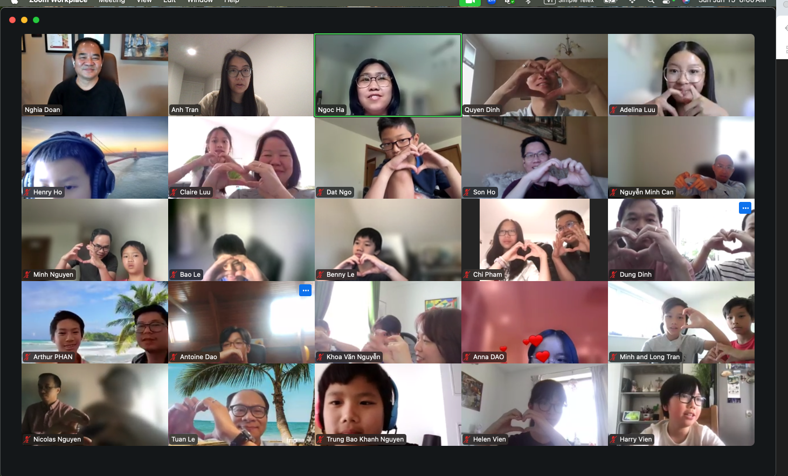
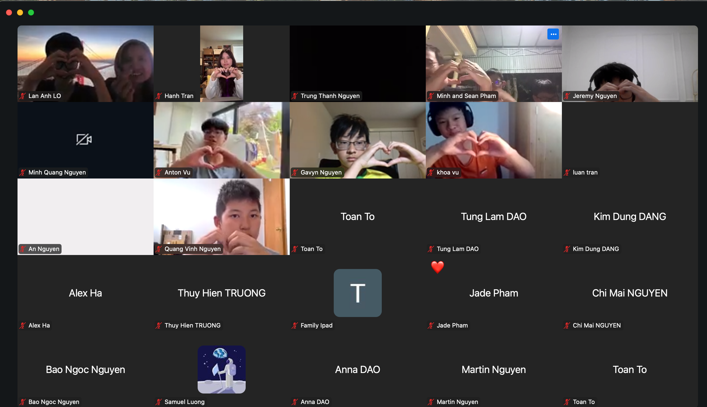
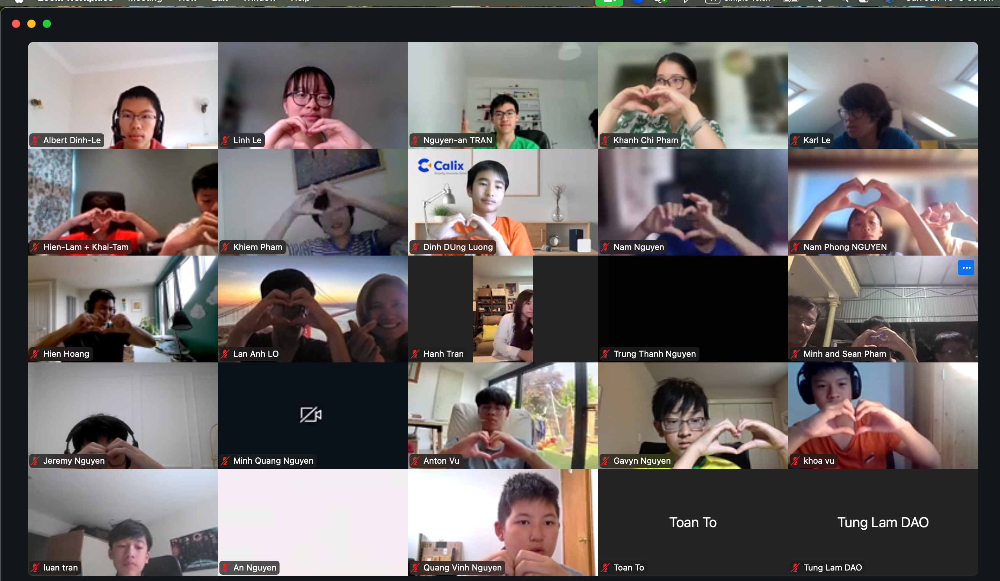
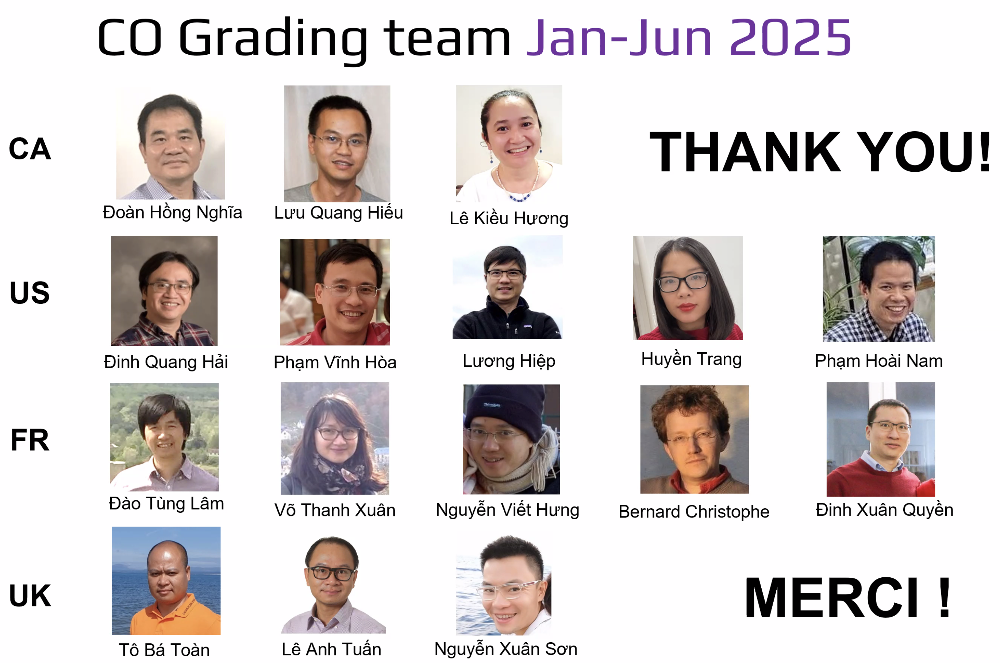

## 1. [Plan for the School Year 2025-2026](#1-plan-for-the-school-year-2025-2026)

### 1.1 The Plan:

Read the [📗 Plan for the 2025–2026 School Year](https://drive.google.com/file/d/14pvTXzHbJYM4vlOUiAEzeKcJzZlWozdm/view?usp=share_link). 

Đọc [Kế hoạch cho Năm học 2025–2026](https://drive.google.com/file/d/14pvTXzHbJYM4vlOUiAEzeKcJzZlWozdm/view?usp=share_link) trước khi tiếp tục.

### 1.2 Register: DEADLINE July 13, 2025

### 1.2.1 📋 School Year 2025–2026 Registration Forms - Đăng ký cho Năm học 2025–2026:

- 🧑‍🎓 Current students: please use [this form](https://forms.gle/9BkNG1Z3XmrW8KycA)
- 🆕 New students: please use [this form](https://forms.gle/6Nf9eQrrkgTF3p3Q6)

### 1.2.2 📝 Admission Test (for new students, if required) - Bài kiểm tra đầu vào (nếu cần thiết): 

The test consists of two days, selected from the following: 📅 August 9, 10, 16, or 17. 

Bài kiểm tra diễn ra trong hai ngày, bạn chọn từ các ngày sau: 📅 Ngày 9, 10, 16 hoặc 17 tháng 8

### 1.2.3 📚 Materials for Preparation

- C2: Review the first 5 levels of the AoPS books. 
- T1/2/3/4: Review the 2024-2025 curriculum. 
- If you are already a member of the club, you should have access to both the 2024-2025 curriculum and the AoPS books.
- If you are not a member, please register for School Year 2025 - 2026. At the end of the form, where it asks for your questions, request access to the material.

Tài liệu ôn tập:
- Nhóm C2: Ôn tập 5 cấp đầu tiên của sách AoPS
- Nhóm T1–T4: Ôn tập chương trình năm học 2024–2025
- Nếu bạn là thành viên hiện tại, bạn đã có quyền truy cập
- Nếu chưa, hãy đăng ký theo biểu mẫu trên. Ở cuối mẫu, nơi yêu cầu ghi câu hỏi, hãy yêu cầu cấp quyền truy cập tài liệu

### 1.2.4 💵 Admission Test Fee: 

- You only pay the Admission Test fee if it is required. Bạn chỉ cần đóng lệ phí nếu bắt buộc phải thi đầu vào.

### 1.2.5 Once admission tests are completed - Sau khi hoàn tất xét tuyển:

- Learning scheduling - Lên kế hoạch học tập
- Membership payment - Thanh toán phí thành viên

### 1.3 Advice for parents

- How can we make math more enjoyable? Not a set of dry lessons. Not a series of drills. But something that sparks curiosity. Something that feels like solving a mystery, discovering a pattern, unlocking a secret?
- Over the past 10 years, I’ve taught hundreds of students — from beginners to competition-level learners — and learned one thing: The right problem explained the right way can change everything. That’s why I wrote this book. It’s a collection of knowledge, ideas, and teaching insights gathered over a decade of working with young learners. 
It’s designed to help students fall in love with problem solving — not by making things easier, but by making them more meaningful. I’d love to share it with you. It’s an ebook, you get it in your hand in 5 minutes.

[100 Math Problems for Absolute Beginners](https://www.lulu.com/shop/nghia-doan/100-math-problems-for-absolute-beginners/ebook/product-p69y785.html?page=1&pageSize=4)

[100 Bài Toán Dành Cho Người Mới Bắt Đầu](https://www.lulu.com/shop/nghia-doan/100-bài-toán-dành-cho-người-mới-bắt-đầu/ebook/product-rm68v54.html?page=1&pageSize=4)

&nbsp;

## 2. 🏆 About MCC – Giới thiệu về MCC

## 2.1 A Global Math Club

Founded in Canada, MCC has grown into a vibrant international community where students from around the world come together to train, compete, and explore mathematics. The club offers free coaching, weekly challenges, and team contests, all designed to help develop strong problem-solving skills.

In 2025, MCC made headlines at the Purple Comet Math Meet, one of the world’s largest online math competitions with over 4,600 teams from more than 80 countries: Middle School Team One earned a perfect score and placed 1st in the world, High School Teams One and Two both scored 26/30, earning Honorable Mentions on the global leaderboard!

MCC students have also performed strongly at national math Olympiads in Canada, the USA, the UK, and France, with several qualifying for advanced training programs and team selections.

&nbsp;

Câu Lộc Bộ Toán Học Toàn Cầu

MCC khởi đầu tại Canada và đã phát triển thành một cộng đồng toán học quốc tế sôi động, nơi học sinh từ nhiều quốc gia cùng học, luyện tập và thi đấu. CLB cung cấp các buổi huấn luyện miễn phí, thử thách hàng tuần và các kỳ thi đồng đội, nhằm rèn luyện kỹ năng tư duy và giải quyết vấn đề.

Năm 2025, MCC tiếp tục ghi dấu ấn tại kỳ thi Purple Comet Math Meet — một trong những cuộc thi toán trực tuyến lớn nhất thế giới với hơn 4.600 đội từ hơn 80 quốc gia: Đội THCS số 1 đạt điểm tuyệt đối và xếp Hạng Nhất Thế Giới, Hai đội THPT cùng đạt 26/30 điểm, được Vinh Danh Toàn Cầu (Honorable Mentions) trên bảng xếp hạng quốc tế!

Nhiều học sinh MCC cũng đã đạt thành tích cao tại các kỳ Olympic Toán học Quốc gia ở Canada, Hoa Kỳ, Vương quốc Anh và Pháp, và một số em còn được chọn vào các chương trình huấn luyện và đội tuyển nâng cao.

## 2.2 2024-2025 Ceremony

### 2.2.1 Club Video:

[Club Video](https://www.youtube.com/watch?v=oDps_b4k8rw "Club Video")

### 2.2.2 Club Students/Parents:

&nbsp;

## 3. [2025 Summer Courses](./25-sc.md)

&nbsp;

## 4. [The achievements of our clubs in the Purple Comet Math Meet 2025](./purple-comet.md)

&nbsp;

## 5. [2024-2025 Programs of the School Year](./24-25-programs.md)

*Note: Students who are not familiar or have not successfully passed the Introductory Curriculum Level 5 Test are advised to learn and take the tests. More information about the ICLTs can be found [here](./iclt.md).*

<!-- ## [D. Entrance Test (Day 1 & 2)](./24-25-et.md)

Below are the books containing tens of thousands of problems and solutions that students are advised to use for learning problem solving: the first set is our own *Learning Problem Solving* volumes and the previous school year books. -->

&nbsp;

## 6. [Learning Problem Solving Volumes 1-2-3](./lps-volumes.md)

&nbsp;

## 7. [Annual School Year books (2021-2024)](./annual-books.md)

&nbsp;

## 8. [From the students](./from-students.md)