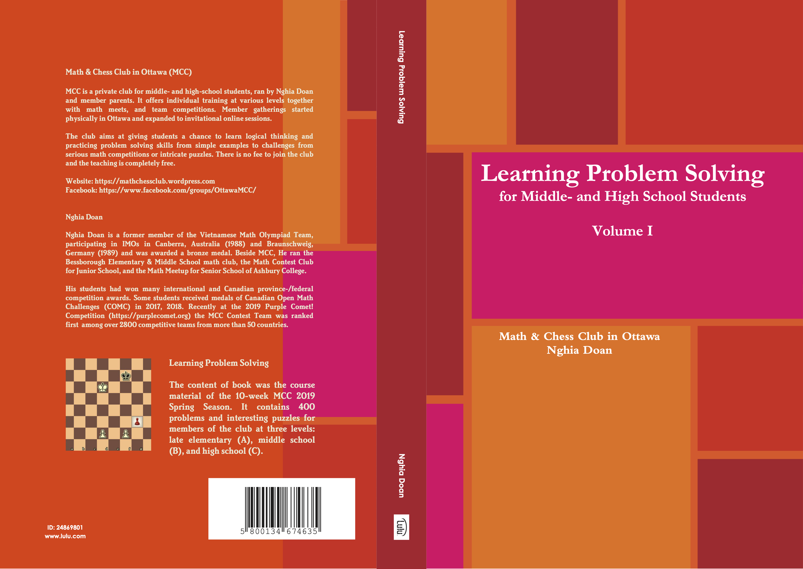
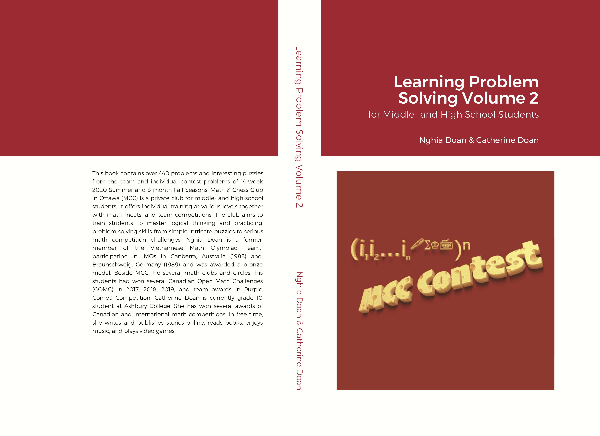
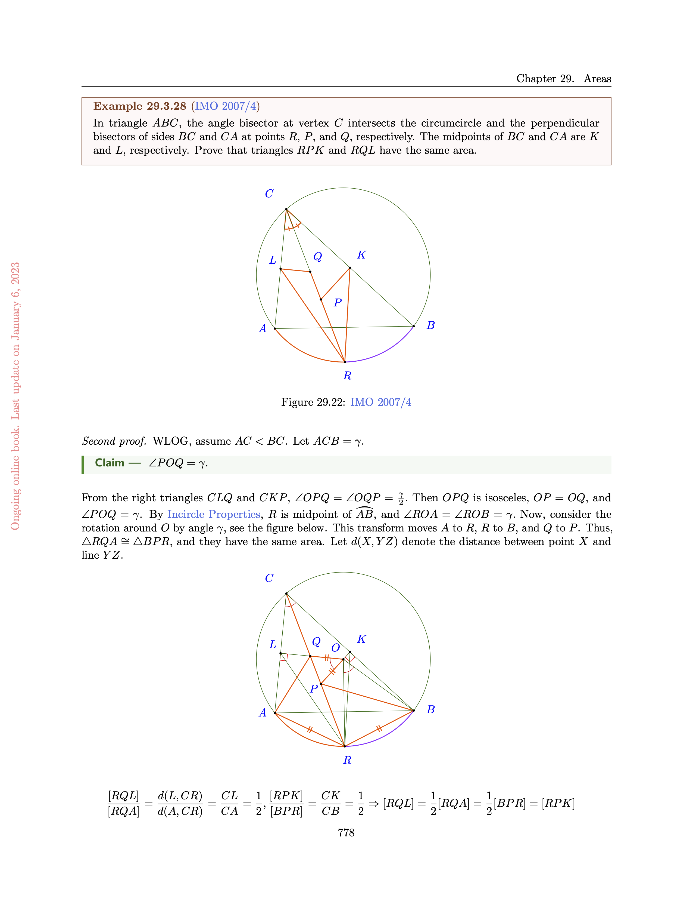
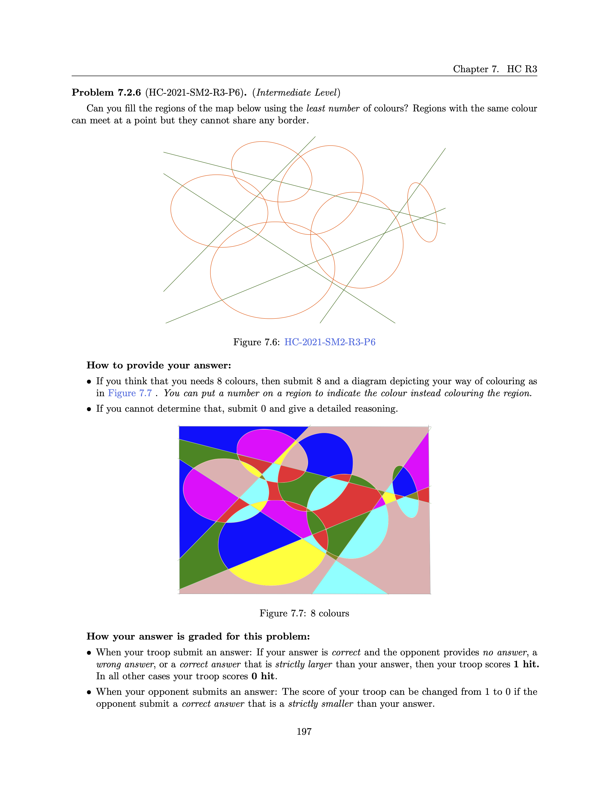
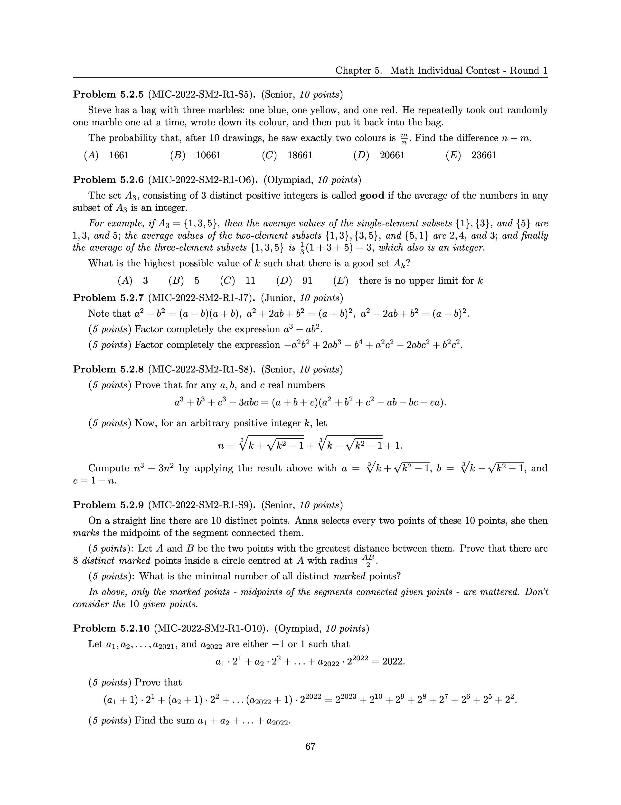
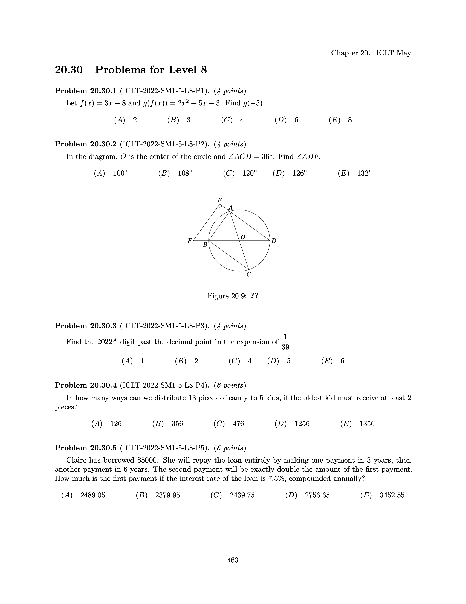
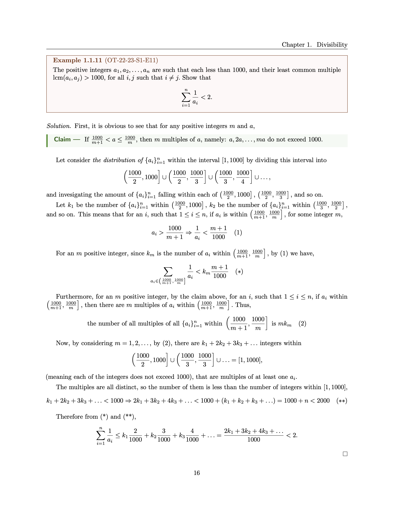
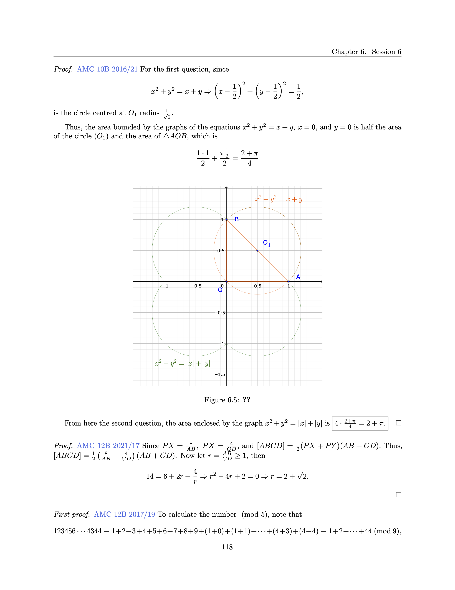
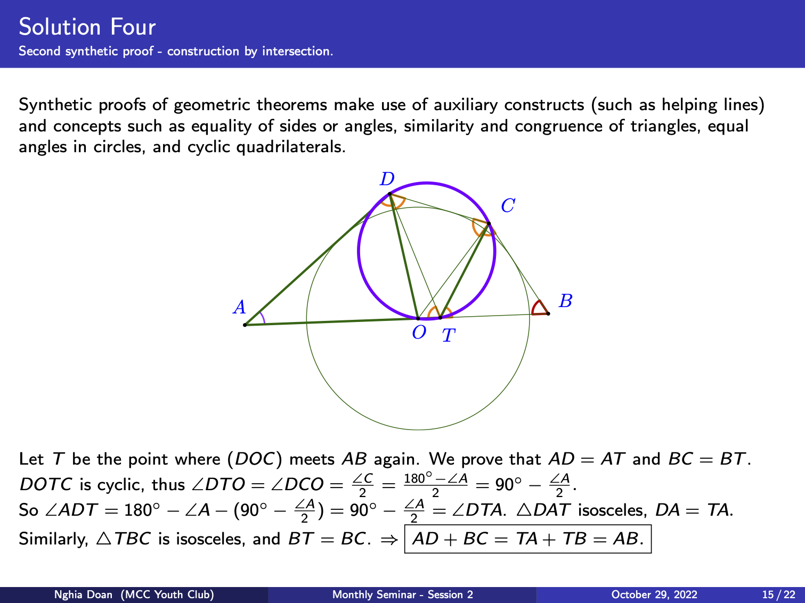
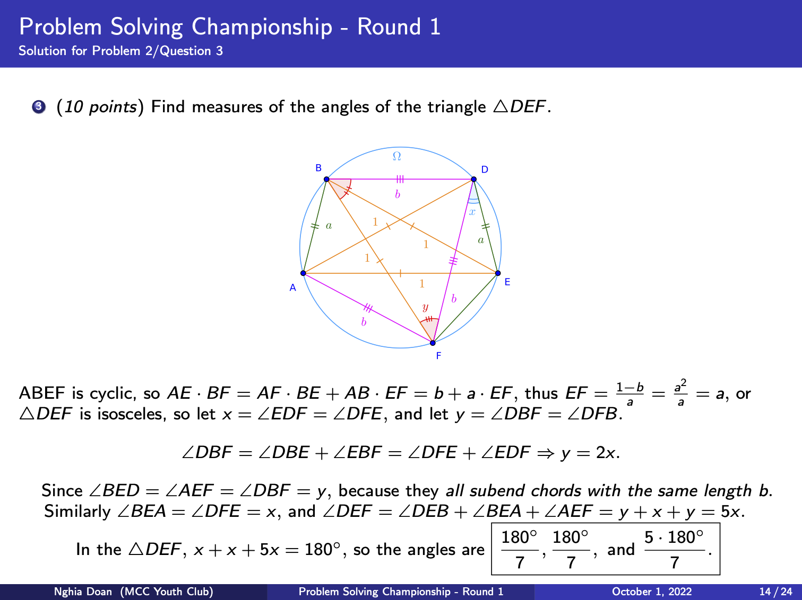

# Nghia Doan's stuffs

## [A. Math, Coding, and Chess Club (MCC)](#math-chess-and-coding-club-mcc)

These books constitute the Learning Problem Solving series from Math, Coding, and Chess Club (MCC), a.k.a Math and Chess Club in Ottawa. 

Students of the club are advised to use the book to learn, practice, and prepare for the club’s House Championship as well as math competitions.

The problems and their solutions are from various sources. Thus, these are open books with all rights reserved by the authors of the problems and solutions. No attempt should be made to reproduce or commercialize any part of any of these books.

Have fun, learn and enjoy!

Nghia Doan & Catherine Doan

-----

## [B. School Year 2023-2024](#b-school-year-2023-2024)

[The online ongoing book](https://drive.google.com/file/d/1VVUMGywLkhSB3Osh_GdfeW_4L69l-gIw/view?usp=sharing), updated on October 12, 2023.
It contains problems and solutions for the entrance tests and sessions 1-2.

Weekly readings and problem sets
- [I-Level](https://drive.google.com/drive/folders/1eyc_x-Ef3LUHzCj3fu4NJZ6nVZmj_el9?usp=sharing)
- [A-Level](https://drive.google.com/drive/folders/1SoMHPwIZ5sS0s2j6FEUFc5vvUulqh_ns?usp=sharing)
- [O-Level](https://drive.google.com/drive/folders/1oFYh9WFAUmEPzU-kwlNDGNOSY7tsv53B?usp=sharing)

-----

&nbsp;

### **C. 1. For beginners**: [Learning Problem Solving, Volume 1](./lps/LPS-Vol-1-4.0-Final.pdf)

Over 400 problems arranged in ten topics for any young students or students relatively new to math to get started:

- Insightful Proofs
- Logic
- Parity
- Visual patterns
- Divisibility
- Basic Geometry
- Ratio
- Average
- Percent
- Counting
- Distance - Rate - Time
- Probability

&nbsp;

------ 

&nbsp;

### **C.2 Club competitions**: [Learning Problem Solving, Volume 2](./lps/LPS-Vol-2-1.0-Final.pdf)

Over 400 problems collected from some competitions of the club during the year 2020.

- Summer semester - 14 weeks, each with a weekly team contest and a set of problems of the week
- Fall semeter - 3 months, each with monthly team contest and a set of problems of the months

&nbsp;

------ 

&nbsp;

### **C.3 Ongoing companion for every math leaners**: [Learning Problem Solving, Volume 3](./lps/LPS-Vol3-3.1-Ongoing.pdf)

*Last update on August 31, 2023.*

Unlike the other book, this book is an ongoing online book, which means that it is updated frequently and available online to the members of the club. 

A smaller set of problems are to help the young contestants to find their footing at the beginning of the journey. A significant number of problems in the book are from the International Mathematical Olympiads (IMO), National Math Olympiads, and other Math Competitions from countries and regions around the world.

Thousands of problems are organized into over 40 chapters of 7 parts: Algebra, Combinatorics, Geometry, Number Theory, Logic, Chess, and Coding. In each chapter, which focuses on certain topics, some examples are discussed in details, sometimes with multiple solutions. 

In each chapters, there are examples at lower difficulty for juniors or seniors without extensive mathematical knowledge or skills. Readers will find examples at olympiad level and additional problems. The students shall attempt to solve the examples first, before consult with the solution(s). In some chapters, related theories are noted at the beginning, some are accompanied with proofs, and additional colloraries. They are by no mean complete. The students are advised and encouraged to learn from other sources, whenever possible.

*Below is an excerpt from the book.*

&nbsp;

------ 

&nbsp;

### **C.4 Companion for the youngsters**: [Learning Problem Solving, Toolbox](./lps/LPS-Tools.pdf)

- 10 Problem Solving Strategies
- 5 Principles: Invariance, Colouring, Pigeonhole, Extremal, and Induction
- 10 Counting Techniques

*Below is an excerpt from the book.*

&nbsp;

------ 

&nbsp;

### **C.5 Some collections from club activities (problems with solutions)**

&nbsp;

#### C.5.1 [Fall Semester, 2021](./mcc/2021-fall.pdf)

- 5 House Championship rounds (plus entrance test)
- 4 MCC Indidvidual Contest rounds
- 2 Introductory Curriculum Level Test rounds (for all levels 1-5)
- 2 AMC 8 review sessions

*Below is an excerpt from the book.*

&nbsp;

------ 

&nbsp;

#### C.5.2. [Fall Semester, 2022](./mcc/2022-fall.pdf)

- 3 House Championship rounds (plus 2 entrance tests)
- 3 MCC Indidvidual Contest rounds
- 2 Introductory Curriculum Level Test rounds (for all levels 1-9)
- 2 Problem Solving Championship rounds

*Below is an excerpt from the book.*

&nbsp;

------ 

&nbsp;

#### C.5.3. [Winter Semester, 2022](./mcc/2022-winter.pdf)

- 5 House Championship rounds (plus 2 entrance tests)
- 4 MCC Indidvidual Contest rounds
- 2 Introductory Curriculum Level Test rounds (for all levels 1-9)
- 6 Purple Comet Training sessions
- 1 Middle School Training session

*Below is an excerpt from the book.*

&nbsp;

------ 

&nbsp;

#### C.5.4. [Olympiad Team Training, 2022](./mcc/2022-olympiad.pdf)

- 4 Training session

*Below is an excerpt from the book.*

&nbsp;

------ 

&nbsp;

#### C.5.5. [Competition Mock Tests, 2022](./mcc/2022-mock-tests.pdf)
- 5 Mock tests (12 problems each, similar to Canadian Open Math Challenge)

*Below is an excerpt from the book.*

&nbsp;

------ 

&nbsp;

#### C.5.6. Middle School seminars, 2022:

- [Session 1](./mcc/2022-2-ms-1.pdf)
- [Session 2](./mcc/2022-2-ms-2.pdf)
- [Session 3](./mcc/2022-2-ms-3.pdf)

*Below is an excerpt from the seminars.*

&nbsp;

------ 

&nbsp;

#### C.5.7. Problem Solving Championship seminars, 2022:
- [Session 1](./mcc/2022-2-psc-1.pdf)
- [Session 2](./mcc/2022-2-psc-2.pdf)

*Below is an excerpt from the seminars.*

&nbsp;

------ 

&nbsp;

#### C.5.8. Summer camp, 2023:
- [MS & HS courses](./mcc/2023-summer-camp.pdf)

&nbsp;
