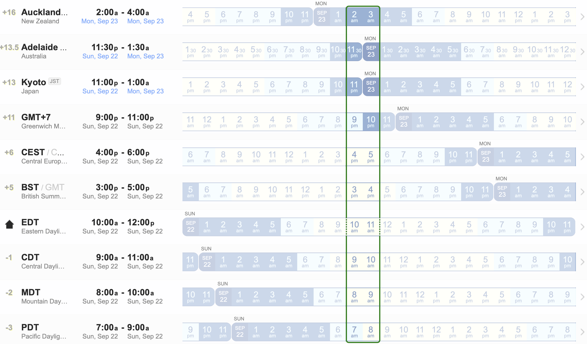

## [Current standings](#current-standings)

|  **ID** | **Student**            | **Level** | **Country** | **P1** | **P2** | **P3** | **P4** |      S1 |
|:-------:|------------------------|:---------:|:-----------:|-------:|-------:|-------:|-------:|--------:|
|   S77   | Adelina Mai Linh Luu   |     G2    |      CA     |     25 |     20 |     10 |      0 |  **55** |
|   S101  | Albert Dinh-Le         |     G4    |      FR     |     25 |        |      0 |     10 |  **35** |
|    S2   | Allison Ly             |     G1    |      CA     |        |        |        |        |         |
|   S84   | An Nguyen              |     G3    |      UK     |        |        |        |        |         |
|   S13   | Andrei Alexeichik      |     G1    |      NZ     |     10 |     10 |     25 |     10 |  **55** |
|   S22   | Anh Diep Nguyen        |     G2    |      CA     |     25 |        |      5 |        |  **30** |
|   S37   | Anh Nguyen             |     G1    |      CA     |        |        |        |        |         |
|   S121  | Anna Le                |     G1    |      US     |     10 |        |     25 |     10 |  **45** |
|   S95   | Anne Chu               |     G2    |      AU     |        |        |        |        |         |
|   S32   | Annie Doan             |     G1    |      UK     |        |        |        |        |         |
|   S125  | Annie Nguyen           |     G1    |      CA     |        |        |        |        |         |
|   S90   | Anthony Pham           |     G3    |      FR     |      5 |        |     25 |      0 |  **30** |
|   S34   | Bao Le                 |     G2    |      US     |      5 |      0 |     15 |      5 |  **25** |
|   S112  | Benny Le               |     G4    |      US     |     25 |     10 |      5 |     25 |  **65** |
|   S110  | Brooklyn Vu            |     G1    |      CA     |     10 |     20 |      0 |      5 |  **35** |
|   S78   | Bui Hoang Long         |     G2    |      VN     |        |        |        |        |         |
|   S80   | Bui Hoang Mai          |     G1    |      VN     |     25 |     20 |      5 |     10 |  **60** |
|   S87   | Chi Khanh Pham         |     G3    |      US     |        |     25 |        |        |  **25** |
|   S46   | Claire Luu             |     G1    |      US     |     25 |     25 |        |     25 |  **75** |
|   S51   | Conan Le               |     G1    |      CA     |     20 |     25 |      0 |     20 |  **65** |
|   S18   | Dang Khanh Le Ngan     |     G1    |      CA     |        |        |        |        |         |
|   S83   | Dang Nguyen Phung      |     G1    |      CA     |     25 |     25 |      0 |     10 |  **60** |
|   S111  | Dao Anna               |     G2    |      FR     |     25 |        |      0 |     25 |  **50** |
|   S106  | Dao Antoine            |     G3    |      FR     |     25 |     25 |        |      5 |  **55** |
|   S146  | David Vu               |     G1    |      CA     |        |        |        |        |         |
|   S133  | Duong Dang Huy         |     G1    |      VN     |        |        |        |        |         |
|   S70   | Elovie Do              |     G1    |      CA     |        |        |        |        |         |
|   S73   | Fred Bui               |     G2    |      CA     |      0 |        |     10 |     25 |  **35** |
|   S29   | Geoffrey Cao           |     G2    |      US     |     25 |     15 |     25 |     25 |  **90** |
|   S128  | Giang Nguyen           |     G2    |      US     |     25 |      5 |     25 |     10 |  **65** |
|   S128  | Giang Nguyen           |     G3    |      US     |     10 |      5 |        |        |  **15** |
|   S60   | Ha Dang                |     G2    |      US     |     10 |        |     25 |     10 |  **45** |
|   S97   | Ha Duong Linh Chi      |     G2    |      FR     |        |        |        |        |         |
|   S148  | Hà Tấn Cương           |     G1    |      VN     |        |        |        |        |         |
|   S57   | Ha-Anh Le              |     G4    |      UK     |        |        |        |        |         |
|   S49   | Ha-Chi Vu Le           |     G1    |      UK     |        |        |        |        |         |
|   S26   | Harry Vien             |     G2    |      UK     |      5 |      0 |     25 |     25 |  **55** |
|   S27   | Helen Vien             |     G3    |      UK     |      5 |        |        |        |   **5** |
|   S86   | Henry Bui              |     G1    |      US     |     20 |     25 |      0 |     10 |  **55** |
|   S144  | Henry Dinh             |     G4    |      US     |     25 |     25 |     25 |     25 | **100** |
|   S21   | Henry Ho               |     G2    |      US     |     15 |     20 |     25 |     20 |  **80** |
|   S104  | Henry Minh Nhat Trinh  |     G3    |      US     |     25 |      0 |     10 |        |  **35** |
|   S56   | Hien-Lam Nguyen        |     G1    |      UK     |     25 |     25 |      0 |      5 |  **55** |
|   S56   | Hien-Lam Nguyen        |     G2    |      UK     |        |      2 |      5 |     10 |  **17** |
|   S88   | Hieu Nguyen            |     G1    |      US     |        |        |        |        |         |
|   S59   | Hoang Dang             |     G3    |      US     |        |        |     25 |        |  **25** |
|    S4   | Hoang Xuan Bach        |     G1    |      VN     |        |        |        |        |         |
|   S15   | Huu Duc Nguyen         |     G1    |      CA     |        |        |        |        |         |
|   S115  | Huynh Minh Nhien       |     G1    |      VN     |     25 |      5 |        |      0 |  **30** |
|   S72   | Jade Pham              |     G3    |      FR     |        |        |        |        |         |
|   S114  | James Minh Trí Nguyen  |     G1    |      CA     |     25 |     25 |        |     25 |  **75** |
|   S12   | Jason To               |     G3    |      UK     |     25 |     15 |        |     25 |  **65** |
|   S69   | Javien Do              |     G1    |      CA     |        |        |        |        |         |
|   S93   | John Minh Quan         |     G3    |      VN     |      5 |      5 |        |        |  **10** |
|   S62   | Julie Cao              |     G2    |      FR     |     25 |     25 |        |     25 |  **75** |
|   S44   | Karl Le                |     G3    |      FR     |      2 |      2 |      5 |      0 |   **9** |
|   S55   | Khai-Tam Nguyen        |     G1    |      UK     |     25 |     25 |     25 |     25 | **100** |
|   S55   | Khai-Tam Nguyen        |     G2    |      UK     |     20 |      0 |     20 |     15 |  **55** |
|   S92   | Khang M. Nguyen        |     G1    |      VN     |        |        |        |        |         |
|   S145  | Khang Nguyen           |     G1    |      US     |        |        |        |        |         |
|   S30   | Khiem Pham             |     G1    |      UK     |     25 |     25 |     25 |     25 | **100** |
|   S143  | Khoa Anh Vu            |     G2    |      UK     |     20 |        |     20 |     25 |  **65** |
|   S64   | Kien Dang              |     G3    |      US     |      2 |      0 |        |      0 |   **2** |
|   S11   | Kylan Thai             |     G1    |      US     |     15 |     25 |        |     10 |  **50** |
|   S74   | Lê Cường Lâm           |     G2    |      UK     |        |        |        |        |         |
|   S105  | Lê Lâm Phương Anh      |     G1    |      AU     |      0 |     22 |      0 |     10 |  **32** |
|   S76   | Le Minh Quan           |     G1    |     N/A     |        |        |        |        |         |
|   S123  | Lê Nguyễn Linh Nhi     |     G1    |      VN     |        |        |        |        |         |
|   S68   | Leo Bui                |     G2    |      US     |     25 |     10 |      0 |     10 |  **45** |
|   S31   | Linh Khanh Le          |     G3    |      UK     |     25 |     10 |        |      2 |  **37** |
|    S5   | Lisa Doan              |     G1    |      UK     |        |        |        |        |         |
|   S38   | Long Doan              |     G2    |      ES     |        |        |        |        |         |
|   S45   | Long Tran              |     G2    |      UK     |     10 |        |      5 |     10 |  **25** |
|   S89   | Luan Duc Tran          |     G2    |      UK     |     10 |        |      5 |        |         |
|   S58   | Matheo Nguyen          |     G2    |      UK     |        |        |        |        |         |
|   S120  | Michelle Nguyen        |     G2    |      US     |        |        |        |        |         |
|   S114  | Mike Nguyen            |     G1    |      CA     |        |        |        |        |         |
|   S66   | Mike Nguyen            |     G2    |      UK     |        |        |      2 |        |   **2** |
|    S9   | Milan Thai             |     G1    |      US     |      5 |     25 |        |      5 |  **35** |
|   S19   | Minh Cao Doan          |     G2    |      ES     |        |        |        |        |         |
|   S137  | Minh Duc Vuong         |     G1    |      CA     |        |        |        |        |         |
|   S142  | Minh Hai Vu            |     G3    |      UK     |     25 |     10 |        |      0 |  **35** |
|   S127  | Minh Ngoc Nguyen       |     G2    |      US     |        |        |        |        |         |
|   S81   | Minh Tran              |     G1    |      UK     |     22 |     25 |      0 |     20 |  **67** |
|   S52   | Nam Nguyen             |     G2    |      UK     |      5 |     25 |     25 |      5 |  **60** |
|   S25   | Nathan Luong           |     G2    |      CA     |     10 |      2 |     25 |     25 |  **62** |
| **S41** | **Ngo Bao Ngoc**       |     G1    |      CA     |     25 |     25 |     25 |     25 | **100** |
|   S63   | Nguyen Binh An         |     G1    |     N/A     |        |        |        |        |         |
|   S131  | Nguyen Duy             |     G2    |      FR     |        |        |        |        |         |
|   S82   | Nguyễn Gia Bảo Nam     |     G2    |      VN     |     25 |      2 |      0 |     10 |  **37** |
|   S108  | Nguyen Hai Ha          |     G2    |      VN     |        |        |        |        |         |
|   S67   | Nguyen Huy Khanh       |     G2    |      VN     |        |        |        |        |         |
|   S48   | Nguyen Jérémy          |     G3    |      FR     |     22 |        |        |        |  **22** |
|   S61   | Nguyen Martin          |     G2    |      FR     |        |        |        |        |         |
|   S16   | Nguyen Minh            |     G1    |      JP     |     25 |        |      0 |     25 |  **50** |
|   S112  | Nguyen Minh Ngoc       |     G1    |      VN     |        |        |        |        |         |
|   S107  | Nguyen Minh Phong      |     G2    |      VN     |        |        |        |        |         |
|   S132  | Nguyen My              |     G2    |      FR     |        |        |        |        |         |
|   S99   | Nguyen Ngo Lam Phong   |     G2    |      FR     |     10 |      5 |        |     10 |  **25** |
|   S140  | Nguyen Pham Bao Ngoc   |     G2    |      FR     |     25 |     20 |     25 |        |  **70** |
|   S117  | Nguyễn Phan Thành Huy  |     G1    |      VN     |      0 |      2 |      0 |      0 |   **2** |
|   S53   | Nguyễn Tiến Minh Khôi  |     G1    |      VN     |        |        |        |        |         |
|   S141  | Nguyen Trung Kien      |     G2    |      FR     |     25 |        |     25 |     25 |  **75** |
|   S129  | Ninh Nguyen            |     G2    |      US     |     20 |     25 |     25 |      5 |  **75** |
|   S109  | Paris Vu               |     G1    |      CA     |      5 |     25 |      0 |      0 |  **30** |
|   S35   | Phạm Nhật Minh         |     G3    |      US     |     20 |      5 |        |      1 |  **26** |
|   S116  | Phạm Thanh Thanh       |     G1    |      VN     |     20 |     25 |      0 |        |  **45** |
|   S91   | Phuc Long Phuong       |     G1    |      CA     |        |        |        |        |         |
|   S17   | Quan                   |     G1    |      VN     |        |        |        |        |         |
|   S138  | Quan Le                |     G1    |      US     |     25 |     25 |     25 |     25 | **100** |
|   S79   | Ryan Nguyen            |     G3    |      UK     |        |        |        |        |         |
|   S20   | Sam Ha                 |     G2    |      CA     |     20 |      2 |     20 |     10 |  **52** |
|   S100  | Sam Vuong              |     G2    |      US     |     10 |     25 |      0 |     10 |  **45** |
|   S50   | Samuel Luong           |     G3    |      US     |     15 |      5 |        |        |  **20** |
|   S36   | Sean Pham              |     G2    |      US     |        |        |     25 |     15 |  **40** |
|   S42   | Sofia Vy Nguyen        |     G1    |      CA     |        |        |        |        |         |
|   S28   | Sophia Cao             |     G2    |      US     |      2 |     25 |      0 |     25 |  **52** |
|   S47   | Sophie HaLinh Pham     |     G1    |      US     |     20 |     25 |      0 |     10 |  **55** |
|   S135  | Steven Pham            |     G1    |      US     |     10 |     25 |      0 |      5 |  **40** |
|   S130  | Theo Nguyen            |     G3    |      UK     |     10 |        |        |     25 |  **35** |
|   S147  | Thomas Vu              |     G1    |      CA     |      3 |      3 |      0 |      3 |   **9** |
|    S8   | Tony Vo                |     G1    |      US     |     25 |     20 |      0 |      5 |  **50** |
|   S24   | Trần Hiếu Khoa         |     G3    |      VN     |        |        |        |        |         |
|   S139  | Tran Lê Bách           |     G2    |      FR     |     10 |      0 |      0 |     15 |  **25** |
|   S96   | Tran Nguyen An         |     G1    |      FR     |     25 |     25 |     25 |     10 |  **85** |
|   S39   | Truong Mai-Vy          |     G1    |      VN     |     10 |     15 |        |     10 |  **35** |
|   S40   | Truong Minh-Vu         |     G2    |      VN     |     10 |     10 |      2 |      5 |  **27** |
|   S136  | Tuan Kien Vuong        |     G1    |      CA     |     10 |     25 |      0 |      5 |  **40** |
|   S118  | Tuyet Ly Phuong        |     G2    |      CA     |        |        |        |        |         |
|   S10   | Valentin Thang         |     G1    |      UK     |     25 |     25 |        |     25 |  **75** |
|    S1   | Vincent Pham           |     G2    |      CA     |      0 |      0 |      8 |      0 |   **8** |
|   S102  | Vo Nhu Y               |     G1    |      CA     |        |        |        |        |         |
|   S71   | Yanis-Huy Desarmaux-Do |     G3    |      FR     |     15 |      5 |     10 |        |  **30** |

-----

## [A. September 8, 2024 - Admission Announcement](#a-september-8-2024---admission-announcement)

Welcome to the 2024 - 2025 School Year of the Math Club & Competitions!

Please read carefully the content below. If you have any personal question, send it directly the club. if you have any general question that might be concern of other students, send it to the mailing list.

On **September 15**, the club will host a **online kick-off ceremony.** Watch out for an email from the club.

### [A.1. Level Groups](#a1-level-groups)

There are 4 level groups for students from grades 4 to 12:

| Level | a.k.a        | for whom?                                                                                                                                                                    |
|-------|--------------|------------------------------------------------------------------------------------------------------------------------------------------------------------------------------|
| G1    | beginners    | absolute no prerequisite is required for joining this group. All students will learn basic approach to mathematics and problem solving.                                      |
| G2    | intermediate | who have an understanding of basic mathematical concepts and obtained a few skills to solve math problem. They are capable of writing their own solution to a given problem. |
| G3    | advance      | who are ready to go on the track to master enough knowledge and skills to solve any math problems in school and willing to go the distance for national competitions.        |
| G4    | olympiad     | who are about to be ready or already proven themselves in competitions and now preparing for upcoming and new challenges.                                                    |

### [A.2. Official Curriculum](#a2-official-curriculum)

The student will use the official [2024-2025 curriculum](https://drive.google.com/file/d/13mwcNV9et5dG1OMAAgAIPAQ3TFU9wjVL/view?usp=sharing) for to study in Semester 1.

What part of the curriculum the student learns is based on his/her level group as follow:

| Level | Chapters          | Part                          |
|:-----:|:-----------------:|:-----------------------------:|
|   G1  | Chapters 03 to 10 | Part II - Beginner Level      |
|   G2  | Chapters 11 to 18 | Part III - Intermediate Level |
|   G3  | Chapters 19 to 26 | Part IV - Advanced Level      |
|   G4  | Chapters 27 to 34 | Part V - Olympiad Level       |

You can also checkout the official solutions for the entrance test day 1 & 2 in Part I of the book.

### [A.3. Programs](#a3-programs)

#### [A.3.1 Fundamental program](#a31-fundamental-program)

In every week of the first 4 weeks of every 6-week cycle, the student attends a 30-minute seminar on a topic on Sunday, then practicing on home assignment from the content of the seminar, then a 90-minutes test on the following Saturday In short, every week from Sunday to Saturday, students need about 7 hours, equivalent to 1 hour/day.

Below is the list of all accepted students. Note that:
- the club maintains (only) two emails per student (one for the student, one for a parent) on a mailing list [Google Group MCC 2024-2025](https://groups.google.com/g/mcc-2024-2025) This is to be used for email when we need to send email to everyone.
- each shared folder assigned to a student is accessible by two email accounts mentioned. Only the club organizers and volunteer graders have access to this folder.

|  ID  | Student                | Program      | Level | Grade | Country |    Access   | Timezone | Folder Link                                                                          |
|:----:|------------------------|--------------|:-----:|:-----:|:-------:|:-----------:|:--------:|--------------------------------------------------------------------------------------|
|  S77 | Adelina Mai Linh Luu   | Fundamental  |   G2  |   7   |    CA   |  Supervised |    MDT   | https://drive.google.com/drive/folders/1Ls9aA_SYUf7DncTjzM1Mx-QQwRvstLpf             |
| S101 | Albert Dinh-Le         | Enrichment   |   G4  |   12  |    FR   |             |   CEST   | https://drive.google.com/drive/folders/1N56n-gwRqGFJjfHiy-EYp06XiyO8hIZu             |
|  S2  | Allison Ly             | Fundamental  |   G1  |   4   |    CA   |             |    EDT   | https://drive.google.com/drive/folders/1HXHcZ2q2t6GpWdWfatjYLArX6N6QvidF?usp=sharing |
|  S84 | An Nguyen              | Enrichment   |   G3  |   12  |    UK   |             |    BST   | https://drive.google.com/drive/folders/1MI9SgDgXIUAvWx4praqW8u78tX21TlzG             |
|  S13 | Andrei Alexeichik      | Fundamental  |   G1  |   6   |    NZ   |             |   NZST   | https://drive.google.com/drive/folders/1GrIFcyGxPlUdIFRVkC14PMhyVJJub_zO             |
|  S22 | Anh Diep Nguyen        | Enrichment   |   G2  |   8   |    CA   |             |    EDT   | https://drive.google.com/drive/folders/1IG3YC2DRt6rgXJnmtWEdgPWIedABzX3A             |
|  S37 | Anh Nguyen             | Fundamental  |   G1  |   4   |    CA   |             |    ADT   | https://drive.google.com/drive/folders/1JMfJJMRo5Zb8KnQ5nt53BQyz9nlRoUmE?usp=sharing |
| S121 | Anna Le                | Fundamental  |   G1  |   9   |    US   |             |    PDT   | https://drive.google.com/drive/folders/1Q0wjiUfJqKTs2kNqyjyD548dnyJyyBmx             |
|  S95 | Anne Chu               | Fundamental  |   G2  |   7   |    AU   |             |   AEST   | https://drive.google.com/drive/folders/1NeS_fphDdjwTXCZq9J37mY5dqw9WOiJP             |
|  S32 | Annie Doan             | Fundamental  |   G1  |   8   |    UK   |             |    BST   | https://drive.google.com/drive/folders/1JreR7yIJClcqU4GCBW02aEIkzr-D82sD             |
| S125 | Annie Nguyen           | Fundamental  |   G1  |   4   |    CA   |             |    EDT   | https://drive.google.com/drive/folders/1PnXE6pHVQmUQtRN4lgNN7IEeDLTAFdAZ             |
|  S90 | Anthony Pham           | Enrichment   |   G3  |   11  |    FR   |             |   CEST   | https://drive.google.com/drive/folders/1M2VA1_QL_G4aOoiCgkU9OHPqMHdBgxI8             |
|  S34 | Bao Le                 | Fundamental  |   G2  |   7   |    US   |             |    EDT   | https://drive.google.com/drive/folders/1JmD0meiIFdYCC5VN5I6O_i7dphvgSI48             |
| S112 | Benny Le               | Enrichment   |   G4  |   8   |    US   |             |    EDT   | https://drive.google.com/drive/folders/1OeDgafEdhrai1vtoSplMecCR9DFyq4Y4             |
| S110 | Brooklyn Vu            | Fundamental  |   G1  |   4   |    CA   |             |    EDT   | https://drive.google.com/drive/folders/1OgHhCo7GULJMcKfoP-MrSevtfSN3nS1A?usp=sharing |
|  S78 | Bui Hoang Long         | Fundamental  |   G2  |   10  |    VN   |             |   GMT+7  | https://drive.google.com/drive/folders/1LjM9hu_J5OL_Sy_O5Db5uupfwKf388Ow             |
|  S80 | Bui Hoang Mai          | Fundamental  |   G1  |   6   |    VN   |             |   GMT+7  | https://drive.google.com/drive/folders/1LdhzOK_HWkVlaj_78Iunxr01XV4vidrq?usp=sharing |
|  S87 | Chi Khanh Pham         | Enrichment   |   G3  |   7   |    US   |  Supervised |    PDT   | https://drive.google.com/drive/folders/1MDVldPRB5KDSPS7K-vJ8lSFfJPsyD5PE             |
|  S46 | Claire Luu             | Fundamental  |   G1  |   4   |    US   |             |    PDT   | https://drive.google.com/drive/folders/1KZAOIjW4fbykXKHTZ3P4CUjmvJmXjpdu?usp=sharing |
|  S51 | Conan Le               | Fundamental  |   G1  |   7   |    CA   |             |    ADT   | https://drive.google.com/drive/folders/1KPS4PgoYCaLzF3KtJ8OPYrxe4DwGbxCE             |
|  S18 | Dang Khanh Le Ngan     | Fundamental  |   G1  |   6   |    CA   |             |    ADT   | https://drive.google.com/drive/folders/1ITLwcSR6SHTvfwAIaI33auL_JxQgAHVa             |
|  S83 | Dang Nguyen Phung      | Fundamental  |   G1  |   5   |    CA   |             |    ADT   | https://drive.google.com/drive/folders/1MKmKEfz4z1oPLdHtTCLEn0voN6jwGXNZ             |
| S111 | Dao Anna               | Enrichment   |   G2  |   7   |    FR   |  Supervised |   CEST   | https://drive.google.com/drive/folders/1OfSH-l0icAt_M4mgldIZLiHVQdk3BTNB             |
| S106 | Dao Antoine            | Enrichment   |   G3  |   10  |    FR   |  Supervised |   CEST   | https://drive.google.com/drive/folders/1P6cNEMyc8sTsl5OlWhyTLnLYJCso0-0b             |
| S146 | David Vu               | Fundamental  |   G1  |   4   |    CA   |             |    EDT   | https://drive.google.com/drive/folders/16KSbl5RqVDgkh4RxI_crwXCtdZZsL_5X?usp=sharing |
| S133 | Duong Dang Huy         | Fundamental  |   G1  |   8   |    VN   |             |   GMT+7  | https://drive.google.com/drive/folders/1PVIn9L0Arj-2KH2KzaRsQ9wvJf8wu0hi?usp=sharing |
|  S70 | Elovie Do              | Fundamental  |   G1  |   4   |    CA   |             |    EDT   | https://drive.google.com/drive/folders/1KyaXEvPyGr0SaNfedvvQzT_nLsco4vPE?usp=sharing |
|  S73 | Fred Bui               | Enrichment   |   G2  |   7   |    CA   |             |    EDT   | https://drive.google.com/drive/folders/1KpjrmQ4nCvDte89T3p5JSci-pGbPNJnw             |
|  S29 | Geoffrey Cao           | Enrichment   |   G3  |   4   |    US   |             |    EDT   | https://drive.google.com/drive/folders/1Hg_d0L2FYoGTq_mIGMWhnRnpP3LGyjxo             |
| S128 | Giang Nguyen           | Fundamental  |   G3  |   7   |    US   |  Supervised |    EDT   | https://drive.google.com/drive/folders/1Pa38rnwa8qfZ8t18_v9ircV8g5-vSBv0             |
|  S60 | Ha Dang                | Fundamental  |   G2  |   6   |    US   |  Supervised |    PDT   | https://drive.google.com/drive/folders/1K3BFB-NblNlUfxhjxwuzZho_iCUTX_pR             |
|  S97 | Ha Duong Linh Chi      | Enrichment   |   G2  |   12  |    FR   |             |   CEST   | https://drive.google.com/drive/folders/1NTtzvMV7_jYah4eOBmkU4MRtE3bJMTEd             |
|  S57 | Ha-Anh Le              | Enrichment   |   G4  |   12  |    UK   |             |    BST   | https://drive.google.com/drive/folders/1K6ciATKQdPuaZZNLq9uiVp38Cdok5Rei             |
|  S49 | Ha-Chi Vu Le           | Fundamental  |   G1  |   5   |    UK   |             |    BST   | https://drive.google.com/drive/folders/1KUS4N9e7h4rfQizoGDmyptkqxSi3h2OD?usp=sharing |
|  S26 | Harry Vien             | Enrichment   |   G2  |   5   |    UK   |  Supervised |    BST   | https://drive.google.com/drive/folders/1I18a7WeGbiw5t0VfG2YOvfesMMVBiJiD             |
|  S27 | Helen Vien             | Enrichment   |   G3  |   8   |    UK   |  Supervised |    BST   | https://drive.google.com/drive/folders/1I-VuB5QyUWS14zRXzaK3oHgSKe0f6iaQ             |
|  S86 | Henry Bui              | Fundamental  |   G1  |   4   |    US   |             |    EDT   | https://drive.google.com/drive/folders/1MDnGQEfiyrrp6haOgRwimcYgk7BCKGPb?usp=sharing |
| S144 | Henry Dinh             | Enrichment   |   G4  |   11  |    US   |             |    EDT   | https://drive.google.com/drive/folders/1HJGV8MQacuB0kokXIU6z3yY6KgwsXHza             |
|  S21 | Henry Ho               | Enrichment   |   G2  |   6   |    US   |  Supervised |    EDT   | https://drive.google.com/drive/folders/1IKhlUX3wazsG3UrAzCWAduppSA0Y4KJ2             |
| S104 | Henry Minh Nhat Trinh  | Enrichment   |   G3  |   9   |    US   |             |    MDT   | https://drive.google.com/drive/folders/1Mw_9PGGNbgLCishI-WBLfSxejwmHRbag             |
|  S56 | Hien-Lam Nguyen        | Fundamental  |   G2  |   6   |    UK   |  Supervised |    BST   | https://drive.google.com/drive/folders/1KBeYCcNP6wMlOICAImMZg5uIbF3R17L4             |
|  S88 | Hieu Nguyen            | Fundamental  |   G1  |   5   |    US   |  Supervised |    EDT   | https://drive.google.com/drive/folders/1M9Tv3JNov77QW8HfSlL6I3A0O5c70A-X?usp=sharing |
|  S59 | Hoang Dang             | Fundamental  |   G3  |   9   |    US   | Supervised  |    PDT   | https://drive.google.com/drive/folders/1K3IVPMdOCA0BUFpBigG7ITIxDc9xF12v             |
|  S4  | Hoang Xuan Bach        | Fundamental  |   G1  |   3   |    VN   |             |   GMT+7  | https://drive.google.com/drive/folders/1HTXJEpqYV6jujK4V_fiHuMH7lFyvdIM6?usp=sharing |
|  S15 | Huu Duc Nguyen         | Fundamental  |   G1  |   7   |    CA   |  Supervised |    CDT   | https://drive.google.com/drive/folders/1GSZxzi1E-yjzfwT8nbPYafl8ODe8Wt5u             |
| S115 | Huynh Minh Nhien       | Fundamental  |   G1  |   5   |    VN   |             |   GMT+7  | https://drive.google.com/drive/folders/1OSE1HmBWpVEcnlMMKnsfiD-_JtKr42bf?usp=sharing |
|  S72 | Jade Pham              | Enrichment   |   G3  |   8   |    FR   |             |   CEST   | https://drive.google.com/drive/folders/1KpsyJwAbNW2SA1ZkdDkaBIsIbMhKDs0d             |
| S114 | James Minh Trí Nguyen  | Fundamental  |   G1  |   4   |    CA   |  Supervised |    PDT   | https://drive.google.com/drive/folders/1GqGSoeLGAVtFmnqS1_XX25G9QPLJ9cTM             |
|  S12 | Jason To               | Enrichment   |   G3  |   8   |    UK   |  Supervised |    BST   | https://drive.google.com/drive/folders/1GsAJIFpzOyx7pVgi-fu6WrHpWwZEWUTD             |
|  S69 | Javien Do              | Fundamental  |   G1  |   3   |    CA   |             |    EDT   | https://drive.google.com/drive/folders/1KzgnzsWZDZIeaTa3VG3PNms-UMg4Ilh8?usp=sharing |
|  S93 | John Minh Quan         | Enrichment   |   G3  |   7   |    VN   |             |   GMT+7  | https://drive.google.com/drive/folders/1NsNGuFRqSjldwhuiYdvP5uSJ0c4Ops4q             |
|  S62 | Julie Cao              | Enrichment   |   G2  |   9   |    FR   |  Supervised |   CEST   | https://drive.google.com/drive/folders/1LXR8ltppxKQ9vS-F2wYfYhRchq4yiK69             |
|  S44 | Karl Le                | Enrichment   |   G3  |   10  |    FR   |  Supervised |   CEST   | https://drive.google.com/drive/folders/1InNZt8CX13-6WukI0u01uVdkJmRB7nb0             |
|  S55 | Khai-Tam Nguyen        | Fundamental  |   G1  |   9   |    UK   |  Supervised |    BST   | https://drive.google.com/drive/folders/1KD_2f5IUW2B3Aa4lyRT_QYPBcs60Hbj5             |
|  S92 | Khang M. Nguyen        | Fundamental  |   G1  |   3   |    VN   |             |   GMT+7  | https://drive.google.com/drive/folders/1NubuI7Nz0RifbCbWVQYq_Oozt8NgOJ96?usp=sharing |
| S145 | Khang Nguyen           | Fundamental  |   G1  |   7   |    US   |  Supervised |    EDT   | https://drive.google.com/drive/folders/15orqdRd0OSRNQ6TGEZGjefHrUCfJCNed             |
|  S30 | Khiem Pham             | Fundamental  |   G1  |   4   |    UK   |             |    BST   | https://drive.google.com/drive/folders/1HYnDJaByx4yDjZUHcADPoghNL8GQDlXm?usp=sharing |
| S143 | Khoa Anh Vu            | Enrichment   |   G2  |   10  |    UK   |             |    BST   | https://drive.google.com/drive/folders/1HODnchKSPV0u2xv4Cv7N1rpTtMdoQc2Z             |
|  S64 | Kien Dang              | Fundamental  |   G3  |   10  |    US   |             |    PDT   | https://drive.google.com/drive/folders/1LE00lq_mgDm1upqeg4zqkvuW91falq-9             |
|  S11 | Kylan Thai             | Fundamental  |   G1  |   4   |    US   |             |    PDT   | https://drive.google.com/drive/folders/1Gx-2dt__r49N053v00b1b2UsdaAYcTyd             |
|  S74 | Lê Cường Lâm           | Enrichment   |   G2  |   10  |    UK   |  Supervised |    BST   | https://drive.google.com/drive/folders/1KeteHB0gpD2WmNOJlJXXlDTC3W8mEfZS             |
| S105 | Lê Lâm Phương Anh      | Fundamental  |   G1  |   5   |    AU   |             |   ACST   | https://drive.google.com/drive/folders/1MulANaswOzLV_lTzLb6pnO92l-GFqQl1             |
|  S76 | Le Minh Quan           | Fundamental  |   G1  |   7   |   N/A   |             |          | https://drive.google.com/drive/folders/1LwmeDrTGeSH4G5j__eSCA9_DORMCYT01             |
| S123 | Lê Nguyễn Linh Nhi     | Fundamental  |   G1  |  N/A  |    VN   |             |   GMT+7  | https://drive.google.com/drive/folders/1PpvXLBQezBReG1erBuuiiJNXc3zdcMwa?usp=sharing |
|  S68 | Leo Bui                | Fundamental  |   G3  |   8   |    US   |             |    EDT   | https://drive.google.com/drive/folders/1L0Pc-G8pIiM_Oztbil58bpiINiZBNndd             |
|  S31 | Linh Khanh Le          | Enrichment   |   G3  |   8   |    UK   |  Supervised |    BST   | https://drive.google.com/drive/folders/1K1V-oCnNnmQHMJgmeDpewpVz3_yiXUfT             |
|  S5  | Lisa Doan              | Fundamental  |   G1  |   6   |    UK   |             |    BST   | https://drive.google.com/drive/folders/1HSwLHvtFWgkoZtjJCBFJCJ_b2EgbQW1c?usp=sharing |
|  S38 | Long Doan              | Fundamental  |   G2  |   9   |    ES   |             |   CEST   | https://drive.google.com/drive/folders/1JGT67aj2X9vH6MO1beW96TfrVtG398Xv             |
|  S45 | Long Tran              | Fundamental  |   G2  |   7   |    UK   |  Supervised |    BST   | https://drive.google.com/drive/folders/1Imdu6SybR6Eqb-UdTHKHeQdLHMXAgPxS             |
|  S89 | Luan Duc Tran          | Enrichment   |   G2  |   8   |    UK   |             |    BST   | https://drive.google.com/drive/folders/1M7Cux7fVKIirI5n8cF_xzAQJT6hD3uPq             |
|  S58 | Matheo Nguyen          | Fundamental  |   G2  |   7   |    UK   |             |    BST   | https://drive.google.com/drive/folders/1K4DP6zpmw2hARvz07ab72_d2u4L76_NZ             |
| S120 | Michelle Nguyen        | Fundamental  |   G2  |   10  |    US   |             |    PDT   | https://drive.google.com/drive/folders/1Nw7Ewz0bvMIB1zkhwpcmnfPps2_wJjAj             |
| S114 | Mike Nguyen            | Fundamental  |   G1  |   8   |    CA   |             |    EDT   | https://drive.google.com/drive/folders/1OWL1-KMzavk6Idpk3-3IrRVDBsRMBdao             |
|  S22 | Mike Nguyen            | Fundamental  |   G2  |   11  |    UK   |             |    BST   | https://drive.google.com/drive/folders/1L5tAUcijEpvZY22ee1jxS6DzWkODgjbz             |
|  S9  | Milan Thai             | Fundamental  |   G1  |   5   |    US   |             |    EDT   | https://drive.google.com/drive/folders/1H5dJ-F8slYU42BRk_CSSX7UUeBL0ExYx             |
|  S19 | Minh Cao Doan          | Enrichment   |   G2  |   11  |    ES   |             |   CEST   | https://drive.google.com/drive/folders/1IPgGVJUTDXwS8Ejz7W63rSUyLsLmII5T             |
| S137 | Minh Duc Vuong         | Fundamental  |   G1  |   6   |    CA   |             |    PDT   | https://drive.google.com/drive/folders/1PES4da7ahSMGy95k3a1ndxR9CrgUjmmK?usp=sharing |
| S142 | Minh Hai Vu            | Enrichment   |   G3  |   13  |    UK   |             |    BST   | https://drive.google.com/drive/folders/1HFs8oHxKutBp2FL-JKyMBx8xjfGYlbr6             |
| S127 | Minh Ngoc Nguyen       | Fundamental  |   G2  |   7   |    US   |             |    PDT   | https://drive.google.com/drive/folders/1PeahOLaJYJh8dhqv8Cv5fEY2EW39VHmM             |
|  S81 | Minh Tran              | Fundamental  |   G1  |   5   |    UK   |  Supervised |    BST   | https://drive.google.com/drive/folders/1Lc_EH7Q62CExmCeMu_0g6q8iXsDSUarP             |
|  S52 | Nam Nguyen             | Fundamental  |   G2  |   8   |    UK   |             |    BST   | https://drive.google.com/drive/folders/1KM1majtLLdtaiOv_QiF2V-_9GNcucxoC             |
|  S25 | Nathan Luong           | Enrichment   |   G2  |   8   |    CA   |             |    EDT   | https://drive.google.com/drive/folders/1I1G7jURDXx40VqA8miqTWZFbNjijo7Wj             |
|  S41 | Ngo Bao Ngoc           | Fundamental  |   G1  |   7   |    CA   |             |    EDT   | https://drive.google.com/drive/folders/1Iu83aGF1x-hNAFrDqpL8CByTpvpptmUj             |
|  S63 | Nguyen Binh An         | Fundamental  |   G1  |   4   |   N/A   |             |          | https://drive.google.com/drive/folders/1LQApylNkOORjWuW6Uw3_cWDdhdybOGsd?usp=sharing |
| S131 | Nguyen Duy             | Enrichment   |   G2  |   9   |    FR   |  Supervised |   CEST   | https://drive.google.com/drive/folders/1PYagPAsEh0C6wFcBsmqypS_zP7Qb-aFt             |
|  S82 | Nguyễn Gia Bảo Nam     | Fundamental  |   G2  |   10  |    VN   |             |   GMT+7  | https://drive.google.com/drive/folders/1MPeaBpaq3xtM1NfBdrE14x-GqfFEL1IU             |
| S108 | Nguyen Hai Ha          | Enrichment   |   G2  |   7   |    VN   |             |   GMT+7  | https://drive.google.com/drive/folders/1Ox7pD2njHa7bs5zA0QG5ka23zK0Hil7_             |
|  S67 | Nguyen Huy Khanh       | Fundamental  |   G2  |   5   |    VN   |             |   GMT+7  | https://drive.google.com/drive/folders/1L2aBkIK1ytQdqaA6R0s39W7s0RXfcZvC             |
|  S48 | Nguyen Jérémy          | Fundamental  |   G3  |   11  |    FR   |             |   CEST   | https://drive.google.com/drive/folders/1KV2Vv4_Jw3LhQmTt5jLJOmIj2rLyjjlT             |
|  S61 | Nguyen Martin          | Enrichment   |   G2  |   9   |    FR   |             |   CEST   | https://drive.google.com/drive/folders/1LYIOG5aikq6uhp0YfTKT6YHSVJYM7KXA             |
|  S16 | Nguyen Minh            | Fundamental  |   G1  |   2   |    JP   |             |    JST   | https://drive.google.com/drive/folders/1GOHZMl6_KcGSZoFDxWkDTZsOFMdyfghR?usp=sharing |
| S112 | Nguyen Minh Ngoc       | Fundamental  |   G1  |   4   |    VN   |             |   GMT+7  | https://drive.google.com/drive/folders/1Q-JUsoyKHWiH-RIbgSHZctwvh4Iu8MJU?usp=sharing |
| S107 | Nguyen Minh Phong      | Enrichment   |   G2  |   7   |    VN   |             |   GMT+7  | https://drive.google.com/drive/folders/1P5EFZWunQXSvNcDo-vMeTKog7WlpA4FQ             |
| S132 | Nguyen My              | Enrichment   |   G2  |   6   |    FR   |  Supervised |   CEST   | https://drive.google.com/drive/folders/1PW1RrRmM7yp5Tez6bRQOkBeuQIbeakSc             |
|  S99 | Nguyen Ngo Lam Phong   | Fundamental  |   G2  |   9   |    FR   |  Supervised |   CEST   | https://drive.google.com/drive/folders/1NOLd4WRd0Wawb9PTkUtXhJsB5rmXc92L             |
| S140 | Nguyen Pham Bao Ngoc   | Enrichment   |   G2  |   9   |    FR   |             |   CEST   | https://drive.google.com/drive/folders/1Y7GRvuEmNPkEZczH1-ruOp7pVqDoBQhF             |
| S117 | Nguyễn Phan Thành Huy  | Fundamental  |   G1  |   10  |    VN   |             |   GMT+7  | https://drive.google.com/drive/folders/1OJzZCLzI1JoW-ezX41KU_2hH6Pp5gEJI             |
|  S53 | Nguyễn Tiến Minh Khôi  | Fundamental  |   G1  |   1   |    VN   |             |   GMT+7  | https://drive.google.com/drive/folders/1KJW6_vOy91BSIDPtvzrtis8TnwMm6Nqz?usp=sharing |
| S141 | Nguyen Trung Kien      | Enrichment   |   G2  |   7   |    FR   |             |   CEST   | https://drive.google.com/drive/folders/1--qnKo3e2Jhon-XUx4VW1n3Kj2iZ8Hfc             |
| S129 | Ninh Nguyen            | Fundamental  |   G2  |   5   |    US   |  Supervised |    EDT   | https://drive.google.com/drive/folders/1P_YmdpTUT6FvMCRrqVDu_pDROiRae3ar             |
| S109 | Paris Vu               | Fundamental  |   G1  |   6   |    CA   |             |    EDT   | https://drive.google.com/drive/folders/1Ou9nC6MJTdvjymBoQZ5a5rW0Zc5idyt3?usp=sharing |
|  S35 | Phạm Nhật Minh         | Enrichment   |   G3  |   8   |    US   |             |    PDT   | https://drive.google.com/drive/folders/1Jh5XXUH79m1oPNGsdkMCNEARdR_Xw6V7             |
| S116 | Phạm Thanh Thanh       | Fundamental  |   G1  |   5   |    VN   |             |    EDT   | https://drive.google.com/drive/folders/1OKVCDsBu_NuRhamAEUyYBw-gM8uZ0sRE?usp=sharing |
|  S91 | Phuc Long Phuong       | Fundamental  |   G1  |   7   |    CA   |             |    EDT   | https://drive.google.com/drive/folders/1NutZ8Vjk9eL3giHwJ0j-d1mpTgS4-4O3             |
|  S17 | Quan                   | Fundamental  |   G1  |   6   |    VN   |             |   GMT+7  | https://drive.google.com/drive/folders/1I_rb4vkT4EtC3FGXoymQt9RX21GmXHg_?usp=sharing |
| S138 | Quan Le                | Fundamental  |   G1  |   5   |    US   |             |    EDT   | https://drive.google.com/drive/folders/1P8Y1sg9vK9cHW_bD7_1_sxVmYHlFbOL5?usp=sharing |
|  S79 | Ryan Nguyen            | Enrichment   |   G3  |   11  |    UK   |             |    BST   | https://drive.google.com/drive/folders/1LfCbZhO6YE--U23-Gui0h41Gx8a2mj6X             |
|  S20 | Sam Ha                 | Fundamental  |   G2  |   7   |    CA   |             |    EDT   | https://drive.google.com/drive/folders/1ILW4eSDK3uXbz2ANJgKk7JR62AFyRnHT             |
| S100 | Sam Vuong              | Fundamental  |   G2  |   5   |    US   |             |    EDT   | https://drive.google.com/drive/folders/1N9VvOY4kHZziHHcxRPAt6Mh2WLmj9D_B             |
|  S50 | Samuel Luong           | Enrichment   |   G3  |   9   |    US   |             |    CDT   | https://drive.google.com/drive/folders/1KS2yNpE0HaW4W9RLdyS4Nl8EwjDJPzhN             |
|  S36 | Sean Pham              | Enrichment   |   G2  |   6   |    US   |             |    PDT   | https://drive.google.com/drive/folders/1JbfL2FBZbX9gy0uuBiEIFjoFlmTUiPdQ             |
|  S42 | Sofia Vy Nguyen        | Fundamental  |   G1  |   7   |    CA   |             |    EDT   | https://drive.google.com/drive/folders/1IpzWas72VETZO3irzQF0liclMXe_beJ1             |
|  S28 | Sophia Cao             | Enrichment   |   G2  |   6   |    US   |             |    EDT   | https://drive.google.com/drive/folders/1HgicOSuJm1jqF8IRLdaztxfqjf22PN_M             |
|  S47 | Sophie HaLinh Pham     | Fundamental  |   G1  |   3   |    US   |  Supervised |    PDT   | https://drive.google.com/drive/folders/1KYT9bHU4ktyy83DHcqTRU-z3Zj8q1Zmo?usp=sharing |
| S135 | Steven Pham            | Fundamental  |   G1  |   4   |    US   |             |    PDT   | https://drive.google.com/drive/folders/1PK8TfPQS_NejS--fRMEhHmPWy9oqGCY7             |
| S130 | Theo Nguyen            | Fundamental  |   G3  |   11  |    UK   |             |    BST   | https://drive.google.com/drive/folders/1PZs_DGit6ybHLWCqFP_0h5qJNvuI3zjg             |
| S147 | Thomas Vu              | Fundamental  |   G1  |   7   |    CA   |             |    EDT   | https://drive.google.com/drive/folders/1gIAoA1jquQdSmGIInOgeNRIxEoz5aFGP?usp=sharing |
|  S8  | Tony Vo                | Fundamental  |   G1  |   6   |    US   |             |    EDT   | https://drive.google.com/drive/folders/1H7TBu_brTablubCc8WWP6LF-plSPhkol             |
|  S24 | Trần Hiếu Khoa         | Fundamental  |   G3  |   9   |    VN   |             |   GMT+7  | https://drive.google.com/drive/folders/1I4TOoKc4OgSgB7KpPlkfhFJbrLwzNThC             |
| S139 | Tran Lê Bách           | Fundamental  |   G2  |   13  |    FR   |             |   CEST   | https://drive.google.com/drive/folders/1P7Yq7CA7n9Fxq3E0QBjwbxuFGfNDw3QI             |
|  S96 | Tran Nguyen An         | Fundamental  |   G1  |   10  |    FR   |             |   CEST   | https://drive.google.com/drive/folders/1NbEjtp0o77H8kMb2gdbsXzzrKeHh0xwj?usp=sharing |
| S119 | Truc An Le             | Fundamental  |   G2  |   9   |    US   |             |    PDT   | https://drive.google.com/drive/folders/1O-JystN7yVRwrs8f7Wm__21A79q9tPYE             |
|  S39 | Truong Mai-Vy          | Fundamental  |   G1  |   5   |    VN   |  Supervised |   GMT+7  | https://drive.google.com/drive/folders/1JErIjjDqDW-CRg3pW9QQySo1-EfHtBIZ?usp=sharing |
|  S40 | Truong Minh-Vu         | Fundamental  |   G2  |   6   |    VN   |  Supervised |   GMT+7  | https://drive.google.com/drive/folders/1IwRvV307Djy5B7Y02AWfNwziHe5MsUBS             |
| S136 | Tuan Kien Vuong        | Fundamental  |   G1  |   8   |    CA   |             |    PDT   | https://drive.google.com/drive/folders/1PHFGQyBX54Lp3P3cxTR4eFPRyLTdhEsf             |
| S118 | Tuyet Ly Phuong        | Enrichment   |   G2  |   8   |    CA   |             |    EDT   | https://drive.google.com/drive/folders/1O7KbxsuqCWK4eEJ289vvWi02UhMaYFhf             |
|  S10 | Valentin Thang         | Fundamental  |   G1  |   6   |    UK   |             |    BST   | https://drive.google.com/drive/folders/1GxN1XN7H9KLtSeyLH0BQjJ0Dx0b45DjZ             |
|  S1  | Vincent Pham           | Enrichment   |   G2  |   10  |    CA   |             |    EDT   | https://drive.google.com/drive/folders/1GNJ6w5Q_R4hL4AJHKqn5WmGefs4q1cRZ             |
| S102 | Vo Nhu Y               | Fundamental  |   G1  |   6   |    CA   |             |    ADT   | https://drive.google.com/drive/folders/1MztTmW8fhfhQrmKYE8QKRW_ENo3M7_KD             |
|  S71 | Yanis-Huy Desarmaux-Do | Enrichment   |   G3  |   11  |    FR   |             |   CEST   | https://drive.google.com/drive/folders/1Ktq8jXwmzRoaDqlcqPLmMNL4UZCuDZ93             |
| S148 | Hà Tấn Cương           | Fundamental  |   G1  |   7   |    VN   |             |   GMT+7  | https://drive.google.com/drive/folders/1Slmolacv_GRrza9bXRGbNsIfnQ1nJAZF?usp=sharing |

**List of emails that are self-configured to not receive emails from mailing lists, thus will not receive announcements directly from the club's mailing list:**
- 11helenvsmiles@gmail.com
- anhngoclan@yahoo.com
- baonguyenle2011@gmail.com
- boonnhq@gmail.com
- harryvien2014@gmail.com
- hatancuong2012@gmail.com
- henryfho@gmail.com
- kien.vuongtuan@gmail.com
- luanductran1212@gmail.com
- maivy.lucie.truong@gmail.com
- maligzygmunt@gmail.com
- minhkarl.le@gmail.com
- minhvu.hugo.truong@gmail.com
- mnp.usvn@gmail.com
- mochiball614@gmail.com
- ngjade174@gmail.com
- nmv0819@gmail.com
- pajalou174186@gmail.com
- phongnm.1211@gmail.com
- samnam.ha@gmail.com
- sonmphammsc@gmail.com
- thi1517@hotmail.com
- tranhieukhoa@gmail.com
- tuankien.minhduc@gmail.com
- utbe84@yahoo.com

**List of emails that are on the club's mailing list, but sent emails bounced off them**
- changduyen.can@gmail.com
- dominhtrang@yahoo.com
- hoatq79@yahoo.fr
- sonhho@gmail.com
- trile771@gmail.com

#### [A.3.2. Enrichment program](#a32-enrichment-program)

This is an *optional program,* offering for students G2, G3, and G4 only, to help them to study more deeply and work with teammates
- In every 6 weeks, a team challenge consisting of a number of problems are issued. The members of a team will work together solve and submit solutions at deadlines. Teams submitted great solutions will be invited for presentation in seminars.
- In addition, the team will be participating a team test in every 6 weeks. Everybody should work together online during the 90-minute test and submit together the solution.
It is expected that participating student needs to invest an additional 7 hours/week for this program.

Where the teams can find the Team Challenge in the curriculum:
- Part VI - Monthly Challenges

Below are the list of the teams:

| Team ID | Student ID | Email                         | Student                | Program    | Level | Grade | Country | Timezone |    Type    |                                           Folder                                           |
|:-------:|:----------:|-------------------------------|------------------------|------------|:-----:|:-----:|:-------:|:--------:|:----------:|:------------------------------------------------------------------------------------------:|
|   CA-1  |     S73    | haidoan711@gmail.com          | Fred Bui               | Enrichment |   G2  |   7   |    CA   |    EDT   |   Captain  | [Link](://drive.google.com/drive/folders/1RDgm_Jbc1nmyzWEtuDPW9jF1cc3yxB4T?usp=drive_link) |
|         |     S1     | VincentPham1210@gmail.com     | Vincent Pham           | Enrichment |   G2  |   10  |    CA   |    EDT   | Lieutenant | [Link](://drive.google.com/drive/folders/1RDgm_Jbc1nmyzWEtuDPW9jF1cc3yxB4T?usp=drive_link) |
|         |     S22    | real.oscar.the.owl8@gmail.com | Anh Diep Nguyen        | Enrichment |   G2  |   8   |    CA   |    EDT   |   Member   |                                                                                            |
|         |     S25    | luong.dinh.dung@gmail.com     | Nathan Luong           | Enrichment |   G2  |   8   |    CA   |    EDT   |   Member   |                                                                                            |
|         |    S118    | changduyen.can@gmail.com      | Tuyet Ly Phuong        | Enrichment |   G2  |   8   |    CA   |    EDT   |   Member   |                                                                                            |
|         |            |                               |                        |            |       |       |         |          |            |                                                                                            |
|   FR-1  |     S90    | anthony.pham.0702@gmail.com   | Anthony Pham           | Enrichment |   G3  |   11  |    FR   |   CEST   |   Captain  | [Link](://drive.google.com/drive/folders/1pQ0pCRgZeW_ATrPwFCz7Pb-zEdcDXzi0?usp=drive_link) |
|         |    S106    | daohbh2810@gmail.com          | Dao Antoine            | Enrichment |   G3  |   10  |    FR   |   CEST   | Lieutenant | [Link](://drive.google.com/drive/folders/1pQ0pCRgZeW_ATrPwFCz7Pb-zEdcDXzi0?usp=drive_link) |
|         |    S111    | daoanna0712@gmail.com         | Dao Anna               | Enrichment |   G2  |   7   |    FR   |   CEST   |   Member   |                                                                                            |
|         |     S72    | jadethugiang@gmail.com        | Jade Pham              | Enrichment |   G3  |   8   |    FR   |   CEST   |   Member   |                                                                                            |
|         |     S62    | julie.caovu@gmail.com         | Julie Cao              | Enrichment |   G2  |   9   |    FR   |   CEST   |   Member   |                                                                                            |
|         |     S44    | minhkarl.le@gmail.com         | Karl Le                | Enrichment |   G3  |   10  |    FR   |   CEST   |   Member   |                                                                                            |
|         |            |                               |                        |            |       |       |         |          |            |                                                                                            |
|   FR-2  |     S19    | caominhdoan8989@gmail.com     | Minh Cao Doan          | Enrichment |   G2  |   11  |    ES   |   CEST   |   Captain  | [Link](://drive.google.com/drive/folders/1ls0BvCO2gtxRZKKvW0yIR1lcyjXHMK9e?usp=drive_link) |
|         |     S61    | hoa.truong@tmfacility.com     | Nguyen Martin          | Enrichment |   G2  |   9   |    FR   |   CEST   | Lieutenant | [Link](://drive.google.com/drive/folders/1ls0BvCO2gtxRZKKvW0yIR1lcyjXHMK9e?usp=drive_link) |
|         |    S131    | hoanganhelec@gmail.com        | Nguyen Duy             | Enrichment |   G2  |   9   |    FR   |   CEST   |   Member   |                                                                                            |
|         |    S140    | ngjade174@gmail.com           | Nguyen Pham Bao Ngoc   | Enrichment |   G2  |   9   |    FR   |   CEST   |   Member   |                                                                                            |
|         |            |                               |                        |            |       |       |         |          |            |                                                                                            |
|   FR-3  |    S101    | dinhalbert@gmail.com          | Albert Dinh-Le         | Enrichment |   G4  |   12  |    FR   |   CEST   |   Captain  | [Link](://drive.google.com/drive/folders/1oZbDyrL8Ly0_cwmYelItccRLZOrnJ-7I?usp=drive_link) |
|         |     S71    | yanishuy.dd@gmail.com         | Yanis-Huy Desarmaux-Do | Enrichment |   G3  |   11  |    FR   |   CEST   | Lieutenant | [Link](://drive.google.com/drive/folders/1oZbDyrL8Ly0_cwmYelItccRLZOrnJ-7I?usp=drive_link) |
|         |     S97    | ashdelinhchi@gmail.com        | Ha Duong Linh Chi      | Enrichment |   G2  |   12  |    FR   |   CEST   |   Member   |                                                                                            |
|         |    S132    | anh1505.nguyen@gmail.com      | Nguyen My              | Enrichment |   G2  |   6   |    FR   |   CEST   |   Member   |                                                                                            |
|         |    S141    | pajalou174186@gmail.com       | Nguyen Trung Kien      | Enrichment |   G2  |   7   |    FR   |   CEST   |   Member   |                                                                                            |
|         |            |                               |                        |            |       |       |         |          |            |                                                                                            |
|   UK-1  |     S57    | cunsu0714@gmail.com           | Ha-Anh Le              | Enrichment |   G4  |   12  |    UK   |    BST   |   Captain  | [Link](://drive.google.com/drive/folders/17IilzcAvsITlq3cLS8KLreU_BRY9PPM5?usp=drive_link) |
|         |     S79    | minhlnguyen@gmail.com         | Ryan Nguyen            | Enrichment |   G3  |   11  |    UK   |    BST   | Lieutenant | [Link](://drive.google.com/drive/folders/17IilzcAvsITlq3cLS8KLreU_BRY9PPM5?usp=drive_link) |
|         |     S12    | tobatoan@gmail.com            | Jason To               | Enrichment |   G3  |   8   |    UK   |    BST   |   Member   |                                                                                            |
|         |     S26    | harryvien2014@gmail.com       | Harry Vien             | Enrichment |   G2  |   5   |    UK   |    BST   |   Member   |                                                                                            |
|         |    S143    | khoavu25b@gmail.com           | Khoa Anh Vu            | Enrichment |   G2  |   10  |    UK   |    BST   |   Member   |                                                                                            |
|         |     S74    | lcuonglam@gmail.com           | Lê Cường Lâm           | Enrichment |   G2  |   10  |    UK   |    BST   |   Member   |                                                                                            |
|         |            |                               |                        |            |       |       |         |          |            |                                                                                            |
|   UK-2  |    S142    | minhvu25b@gmail.com           | Minh Hai Vu            | Enrichment |   G3  |   13  |    UK   |    BST   |   Captain  | [Link](://drive.google.com/drive/folders/19SYII9zZQld6g1sslHpjtg81wPUw75vH?usp=drive_link) |
|         |     S84    | anknguyen119@gmail.com        | An Nguyen              | Enrichment |   G3  |   12  |    UK   |    BST   | Lieutenant | [Link](://drive.google.com/drive/folders/19SYII9zZQld6g1sslHpjtg81wPUw75vH?usp=drive_link) |
|         |     S31    | linhkhanhle.hbs@gmail.com     | Linh Khanh Le          | Enrichment |   G3  |   8   |    UK   |    BST   |   Member   |                                                                                            |
|         |     S89    | luanductran1212@gmail.com     | Luan Duc Tran          | Enrichment |   G2  |   8   |    UK   |    BST   |   Member   |                                                                                            |
|         |     S27    | 11helenvsmiles@gmail.com      | Helen Vien             | Enrichment |   G3  |   8   |    UK   |    BST   |   Member   |                                                                                            |
|         |            |                               |                        |            |       |       |         |          |            |                                                                                            |
|   US-1  |    S112    | benranger2011@gmail.com       | Benny Le               | Enrichment |   G4  |   8   |    US   |    EDT   |   Captain  | [Link](://drive.google.com/drive/folders/1KZSeOn52jjRiAffyQWgbvKIBkfsDjiGr?usp=drive_link) |
|         |    S104    | henrymntrinh@gmail.com        | Henry Minh Nhat Trinh  | Enrichment |   G3  |   9   |    US   |    MDT   | Lieutenant | [Link](://drive.google.com/drive/folders/1KZSeOn52jjRiAffyQWgbvKIBkfsDjiGr?usp=drive_link) |
|         |     S36    | sonmphammsc@gmail.com         | Sean Pham              | Enrichment |   G2  |   6   |    US   |    PDT   |   Member   |                                                                                            |
|         |     S29    | trangnguyen.thtn@gmail.com    | Geoffrey Cao           | Enrichment |   G3  |   4   |    US   |    EDT   |   Member   |                                                                                            |
|         |     S50    | samluong8109@gmail.com        | Samuel Luong           | Enrichment |   G3  |   9   |    US   |    CDT   |   Member   |                                                                                            |
|         |            |                               |                        |            |       |       |         |          |            |                                                                                            |
|   US-2  |    S144    | henrydinh17@gmail.com         | Henry Dinh             | Enrichment |   G4  |   11  |    US   |    EDT   |   Captain  | [Link](://drive.google.com/drive/folders/1htrZQUSmQLkGoFEfNlyxKqo27rjgZnp-?usp=drive_link) |
|         |     S87    | chipham6712@gmail.com         | Chi Khanh Pham         | Enrichment |   G3  |   7   |    US   |    PDT   | Lieutenant | [Link](://drive.google.com/drive/folders/1htrZQUSmQLkGoFEfNlyxKqo27rjgZnp-?usp=drive_link) |
|         |     S21    | henryfho@gmail.com            | Henry Ho               | Enrichment |   G2  |   6   |    US   |    EDT   |   Member   |                                                                                            |
|         |     S28    | minhduc.cao@gmail.com         | Sophia Cao             | Enrichment |   G2  |   6   |    US   |    EDT   |   Member   |                                                                                            |
|         |     S35    | mnp.usvn@gmail.com            | Phạm Nhật Minh         | Enrichment |   G3  |   8   |    US   |    PDT   |   Member   |                                                                                            |
|         |            |                               |                        |            |       |       |         |          |            |                                                                                            |
|   VN-1  |     S93    | ngochuongssy@gmail.com        | John Minh Quan         | Enrichment |   G3  |   7   |    VN   |   GMT+7  |   Captain  | [Link](://drive.google.com/drive/folders/1eBqgygGNmsgWbvBeh8bTJje1BmKLD06i?usp=drive_link) |
|         |    S107    | phongnm.1211@gmail.com        | Nguyen Minh Phong      | Enrichment |   G2  |   7   |    VN   |   GMT+7  | Lieutenant | [Link](://drive.google.com/drive/folders/1eBqgygGNmsgWbvBeh8bTJje1BmKLD06i?usp=drive_link) |
|         |    S108    | nguyenhaiha2987@gmail.com     | Nguyen Hai Ha          | Enrichment |   G2  |   7   |    VN   |   GMT+7  |   Member   |                                                                                            |                           |

#### [A.3.3. Grading team submission](#a33-grading-team-submission)

It is impossible to balance teams for a fair contest, especially when allowing self-organized teams to be formed.
We will use two different measures: (i) absolute score: and (2) relative score. Below is an example (not related anyhow to the current team compositions.)

*Assume that the team test containing 10 problems: 4 at G2 difficulty, 4 at G3, and 2 at G4. Each problem is worth of 10 points.*

<table class="tg"><thead>
  <tr>
    <th class="tg-3xi5" rowspan="2">Team</th>
    <th class="tg-3xi5" colspan="3">Members</th>
    <th class="tg-3xi5" rowspan="2">Team Strength</th>
    <th class="tg-3xi5">P1</th>
    <th class="tg-3xi5">P2</th>
    <th class="tg-3xi5">P3</th>
    <th class="tg-3xi5">P4</th>
    <th class="tg-3xi5">P5</th>
    <th class="tg-3xi5">P6</th>
    <th class="tg-3xi5">P7</th>
    <th class="tg-3xi5">P8</th>
    <th class="tg-3xi5">P9</th>
    <th class="tg-3xi5">P10</th>
    <th class="tg-3xi5" rowspan="2">Absolute Score</th>
    <th class="tg-3xi5" rowspan="2">Relative Score</th>
  </tr>
  <tr>
    <th class="tg-3xi5">G2</th>
    <th class="tg-3xi5">G3</th>
    <th class="tg-3xi5">G4</th>
    <th class="tg-3xi5">1</th>
    <th class="tg-3xi5">1</th>
    <th class="tg-3xi5">1</th>
    <th class="tg-3xi5">1</th>
    <th class="tg-3xi5">2</th>
    <th class="tg-3xi5">2</th>
    <th class="tg-3xi5">2</th>
    <th class="tg-3xi5">2</th>
    <th class="tg-3xi5">3</th>
    <th class="tg-3xi5">3</th>
  </tr></thead>
<tbody>
  <tr>
    <td class="tg-3xi5">T1</td>
    <td class="tg-3xi5">5</td>
    <td class="tg-3xi5">0</td>
    <td class="tg-3xi5">0</td>
    <td class="tg-3xi5">5</td>
    <td class="tg-3xi5">1</td>
    <td class="tg-3xi5">1</td>
    <td class="tg-3xi5">1</td>
    <td class="tg-3xi5">1</td>
    <td class="tg-3xi5">1</td>
    <td class="tg-3xi5">1</td>
    <td class="tg-c6of"></td>
    <td class="tg-c6of"></td>
    <td class="tg-c6of"></td>
    <td class="tg-c6of"></td>
    <td class="tg-3xi5">60</td>
    <td class="tg-3xi5">16.00</td>
  </tr>
  <tr>
    <td class="tg-3xi5">T2</td>
    <td class="tg-3xi5">2</td>
    <td class="tg-3xi5">4</td>
    <td class="tg-3xi5">0</td>
    <td class="tg-3xi5">10</td>
    <td class="tg-3xi5">1</td>
    <td class="tg-3xi5">1</td>
    <td class="tg-3xi5">1</td>
    <td class="tg-c6of"></td>
    <td class="tg-3xi5">1</td>
    <td class="tg-3xi5">1</td>
    <td class="tg-3xi5">1</td>
    <td class="tg-3xi5">1</td>
    <td class="tg-c6of"></td>
    <td class="tg-c6of"></td>
    <td class="tg-3xi5">70</td>
    <td class="tg-3xi5">11.00</td>
  </tr>
  <tr>
    <td class="tg-3xi5">T3</td>
    <td class="tg-3xi5">5</td>
    <td class="tg-3xi5">0</td>
    <td class="tg-3xi5">0</td>
    <td class="tg-3xi5">5</td>
    <td class="tg-3xi5">1</td>
    <td class="tg-3xi5">1</td>
    <td class="tg-c6of"></td>
    <td class="tg-c6of"></td>
    <td class="tg-3xi5">1</td>
    <td class="tg-3xi5">1</td>
    <td class="tg-c6of"></td>
    <td class="tg-c6of"></td>
    <td class="tg-3xi5">1</td>
    <td class="tg-c6of"></td>
    <td class="tg-3xi5">50</td>
    <td class="tg-3xi5">18.00</td>
  </tr>
  <tr>
    <td class="tg-3xi5">T4</td>
    <td class="tg-3xi5">3</td>
    <td class="tg-3xi5">1</td>
    <td class="tg-3xi5">1</td>
    <td class="tg-3xi5">8</td>
    <td class="tg-3xi5">1</td>
    <td class="tg-3xi5">1</td>
    <td class="tg-3xi5">1</td>
    <td class="tg-c6of"></td>
    <td class="tg-3xi5">1</td>
    <td class="tg-3xi5">1</td>
    <td class="tg-c6of"></td>
    <td class="tg-c6of"></td>
    <td class="tg-3xi5">1</td>
    <td class="tg-3xi5">1</td>
    <td class="tg-3xi5">70</td>
    <td class="tg-3xi5">16.25</td>
  </tr>
  <tr>
    <td class="tg-3xi5">T5</td>
    <td class="tg-3xi5">3</td>
    <td class="tg-3xi5">1</td>
    <td class="tg-3xi5">1</td>
    <td class="tg-3xi5">8</td>
    <td class="tg-3xi5">1</td>
    <td class="tg-3xi5">1</td>
    <td class="tg-3xi5">1</td>
    <td class="tg-c6of"></td>
    <td class="tg-3xi5">1</td>
    <td class="tg-3xi5">1</td>
    <td class="tg-3xi5">1</td>
    <td class="tg-c6of"></td>
    <td class="tg-3xi5">1</td>
    <td class="tg-c6of"></td>
    <td class="tg-3xi5">70</td>
    <td class="tg-3xi5">15.00</td>
  </tr>
  <tr>
    <td class="tg-3xi5">T6</td>
    <td class="tg-3xi5">1</td>
    <td class="tg-3xi5">4</td>
    <td class="tg-3xi5">0</td>
    <td class="tg-3xi5">9</td>
    <td class="tg-3xi5">1</td>
    <td class="tg-3xi5">1</td>
    <td class="tg-3xi5">1</td>
    <td class="tg-3xi5">1</td>
    <td class="tg-3xi5">1</td>
    <td class="tg-3xi5">1</td>
    <td class="tg-3xi5">1</td>
    <td class="tg-3xi5">1</td>
    <td class="tg-c6of"></td>
    <td class="tg-c6of"></td>
    <td class="tg-3xi5">80</td>
    <td class="tg-3xi5">13.33</td>
  </tr>
  <tr>
    <td class="tg-3xi5">T7</td>
    <td class="tg-3xi5">2</td>
    <td class="tg-3xi5">3</td>
    <td class="tg-3xi5">1</td>
    <td class="tg-3xi5">11</td>
    <td class="tg-3xi5">1</td>
    <td class="tg-3xi5">1</td>
    <td class="tg-3xi5">1</td>
    <td class="tg-c6of"></td>
    <td class="tg-3xi5">1</td>
    <td class="tg-3xi5">1</td>
    <td class="tg-c6of"></td>
    <td class="tg-c6of"></td>
    <td class="tg-3xi5">1</td>
    <td class="tg-3xi5">1</td>
    <td class="tg-3xi5">70</td>
    <td class="tg-3xi5">11.82</td>
  </tr>
  <tr>
    <td class="tg-3xi5">T8</td>
    <td class="tg-3xi5">2</td>
    <td class="tg-3xi5">2</td>
    <td class="tg-3xi5">1</td>
    <td class="tg-3xi5">9</td>
    <td class="tg-3xi5">1</td>
    <td class="tg-3xi5">1</td>
    <td class="tg-3xi5">1</td>
    <td class="tg-c6of"></td>
    <td class="tg-3xi5">1</td>
    <td class="tg-3xi5">1</td>
    <td class="tg-c6of"></td>
    <td class="tg-c6of"></td>
    <td class="tg-3xi5">1</td>
    <td class="tg-3xi5">1</td>
    <td class="tg-3xi5">70</td>
    <td class="tg-3xi5">14.44</td>
  </tr>
  <tr>
    <td class="tg-3xi5">T9</td>
    <td class="tg-3xi5">2</td>
    <td class="tg-3xi5">1</td>
    <td class="tg-3xi5">0</td>
    <td class="tg-3xi5">4</td>
    <td class="tg-3xi5">1</td>
    <td class="tg-3xi5">1</td>
    <td class="tg-3xi5">1</td>
    <td class="tg-c6of"></td>
    <td class="tg-3xi5">1</td>
    <td class="tg-c6of"></td>
    <td class="tg-c6of"></td>
    <td class="tg-c6of"></td>
    <td class="tg-c6of"></td>
    <td class="tg-c6of"></td>
    <td class="tg-3xi5">40</td>
    <td class="tg-3xi5">12.50</td>
  </tr>
  <tr>
    <td class="tg-0pky"></td>
    <td class="tg-0pky"></td>
    <td class="tg-0pky"></td>
    <td class="tg-0pky"></td>
    <td class="tg-0pky"></td>
    <td class="tg-0pky"></td>
    <td class="tg-0pky"></td>
    <td class="tg-0pky"></td>
    <td class="tg-0pky"></td>
    <td class="tg-0pky"></td>
    <td class="tg-0pky"></td>
    <td class="tg-0pky"></td>
    <td class="tg-0pky"></td>
    <td class="tg-0pky"></td>
    <td class="tg-0pky"></td>
    <td class="tg-0pky"></td>
    <td class="tg-0pky"></td>
  </tr>
  <tr>
    <td class="tg-0pky"></td>
    <td class="tg-c3ow" colspan="3">Weights</td>
    <td class="tg-0pky"></td>
    <td class="tg-0pky"></td>
    <td class="tg-0pky"></td>
    <td class="tg-0pky"></td>
    <td class="tg-0pky"></td>
    <td class="tg-0pky"></td>
    <td class="tg-0pky"></td>
    <td class="tg-0pky"></td>
    <td class="tg-0pky"></td>
    <td class="tg-0pky"></td>
    <td class="tg-0pky"></td>
    <td class="tg-0pky"></td>
    <td class="tg-0pky"></td>
  </tr>
  <tr>
    <td class="tg-0pky"></td>
    <td class="tg-ip6i">1</td>
    <td class="tg-ip6i">2</td>
    <td class="tg-ip6i">3</td>
    <td class="tg-0pky"></td>
    <td class="tg-0pky"></td>
    <td class="tg-0pky"></td>
    <td class="tg-0pky"></td>
    <td class="tg-0pky"></td>
    <td class="tg-0pky"></td>
    <td class="tg-0pky"></td>
    <td class="tg-0pky"></td>
    <td class="tg-0pky"></td>
    <td class="tg-0pky"></td>
    <td class="tg-0pky"></td>
    <td class="tg-0pky"></td>
    <td class="tg-0pky"></td>
  </tr>
</tbody></table>

*The team strength is the sum of the product of the numbers of each members at each difficulty (G2-3-4) multiply with a weight (1, 2, 3).*
For example Team T2 has a mix of 2 G2, 4 G3, and 0 G4 members, their team strength is: `2 * 1.0 + 4 * 2.0 = 10.`
Team T4 has 3 G2, 1 G3, and 1 G4 members, their team strength is: `3 * 1.0 + 1 * 2.0 + 1 * 3.0 = 8.`

*The absolute score is the sum of the points the team earn from solving the problem, without any modification by weight.*
For example Team T2 has solved of 3 G2, 4 G3, their absolute score is 70.
Team T4 has solved 3 G2, 2 G3, and 2 G4, their absolute score is also 70.

*For relative score is the the sum of the points the team earn from solving the problem weighted by the difficulties of the problems (1, 1.5, 2), then divided by their team strength.*
Team T2 has achieved `(3 * 1.0 + 4 * 2.0) * 10 / 10 = 11.`
Team T4 has achieved `(3 * 1.0 + 2 * 2.0  + 2 * 3.0) * 10 / 8 = 16.25.`

### [A.4. Learning Calendar:](#a4-learning-calendar)

<table class="tg"><thead>
  <tr>
    <th class="tg-trlr" rowspan="2">6-week cycle</th>
    <th class="tg-trlr" rowspan="2">Program</th>
    <th class="tg-trlr" rowspan="2">Session</th>
    <th class="tg-trlr" rowspan="2">Seminar Day</th>
    <th class="tg-trlr" rowspan="2">Q&amp;A Day</th>
    <th class="tg-trlr" rowspan="2">Individual Test Day</th>
    <th class="tg-trlr" rowspan="2">Team Test Day</th>
    <th class="tg-trlr" rowspan="2">Team Challenge Day</th>
    <th class="tg-trlr" colspan="2">Grading</th>
    <th class="tg-trlr" colspan="2">Review</th>
  </tr>
  <tr>
    <th class="tg-trlr">Begin</th>
    <th class="tg-trlr">End</th>
    <th class="tg-trlr">Begin</th>
    <th class="tg-trlr">End</th>
  </tr></thead>
<tbody>
  <tr>
    <td class="tg-trlr" rowspan="6">Cycle 1</td>
    <td class="tg-trlr" rowspan="4">Fundamental</td>
    <td class="tg-2qwx">S1</td>
    <td class="tg-2qwx">Sep 22</td>
    <td class="tg-hrrh"></td>
    <td class="tg-2qwx">Sep 28</td>
    <td class="tg-hrrh"></td>
    <td class="tg-hrrh"></td>
    <td class="tg-2qwx">Sep 29</td>
    <td class="tg-2qwx">Oct 3</td>
    <td class="tg-2qwx">Oct 4</td>
    <td class="tg-2qwx">Oct 5</td>
  </tr>
  <tr>
    <td class="tg-2qwx">S2</td>
    <td class="tg-2qwx">Sep 29</td>
    <td class="tg-hrrh"></td>
    <td class="tg-2qwx">Oct 5</td>
    <td class="tg-hrrh"></td>
    <td class="tg-hrrh"></td>
    <td class="tg-2qwx">Oct 6</td>
    <td class="tg-2qwx">Oct10</td>
    <td class="tg-2qwx">Oct 11</td>
    <td class="tg-2qwx">Oct 12</td>
  </tr>
  <tr>
    <td class="tg-2qwx">S3</td>
    <td class="tg-2qwx">Oct 6</td>
    <td class="tg-hrrh"></td>
    <td class="tg-2qwx">Oct 12</td>
    <td class="tg-hrrh"></td>
    <td class="tg-hrrh"></td>
    <td class="tg-2qwx">Oct 13</td>
    <td class="tg-2qwx">Oct 17</td>
    <td class="tg-2qwx">Oct 18</td>
    <td class="tg-2qwx">Oct 19</td>
  </tr>
  <tr>
    <td class="tg-2qwx">S4</td>
    <td class="tg-2qwx">Oct 13</td>
    <td class="tg-hrrh"></td>
    <td class="tg-2qwx">Oct 19</td>
    <td class="tg-hrrh"></td>
    <td class="tg-hrrh"></td>
    <td class="tg-2qwx">Oct 20</td>
    <td class="tg-2qwx">Oct 24</td>
    <td class="tg-2qwx">Oct 26</td>
    <td class="tg-2qwx">Oct 26</td>
  </tr>
  <tr>
    <td class="tg-trlr" rowspan="2">Enrichment</td>
    <td class="tg-2qwx">S5</td>
    <td class="tg-hrrh"></td>
    <td class="tg-2qwx">Oct 20</td>
    <td class="tg-hrrh"></td>
    <td class="tg-2qwx">Oct 26</td>
    <td class="tg-hrrh"></td>
    <td class="tg-2qwx">Oct 27</td>
    <td class="tg-2qwx">Oct 31</td>
    <td class="tg-2qwx">Nov 1</td>
    <td class="tg-2qwx">Nov 2</td>
  </tr>
  <tr>
    <td class="tg-2qwx">S6</td>
    <td class="tg-hrrh"></td>
    <td class="tg-2qwx">Oct 27</td>
    <td class="tg-hrrh"></td>
    <td class="tg-hrrh"></td>
    <td class="tg-2qwx">Nov 2</td>
    <td class="tg-2qwx">Nov 3</td>
    <td class="tg-2qwx">Nov 7</td>
    <td class="tg-2qwx">Nov 8</td>
    <td class="tg-2qwx">Nov 9</td>
  </tr>
  <tr>
    <td class="tg-hrrh"></td>
    <td class="tg-hrrh"></td>
    <td class="tg-hrrh"></td>
    <td class="tg-hrrh"></td>
    <td class="tg-hrrh"></td>
    <td class="tg-hrrh"></td>
    <td class="tg-hrrh"></td>
    <td class="tg-hrrh"></td>
    <td class="tg-hrrh"></td>
    <td class="tg-hrrh"></td>
    <td class="tg-hrrh"></td>
    <td class="tg-hrrh"></td>
  </tr>
  <tr>
    <td class="tg-trlr" rowspan="6">Cycle 2</td>
    <td class="tg-trlr" rowspan="4">Fundamental</td>
    <td class="tg-2qwx">S7</td>
    <td class="tg-2qwx">Nov 3</td>
    <td class="tg-hrrh"></td>
    <td class="tg-2qwx">Nov 9</td>
    <td class="tg-hrrh"></td>
    <td class="tg-hrrh"></td>
    <td class="tg-2qwx">Nov 10</td>
    <td class="tg-2qwx">Nov 14</td>
    <td class="tg-2qwx">Nov 15</td>
    <td class="tg-2qwx">Nov 16</td>
  </tr>
  <tr>
    <td class="tg-2qwx">S8</td>
    <td class="tg-2qwx">Nov 10</td>
    <td class="tg-hrrh"></td>
    <td class="tg-2qwx">Nov 16</td>
    <td class="tg-hrrh"></td>
    <td class="tg-hrrh"></td>
    <td class="tg-2qwx">Nov 17</td>
    <td class="tg-2qwx">Nov 21</td>
    <td class="tg-2qwx">Nov 22</td>
    <td class="tg-2qwx">Nov 23</td>
  </tr>
  <tr>
    <td class="tg-2qwx">S9</td>
    <td class="tg-2qwx">Nov 17</td>
    <td class="tg-hrrh"></td>
    <td class="tg-2qwx">Nov 23</td>
    <td class="tg-hrrh"></td>
    <td class="tg-hrrh"></td>
    <td class="tg-2qwx">Nov 24</td>
    <td class="tg-2qwx">Nov 28</td>
    <td class="tg-2qwx">Nov 29</td>
    <td class="tg-2qwx">Nov 30</td>
  </tr>
  <tr>
    <td class="tg-2qwx">S10</td>
    <td class="tg-2qwx">Nov 24</td>
    <td class="tg-hrrh"></td>
    <td class="tg-2qwx">Nov 30</td>
    <td class="tg-hrrh"></td>
    <td class="tg-hrrh"></td>
    <td class="tg-2qwx">Dec 1</td>
    <td class="tg-2qwx">Dec 5</td>
    <td class="tg-2qwx">Dec 6</td>
    <td class="tg-2qwx">Dec 7</td>
  </tr>
  <tr>
    <td class="tg-trlr" rowspan="2">Enrichment</td>
    <td class="tg-2qwx">S11</td>
    <td class="tg-hrrh"></td>
    <td class="tg-2qwx">Dec 1</td>
    <td class="tg-hrrh"></td>
    <td class="tg-2qwx">Dec 7</td>
    <td class="tg-hrrh"></td>
    <td class="tg-2qwx">Dec 8</td>
    <td class="tg-2qwx">Dec 12</td>
    <td class="tg-2qwx">Dec 13</td>
    <td class="tg-2qwx">Dec 14</td>
  </tr>
  <tr>
    <td class="tg-2qwx">S12</td>
    <td class="tg-hrrh"></td>
    <td class="tg-2qwx">Dec 8</td>
    <td class="tg-hrrh"></td>
    <td class="tg-hrrh"></td>
    <td class="tg-2qwx">Dec 14</td>
    <td class="tg-2qwx">Dec 15</td>
    <td class="tg-2qwx">Dec 29</td>
    <td class="tg-2qwx">Dec 20</td>
    <td class="tg-2qwx">Dec 21</td>
  </tr>
</tbody></table>

#### [A.4.1. 6-week Cycles](#a41-6-week-cycles)

The school calendar is divided into 6-week cycle. In the first semester, we have 2 cycles. See above.

Each cycle contains 6 sessions, each is intended to be within a week:
- On the first day of the cycle, if the student registered for the Enrichment program, his/her team will receive a Team Challenge consisting a set of problems to be solved. The deadline is the last Saturday of the cycle (Saturday of week 6.)
- In the first 4 weeks, the student starts the week by:
    + On Sunday (Seminar Day): attending to the lecture seminar (see below about scheduled times of the seminars),
    + From Monday to Friday: practicing what was learned on additional examples and problems. Note that all problems have accompanied solutions. Try solve by yourself before reading the solutions.
    + On Saturday (Individual Test Day): take an individual test and submit the solutions to assigned Google folder (see below about the scheduled times of the individual tests).
- In week 5:
    + On Sunday (Q&A Day): attending to the Q&A seminar, where some problems of individual tests are discussed (see below about scheduled times of the seminars), attending students and parents can ask any questions.
    + From Monday to Friday: Teams (of Enrichment students) work on the Team Challenge
    + On Saturday (Team Test Day): Teams (of Enrichment students) take a Team Test together with their team members. Each team submits a single set of solutions.
- In week 6:
    + On Sunday: attending to the Q&A seminar, where some problems of team tests are discussed (see below about scheduled times of the seminars), attending students and parents can ask any questions.
    + From Monday to Friday: Teams (of Enrichment students) continue to work on the Team Challenge
    + On Saturday (Team Challenge Day): Each team submits a single set of solutions for a Team Challenge (see below about scheduled times of the tests).

Above, you can see that periods when the submissions will be graded and reviewed.

#### [A.4.2. Seminar Times](#a42-seminar-times)

Use **[this link](https://www.worldtimebuddy.com/?qm=1&lid=2193733,2078025,1857910,127,12,14,305,306,307,308&h=305&date=2024-9-22&sln=10-12&hf=1&c=1444)** to see what time in your timezone corresponds to the times in other zones.

Each seminar lasts for 30 minutes. The timezone for each student is on the list of all admitted students:

| Level |               Time               |
|:-----:|:--------------------------------:|
|   G1  | 10:00 AM - 10:30 AM Eastern Time |
|   G2  | 10:30 AM - 11:00 AM Eastern Time |
|   G3  | 11:00 AM - 11:30 AM Eastern Time |
|   G4  | 11:30 AM - 12:00 PM Eastern Time |

Zoom links to each of the seminars will be provided.

#### [A.4.3. Test Times](#a43-test-times)

Students with in a group of timezones, see below, will participate both individual and team tests at the same time:

| Timezone group |               Time               |
|:--------------:|:--------------------------------:|
|   VN+AU+JP+NZ  | 00:00 AM - 01:30 AM Eastern Time |
|    UK+FR+ES    | 05:00 AM - 06:30 AM Eastern Time |
|      CA+US     | 10:00 AM - 11:30 AM Eastern Time |
|       N/A      | 10:00 AM - 11:30 PM Eastern Time |

All the test problems are sent directly to the student emails. All submissions must be uploaded to individual folders - if it is an individual test,
a captain's or lieutenant's folder - if it is a team test.

| Timezone group |  ID  | Student                | Program      | Level | Grade | Country | Timezone |
|:--------------:|:----:|------------------------|--------------|:-----:|:-----:|:-------:|:--------:|
|   VN+AU+JP+NZ  |  S13 | Andrei Alexeichik      | Fundamental  |   G1  |   6   |    NZ   |   NZST   |
|                |  S95 | Anne Chu               | Fundamental  |   G2  |   7   |    AU   |   AEST   |
|                |  S78 | Bui Hoang Long         | Fundamental  |   G2  |   10  |    VN   |   GMT+7  |
|                |  S80 | Bui Hoang Mai          | Fundamental  |   G1  |   6   |    VN   |   GMT+7  |
|                | S133 | Duong Dang Huy         | Fundamental  |   G1  |   8   |    VN   |   GMT+7  |
|                | S148 | Hà Tấn Cương           | Fundamental  |   G1  |   7   |    VN   |   GMT+7  |
|                |  S4  | Hoang Xuan Bach        | Fundamental  |   G1  |   3   |    VN   |   GMT+7  |
|                | S115 | Huynh Minh Nhien       | Fundamental  |   G1  |   5   |    VN   |   GMT+7  |
|                |  S93 | John Minh Quan         | Enrichment   |   G3  |   7   |    VN   |   GMT+7  |
|                |  S92 | Khang M. Nguyen        | Fundamental  |   G1  |   3   |    VN   |   GMT+7  |
|                | S105 | Lê Lâm Phương Anh      | Fundamental  |   G1  |   5   |    AU   |   ACST   |
|                | S123 | Lê Nguyễn Linh Nhi     | Fundamental  |   G1  |  N/A  |    VN   |   GMT+7  |
|                |  S82 | Nguyễn Gia Bảo Nam     | Fundamental  |   G2  |   10  |    VN   |   GMT+7  |
|                | S108 | Nguyen Hai Ha          | Enrichment   |   G2  |   7   |    VN   |   GMT+7  |
|                |  S67 | Nguyen Huy Khanh       | Fundamental  |   G2  |   5   |    VN   |   GMT+7  |
|                |  S16 | Nguyen Minh            | Fundamental  |   G1  |   2   |    JP   |    JST   |
|                | S112 | Nguyen Minh Ngoc       | Fundamental  |   G1  |   4   |    VN   |   GMT+7  |
|                | S107 | Nguyen Minh Phong      | Enrichment   |   G2  |   7   |    VN   |   GMT+7  |
|                | S117 | Nguyễn Phan Thành Huy  | Fundamental  |   G1  |   10  |    VN   |   GMT+7  |
|                |  S53 | Nguyễn Tiến Minh Khôi  | Fundamental  |   G1  |   1   |    VN   |   GMT+7  |
|                |  S17 | Quan                   | Fundamental  |   G1  |   6   |    VN   |   GMT+7  |
|                |  S24 | Trần Hiếu Khoa         | Fundamental  |   G3  |   9   |    VN   |   GMT+7  |
|                |  S39 | Truong Mai-Vy          | Fundamental  |   G1  |   5   |    VN   |   GMT+7  |
|                |  S40 | Truong Minh-Vu         | Fundamental  |   G2  |   6   |    VN   |   GMT+7  |
|    UK+FR+ES    | S101 | Albert Dinh-Le         | Enrichment   |   G4  |   12  |    FR   |   CEST   |
|                |  S84 | An Nguyen              | Enrichment   |   G3  |   12  |    UK   |    BST   |
|                |  S32 | Annie Doan             | Fundamental  |   G1  |   8   |    UK   |    BST   |
|                |  S90 | Anthony Pham           | Enrichment   |   G3  |   11  |    FR   |   CEST   |
|                | S111 | Dao Anna               | Enrichment   |   G2  |   7   |    FR   |   CEST   |
|                | S106 | Dao Antoine            | Enrichment   |   G3  |   10  |    FR   |   CEST   |
|                |  S97 | Ha Duong Linh Chi      | Enrichment   |   G2  |   12  |    FR   |   CEST   |
|                |  S57 | Ha-Anh Le              | Enrichment   |   G4  |   12  |    UK   |    BST   |
|                |  S49 | Ha-Chi Vu Le           | Fundamental  |   G1  |   5   |    UK   |    BST   |
|                |  S26 | Harry Vien             | Enrichment   |   G2  |   5   |    UK   |    BST   |
|                |  S27 | Helen Vien             | Enrichment   |   G3  |   8   |    UK   |    BST   |
|                |  S56 | Hien-Lam Nguyen        | Fundamental  |   G2  |   6   |    UK   |    BST   |
|                |  S72 | Jade Pham              | Enrichment   |   G3  |   8   |    FR   |   CEST   |
|                |  S12 | Jason To               | Enrichment   |   G3  |   8   |    UK   |    BST   |
|                |  S62 | Julie Cao              | Enrichment   |   G2  |   9   |    FR   |   CEST   |
|                |  S44 | Karl Le                | Enrichment   |   G3  |   10  |    FR   |   CEST   |
|                |  S55 | Khai-Tam Nguyen        | Fundamental  |   G1  |   9   |    UK   |    BST   |
|                |  S30 | Khiem Pham             | Fundamental  |   G1  |   4   |    UK   |    BST   |
|                | S143 | Khoa Anh Vu            | Enrichment   |   G2  |   10  |    UK   |    BST   |
|                |  S74 | Lê Cường Lâm           | Enrichment   |   G2  |   10  |    UK   |    BST   |
|                |  S76 | Le Minh Quan           | Fundamental  |   G1  |   7   |    UK   |    BST   |
|                |  S31 | Linh Khanh Le          | Enrichment   |   G3  |   8   |    UK   |    BST   |
|                |  S5  | Lisa Doan              | Fundamental  |   G1  |   6   |    UK   |    BST   |
|                |  S38 | Long Doan              | Fundamental  |   G2  |   9   |    ES   |   CEST   |
|                |  S45 | Long Tran              | Fundamental  |   G2  |   7   |    UK   |    BST   |
|                |  S89 | Luan Duc Tran          | Enrichment   |   G2  |   8   |    UK   |    BST   |
|                |  S58 | Matheo Nguyen          | Fundamental  |   G2  |   7   |    UK   |    BST   |
|                |  S22 | Mike Nguyen            | Fundamental  |   G2  |   11  |    UK   |    BST   |
|                |  S19 | Minh Cao Doan          | Enrichment   |   G2  |   11  |    ES   |   CEST   |
|                | S142 | Minh Hai Vu            | Enrichment   |   G3  |   13  |    UK   |    BST   |
|                |  S81 | Minh Tran              | Fundamental  |   G1  |   5   |    UK   |    BST   |
|                |  S52 | Nam Nguyen             | Fundamental  |   G2  |   8   |    UK   |    BST   |
|                | S131 | Nguyen Duy             | Enrichment   |   G2  |   9   |    FR   |   CEST   |
|                |  S48 | Nguyen Jérémy          | Fundamental  |   G3  |   11  |    FR   |   CEST   |
|                |  S61 | Nguyen Martin          | Enrichment   |   G2  |   9   |    FR   |   CEST   |
|                | S132 | Nguyen My              | Enrichment   |   G2  |   6   |    FR   |   CEST   |
|                |  S99 | Nguyen Ngo Lam Phong   | Fundamental  |   G2  |   9   |    FR   |   CEST   |
|                | S140 | Nguyen Pham Bao Ngoc   | Enrichment   |   G2  |   9   |    FR   |   CEST   |
|                | S141 | Nguyen Trung Kien      | Enrichment   |   G2  |   7   |    FR   |   CEST   |
|                |  S79 | Ryan Nguyen            | Enrichment   |   G3  |   11  |    UK   |    BST   |
|                | S130 | Theo Nguyen            | Fundamental  |   G3  |   11  |    UK   |    BST   |
|                | S139 | Tran Lê Bách           | Fundamental  |   G2  |   13  |    FR   |   CEST   |
|                |  S96 | Tran Nguyen An         | Fundamental  |   G1  |   10  |    FR   |   CEST   |
|                |  S10 | Valentin Thang         | Fundamental  |   G1  |   6   |    UK   |    BST   |
|                |  S71 | Yanis-Huy Desarmaux-Do | Enrichment   |   G3  |   11  |    FR   |   CEST   |
|                |  S85 | Zygmunt Malig          | Fundamental  |   G2  |   7   |    UK   |    BST   |
|      CA+US     |  S77 | Adelina Mai Linh Luu   | Fundamental  |   G2  |   7   |    CA   |    MDT   |
|                |  S2  | Allison Ly             | Fundamental  |   G1  |   4   |    CA   |    EDT   |
|                |  S22 | Anh Diep Nguyen        | Enrichment   |   G2  |   8   |    CA   |    EDT   |
|                |  S37 | Anh Nguyen             | Fundamental  |   G1  |   4   |    CA   |    ADT   |
|                | S121 | Anna Le                | Fundamental  |   G1  |   9   |    US   |    PDT   |
|                | S125 | Annie Nguyen           | Fundamental  |   G1  |   4   |    CA   |    EDT   |
|                |  S34 | Bao Le                 | Fundamental  |   G2  |   7   |    US   |    EDT   |
|                | S112 | Benny Le               | Enrichment   |   G4  |   8   |    US   |    EDT   |
|                | S110 | Brooklyn Vu            | Fundamental  |   G1  |   4   |    CA   |    EDT   |
|                |  S87 | Chi Khanh Pham         | Enrichment   |   G3  |   7   |    US   |    PDT   |
|                |  S46 | Claire Luu             | Fundamental  |   G1  |   4   |    US   |    PDT   |
|                |  S51 | Conan Le               | Fundamental  |   G1  |   7   |    CA   |    ADT   |
|                |  S18 | Dang Khanh Le Ngan     | Fundamental  |   G1  |   6   |    CA   |    ADT   |
|                |  S83 | Dang Nguyen Phung      | Fundamental  |   G1  |   5   |    CA   |    ADT   |
|                | S146 | David Vu               | Fundamental  |   G1  |   4   |    CA   |    EDT   |
|                |  S70 | Elovie Do              | Fundamental  |   G1  |   4   |    CA   |    EDT   |
|                |  S73 | Fred Bui               | Enrichment   |   G2  |   7   |    CA   |    EDT   |
|                |  S29 | Geoffrey Cao           | Enrichment   |   G3  |   4   |    US   |    EDT   |
|                | S128 | Giang Nguyen           | Fundamental  |   G3  |   7   |    US   |    EDT   |
|                |  S60 | Ha Dang                | Fundamental  |   G2  |   6   |    US   |    PDT   |
|                |  S86 | Henry Bui              | Fundamental  |   G1  |   4   |    US   |    EDT   |
|                | S144 | Henry Dinh             | Enrichment   |   G4  |   11  |    US   |    EDT   |
|                |  S21 | Henry Ho               | Enrichment   |   G2  |   6   |    US   |    EDT   |
|                | S104 | Henry Minh Nhat Trinh  | Enrichment   |   G3  |   9   |    US   |    MDT   |
|                |  S88 | Hieu Nguyen            | Fundamental  |   G1  |   5   |    US   |    EDT   |
|                |  S59 | Hoang Dang             | Fundamental  |   G3  |   9   |    US   |    PDT   |
|                |  S15 | Huu Duc Nguyen         | Fundamental  |   G1  |   7   |    CA   |    CDT   |
|                | S114 | James Minh Trí Nguyen  | Fundamental  |   G1  |   4   |    CA   |    PDT   |
|                |  S69 | Javien Do              | Fundamental  |   G1  |   3   |    CA   |    EDT   |
|                | S145 | Khang Nguyen           | Fundamental  |   G1  |   7   |    US   |    EDT   |
|                |  S64 | Kien Dang              | Fundamental  |   G3  |   10  |    US   |    PDT   |
|                |  S11 | Kylan Thai             | Fundamental  |   G1  |   4   |    US   |    PDT   |
|                |  S68 | Leo Bui                | Fundamental  |   G3  |   8   |    US   |    EDT   |
|                | S120 | Michelle Nguyen        | Fundamental  |   G2  |   10  |    US   |    PDT   |
|                | S114 | Mike Nguyen            | Fundamental  |   G1  |   8   |    CA   |    EDT   |
|                |  S9  | Milan Thai             | Fundamental  |   G1  |   5   |    US   |    EDT   |
|                | S137 | Minh Duc Vuong         | Fundamental  |   G1  |   6   |    CA   |    PDT   |
|                | S127 | Minh Ngoc Nguyen       | Fundamental  |   G2  |   7   |    US   |    PDT   |
|                |  S25 | Nathan Luong           | Enrichment   |   G2  |   8   |    CA   |    EDT   |
|                |  S41 | Ngo Bao Ngoc           | Fundamental  |   G1  |   7   |    CA   |    EDT   |
|                | S129 | Ninh Nguyen            | Fundamental  |   G2  |   5   |    US   |    EDT   |
|                | S109 | Paris Vu               | Fundamental  |   G1  |   6   |    CA   |    EDT   |
|                |  S35 | Phạm Nhật Minh         | Enrichment   |   G3  |   8   |    US   |    PDT   |
|                | S116 | Phạm Thanh Thanh       | Fundamental  |   G1  |   5   |    VN   |    EDT   |
|                |  S91 | Phuc Long Phuong       | Fundamental  |   G1  |   7   |    CA   |    EDT   |
|                | S138 | Quan Le                | Fundamental  |   G1  |   5   |    US   |    EDT   |
|                |  S20 | Sam Ha                 | Fundamental  |   G2  |   7   |    CA   |    EDT   |
|                | S100 | Sam Vuong              | Fundamental  |   G2  |   5   |    US   |    EDT   |
|                |  S50 | Samuel Luong           | Enrichment   |   G3  |   9   |    US   |    CDT   |
|                |  S36 | Sean Pham              | Enrichment   |   G2  |   6   |    US   |    PDT   |
|                |  S42 | Sofia Vy Nguyen        | Fundamental  |   G1  |   7   |    CA   |    EDT   |
|                |  S28 | Sophia Cao             | Enrichment   |   G2  |   6   |    US   |    EDT   |
|                |  S47 | Sophie HaLinh Pham     | Fundamental  |   G1  |   3   |    US   |    PDT   |
|                | S135 | Steven Pham            | Fundamental  |   G1  |   4   |    US   |    PDT   |
|                | S147 | Thomas Vu              | Fundamental  |   G1  |   7   |    CA   |    EDT   |
|                |  S8  | Tony Vo                | Fundamental  |   G1  |   6   |    US   |    EDT   |
|                | S119 | Truc An Le             | Fundamental  |   G2  |   9   |    US   |    PDT   |
|                | S136 | Tuan Kien Vuong        | Fundamental  |   G1  |   8   |    CA   |    PDT   |
|                | S118 | Tuyet Ly Phuong        | Enrichment   |   G2  |   8   |    CA   |    EDT   |
|                |  S1  | Vincent Pham           | Enrichment   |   G2  |   10  |    CA   |    EDT   |
|                | S102 | Vo Nhu Y               | Fundamental  |   G1  |   6   |    CA   |    ADT   |
|       N/A      |  S63 | Nguyen Binh An         | Fundamental  |   G1  |   4   |   N/A   |          |

-----

## [B. September 2, 2024 - FINAL Result of Entrance Test (Day 1 & 2)](#b-september-2-2024---final-result-of-entrance-test-day-1--2)

### B.1. How to read the result:

1. If you have done one test, you got one line. If you have done multiple test, you got multiple lines: the one started with your ID and all the ones without until the next student.
For example:

*Adelina Mai Linh Luu has done one test (G2), Albert Dinh-Le has done two tests (G3 and G4), and An Nguyen has done one test (G3):*

|  ID  |          Name          |   Program   | Country | Level | P1 | P2 | P3 | P4 | P5 | Total |
|:----:|:----------------------:|:-----------:|:-------:|:-----:|:--:|:--:|:--:|:--:|:--:|:-----:|
|  S77 | Adelina Mai Linh Luu   | Fundamental |    CA   |   G2  | 20 | 20 |  6 |  2 |  6 |   54  |
| S101 | Albert Dinh-Le         | Enrichment  |    FR   |   G3  | 20 | 20 | 20 | 20 | 14 |   94  |
|      |                        |             |         |   G4  |    | 20 | 20 |    | 20 |   60  |
|  S84 | An Nguyen              | Enrichment  |    UK   |   G3  |  4 | 20 |  2 | 12 | 20 |   58  |

2. **If you got 50+ points**, you are accepted to that level group. If you pass more, you can be accepted to the highest level of them.
*It is your choice which level do you want to attend.* In the example above *Adelina Mai Linh Luu is accepted to level G2*, *Albert Dinh-Le has a choice for G3 or G4,* and *An Nguyen is accepted to G3.* Be careful when making the choice. It should be the one that *you are comfortable with.*

3. **If you got under 50 points**, you can be accepted to G1.

### B.2. The result:

|  ID  |          Name          |   Program   | Country | Level | P1 | P2 | P3 | P4 | P5 | Total |
|:----:|:----------------------:|:-----------:|:-------:|:-----:|:--:|:--:|:--:|:--:|:--:|:-----:|
|  S77 | Adelina Mai Linh Luu   | Fundamental |    CA   |   G2  | 20 | 20 |  6 |  2 |  6 |   54  |
| S101 | Albert Dinh-Le         | Enrichment  |    FR   |   G3  | 20 | 20 | 20 | 20 | 14 |   94  |
|      |                        |             |         |   G4  |    | 20 | 20 |    | 20 |   60  |
|  S84 | An Nguyen              | Enrichment  |    UK   |   G3  |  4 | 20 |  2 | 12 | 20 |   58  |
|  S22 | Anh Diep Nguyen        | Enrichment  |    CA   |   G2  | 20 | 20 |  0 |  6 |  6 |   52  |
|      |                        |             |         |   G3  |  2 |  0 |  0 |  2 |  0 |   4   |
| S121 | Anna Le                |             |         |   G3  |  2 | 20 | 20 |    |    |   42  |
|  S95 | Anne Chu               | Fundamental |    AU   |   G2  | 20 |  0 | 10 | 14 | 12 |   56  |
|      |                        |             |         |   G3  |  2 | 20 |    |  0 | 16 |   38  |
|  S32 | Annie Doan             |             |         |   G2  | 10 |  0 | 10 | 16 |  6 |   42  |
| S125 | Annie Nguyen           |             |         |   G2  | 10 |  0 |  0 |  0 |  0 |   10  |
|  S90 | Anthony Pham           | Enrichment  |    FR   |   G4  |  0 |  6 |    |    |    |   6   |
|      |                        |             |         |   G3  | 20 | 20 | 20 | 20 |  0 |   80  |
|  S34 | Bao Le                 | Fundamental |    US   |   G2  | 20 | 20 | 20 | 14 |  4 |   78  |
|      |                        |             |         |   G3  |  2 | 10 |  0 | 20 |  2 |   34  |
| S112 | Benny Le               | Enrichment  |    US   |   G3  | 20 | 20 | 20 | 20 | 18 |   98  |
|      |                        |             |         |   G4  |  0 | 20 | 20 | 14 | 20 |   74  |
|  S78 | Bui Hoang Long         | Fundamental |    VN   |   G2  | 20 | 20 |  6 |    | 20 |   66  |
|  S87 | Chi Khanh Pham         | Enrichment  |    US   |   G3  | 20 | 20 |  2 | 20 |  4 |   66  |
|      |                        |             |         |   G4  |  0 | 10 |  2 |    |    |   12  |
|  S18 | Dang Khanh Le Ngan     |             |         |   G2  |  0 |  0 | 10 |  0 |  0 |   10  |
|      |                        |             |         |   G2  |  4 |  0 | 10 |  0 |  0 |   14  |
|  S83 | Dang Nguyen Phung      |             |         |   G2  |    | 20 |  2 |  6 |    |   28  |
|      |                        |             |         |   G2  | 20 |  0 | 12 | 12 |    |   44  |
| S111 | Dao Anna               | Enrichment  |    FR   |   G2  | 20 | 20 | 10 | 20 |  4 |   74  |
|      |                        |             |         |   G2  | 20 |    | 20 |    | 20 |   60  |
| S106 | Dao Antoine            | Enrichment  |    FR   |   G3  | 10 |  0 |    | 20 | 10 |   40  |
|      |                        |             |         |   G3  | 20 | 20 |  0 | 20 | 20 |   80  |
|  S73 | Fred Bui               | Enrichment  |    CA   |   G2  | 18 | 20 | 20 | 20 | 16 |   94  |
|      |                        |             |         |   G3  |  2 |  4 |  2 |    |    |   8   |
|  S29 | Geoffrey Cao           | Enrichment  |    US   |   G2  | 20 | 20 | 20 | 20 | 20 |  100  |
|      |                        |             |         |   G3  |  4 |  6 |    | 20 | 20 |   50  |
| S128 | Giang Nguyen           | Fundamental |    US   |   G2  | 14 | 20 | 20 | 18 | 18 |   90  |
|      |                        |             |         |   G3  |  2 | 20 |  0 | 20 | 20 |   62  |
|  S60 | Ha Dang                | Fundamental |    US   |   G2  | 20 | 10 | 20 | 20 |  6 |   76  |
|      |                        |             |         |   G2  | 20 |    | 20 | 20 | 14 |   74  |
|  S97 | Ha Duong Linh Chi      | Enrichment  |    FR   |   G2  | 20 | 14 | 20 | 20 |  0 |   74  |
|  S57 | Ha-Anh Le              | Enrichment  |    UK   |   G4  | 20 | 20 |  8 |  6 | 20 |   74  |
|  S26 | Harry Vien             | Enrichment  |    UK   |   G2  |  0 | 14 | 14 |  6 |  6 |   40  |
|      |                        |             |         |   G2  | 20 |    | 10 | 20 | 14 |   64  |
|  S27 | Helen Vien             | Enrichment  |    UK   |   G2  | 20 | 20 | 20 |  6 | 14 |   80  |
|      |                        |             |         |   G3  | 20 | 10 |  0 | 20 | 10 |   60  |
| S144 | Henry Dinh             | Enrichment  |    US   |   G4  |    | 20 |  0 |  0 | 20 |   40  |
|      |                        |             |         |   G4  | 20 | 20 | 20 |  0 | 20 |   80  |
|  S21 | Henry Ho               | Enrichment  |    US   |   G2  | 20 | 20 |  0 | 20 | 18 |   78  |
|      |                        |             |         |   G3  | 20 | 20 |  0 | 10 |  6 |   56  |
| S104 | Henry Minh Nhat Trinh  | Enrichment  |    US   |   G3  | 20 | 20 | 20 |  2 | 18 |   80  |
|      |                        |             |         |   G4  |  0 |  0 |    |    |    |   0   |
|  S56 | Hien-Lam Nguyen        | Fundamental |    UK   |   G2  | 20 | 14 |  0 |  6 |  4 |   44  |
|      |                        |             |         |   G2  | 20 | 14 | 20 | 20 | 20 |   94  |
|  S59 | Hoang Dang             | Fundamental |    US   |   G3  |    | 20 | 20 | 19 | 16 |   75  |
|      |                        |             |         |   G4  |    | 20 |    |    |    |   20  |
|  S15 | Huu Duc Nguyen         |             |    ?    |   G2  |  2 |  0 |  0 |  0 |  0 |   2   |
|  S72 | Jade Pham              | Enrichment  |    FR   |   G2  | 18 |  4 | 20 |  0 |    |   42  |
|      |                        |             |         |   G2  | 20 |    | 20 | 10 | 20 |   70  |
|      |                        |             |         |   G3  | 20 | 20 |    |    | 10 |   50  |
|  S14 | James Minh Trí Nguyen  |             |    CA   |   G2  |  2 |  0 |  0 |  0 |  4 |   6   |
|      |                        |             |         |   G3  |  2 |  2 |    |    |    |   4   |
|  S12 | Jason To               | Enrichment  |    UK   |   G3  |  6 |  6 |    | 20 | 20 |   52  |
|  S93 | John Minh Quan         | Enrichment  |    VN   |   G3  | 20 | 20 | 20 |    | 18 |   78  |
|      |                        |             |         |   G3  |  2 | 20 |  6 | 10 | 20 |   58  |
|  S62 | Julie Cao              | Enrichment  |    FR   |   G2  | 20 | 20 | 10 | 20 | 14 |   84  |
|      |                        |             |         |   G3  |  2 | 20 |  0 |    | 20 |   42  |
|  S44 | Karl Le                | Fundamental |    FR   |   G3  |  2 | 20 | 20 |    | 20 |   62  |
|  S55 | Khai-Tam Nguyen        |             |    UK   |   G3  |  0 | 20 |  0 |  0 |  2 |   22  |
|      |                        |             |         |   G3  |  2 | 10 |  1 |  0 | 10 |   23  |
| S145 | Khang Nguyen           | Fundamental |    US   |   G2  | 10 |  2 | 14 |  0 |  0 |   26  |
| S143 | Khoa Anh Vu            | Enrichment  |    UK   |   G3  | 20 | 20 |  2 |    |  2 |   44  |
|      |                        |             |         |   G2  | 20 | 20 | 20 | 20 | 20 |  100  |
|  S64 | Kien Dang              | Fundamental |    US   |   G2  | 20 | 20 | 14 | 20 | 14 |   88  |
|      |                        |             |         |   G3  |  2 | 20 |  0 | 20 | 10 |   52  |
|  S11 | Kylan Thai             |             |         |   G2  |    |  0 |    |    |    |   0   |
|      |                        |             |         |   G2  |    |    | 20 |    |    |   20  |
|  S74 | Lê Cường Lâm           | Enrichment  |    UK   |   G2  | 18 | 20 | 14 | 20 | 14 |   86  |
|      |                        |             |         |   G3  |  2 |  0 |  0 | 20 |  6 |   28  |
| S105 | Lê Lâm Phương Anh      |             |         |   G2  |  4 | 20 |  4 |  6 |  4 |   38  |
|      |                        |             |         |   G2  | 20 |  0 | 20 |  2 |  0 |   42  |
|  S68 | Leo Bui                | Fundamental |    US   |   G2  | 20 | 20 |  4 | 20 |  6 |   70  |
|      |                        |             |         |   G3  | 20 | 20 |  4 |    | 10 |   54  |
|  S31 | Linh Khanh Le          | Enrichment  |    UK   |   G2  | 20 | 20 | 20 |  6 | 20 |   86  |
|      |                        |             |         |   G3  | 20 | 10 |    |    | 20 |   50  |
|  S38 | Long Doan              | Fundamental |    ES   |   G2  |  2 | 20 | 10 | 14 | 14 |   60  |
|      |                        |             |         |   G3  |  2 | 20 |    |  2 |  2 |   26  |
|  S45 | Long Tran              | Fundamental |    UK   |   G2  | 20 |  6 |  2 |  6 |  6 |   40  |
|      |                        |             |         |   G2  | 20 |  0 | 20 |  6 | 14 |   60  |
|  S89 | Luan Duc Tran          | Enrichment  |    UK   |   G2  | 20 | 20 | 14 | 20 | 12 |   86  |
|      |                        |             |         |   G3  |  2 | 20 |    |  0 |  2 |   24  |
|  S58 | Matheo Nguyen          | Enrichment  |    UK   |   G2  | 20 | 20 | 20 | 20 | 14 |   94  |
|      |                        |             |         |   G3  |  2 | 10 | 20 |    |  2 |   34  |
| S120 | Michelle Nguyen        | Fundamental |    US   |   G2  | 20 | 20 | 20 |  6 |    |   66  |
|  S22 | Mike Nguyen            | Fundamental |    UK   |   G2  | 20 | 20 | 20 | 10 |    |   70  |
| S114 | Mike Nguyen            |             |         |   G2  |  2 |  0 | 10 |  0 |    |   12  |
|      |                        |             |         |   G2  | 10 |  0 | 18 | 20 |    |   48  |
|  S9  | Milan Thai             |             |         |   G4  |    |  0 |  0 |    |  0 |   0   |
|      |                        |             |         |   G3  |    |    |  0 |  0 |  2 |   2   |
|  S19 | Minh Cao Doan          | Enrichment  |    ES   |   G2  | 20 | 20 | 20 | 20 | 18 |   98  |
|      |                        |             |         |   G3  |  2 | 20 |    | 20 |  2 |   44  |
| S142 | Minh Hai Vu            | Enrichment  |    UK   |   G4  |    |    |    |    | 14 |   14  |
|      |                        |             |         |   G3  |  2 |  6 | 16 | 20 | 10 |   54  |
| S127 | Minh Ngoc Nguyen       | Fundamental |    US   |   G2  | 20 | 20 | 20 | 18 | 10 |   88  |
|      |                        |             |         |   G3  |  2 | 10 |    |    | 20 |   32  |
|  S81 | Minh Tran              |             |         |   G2  | 20 | 10 |  2 |  6 |  6 |   44  |
|      |                        |             |         |   G2  | 20 |  0 |  4 |  2 | 20 |   46  |
|  S52 | Nam Nguyen             | Fundamental |    UK   |   G3  | 10 | 14 |  2 |  0 |  2 |   28  |
|      |                        |             |         |   G2  | 20 | 20 | 20 | 20 | 20 |  100  |
|  S25 | Nathan Luong           | Enrichment  |    CA   |   G2  |  2 | 20 | 14 | 20 | 20 |   76  |
|  S41 | Ngo Bao Ngoc           |             |         |   G2  |  6 |  6 |  6 |  6 |  2 |   26  |
|      |                        |             |         |   G2  | 10 |  0 |  0 |  0 | 20 |   30  |
| S131 | Nguyen Duy             | Enrichment  |    FR   |   G2  | 20 | 20 |  6 | 10 |  4 |   60  |
|      |                        |             |         |   G3  |  2 |  2 |  6 |  6 |  0 |   16  |
|  S82 | Nguyễn Gia Bảo Nam     | Fundamental |    VN   |   G2  | 20 | 20 | 20 | 20 | 18 |   98  |
|      |                        |             |         |   G3  |  2 | 20 |  0 |  6 | 14 |   42  |
| S108 | Nguyen Hai Ha          | Enrichment  |    VN   |   G2  |  2 | 20 |  0 |  2 | 18 |   42  |
|      |                        |             |         |   G2  | 20 |  0 | 14 | 14 |  4 |   52  |
|  S67 | Nguyen Huy Khanh       | Fundamental |    VN   |   G2  | 14 | 20 |  2 | 20 |  2 |   58  |
|  S48 | Nguyen Jérémy          | Fundamental |    FR   |   G3  | 10 | 20 |  4 |    | 18 |   52  |
|      |                        |             |         |   G4  | 20 |  6 |  6 |    |  4 |   36  |
|  S61 | Nguyen Martin          | Enrichment  |    FR   |   G2  | 20 | 20 | 20 |  0 | 20 |   80  |
| S107 | Nguyen Minh Phong      | Enrichment  |    VN   |   G2  | 20 | 10 | 20 | 18 | 18 |   86  |
|      |                        |             |         |   G3  |  2 | 20 | 14 | 10 |  2 |   48  |
| S132 | Nguyen My              | Enrichment  |    FR   |   G2  |  4 |  4 | 14 |  6 |    |   28  |
|      |                        |             |         |   G2  | 14 | 14 | 21 | 20 | 14 |   83  |
|  S99 | Nguyen Ngo Lam Phong   | Fundamental |    FR   |   G2  |  0 | 10 |  2 | 18 |  4 |   34  |
|      |                        |             |         |   G2  | 20 |    | 10 | 14 | 14 |   58  |
| S140 | Nguyen Pham Bao Ngoc   | Enrichment  |    FR   |   G2  | 20 | 20 | 20 | 20 | 14 |   94  |
|      |                        |             |         |   G3  | 20 | 20 |    |    |  4 |   44  |
| S141 | Nguyen Trung Kien      | Enrichment  |    FR   |   G2  | 20 | 20 |  0 | 20 | 14 |   74  |
|      |                        |             |         |   G3  |  2 | 20 |  0 |    |  2 |   24  |
| S129 | Ninh Nguyen            | Fundamental |    US   |   G2  | 20 | 20 | 14 | 18 | 18 |   90  |
|      |                        |             |         |   G3  |  2 |    |    |  2 |  2 |   6   |
|  S35 | Phạm Nhật Minh         | Enrichment  |    US   |   G2  | 20 | 14 | 20 | 20 | 10 |   84  |
|      |                        |             |         |   G3  |  2 | 10 |    | 20 | 20 |   52  |
|      |                        |             |         |   G4  |    |    |    |    | 20 |   20  |
|  S91 | Phuc Long Phuong       |             |         |   G2  |  0 |  0 |  0 |  2 |  2 |   4   |
|      |                        |             |         |   G2  | 20 |  2 | 16 | 10 |    |   48  |
|  S79 | Ryan Nguyen            | Enrichment  |    UK   |   G3  | 20 | 20 |  0 |  2 | 18 |   60  |
|      |                        |             |         |   G4  |  0 |  0 |    |    |    |   0   |
|  S20 | Sam Ha                 | Fundamental |    CA   |   G2  | 10 | 20 | 20 | 20 | 10 |   80  |
|      |                        |             |         |   G3  |  2 |  4 |  0 |    | 20 |   26  |
| S100 | Sam Vuong              | Fundamental |    US   |   G2  | 20 | 20 | 14 | 20 | 14 |   88  |
|      |                        |             |         |   G3  |  2 |  4 |  0 | 18 | 14 |   38  |
|  S50 | Samuel Luong           | Enrichment  |    US   |   G3  | 20 | 20 |  4 |    |  6 |   50  |
|  S36 | Sean Pham              | Enrichment  |    US   |   G2  | 20 |  0 | 20 |  2 |  2 |   44  |
|      |                        |             |         |   G2  |  6 | 20 | 20 |  2 |  4 |   52  |
| S42  | Sofia Vy Nguyen        |             |         |   G2  | 20 |  2 |  6 |  6 |  6 |   40  |
|  S28 | Sophia Cao             | Enrichment  |    US   |   G2  | 20 | 20 | 14 | 20 | 14 |   88  |
|      |                        |             |         |   G3  |  2 | 20 |  2 |    | 20 |   44  |
| S135 | Steven Pham            |             |         |   G2  |    | 20 | 10 |    |    |   30  |
| S130 | Theo Nguyen            | Enrichment  |    UK   |   G2  | 20 | 20 | 20 | 20 | 20 |  100  |
|      |                        |             |         |   G3  |  2 | 10 |    | 20 | 20 |   52  |
|  S8  | Tony Vo                |             |         |   G2  |  0 | 20 |  2 |  6 |  0 |   28  |
|  S24 | Trần Hiếu Khoa         | Fundamental |    VN   |   G3  |  6 | 20 |    | 20 |  6 |   52  |
| S139 | Tran Lê Bách           | Fundamental |    FR   |   G2  | 20 | 20 | 20 |  2 |  0 |   62  |
| S119 | Truc An Le             | Fundamental |    US   |   G2  | 20 | 20 | 20 | 20 | 18 |   98  |
|  S40 | Truong Minh-Vu         | Fundamental |    VN   |   G2  | 16 |  0 | 20 | 14 |  0 |   50  |
| S136 | Tuan Kien Vuong        |             |         |   G2  |  4 | 20 |  2 |  6 |  2 |   34  |
| S118 | Tuyet Ly Phuong        | Enrichment  |    CA   |   G3  | 10 |  4 |  0 |    |  4 |   18  |
|      |                        |             |         |   G2  | 20 |    | 20 | 20 |  4 |   64  |
|  S10 | Valentin Thang         | Fundamental |    UK   |   G2  | 20 |  0 | 20 |  2 |  0 |   42  |
|  S1  | Vincent Pham           | Enrichment  |    CA   |   G2  | 20 | 20 | 20 |  6 | 14 |   80  |
|      |                        |             |         |   G3  |  2 | 10 |  2 | 10 |  2 |   26  |
| S102 | Vo Nhu Y               |             |         |   G3  |  0 |  0 |  0 |  0 |  0 |   0   |
|  S71 | Yanis-Huy Desarmaux-Do | Enrichment  |    FR   |   G2  | 20 | 20 | 14 | 18 | 14 |   86  |
|      |                        |             |         |   G3  |  2 | 20 |  6 | 20 | 20 |   68  |
|  S85 | Zygmunt Malig          | Enrichment  |    UK   |   G2  |  0 | 20 | 14 | 20 |  6 |   60  |
|      |                        |             |         |   G3  |  2 |  0 |  0 |  0 |  0 |   2   |

-----

## [C. Club's books](#c-clubs-books)

Below are the books containing tens of thousands of problems and solutions that students are advised to use for learning problem solving: the first set is our own *Learning Problem Solving* volumes and the previous school year books.

### C.1. [Learning Problem Solving Volumes 1-2-3](./lps-volumes.md)

### C.2. [Annual School Year books (2021-2024)](./annual-books.md)

-----

*Note: Students who are not familiar or have not successfully passed the Introductory Curriculum Level 5 Test are advised to learn and take the tests. More information about the ICLTs can be found [here](https://mccyouthclub.wixsite.com/home/post/the-first-introductory-curriculum-level-test-iclt-this-year-22nd-oct-22).*
