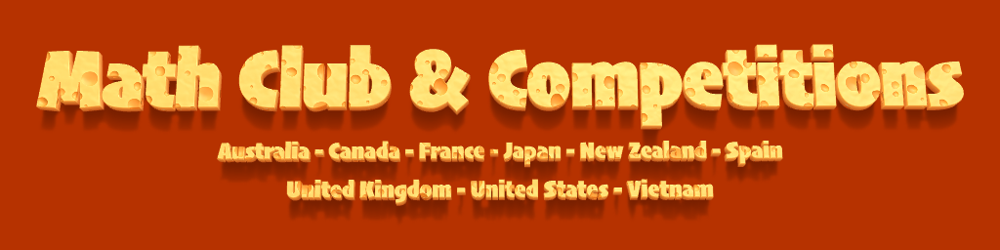

# MCC – A Global Math Club

## 1. 🏆 Who are we? & Our 2026-2027 Transition / Chúng tôi là ai & Sự chuyển mình 2026-2027

Founded in Canada, MCC has grown from a passionate group of students into a vibrant international community. For over a decade, we have offered coaching, weekly challenges, and team contests to help students develop strong problem-solving skills. Our track record is marked by world-class achievements: In 2025, for the second time, our Middle School team placed **1st in the world** at the Purple Comet Math Meet with a perfect score, while our High School teams consistently earn global **Honorable Mentions**.

**The Transition to 2026-2027:**
Starting from the 2026-2027 school year, MCC is evolving into a more structured, professional organization. We are moving from a flexible coaching model to a **Comprehensive Research & Olympiad Club**. This transformation includes:

* **Professional Leadership:** A structured board with a President and 3 Vice-Presidents (Administrative, Academic, and Competition).
* **Formal Membership:** An annual membership model ($200-$300/year) that provides a stable foundation for advanced resources.
* **Global On-site Events:** Launching two annual "MCC Olympiads" held in-person in the USA and Europe.

### How to Join

**Contact**: register yourself to [the MCC Malining List](https://groups.google.com/g/mcc-school-year-2025-2026), or email to [Ms. Thu Pham](mailto:tpham151st@gmail.com), [Ms. Ngoc Ha](mailto:lengocha45@gmail.com), [Ms. Ngoc Anh](tranngocanh0910@gmail.com).

&nbsp;

Câu Lạc Bộ Toán Học Toàn Cầu MCC khởi đầu tại Canada và đã phát triển thành một cộng đồng quốc tế sôi động. Trong hơn một thập kỷ, chúng tôi đã đồng hành cùng học sinh qua các buổi huấn luyện và thử thách hàng tuần. Thành tích của MCC đã được khẳng định trên đấu trường quốc tế: Năm 2025, lần thứ 2 đội THCS của chúng tôi xếp **Hạng Nhất Thế Giới** với điểm tuyệt đối tại Purple Comet Math Meet, và các đội THPT liên tục nhận vinh danh **Honorable Mentions** toàn cầu.

**Sự chuyển mình cho năm học 2026-2027:**
Bước sang năm học 2026-2027, MCC chính thức chuyển mình sang mô hình **Câu lạc bộ Nghiên cứu & Thi đấu chuyên nghiệp**. Đây là một bước tiến từ mô hình hỗ trợ tự phát sang một tổ chức có cấu trúc chặt chẽ:

* **Bộ máy chuyên nghiệp:** Điều hành bởi Chủ tịch và 3 Phó chủ tịch phụ trách chuyên sâu về Hành chính, Chuyên môn và Thi đua.
* **Hệ thống hội viên:** Chế độ hội viên thường niên ($200-$300/năm) giúp duy trì các nguồn lực cao cấp và hạ tầng học tập.
* **Olympic trực tiếp:** Tổ chức 2 kỳ thi Olympic nội bộ quy mô lớn mỗi năm tại Mỹ và Châu Âu, tạo môi trường thi đấu thực tế cho học sinh.

### Làm Thế Nào Để Tham Gia 

**Liên lạc**: đăng ký [the MCC Malining List](https://groups.google.com/g/mcc-school-year-2025-2026), hoặc email cho [Ms. Thu Pham](mailto:tpham151st@gmail.com), [Ms. Ngoc Ha](mailto:lengocha45@gmail.com), [Ms. Ngoc Anh](tranngocanh0910@gmail.com).

&nbsp;

## 2. The Club Curriculums/ Giáo Trình của Câu Lộc Bộ

Every journey in mathematics begins with a single spark of curiosity. To help students find that spark, we have designed a clear, progressive pathway:

### (1) The Foundation: 100 Math Problems for Absolute Beginners

Before diving into complex theories, students need to fall in love with patterns and logic. This book is a collection of teaching insights gathered over a decade, designed to make math meaningful. It is the perfect entry point for young thinkers.
👉 [100 Math Problems for Absolute Beginners (Ebook)](https://www.lulu.com/shop/nghia-doan/100-math-problems-for-absolute-beginners/ebook/product-p69y785.html)

### (2) The Curriculum: Learning Problem Solving V & VI (New for 2026)

For the 2026-2027 school year, we are releasing our flagship high-quality print series. These are not just textbooks; they are complete learning journeys updated annually.

* **Volume V: 500 Math Problems for Growing Thinkers** (Middle School)
* **Volume VI: 500 Math Problems for Deep Thinkers** (High School)

Each set consists of two books:

1. **Textbook & Practice:** 50 chapters with guided examples, including **video solutions** for key problems accessible via member accounts.
2. **Exams & Solutions:** A dedicated volume for assessment and grading, allowing parents and students to track progress throughout the 4-year curriculum.

&nbsp;

Mỗi hành trình toán học đều bắt đầu từ một tia sáng tò mò. Để giúp học sinh khởi đầu đúng hướng, chúng tôi đã thiết kế một lộ trình phát triển rõ ràng:

### (1) Nền tảng: 100 Bài Toán Dành Cho Người Mới Bắt Đầu

Trước khi bước vào những lý thuyết phức tạp, học sinh cần yêu thích các quy luật và logic. Cuốn sách này là tập hợp những trải nghiệm giảng dạy suốt một thập kỷ, giúp toán học trở nên có ý nghĩa và gần gũi hơn. Đây là điểm bắt đầu lý tưởng.
👉 [100 Bài Toán Dành Cho Người Mới Bắt Đầu (Ebook)](https://www.google.com/search?q=https://www.lulu.com/shop/nghia-doan/100-b%C3%A0i-to%C3%A1n-d%C3%A0nh-cho-ng%C6%B0%E1%BB%9Di-m%E1%BB%9Bi-b%E1%BA%AFt-%C4%91%E1%BA%A7u/ebook/product-rm68v54.html)

### (2) Giáo trình chuyên sâu: Learning Problem Solving V & VI (Ra mắt 2026)

Cho năm học 2026-2027, MCC ra mắt bộ sách in chất lượng cao, được cập nhật và hiệu chỉnh hàng năm để phù hợp với thực tế học tập:

* **Tập V: 500 Math Problems for Growing Thinkers** (Dành cho cấp THCS)
* **Tập VI: 500 Math Problems for Deep Thinkers** (Dành cho cấp THPT)

Mỗi cấp độ bao gồm bộ đôi sách đi kèm:

1. **Sách Giáo khoa & Bài tập:** Gồm 50 chương với các ví dụ hướng dẫn và bài tập chọn lọc. Đặc biệt, các bài toán tiêu biểu sẽ có **video phân tích lời giải** đi kèm.
2. **Bộ đề kiểm tra & Lời giải:** Hệ thống đánh giá định kỳ giúp học sinh và phụ huynh kiểm soát quá trình học tập một cách nghiêm túc và hiệu quả.

&nbsp;

## 3. Important Deadlines / Các mốc thời gian quan trọng

* **February 28, 2026:** Registration deadline for the new book sets and club membership.
* **March 2026:** Writing and content finalization phase.
* **August 2026:** Global distribution of printed books to registered local groups.
* **28/02/2026:** Hạn chót đăng ký mua bộ sách mới và tham gia hội viên câu lạc bộ.
* **Tháng 3/2026:** Bắt đầu giai đoạn biên soạn và hoàn thiện nội dung.
* **Tháng 8/2026:** Giao sách in đến các điểm đăng ký chung trên toàn cầu.

&nbsp;

## 4. Our achievements in the Purple Comet Math Meets

The great teams in 2025 [2025 Middle School and High School Teams](./purple-comet.md)

### **Middle School Mixed Team Category**:

- [1st in the world in 2025: MS One (Math, Coding & Chess Club)](https://purplecomet.org/results/2025?year=2025)
- [1st in the world in 2019: The Contest Team (Math & Chess Club in Ottawa)](https://purplecomet.org/results/2019?year=2019)
- [Honorable mention worldwide in 2021: MCC Challengers (Canada)](https://purplecomet.org/results/2021?year=2021)
- [Second in Canada in 2023: Middle School One (Canada)](https://purplecomet.org/results/2023?year=2023)
- [Second in Canada in 2022: The Pi-thons (Canada)](https://purplecomet.org/results/2022?year=2022)

### **High School Mixed Team Category**:

- [Honorable mention worldwide, first in Canada in 2025: HS One (Math, Codding & Chess Club (MCC))](https://purplecomet.org/results/2025?year=2025)
- [Honorable mention worldwide, first in Canada in 2025: HS Two (Math, Codding & Chess Club (MCC))](https://purplecomet.org/results/2025?year=2025)
- [Honorable mention worldwide, second in Canada in 2022: The Lost Comets (Canada)](https://purplecomet.org/results/2022?year=2022)
- [Honorable mention worldwide, second in Canada in 2021: Hi-scorers (Canada)](https://purplecomet.org/results/2021?year=2021)
- [Second in Canada in 2020: Mazaleth (Canada)](https://purplecomet.org/?action=result/results/2020)
- [First in Canada in 2019: The Contest Team (Math & Chess Club in Ottawa)](https://purplecomet.org/results/2019?year=2019)

&nbsp;

Những đội tuyển xuất sắc năm 2025 [Các đội THCS và THPT năm 2025](https://www.google.com/search?q=./purple-comet.md)

### **Hạng mục Đội Hỗn hợp cấp THCS**:

* [Hạng Nhất Thế giới năm 2025: MS One (Math, Coding & Chess Club)](https://purplecomet.org/results/2025?year=2025)
* [Hạng Nhất Thế giới năm 2019: The Contest Team (Math & Chess Club tại Ottawa)](https://purplecomet.org/results/2019?year=2019)
* [Vinh danh Toàn cầu năm 2021: MCC Challengers (Canada)](https://purplecomet.org/results/2021?year=2021)
* [Hạng Nhì tại Canada năm 2023: Middle School One (Canada)](https://purplecomet.org/results/2023?year=2023)
* [Hạng Nhì tại Canada năm 2022: The Pi-thons (Canada)](https://purplecomet.org/results/2022?year=2022)

### **Hạng mục Đội Hỗn hợp cấp THPT**:

* [Vinh danh Toàn cầu, Hạng Nhất tại Canada năm 2025: HS One (Math, Coding & Chess Club (MCC))](https://purplecomet.org/results/2025?year=2025)
* [Vinh danh Toàn cầu, Hạng Nhất tại Canada năm 2025: HS Two (Math, Coding & Chess Club (MCC))](https://purplecomet.org/results/2025?year=2025)
* [Vinh danh Toàn cầu, Hạng Nhì tại Canada năm 2022: The Lost Comets (Canada)](https://purplecomet.org/results/2022?year=2022)
* [Vinh danh Toàn cầu, Hạng Nhì tại Canada năm 2021: Hi-scorers (Canada)](https://purplecomet.org/results/2021?year=2021)
* [Hạng Nhì tại Canada năm 2020: Mazaleth (Canada)](https://purplecomet.org/?action=result/results/2020)
* [Hạng Nhất tại Canada năm 2019: The Contest Team (Math & Chess Club tại Ottawa)](https://purplecomet.org/results/2019?year=2019)

&nbsp;

## 5. [Our other books and previous curriculums]

[Learning Problem Solving Volumes 1-2-3](./lps-volumes.md)

[Annual School Year books (2021-2025)](./annual-books.md)

&nbsp;

## 6. [From the students](./from-students.md)