# 🚀 MCC at Purple Comet 2026  
## A Decade of Excellence • A Global Achievement

We proudly present the achievements and voices of our students at the [Purple Comet! Math Meet 2026](chatgpt://generic-entity?number=0), as we also celebrate **10 years of MCC participation in Purple Comet**.

---

## 🌍 Preminent at Global Stage

- 🌐 **4,804 teams**
- 🌎 **86 countries**

Competing on this scale, MCC teams demonstrated not only excellence — but discipline, collaboration, and a deep love for mathematics.

---

## 🏆 MCC RESULTS

| Team | Result | Score |
|------|--------|-------|
| 🥇 MS ONE | First Place (Tie) | 20 / 20 |
| 🥇 MS TWO | First Place (Tie) | 20 / 20 |
| 🌟 MS THREE | Honorable Mention | 19 / 20 |
| 🥇 HS ONE | First Place (Tie) | 30 / 30 |

🔥 **3 MCC teams ranked #1 worldwide**

---

## 🏆 MCC TEAMS OVERVIEW

<table>

<tr>

<td valign="top">

### 🟦 MS ONE  

**🥇 First Place (20/20)**  

| Role | Name | Grade |
|------|------|------|
| Captain | Jason To | 8 |
| Vice Captain | Linh Le | 8 |
| Member | Alex Tran | 7 |
| Member | Chi Pham | 8 |
| Member | Mailys Phung Khac | 8 |
| Member | Nam Phong Nguyen | 8 |

</td>

<td valign="top">

### 🟦 MS TWO  

**🥇 First Place (20/20)**  

| Role | Name | Grade |
|------|------|------|
| Captain | Luan Tran | 8 |
| Vice Captain | Nam Nguyen | 8 |
| Member | Long Vo Duc Tran | 8 |
| Member | Anna Dao | 8 |
| Member | Minh Vo Duc Tran | 7 |
| Member | Nguyen Trung Kien | 8 |

</td>

<td valign="top">

### 🟦 MS THREE  

**🌟 Honorable Mention (19/20)**  

| Role | Name | Grade |
|------|------|------|
| Captain | Henry Ho | 7 |
| Vice Captain | Helen Vien | 8 |
| Member | Claire Bao Tran Luu | 5 |
| Member | Gia Minh Nguyen | 6 |
| Member | Harry Vien | 6 |
| Member | Michael Le | 5 |
</td>
<td valign="top">

### 🟦 HS ONE  

**🥇 First Place (30/30)**  

| Role | Name | Grade |
|------|------|------|
| Captain | Karl Le | 11 |
| Vice Captain | Linh Le | 8 |
| Member | Antoine Dao | 11 |
| Member | Chi Pham | 8 |
| Member | Jake Cao | 9 |
| Member | Jason To | 8 |
</td>
</tr>
</table>

---

# 👥 MCC Student Profiles (Alphabetical)

<table>
<tr>

<td width="20%" valign="top">

### Anna Dao  
**G8 • Age 13**  
**Teams:** MS TWO  
**Role:** Member  

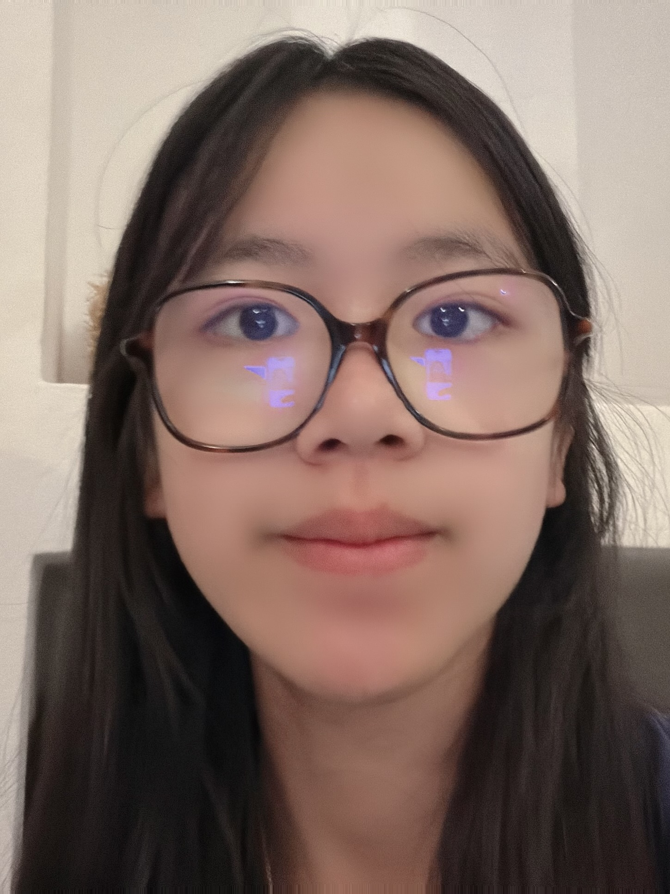

**Who I Am**  
Hello, my name is Anna. I am 13 years old and in Grade 8. I live in France.

**MCC Journey**  
I have been attending MCC for 2 years.

**Purple Comet Experience**  
I took part in the Purple Comet competition for 2 years. I really appreciate the teamwork, and I was very happy to receive the first award.

**Parent Thought**  
Anna has participated in the club for the past two years. She has started to make progress, becoming more focused and gradually improving her reasoning and teamwork.

</td>

<td width="20%" valign="top">

### Antoine Dao  
**G11 • Age 16**  
**Teams:** HS ONE  
**Role:** Member  

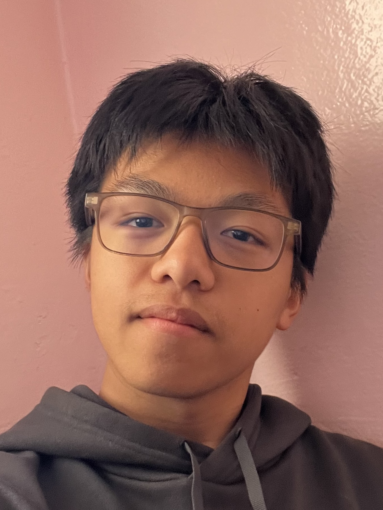

**Who I Am**  
My name is Antoine Dao, and I am 16 years old.

**MCC Journey**  
I started MCC 5 years ago and have seen a lot of progress through the years.

**Purple Comet Experience**  
I have taken part in 4 Purple Comet competitions, and this year is the first time our team achieved a perfect score of 30/30.

**Parent Thought**  
We have seen great progress in his autonomy, mathematical knowledge, and reasoning.

</td>

<td width="20%" valign="top">

### Claire Bao Tran Luu  
**G5 • Age 10**  
**Teams:** MS THREE  
**Role:** Member  

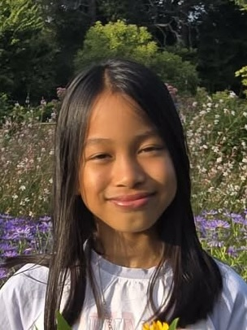

**Who I Am**  
I am Claire, a fifth grader living in Washington. I love playing the violin and piano, and I enjoy swimming.

**MCC Journey**  
I have been attending MCC for 2 years.

**Purple Comet Experience**  
I took part in the 2026 Middle School Purple Comet as part of Team 3. The training sessions were very helpful, and the problems were similar to what we practiced, which helped me understand how to approach them.

**Parent Thought**  
Claire has improved tremendously. She can now write solutions in a logical and precise way and has benefited greatly from teamwork.

</td>

<td width="20%" valign="top">

### Chi Pham  
**G8 • Age 13**  
**Teams:** MS ONE, HS ONE  
**Role:** Member  

**Who I Am**  
I am Chi Pham. I am in 8th grade and live in Washington, USA.

**MCC Journey**  
I have been attending MCC for 3 years.

**Purple Comet Experience**  
I took part in both MS ONE and HS ONE. Purple Comet was a nice challenge and helped develop teamwork within the club.

**Parent Thought**  
Chi has significantly improved since joining the club. She started as a beginner, and now she is solid and able to work well in a team.

</td>

<td width="20%" valign="top">

### Gia Minh Nguyen  
**G6 • Age 11**  
**Teams:** MS THREE  
**Role:** Member  

<!-- 

**Who I Am**  

**MCC Journey**  

**Purple Comet Experience**  

**Parent Thought**   -->

</td>

</tr>

<tr>

<td width="20%" valign="top">

### Harry Vien  
**G6 • Age 10**  
**Teams:** MS THREE  
**Role:** Member  

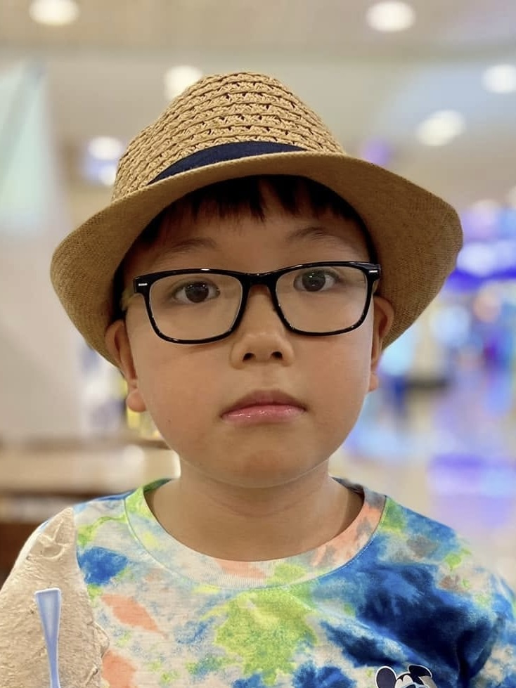

**Who I Am**  
I am Harry. I am 11 years old and will be attending Queen Elizabeth's School for Boys. I have participated in several math competitions.

**MCC Journey**  
I have been attending MCC for 2 years.

**Purple Comet Experience**  
This was my first time attending Purple Comet. I found it a great opportunity to test my skills and understand what I need to improve.

**Parent Thought**  
Harry has made significant progress in mathematical thinking and problem-solving skills.

</td>

<td width="20%" valign="top">

### Helen Vien  
**G8 • Age 13**  
**Teams:** MS THREE  
**Role:** Vice Captain  

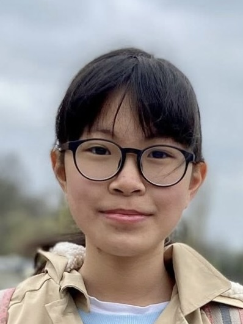

**Who I Am**  
I am 13 years old and study at the Henrietta Barnett School in the UK.

**MCC Journey**  
I have been attending MCC for 2 years.

**Purple Comet Experience**  
This was my first time participating. It was very helpful in improving my problem-solving skills.

**Parent Thought**  
Helen has made excellent progress and achieved outstanding results in competitions.

</td>

<td width="20%" valign="top">

### Henry Ho  
**G7 • Age 13**  
**Teams:** MS THREE  
**Role:** Captain  

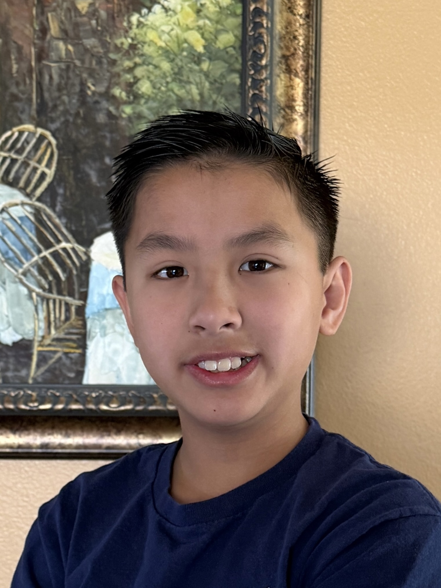

**Who I Am**  
My name is Henry Ho. I am 13 years old and in 7th grade.

**MCC Journey**  
This is my second year at MCC.

**Purple Comet Experience**  
I participated this year, and the problems were solvable but required time and thinking.

**Parent Thought**  
Henry has made strong progress in strengthening his fundamentals.

</td>

<td width="20%" valign="top">

### Jason To  
**G8 • Age 14**  
**Teams:** MS ONE, HS ONE  
**Role:** Captain (MS ONE), Member (HS ONE)

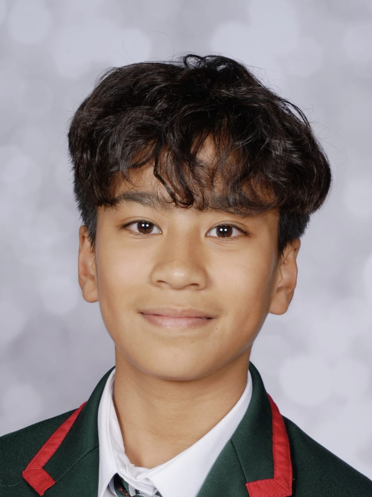

**Who I Am**  
My name is Jason To, a dedicated member of MCC.

**MCC Journey**  
I have been attending MCC for 3 years.

**Purple Comet Experience**  
I participated in both Middle School and High School competitions and achieved full marks. It was a proud moment, but the teamwork and focus mattered most.

**Parent Thought**  
Jason has grown in confidence, maturity, and passion for mathematics.

</td>

<td width="20%" valign="top">

### Jake Cao  
**G9 • Age 15**  
**Teams:** HS ONE  
**Role:** Member  

<!-- 

**Who I Am**  

**MCC Journey**  

**Purple Comet Experience**  

**Parent Thought**   -->

</td>

</tr>

<tr>

<td width="20%" valign="top">

### Karl Le  
**G11 • Age 16**  
**Teams:** HS ONE  
**Role:** Captain  

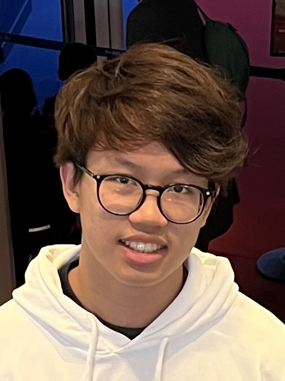

**Who I Am**  
Karl Le, 16 years old, living in France near Paris, currently in 11th grade.

**MCC Journey**  
I have been attending MCC for 5 years.

**Purple Comet Experience**  
I have participated for 3–4 years. It is a good competition, and this year’s was even better, especially looking at the results.

**Parent Thought**  
Good.

</td>

<td width="20%" valign="top">

### Linh Le  
**G8 • Age 14**  
**Teams:** MS ONE, HS ONE  
**Role:** Vice Captain (MS ONE), Vice Captain (HS ONE)

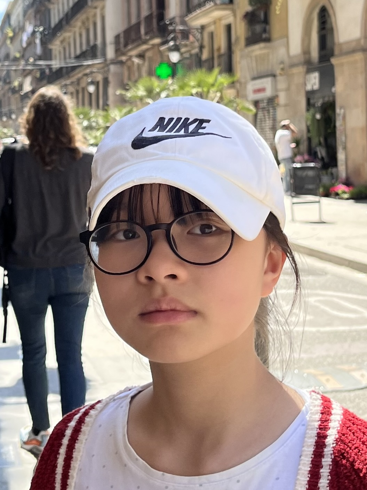

**Who I Am**  
Hi! My name is Linh, and I am a Year 9 student from the UK.

**MCC Journey**  
I have been attending MCC for 2 years.

**Purple Comet Experience**  
I have participated in the Purple Comet competitions in 2025 and 2026. This year, I was part of both the Middle School and High School teams, where both teams achieved full marks and top scores. The competition was an unforgettable experience with both intense and rewarding moments.

**Parent Thought**  
Linh has developed a deeper passion for mathematics, stronger problem-solving skills, teamwork, and discipline.

</td>

<td width="20%" valign="top">

### Long Vo Duc Tran  
**G8 • Age 13**  
**Teams:** MS TWO  
**Role:** Member  

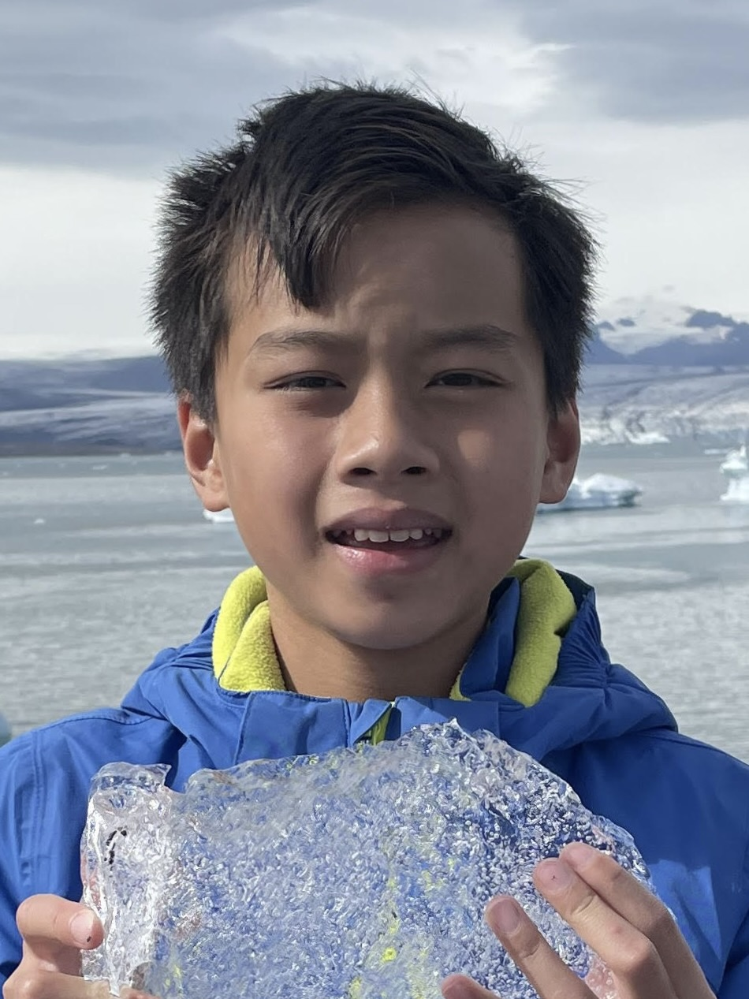

**Who I Am**  
My name is Long Vo Duc Tran. I am 13 years old and in Year 9 in the UK.

**MCC Journey**  
I have been attending MCC for almost 2 years.

**Purple Comet Experience**  
I took part in the Middle School Purple Comet as part of Team 2. I thought it was challenging and actually harder than the practice, but it was fun.

**Parent Thought**  
Long has developed from needing encouragement to becoming genuinely excited about learning. He now appreciates the beauty of mathematics and expresses his reasoning clearly.

</td>

<td width="20%" valign="top">

### Luan Tran  
**G8 • Age 14**  
**Teams:** MS TWO  
**Role:** Captain  

<!-- 

**Who I Am**  

**MCC Journey**  

**Purple Comet Experience**  

**Parent Thought**   -->

</td>

<td width="20%" valign="top">

### Mailys Phung Khac  
**G8 • Age 13**  
**Teams:** MS ONE  
**Role:** Member  

<!-- 

**Who I Am**  

**MCC Journey**  

**Purple Comet Experience**  

**Parent Thought**  
 -->

</td>

</tr>

<tr>

<td width="20%" valign="top">

### Michael Le  
**G5 • Age 11**  
**Teams:** MS THREE  
**Role:** Member  

**Who I Am**  
Michael Le, a 5th grader in Washington, USA. I enjoy building LEGO, creating music sheets, and playing video games with my brothers.

**MCC Journey**  
I have been attending MCC for 1 year.

**Purple Comet Experience**  
I participated in Purple Comet 2026. My teammates actively worked on problems and helped review each other’s solutions. The training and materials provided were very effective.

**Parent Thought**  
Michael has improved in critical thinking and teamwork.

</td>

<td width="20%" valign="top">

### Minh Nguyen  
**G6 • Age 12**  
**Teams:** MS TWO  
**Role:** Member  

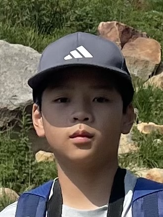

**Who I Am**  
I am in 6th grade and live in Washington state.

**MCC Journey**  
I have been attending MCC for 2 years.

**Purple Comet Experience**  
I participated in the 2026 Middle School competition. It was my first time. I received lectures and practice materials beforehand. My teammates were kind, and we all did our best.

**Parent Thought**  
Minh has learned many new concepts and now explains ideas much more clearly. He also collaborates very well with teammates.

</td>

<td width="20%" valign="top">

### Minh Vo Duc Tran  
**G7 • Age 12**  
**Teams:** MS TWO  
**Role:** Member  

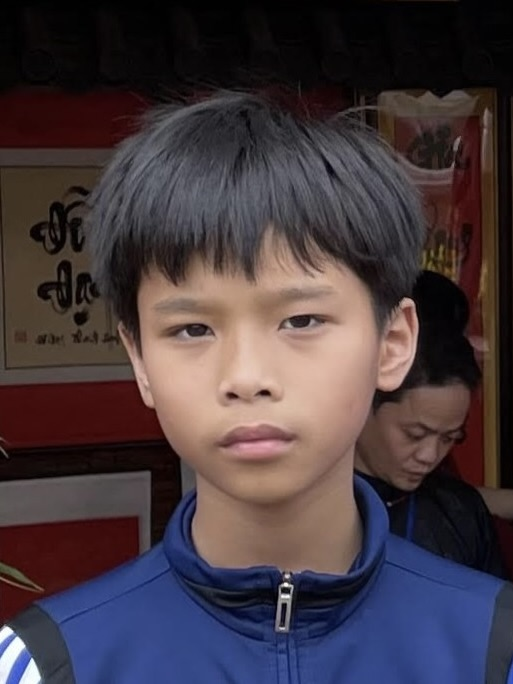

**Who I Am**  
My name is Minh Vo Duc Tran, and I am 12 years old. I am in Year 7 in the UK.

**MCC Journey**  
I have been attending MCC for almost 2 years.

**Purple Comet Experience**  
The Purple Comet competition was more challenging than anything I had done before. I was part of the second Middle School team.

**Parent Thought**  
Minh has learned persistence and improved his ability to explain his solutions clearly.

</td>

<td width="20%" valign="top">

### Nam Nguyen  
**G8 • Age 13**  
**Teams:** MS TWO  
**Role:** Vice Captain  

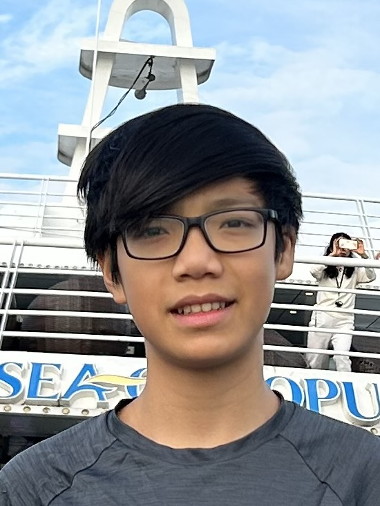

**Who I Am**  
I am a Year 9 student at the Perse Upper in Cambridge. Maths is my favourite subject, and I also play piano and table tennis.

**MCC Journey**  
I have been attending MCC for 2 years.

**Purple Comet Experience**  
I participated in the Middle School competition. The questions were interesting and challenging.

**Parent Thought**  
“My son finds the MCC Club both useful and motivating for his Maths learning.”

</td>

<td width="20%" valign="top">

### Nam Phong Nguyen  
**G8 • Age 13**  
**Teams:** MS ONE  
**Role:** Member  

**Who I Am**  
I am 13 years old and study at Lakanal Middle School in Sceaux, France. I enjoy sports, especially tennis.

**MCC Journey**  
I have been attending MCC for about 1.5 years.

**Purple Comet Experience**  
I participated in MS ONE this year. The competition was very interesting and required strong collaboration between all team members.

**Parent Thought**  
He has become more independent and focused when solving math problems, and his motivation has improved.

</td>

</tr>

<tr>

<td width="20%" valign="top">

### Nguyen Trung Kien  
**G8 • Age 13**  
**Teams:** MS TWO  
**Role:** Member  

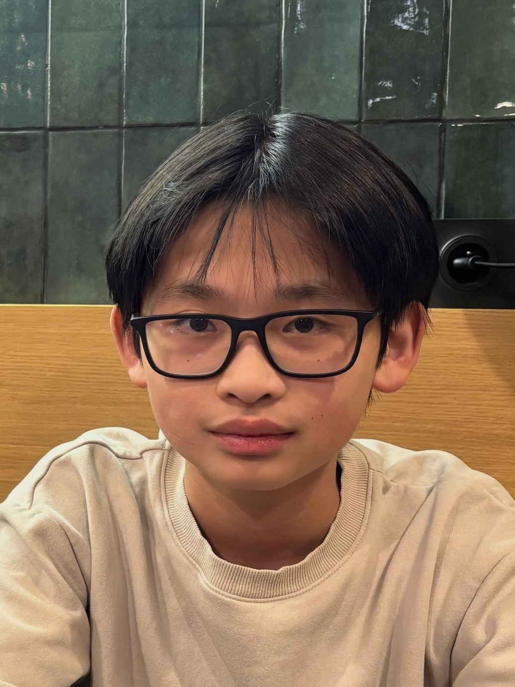

**Who I Am**  
My name is Trung Kien. I live in France and am in 8th grade. I enjoy math, chess, and playing.

**MCC Journey**  
I have been attending MCC since 2024.

**Purple Comet Experience**  
It was my first time participating, and I really loved working as a team.

**Parent Thought**  
More time work on Math.

</td>

</tr>

</table>
---

# 💬 FEATURED TESTIMONIAL  
## Albert Dinh-Le (MCC Alumni, Twice Purple Comet Honourable Mentions 2022, 2025.)

It is clear how much the club has grown into something truly special. Over the years, it has brought together students who share a curiosity for mathematics and a desire to challenge themselves. Your commitment to creating engaging problems and fostering a supportive, stimulating environment has made the club a place where learning is both demanding and deeply rewarding.

On a personal level, the impact of the club has been especially meaningful during my studies. The rigor of the problems, combined with your guidance, helped me develop the discipline, precision, and perseverance required to succeed. Beyond improving my mathematical skills, it shaped the way I think, reason, and approach difficulty in general. The habits and confidence I gained through the club continue to guide me every day, and I am truly grateful for its lasting influence.

---

# 🎯 FINAL REFLECTION

This is not just about winning.

It is about:
- developing discipline and perseverance  
- learning to think deeply and clearly  
- growing through teamwork and challenge  

💙 MCC continues to build not only strong mathematicians —  
but confident thinkers.

---

# 🔗 Official Results
https://purplecomet.org/results/2026

---

# #MCC #PurpleComet #GlobalChampions #MathJourney

&nbsp;

# MCC – A Global Math Club

## 1. 🏆 Who are we? & Our 2026-2027 Transition / Chúng tôi là ai & Sự chuyển mình 2026-2027

Founded in Canada, MCC has grown from a passionate group of students into a vibrant international community. For over a decade, we have offered coaching, weekly challenges, and team contests to help students develop strong problem-solving skills. Our track record is marked by world-class achievements: In 2025, for the second time, our Middle School team placed **1st in the world** at the Purple Comet Math Meet with a perfect score, while our High School teams consistently earn global **Honorable Mentions**.

**The Transition to 2026-2027:**
Starting from the 2026-2027 school year, MCC is evolving into a more structured, professional organization. We are moving from a flexible coaching model to a **Comprehensive Research & Olympiad Club**. This transformation includes:

* **Professional Leadership:** A structured board with a President and 3 Vice-Presidents (Administrative, Academic, and Competition).
* **Formal Membership:** An annual membership model ($200-$300/year) that provides a stable foundation for advanced resources.
* **Global On-site Events:** Launching two annual "MCC Olympiads" held in-person in the USA and Europe.

Câu Lạc Bộ Toán Học Toàn Cầu MCC khởi đầu tại Canada và đã phát triển thành một cộng đồng quốc tế sôi động. Trong hơn một thập kỷ, chúng tôi đã đồng hành cùng học sinh qua các buổi huấn luyện và thử thách hàng tuần. Thành tích của MCC đã được khẳng định trên đấu trường quốc tế: Năm 2025, lần thứ 2 đội THCS của chúng tôi xếp **Hạng Nhất Thế Giới** với điểm tuyệt đối tại Purple Comet Math Meet, và các đội THPT liên tục nhận vinh danh **Honorable Mentions** toàn cầu.

**Sự chuyển mình cho năm học 2026-2027:**
Bước sang năm học 2026-2027, MCC chính thức chuyển mình sang mô hình **Câu lạc bộ Nghiên cứu & Thi đấu chuyên nghiệp**. Đây là một bước tiến từ mô hình hỗ trợ tự phát sang một tổ chức có cấu trúc chặt chẽ:

* **Bộ máy chuyên nghiệp:** Điều hành bởi Chủ tịch và 3 Phó chủ tịch phụ trách chuyên sâu về Hành chính, Chuyên môn và Thi đua.
* **Hệ thống hội viên:** Chế độ hội viên thường niên ($200-$300/năm) giúp duy trì các nguồn lực cao cấp và hạ tầng học tập.
* **Olympic trực tiếp:** Tổ chức 2 kỳ thi Olympic nội bộ quy mô lớn mỗi năm tại Mỹ và Châu Âu, tạo môi trường thi đấu thực tế cho học sinh.

### How to Join / Làm Thế Nào Để Tham Gia 

**Contact**: register yourself to [the MCC Malining List](https://groups.google.com/g/mcc-school-year-2025-2026), or email to [Ms. Thu Pham](mailto:tpham151st@gmail.com), [Ms. Ngoc Ha](mailto:lengocha45@gmail.com), [Ms. Ngoc Anh](tranngocanh0910@gmail.com).

**Liên lạc**: đăng ký [the MCC Malining List](https://groups.google.com/g/mcc-school-year-2025-2026), hoặc email cho [Ms. Thu Pham](mailto:tpham151st@gmail.com), [Ms. Ngoc Ha](mailto:lengocha45@gmail.com), [Ms. Ngoc Anh](tranngocanh0910@gmail.com).

&nbsp;

## 2. The Club Curriculums/ Giáo Trình của Câu Lộc Bộ

Every journey in mathematics begins with a single spark of curiosity. To help students find that spark, we have designed a clear, progressive pathway.

Mỗi hành trình toán học đều bắt đầu từ một tia sáng tò mò. Để giúp học sinh khởi đầu đúng hướng, chúng tôi đã thiết kế một lộ trình phát triển rõ ràng.

### (1) The Foundation: 100 Math Problems for Absolute Beginners / Nền tảng: 100 Bài Toán Dành Cho Người Mới Bắt Đầu

Before diving into complex theories, students need to fall in love with patterns and logic. This book is a collection of teaching insights gathered over a decade, designed to make math meaningful. It is the perfect entry point for young thinkers.

How can we make math more enjoyable? Not a set of dry lessons. Not a series of drills. But something that sparks curiosity. Something that feels like solving a mystery, discovering a pattern, unlocking a secret? Over the past 10 years, I’ve taught hundreds of students — from beginners to competition-level learners — and learned one thing: The right problem explained the right way can change everything. That’s why I wrote this book. It’s a collection of knowledge, ideas, and teaching insights gathered over a decade of working with young learners.

It’s designed to help students fall in love with problem solving — not by making things easier, but by making them more meaningful. I’d love to share it with you.

Trước khi bước vào những lý thuyết phức tạp, học sinh cần yêu thích các quy luật và logic. Cuốn sách này là tập hợp những trải nghiệm giảng dạy suốt một thập kỷ, giúp toán học trở nên có ý nghĩa và gần gũi hơn. Đây là điểm bắt đầu lý tưởng.

Làm thế nào để Toán học trở nên thú vị hơn? Không phải là những bài giảng khô khan. Cũng không phải là một chuỗi các bài luyện tập máy móc. Mà là điều gì đó khơi gợi sự tò mò — như đang giải một bí ẩn, phát hiện một quy luật, mở khóa một điều bí mật? Trong 10 năm qua, tôi đã dạy hàng trăm học sinh — từ những em mới bắt đầu đến các bạn học sinh luyện thi cấp cao — và tôi rút ra một điều: một bài toán phù hợp, được giảng giải đúng cách, có thể thay đổi mọi thứ. Đó là lý do tôi viết cuốn sách này. Nó là tập hợp của kiến thức, ý tưởng, và những trải nghiệm giảng dạy mà tôi tích lũy suốt một thập kỷ làm việc cùng học sinh nhỏ tuổi. 

Cuốn sách được viết để giúp học sinh yêu thích việc giải toán — không phải bằng cách làm cho mọi thứ dễ hơn, mà là bằng cách khiến chúng có ý nghĩa hơn. Tôi rất muốn chia sẻ nó với bạn. 

There are two editions: print and electronic. I suggest you to get the print one, that is a beautiful and high quality book. Contact the club to have the print edition.

In case if you want to have the ebook, you get it in your hand in 5 minutes.

👉 [100 Math Problems for Absolute Beginners (Ebook)](https://www.lulu.com/shop/nghia-doan/100-math-problems-for-absolute-beginners/ebook/product-p69y785.html)

Hiện có hai phiên bản: sách in và sách điện tử. Tôi khuyên bạn nên chọn phiên bản sách in, vì đây là một cuốn sách được thiết kế đẹp mắt với chất lượng cao. Liên lạc với Câu Lộc Bộ để có bản in.

Trong trường hợp bạn muốn sở hữu bản ebook, bạn sẽ nhận được sách chỉ sau 5 phút.

👉 [100 Bài Toán Dành Cho Người Mới Bắt Đầu (Ebook)](https://www.google.com/search?q=https://www.lulu.com/shop/nghia-doan/100-b%C3%A0i-to%C3%A1n-d%C3%A0nh-cho-ng%C6%B0%E1%BB%9Di-m%E1%BB%9Bi-b%E1%BA%AFt-%C4%91%E1%BA%A7u/ebook/product-rm68v54.html)

&nbsp;

### (2) The Curriculum: Learning Problem Solving V & VI (New for 2026) / Giáo trình chuyên sâu: Learning Problem Solving V & VI (Ra mắt 2026)

For the 2026-2027 school year, we are releasing our flagship high-quality print series. These are not just textbooks; they are complete learning journeys updated annually.

* **Volume V: 500 Math Problems for Growing Thinkers** (Middle School)
* **Volume VI: 500 Math Problems for Deep Thinkers** (High School)

Each set consists of two books:

1. **Textbook & Practice:** 50 chapters with guided examples, including **video solutions** for key problems accessible via member accounts.
2. **Exams & Solutions:** A dedicated volume for assessment and grading, allowing parents and students to track progress throughout the 4-year curriculum.

Cho năm học 2026-2027, MCC ra mắt bộ sách in chất lượng cao, được cập nhật và hiệu chỉnh hàng năm để phù hợp với thực tế học tập:

* **Tập V: 500 Math Problems for Growing Thinkers** (Dành cho cấp THCS)
* **Tập VI: 500 Math Problems for Deep Thinkers** (Dành cho cấp THPT)

Mỗi cấp độ bao gồm bộ đôi sách đi kèm:

1. **Sách Giáo khoa & Bài tập:** Gồm 50 chương với các ví dụ hướng dẫn và bài tập chọn lọc. Đặc biệt, các bài toán tiêu biểu sẽ có **video phân tích lời giải** đi kèm.
2. **Bộ đề kiểm tra & Lời giải:** Hệ thống đánh giá định kỳ giúp học sinh và phụ huynh kiểm soát quá trình học tập một cách nghiêm túc và hiệu quả.

&nbsp;

## 3. Important Deadlines / Các mốc thời gian quan trọng

* **February 28, 2026:** Registration deadline for the new book sets and club membership.
* **March 2026:** Writing and content finalization phase.
* **August 2026:** Global distribution of printed books to registered local groups.
* **28/02/2026:** Hạn chót đăng ký mua bộ sách mới và tham gia hội viên câu lạc bộ.
* **Tháng 3/2026:** Bắt đầu giai đoạn biên soạn và hoàn thiện nội dung.
* **Tháng 8/2026:** Giao sách in đến các điểm đăng ký chung trên toàn cầu.

&nbsp;

## 4. Our achievements in the Purple Comet Math Meets

The great teams in 2025 [2025 Middle School and High School Teams](./purple-comet.md)

Những đội tuyển xuất sắc năm 2025 [Các đội THCS và THPT năm 2025](https://www.google.com/search?q=./purple-comet.md)

### **Middle School Mixed Team Category** / **Hạng mục Đội Hỗn hợp cấp THCS**:

- [1st in the world in 2025: MS One (Math, Coding & Chess Club)](https://purplecomet.org/results/2025?year=2025)
- [1st in the world in 2019: The Contest Team (Math & Chess Club in Ottawa)](https://purplecomet.org/results/2019?year=2019)
- [Honorable mention worldwide in 2021: MCC Challengers (Canada)](https://purplecomet.org/results/2021?year=2021)
- [Second in Canada in 2023: Middle School One (Canada)](https://purplecomet.org/results/2023?year=2023)
- [Second in Canada in 2022: The Pi-thons (Canada)](https://purplecomet.org/results/2022?year=2022)

* [Hạng Nhất Thế giới năm 2025: MS One (Math, Coding & Chess Club)](https://purplecomet.org/results/2025?year=2025)
* [Hạng Nhất Thế giới năm 2019: The Contest Team (Math & Chess Club tại Ottawa)](https://purplecomet.org/results/2019?year=2019)
* [Vinh danh Toàn cầu năm 2021: MCC Challengers (Canada)](https://purplecomet.org/results/2021?year=2021)
* [Hạng Nhì tại Canada năm 2023: Middle School One (Canada)](https://purplecomet.org/results/2023?year=2023)
* [Hạng Nhì tại Canada năm 2022: The Pi-thons (Canada)](https://purplecomet.org/results/2022?year=2022)

### **High School Mixed Team Category** / **Hạng mục Đội Hỗn hợp cấp THPT**:

- [Honorable mention worldwide, first in Canada in 2025: HS One (Math, Codding & Chess Club (MCC))](https://purplecomet.org/results/2025?year=2025)
- [Honorable mention worldwide, first in Canada in 2025: HS Two (Math, Codding & Chess Club (MCC))](https://purplecomet.org/results/2025?year=2025)
- [Honorable mention worldwide, second in Canada in 2022: The Lost Comets (Canada)](https://purplecomet.org/results/2022?year=2022)
- [Honorable mention worldwide, second in Canada in 2021: Hi-scorers (Canada)](https://purplecomet.org/results/2021?year=2021)
- [Second in Canada in 2020: Mazaleth (Canada)](https://purplecomet.org/?action=result/results/2020)
- [First in Canada in 2019: The Contest Team (Math & Chess Club in Ottawa)](https://purplecomet.org/results/2019?year=2019)

* [Vinh danh Toàn cầu, Hạng Nhất tại Canada năm 2025: HS One (Math, Coding & Chess Club (MCC))](https://purplecomet.org/results/2025?year=2025)
* [Vinh danh Toàn cầu, Hạng Nhất tại Canada năm 2025: HS Two (Math, Coding & Chess Club (MCC))](https://purplecomet.org/results/2025?year=2025)
* [Vinh danh Toàn cầu, Hạng Nhì tại Canada năm 2022: The Lost Comets (Canada)](https://purplecomet.org/results/2022?year=2022)
* [Vinh danh Toàn cầu, Hạng Nhì tại Canada năm 2021: Hi-scorers (Canada)](https://purplecomet.org/results/2021?year=2021)
* [Hạng Nhì tại Canada năm 2020: Mazaleth (Canada)](https://purplecomet.org/?action=result/results/2020)
* [Hạng Nhất tại Canada năm 2019: The Contest Team (Math & Chess Club tại Ottawa)](https://purplecomet.org/results/2019?year=2019)

&nbsp;

## 5. [Our other books and previous curriculums]

[Learning Problem Solving Volumes 1-2-3](./lps-volumes.md)

[Annual School Year books (2021-2025)](./annual-books.md)

&nbsp;

## 6. [From the students](./from-students.md)