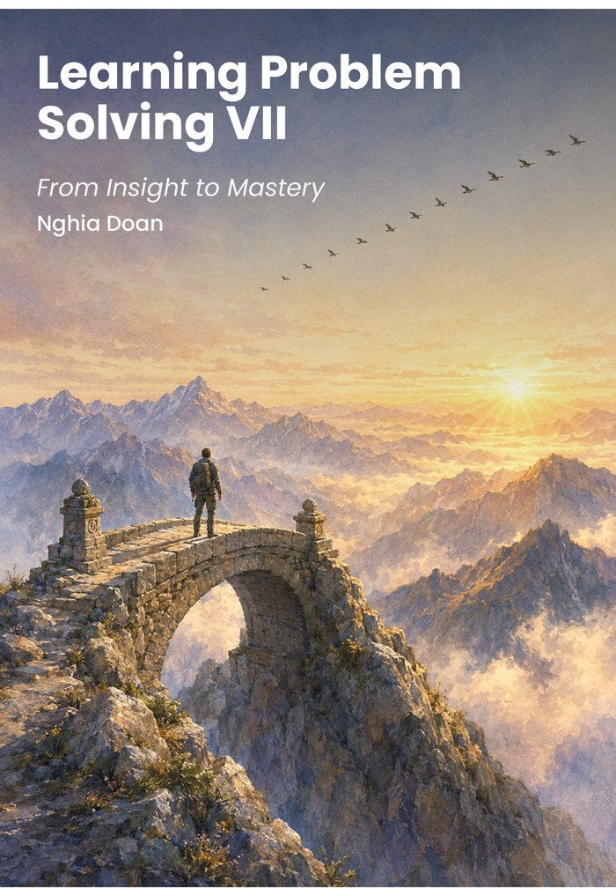
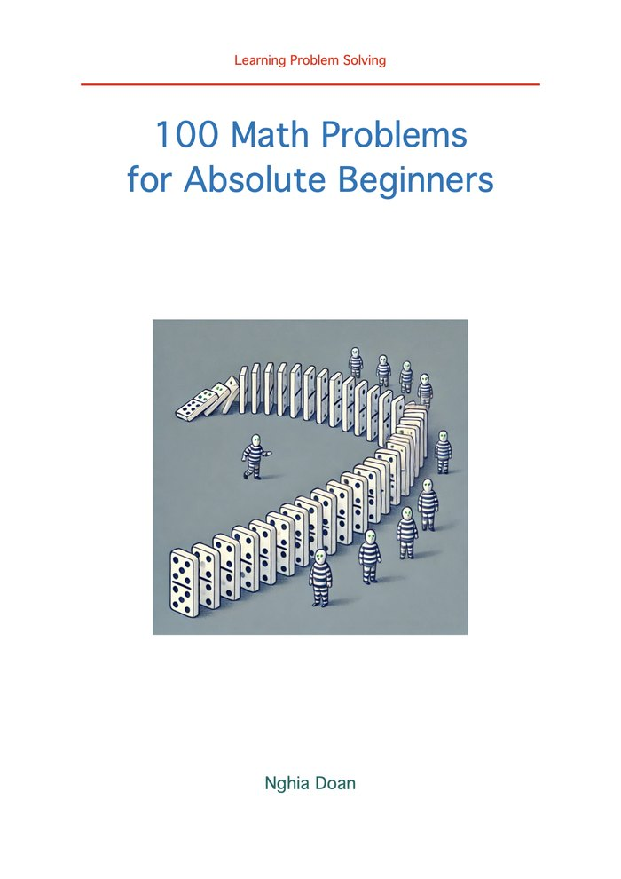

# Math Club & Competitions

A global mathematics club for students in Grades 4–12. Founded in Canada by Nghia Doan, MCC has grown over more than a decade from a small group of curious students into an international community spanning nine countries.

We teach problem solving, not formulas. Our students learn to read a problem carefully, experiment with small cases, build and test a conjecture, and write an argument that convinces. They do it together, in teams, and they take that habit into national and international competition.

[Register for 2026-2027](https://forms.gle/dD6cLU6Ym8kEQddNA){: .btn}
[See the programs](./programs.md){: .btn .secondary}
[Order the books](./books.md){: .btn .secondary}

## 📣 Registration for 2026-2027 is open

**Register by 18 July 2026.** Entrance and reassessment tests take place over two days at the **beginning of August**. Membership is **$300** for the year, including the curriculum books.

**Three things are new, and two of them need settling *before* you fill in the form.** You must **register with a team of two**, already formed — we no longer match students to teammates afterwards. **Almost every student tests at the start of the year**, returning students included, unless they scored 75% or above last year. And the curriculum is now **[LPS VI and LPS VII](./books.md)**, ordered directly from Lulu at printing cost.

[Read the full announcement](./register.md){: .btn}
[Registration form](https://forms.gle/dD6cLU6Ym8kEQddNA){: .btn .secondary}

**📣 Đăng ký năm học 2026-2027 đã mở.** Hạn chót **18/07/2026**. Thi đầu vào và thi đánh giá lại diễn ra trong hai ngày vào **đầu tháng 8**. Phí hội viên **$300/năm**, đã bao gồm bộ sách giáo trình.

**Ba điểm mới, trong đó hai điểm cần chuẩn bị *trước* khi điền mẫu đăng ký.** Học sinh phải **đăng ký theo đội hai người đã lập sẵn** — câu lạc bộ không ghép đội sau khi thi nữa. **Hầu hết học sinh đều thi đầu năm**, kể cả học sinh cũ, trừ những em đạt từ 75% trở lên năm ngoái. Và giáo trình nay là **[LPS VI và LPS VII](./books.md)**, đặt trực tiếp từ Lulu theo giá in.

[Đọc thông báo đầy đủ](./register.md){: .btn}
[Mẫu đăng ký](https://forms.gle/dD6cLU6Ym8kEQddNA){: .btn .secondary}

## Purple Comet 2026 — three teams first in the world

  
<b>3</b>MCC teams ranked #1 worldwide

  
<b>4,804</b>competing teams

  
<b>86</b>countries

  
<b>10</b>years of MCC at Purple Comet

MS ONE and MS TWO both scored a perfect 20/20 and HS ONE a perfect 30/30, each tying for World Champion; MS THREE earned an Honorable Mention at 19/20.

[The 2026 teams and student profiles](./purple-comet-2026.md){: .btn}
[Our results since 2019](./history.md){: .btn .secondary}

## The four training tracks

Students work in pairs through a two-week cycle: study a chapter, submit a team assignment, review the official solutions, then sit a team test together. Every track follows the same rhythm; what changes is the difficulty and the length of the test.

  

    Entry
    <h3><a href="./t1.md">T1 — Foundations</a></h3>
    
The entry point into collaborative contest training. Learning to read a problem, choose a strategy, and write a complete solution with a partner.

    
<strong>LPS VI</strong> · 5–7 hrs/week · 90-minute tests

  

  

    Contest
    <h3><a href="./t2.md">T2 — Foresight</a></h3>
    
Harder contest problems that need several ideas joined together. Comparable to AMC 8/10 and national qualifiers.

    
<strong>LPS VI</strong> · 5–7 hrs/week · 120-minute tests

  

  

    Olympiad
    <h3><a href="./t3.md">T3 — Combat</a></h3>
    
National olympiad training. Standard olympiad theorems, unfamiliar problems broken into solvable parts, rigorous written proof.

    
<strong>LPS VII</strong> · 6–7 hrs/week · 150-minute tests

  

  

    Mastery
    <h3><a href="./t4.md">T4 — Mastery</a></h3>
    
The capstone. Advanced technique, professional solution writing, and the stamina for multi-hour contests. Aimed at team selection tests and the IMO.

    
<strong>LPS VII</strong> · 7–8 hrs/week · 180-minute tests

  

## The curriculum

  

    Middle School
    
    <h3>LPS VI — From Foundations to Insight</h3>
    
54 chapters in 5 parts, 217 themed sections, <strong>1,395 problems</strong> — 998 worked examples and 397 exercises. 672 pages, A4. The textbook for T1 and T2.

    
<a href="https://www.lulu.com/shop/nghia-doan/learning-problem-solving-vi/hardcover/product-m2ezqjj.html">Order from Lulu →</a>

  

  

    High School
    
    <h3>LPS VII — From Insight to Mastery</h3>
    
55 chapters in 5 parts, 216 themed sections, <strong>1,326 problems</strong> — 922 worked examples and 404 exercises. 648 pages, A4. The textbook for T3 and T4.

    
<a href="https://www.lulu.com/shop/nghia-doan/learning-problem-solving-vii/hardcover/product-2mnpyy4.html">Order from Lulu →</a>

  

  

    Starting out
    
    <h3>100 Math Problems for Absolute Beginners</h3>
    
Not the course book — the one that comes before it. For students just starting, or with the club a year or less. English and Vietnamese editions.

    
<a href="./books.md">Details and ordering →</a>

  

  

    Tests
    <h3>Tests & Yearbook</h3>
    
56 papers and over 1,200 problems across four levels — and, at the end of the year, the yearbook the students write with us.

    
<a href="./tests.md">How testing works →</a>

  

## The Online Mathematics Laboratory

**[TOML](./toml.html)** is a free, bilingual companion course: mathematics investigated with a programming tool. Each problem is posed three ways — explore it computationally, explain what you see, then establish it with a proof — and every page carries runnable Python you can execute in the browser or copy to your own machine. Nothing to buy, nothing to install.

## The club in 2026-2027

Starting this year, MCC is becoming a more structured organisation, moving from a flexible coaching model to a **Comprehensive Research & Olympiad Club**:

* **Professional leadership** — a board with a President and three Vice-Presidents (Administrative, Academic, and Competition).
* **Formal membership** — an annual membership of $200–$300, giving the club a stable foundation for advanced resources.
* **Global on-site events** — two annual in-person "MCC Olympiads", in the USA and in Europe.

**Câu Lạc Bộ Toán Học Toàn Cầu MCC** khởi đầu tại Canada và đã phát triển thành một cộng đồng quốc tế sôi động. Trong hơn một thập kỷ, chúng tôi đã đồng hành cùng học sinh qua các buổi huấn luyện và thử thách hàng tuần. Thành tích của MCC đã được khẳng định trên đấu trường quốc tế: năm 2026, ba đội của câu lạc bộ cùng đạt **Hạng Nhất Thế Giới** tại Purple Comet Math Meet với điểm tuyệt đối.

**Sự chuyển mình cho năm học 2026-2027.** Bước sang năm học 2026-2027, MCC chính thức chuyển sang mô hình **Câu lạc bộ Nghiên cứu & Thi đấu chuyên nghiệp**:

* **Bộ máy chuyên nghiệp** — điều hành bởi Chủ tịch và 3 Phó chủ tịch phụ trách Hành chính, Chuyên môn và Thi đua.
* **Hệ thống hội viên** — chế độ hội viên thường niên ($200–$300/năm) giúp duy trì các nguồn lực cao cấp và hạ tầng học tập.
* **Olympic trực tiếp** — tổ chức 2 kỳ thi Olympic quy mô lớn mỗi năm tại Mỹ và Châu Âu.

[Thông báo đăng ký năm học 2026-2027](./register.md)

## How to join

Register on the [MCC mailing list](https://groups.google.com/g/mcc-school-year-2025-2026), or write to
[Ms. Thu Pham](mailto:tpham151st@gmail.com), [Ms. Ngoc Ha](mailto:lengocha45@gmail.com), [Ms. Ngoc Anh](mailto:tranngocanh0910@gmail.com), or [Ms. Quynh Anh](mailto:vquynhanh80@gmail.com).

*Liên lạc:* đăng ký [Danh sách thư MCC](https://groups.google.com/g/mcc-school-year-2025-2026), hoặc email cho [Ms. Thu Pham](mailto:tpham151st@gmail.com), [Ms. Ngoc Ha](mailto:lengocha45@gmail.com), [Ms. Ngoc Anh](mailto:tranngocanh0910@gmail.com), [Ms. Quynh Anh](mailto:vquynhanh80@gmail.com).

## Everything else

* [**Registration 2026-2027**](./register.md) — the full announcement, in English and Vietnamese.
* [**Programs 2026-2027**](./programs.md) — how the year works, entrance and reassessment, the calendar, awards.
* [**Books**](./books.md) — the full curriculum and how to order it.
* [**Tests & Yearbook**](./tests.md) — the test format, submission rules, grading, and the yearbook.
* [**Purple Comet 2026**](./purple-comet-2026.md) — teams, results, and student profiles.
* [**Competition history**](./history.md) — our Purple Comet results, 2019 to 2026.
* [**Archive**](./archive.md) — past curricula, standings, entrance tests, and earlier LPS volumes.
