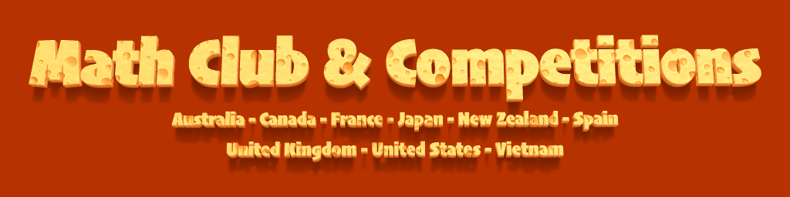

# MCC – A Global Math Club

Follow this shortcut to [The School Year 2025-2026](./25-26.md)

## 1. 🏆 Who are we?

Founded in Canada, MCC has grown into a vibrant international community where students from around the world come together to train, compete, and explore mathematics. The club offers free coaching, weekly challenges, and team contests, all designed to help develop strong problem-solving skills.

In 2025, MCC made headlines at the Purple Comet Math Meet, one of the world’s largest online math competitions with over 4,600 teams from more than 80 countries: Middle School Team One earned a perfect score and placed 1st in the world, High School Teams One and Two both scored 26/30, earning Honorable Mentions on the global leaderboard! This is the second time our club has our Middle School teams ranked 1st in the world and the fourth times our High School teams achieved Honorable Mentions worldwide!

MCC students have also performed strongly at national math Olympiads in Canada, the USA, the UK, and France, with several qualifying for advanced training programs and team selections.

 

Câu Lộc Bộ Toán Học Toàn Cầu MCC khởi đầu tại Canada và đã phát triển thành một cộng đồng toán học quốc tế sôi động, nơi học sinh từ nhiều quốc gia cùng học, luyện tập và thi đấu. CLB cung cấp các buổi huấn luyện miễn phí, thử thách hàng tuần và các kỳ thi đồng đội, nhằm rèn luyện kỹ năng tư duy và giải quyết vấn đề.

Năm 2025, MCC tiếp tục ghi dấu ấn tại kỳ thi Purple Comet Math Meet — một trong những cuộc thi toán trực tuyến lớn nhất thế giới với hơn 4.600 đội từ hơn 80 quốc gia: Đội THCS số 1 đạt điểm tuyệt đối và xếp Hạng Nhất Thế Giới, Hai đội THPT cùng đạt 26/30 điểm, được Vinh Danh Toàn Cầu (Honorable Mentions) trên bảng xếp hạng quốc tế! Đây là lần thứ 2 câu lộc bộ có đội THCS Hạng Nhất Thế Giới và lần thứ ba có đội THPT được Vinh Danh Toàn Cầu! 

Nhiều học sinh MCC cũng đã đạt thành tích cao tại các kỳ Olympic Toán học Quốc gia ở Canada, Hoa Kỳ, Vương quốc Anh và Pháp, và một số em còn được chọn vào các chương trình huấn luyện và đội tuyển nâng cao.

 

## 2. Advice for parents

How can we make math more enjoyable? Not a set of dry lessons. Not a series of drills. But something that sparks curiosity. Something that feels like solving a mystery, discovering a pattern, unlocking a secret? Over the past 10 years, I’ve taught hundreds of students — from beginners to competition-level learners — and learned one thing: The right problem explained the right way can change everything. That’s why I wrote this book. It’s a collection of knowledge, ideas, and teaching insights gathered over a decade of working with young learners. 
It’s designed to help students fall in love with problem solving — not by making things easier, but by making them more meaningful. I’d love to share it with you. It’s an ebook, you get it in your hand in 5 minutes.

[100 Math Problems for Absolute Beginners](https://www.lulu.com/shop/nghia-doan/100-math-problems-for-absolute-beginners/ebook/product-p69y785.html?page=1&pageSize=4)

Làm thế nào để Toán học trở nên thú vị hơn? Không phải là những bài giảng khô khan. Cũng không phải là một chuỗi các bài luyện tập máy móc. Mà là điều gì đó khơi gợi sự tò mò — như đang giải một bí ẩn, phát hiện một quy luật, mở khóa một điều bí mật? Trong 10 năm qua, tôi đã dạy hàng trăm học sinh — từ những em mới bắt đầu đến các bạn học sinh luyện thi cấp cao — và tôi rút ra một điều: một bài toán phù hợp, được giảng giải đúng cách, có thể thay đổi mọi thứ. Đó là lý do tôi viết cuốn sách này. Nó là tập hợp của kiến thức, ý tưởng, và những trải nghiệm giảng dạy mà tôi tích lũy suốt một thập kỷ làm việc cùng học sinh nhỏ tuổi. Cuốn sách được viết để giúp học sinh yêu thích việc giải toán — không phải bằng cách làm cho mọi thứ dễ hơn, mà là bằng cách khiến chúng có ý nghĩa hơn. Tôi rất muốn chia sẻ nó với bạn. Đây là sách điện tử — bạn có thể nhận được chỉ sau 5 phút.

[100 Bài Toán Dành Cho Người Mới Bắt Đầu](https://www.lulu.com/shop/nghia-doan/100-bài-toán-dành-cho-người-mới-bắt-đầu/ebook/product-rm68v54.html?page=1&pageSize=4)

 

## 3. [Our achievements in the Purple Comet Math Meets](./purple-comet.md)

 

## 4. [Our books and curriculums] 

[Learning Problem Solving Volumes 1-2-3](./lps-volumes.md)

[Annual School Year books (2021-2025)](./annual-books.md)

 

## 5. [From the students](./from-students.md)