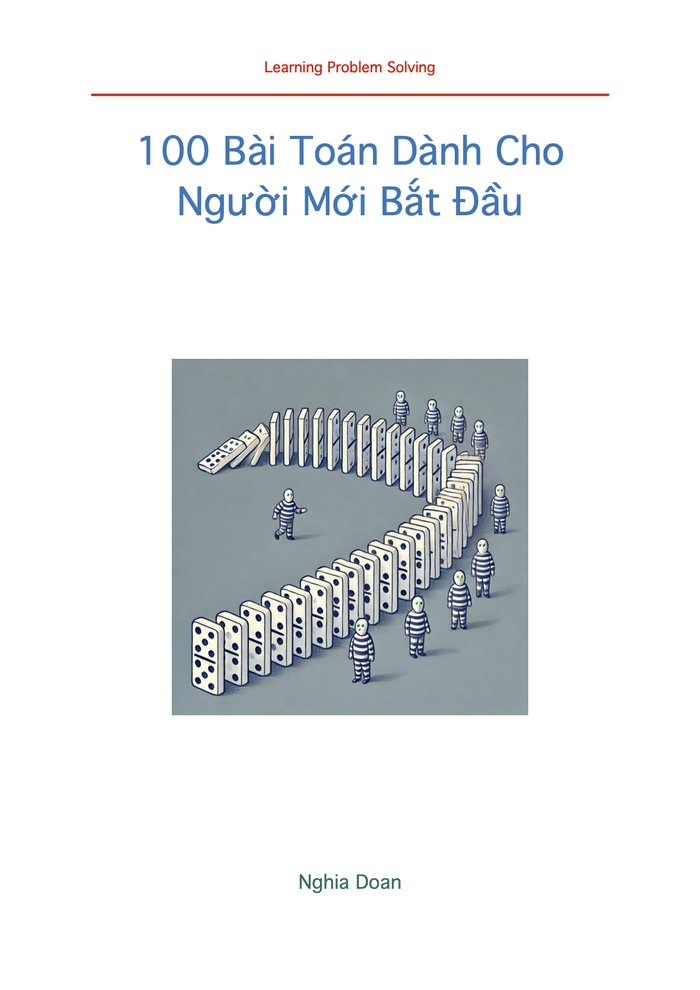

# The MCC Curriculum

Every journey in mathematics begins with a single spark of curiosity. To help students find that spark and then keep going, we have built a clear, progressive pathway — one entry book, two flagship volumes, and the tests and yearbook that go with them.

*Mỗi hành trình toán học đều bắt đầu từ một tia sáng tò mò. Để giúp học sinh khởi đầu đúng hướng, chúng tôi đã thiết kế một lộ trình phát triển rõ ràng.*

## 1. The foundation — *100 Math Problems for Absolute Beginners*

Before diving into complex theory, students need to fall in love with patterns and logic. This book is a collection of teaching insight gathered over a decade, written to make mathematics meaningful. It is the right entry point for young thinkers.

How can we make mathematics more enjoyable? Not with dry lessons. Not with a series of drills. But with something that sparks curiosity — something that feels like solving a mystery, discovering a pattern, unlocking a secret. Over the past ten years I have taught hundreds of students, from beginners to competition-level learners, and I have learned one thing: **the right problem, explained the right way, can change everything.** That is why I wrote this book. It is a collection of knowledge, ideas, and teaching insight gathered over a decade of working with young learners, designed to help students fall in love with problem solving — not by making things easier, but by making them more meaningful.

There are two editions. I would recommend the print one: it is a beautiful, high-quality book. Contact the club for a print copy. If you would rather have the e-book, it is in your hands in five minutes — click the cover.

Trước khi bước vào những lý thuyết phức tạp, học sinh cần yêu thích các quy luật và logic. Cuốn sách này là tập hợp những trải nghiệm giảng dạy suốt một thập kỷ, giúp toán học trở nên có ý nghĩa và gần gũi hơn. Đây là điểm bắt đầu lý tưởng.

Làm thế nào để Toán học trở nên thú vị hơn? Không phải là những bài giảng khô khan, cũng không phải một chuỗi bài luyện tập máy móc, mà là điều gì đó khơi gợi sự tò mò — như đang giải một bí ẩn, phát hiện một quy luật, mở khóa một điều bí mật. Trong 10 năm qua, tôi đã dạy hàng trăm học sinh — từ những em mới bắt đầu đến các bạn luyện thi cấp cao — và tôi rút ra một điều: **một bài toán phù hợp, được giảng giải đúng cách, có thể thay đổi mọi thứ.**

Hiện có hai phiên bản: sách in và sách điện tử. Tôi khuyên bạn nên chọn bản in, vì đây là cuốn sách được thiết kế đẹp mắt với chất lượng cao — liên lạc với Câu Lạc Bộ để có bản in. Nếu muốn bản e-book, bạn nhận được sách chỉ sau 5 phút; nhấp vào ảnh bìa ở trên.

## 2. The flagship series — Learning Problem Solving VI & VII

  

    Middle School · T1–T2
    
    <h3>LPS VI — From Foundations to Insight</h3>
    
<strong>54 chapters</strong>, four themed sections each — <strong>216 sections</strong> in all. 
       About <strong>1,400 problems</strong>. <strong>675 pages.</strong>

    
<a class="btn" href="https://www.lulu.com/shop/nghia-doan/learning-problem-solving-vi/hardcover/product-m2ezqjj.html">Order from Lulu</a>

  

  

    High School · T3–T4
    
    <h3>LPS VII — From Insight to Mastery</h3>
    
<strong>55 chapters.</strong> About <strong>1,340 problems</strong>: <strong>934 fully worked examples</strong> and <strong>406 exercises</strong>, most solutions rewritten from scratch. 
       <strong>850 pages.</strong>

    
<a class="btn" href="https://www.lulu.com/shop/nghia-doan/learning-problem-solving-vii/hardcover/product-2mnpyy4.html">Order from Lulu</a>

  

### How the books are built

* Roughly **30% of each volume is exercise problems**, spread evenly across difficulty and across Algebra, Combinatorics, Geometry, and Number Theory.
* There are **no one-step, plug-in-the-formula problems**. Easy or hard, every problem asks the student to read, analyse, compute, and check. Routine drills belong to other curricula; these books assume you want to think.
* Each section teaches **one idea deeply**. You may notice several problems circling the same piece of theory before the next section opens a different door — that is the design, not a lack of variety. A little material above grade level is deliberately mixed in, so that students meet the next idea before they need it.
* Problems without an attributed source are the author's own.
* **Use the books in a spiral, over two or more years.** The easy problems the first year, the medium ones the next, then the hard ones. This is why T1 and T2 share the same 54 chapters, and T3 and T4 the same 55.

### The four-year path

Together the two volumes are a complete four-year programme: **109 chapters, more than 4,000 problems, 109+ tests, and four Purple Comet campaigns.** A strong student can take a volume in a year; for most, two years per volume is the right pace.

**This set is not for absolute beginners.** It assumes a student has already worked through Beast Academy or the AoPS Introductory series. Starting here without that footing is discouraging rather than useful.

### Ordering

Order directly from Lulu using the links above. **The price is the printing cost, rounded to the nearest unit** — the club takes nothing. Lulu prints in each country and ships domestically, which keeps both cost and delivery time reasonable.

Please tell the club when you order: if a discount code is available, we will pass it on. A **group order** is cheaper still, if a local group is willing to handle delivery — and it usually turns into coffee.

**Đặt sách.** Đặt trực tiếp từ Lulu theo đường dẫn ở trên. Giá đúng bằng giá in, làm tròn đến hàng đơn vị — câu lạc bộ không lấy gì thêm. Lulu in tại từng nước rồi giao hàng trong nước đó nên chi phí và thời gian giao hàng đều hợp lý.

Khi đặt xin nhắn cho câu lạc bộ — nếu có mã giảm giá chúng tôi sẽ chuyển ngay. Đặt theo nhóm còn rẻ hơn nữa, nếu có phụ huynh nhận việc giao sách tại chỗ.

**Bộ sách gồm 54/55 chương mỗi quyển, mỗi chương 4 chuyên mục, khoảng 30% là bài tập.** Sách không có bài áp dụng công thức một bước ăn ngay; dù dễ hay khó, mỗi bài đều đòi hỏi đọc hiểu, phân tích, tính toán rồi kiểm tra. Sách được thiết kế để dùng theo kiểu **xoáy trôn ốc** trong hai năm trở lên: lần đầu học các bài dễ, năm sau chuyển sang bài trung bình, rồi bài khó. Bộ hai quyển là một chương trình bốn năm: **109 chương, hơn 4.000 bài toán, 109+ kỳ kiểm tra và 4 mùa Purple Comet.**

## 3. The tests and the yearbook

Every chapter closes with its own test, and those tests are collected into the third book of the set — **56 papers and over 1,200 problems**, across all four levels. At the end of the year comes the yearbook, written together with the students.

[How testing works, and what goes in the yearbook →](./tests.md)

## 4. Free online: The Online Mathematics Laboratory

**[TOML](./toml.html)** teaches mathematics investigated with a programming tool: explore a problem computationally, explain what you see, then establish it with a proof. Bilingual, with runnable Python on every page — copy it to your machine or run it in the browser. Free, with no book to buy.

## 5. Earlier volumes

The Learning Problem Solving series began well before Volume VI. Volumes 1–3 and the Toolbox remain available, along with the annual school-year books.

* [**Learning Problem Solving, Volumes 1–3 and the Toolbox**](./lps-volumes.md)
* [**Annual school-year books, 2021–2025**](./annual-books.md)
