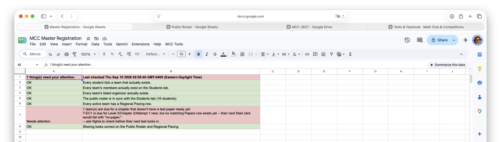

# Current Standings

This page is the club's live index: where the roster and every team's exam status can be seen by anyone, where the coordinator and organizer spreadsheets live for the people who run the club, and — while the new testing pipeline is being verified — a coordinator's-eye-view testing guide Mr. Nghia uses to exercise the whole system himself before real teams rely on it.

## Where the club's data lives

The club runs on three Google Sheets, kept deliberately separate so that what's safe for everyone to see, what's editable by the people who run pacing, and what's family-private never share a file:

| Spreadsheet | What it holds | Who can open it |
|---|---|---|
| **MCC Public Roster** | Every active team — name, team, level, region, status — plus a live row per test: placed, submitted, graded. | Anyone with the link |
| **MCC Master Registration** | Full student and parent details, team assignments, and the club's coordinator and grader lists. | Coordinators only |
| **MCC Regional Pacing** | One tab per region (UK, FR, EC, WC, VN) — each team's next chapter, testing frequency, and next test date — hand-edited by that region's coordinator. | Coordinators (edit) & club organizers (view only) |

**Coordinators** are the volunteers who directly schedule and pace each region's teams — they get edit access to Regional Pacing. **Club organizers** is a separate, broader, read-only role for volunteers who run club activities day to day; they can see rosters and standings (Regional Pacing, view-only) but never edit anything and never touch the Master Registration Spreadsheet at all — that's where family contact details live, and organizers don't need it. See [Organization](./organization.md) for who's who.

## The public roster

The **MCC Public Roster** is the one spreadsheet anyone — student, parent, or visitor — can open directly. The `Roster` tab lists every active team; the `Exams` tab shows, for each test session, whether the paper has been placed, submitted, or graded, updated automatically as the pipeline runs.

**[Open the MCC Public Roster →](https://docs.google.com/spreadsheets/d/1m_CzWRfQxUt7puw1mVBqAZCpm1zvYDrxievSJXKGGFI/edit?usp=sharing)**

<figure class="screenshot">

<figcaption>The <code>Roster</code> tab — every active team, at a glance.</figcaption>
</figure>

<figure class="screenshot">

<figcaption>The <code>Exams</code> tab — one row per test, updated as each one is placed, submitted, and graded. (Cropped to the identifying and status columns; the full row also tracks timestamps and Drive links in between.)</figcaption>
</figure>

## Coordinator & organizer resources

**Restricted access.** The two spreadsheets below hold family contact details and hand-edited pacing data, so they're shared individually, not with the public. The Master Registration Spreadsheet goes to coordinators only (edit access); the Regional Pacing Spreadsheet goes to coordinators (edit) and organizers (view only). Opening a link below without access will prompt Google to request it; if you should have access and don't, get in touch through the [Organization](./organization.md) page.

**MCC Master Registration** — `Students`, `Teams`, `Coordinators`, `Graders`, and `Organizers` tabs, plus a `Data Check` tab that flags anything inconsistent before it causes a problem downstream. (The `Organizers` tab is just the contact list for that role — it's Nghia's record of who's an organizer, not something organizers themselves ever open; their own access is view-only on Regional Pacing, below, never on this spreadsheet.)

**[Open the Master Registration Spreadsheet →](https://docs.google.com/spreadsheets/d/13byGPiBQW00egpC2GIZenAsKhMCS7qbCykZSUtbE7jk/edit?usp=sharing)**

<figure class="screenshot">

<figcaption>The <code>Students</code> tab on the Master Registration Spreadsheet.</figcaption>
</figure>

**MCC Regional Pacing** — one tab per region, plus a `Standings` tab recomputed automatically from graded results.

**[Open the Regional Pacing Spreadsheet →](https://docs.google.com/spreadsheets/d/1BsRd05S7tK1lnr83vxidwDA87qAd1NWEMTFKvDfRkDg/edit?usp=sharing)**

<figure class="screenshot">

<figcaption>One region's tab on the Regional Pacing Spreadsheet — the <code>Standings</code> tab sits alongside it, recomputed from graded results.</figcaption>
</figure>

## Testing the pipeline — a coordinator's-eye-view test-case guide

**This section is a personal working guide, not general reading.** Mr. Nghia uses this to exercise the automated testing pipeline — paper release, submission, and grading — end to end, playing every role himself, before any real team relies on it. Written from the coordinator's actual vantage point: coordinator steps use only the **MCC Tools** menu, never raw Apps Script, because that's genuinely all the access a real coordinator has. Each step names who's acting, so a role change is never buried mid-sentence.

The guide uses the club's standing fixture teams — `T-EC1` and `T-WC1`, both covered by coordinator `O02` (`nghia71@gmail.com`) — and the two dedicated test accounts already set up for the student role. No real student data is touched.

### Resetting between cases

**As coordinator:** click **MCC Tools → Reset my test team(s)**. One click resets `T-EC1`/`T-WC1` to chapter 1 with a fresh test date today, clears their test history, and locks a new session in immediately — no Apps Script needed.

**As admin, only if that button itself seems broken:** the old manual sequence still works — from the Master Registration Spreadsheet's Apps Script editor, run in order: `resetRegionalPacing()`, `seedRegionalPacing()`, `seedTestPapers()`, `resetExamsForTest_()` (via the temporary `zClaudeResetExams()` wrapper, since Apps Script hides functions ending in `_` from the run menu), then `nightlyLockIn()`.

### TC-1 — Positive: full lifecycle, Pass

**What this proves:** the ordinary case everything else is a variation on.

1. **[Coordinator]** `Teams` tab, confirm `T-EC1` is `Active = TRUE`, `CoordinatorID = O02`.
2. **[Coordinator]** Click **MCC Tools → Check my data**. *Expect:* `Data Check` tab, all green.
3. **[Coordinator]** `Exams` tab, find the new `T-EC1` row from the reset. *Expect:* `SessionID` set, today's date, "Not started..."
4. **[Student 1]** Signed into the first test account, open the Test Paper Open/Submit Form, choose **"I'm ready to open my test paper."** *Expect:* the form's own confirmation.
5. **[Student 1]** Check the `Exams` row. *Expect:* `StartedUTC`/`Deadline` filled in — the confirmation screen itself doesn't actually tell you whether this worked (see TC-7 below), the sheet is the real source of truth.
6. **[Student 1]** Check that account's Drive. *Expect:* viewer access to the test paper PDF.
7. **[Student 2]** Switch to the second test account, same form, choose **"Submit my solution,"** upload any small PDF. *Expect:* the form's confirmation.
8. **[Student 2]** Check the `Exams` row. *Expect:* `SubmissionFileLink`/`SubmittedUTC` filled in, `Status` reads submitted on time.
9. **[Grader]** Run `setupWeeklyGrading_()` (the one grader step that still needs Apps Script — there's no self-service grader UI yet). *Expect:* this week's grading sheet created/found, shared with the `Graders` list.
10. **[Grader]** Click the `SubmissionFileLink` on the `Exams` row. *Expect:* the submitted PDF opens.
11. **[Grader]** On the grading sheet's `Grading` tab, add a row by hand: `SessionID`, `TeamID T-EC1`, `Score` ≥ 51 (a pass), `Comments`, your name as `GradedBy`, check `Done`.
12. **[Grader]** Run `pullWeeklyGrading()`. *Expect:* logs the row pulled.
13. **[Grader]** Check the `Exams` row. *Expect:* `Score`/`Result`(Pass)/`GradedUTC`/`GradedBy`/`GradingStatus` filled in, `Status` reads "Graded."
14. **[Coordinator]** Hover the `Score` cell. *Expect:* the grader's comment shows as a note, not a new shared file.
15. **[Coordinator]** Check the Regional Pacing row and `Standings` tab. *Expect:* `NextChapter` advanced, `Standings` reflects the result.

<figure class="screenshot">

<figcaption>Step 2 — the confirmation dialog after <strong>MCC Tools → Check my data</strong>.</figcaption>
</figure>

<figure class="screenshot">

<figcaption>Step 4 — the form's landing choice.</figcaption>
</figure>

<figure class="screenshot">

<figcaption>Step 7 — submitting the solution PDF.</figcaption>
</figure>

<figure class="screenshot">

<figcaption>Step 11 — a completed row on the weekly grading spreadsheet.</figcaption>
</figure>

### TC-2 — Edge: Fail with retakes remaining

**What this proves:** a Fail doesn't just stop — it automatically schedules a retake at the same chapter.

1. Repeat TC-1 with `Score` under 51 at step 11.
2. **[Coordinator]** Check `T-EC1`'s `Exams` history. *Expect:* the original row reads `Result: Fail`; a second row is created automatically, `Attempt 2`, same chapter.
3. **[Coordinator]** Check the Regional Pacing row. *Expect:* `NextChapter` unchanged — only a Pass advances it.

### TC-3 — Edge: retakes exhausted (Fail at Attempt 3)

**What this proves:** the system stops retrying at a defined limit and hands the decision to a person, rather than looping forever.

1. Reach `Attempt 3` (repeat TC-2's Fail twice more, or hand-edit the retake row's `Attempt` to `3`).
2. **[Grader]** Grade `Attempt 3` as a Fail.
3. **[Coordinator]** Check the `Exams` history. *Expect:* **no** `Attempt 4` row created.
4. **[Coordinator]** This team now needs your own decision — a makeup, a conversation with the family, or moving on — not anything the system will do automatically.

### TC-4 — Edge: submission arrives late, inside the grace period

**What this proves:** a slightly-late submission (slow internet, a scramble) is accepted and flagged, not thrown out.

1. **[Student 2]** Submit after `Deadline` but within 30 minutes of it. *Expect:* the form's ordinary confirmation — same as on time, no visible difference.
2. **[Coordinator]** Check the `Exams` row. *Expect:* **accepted**, `Status` reads "Submitted — N min late."

### TC-5 — Exception: submission arrives past the grace period

**What this proves:** there's a real cutoff, and a genuinely-too-late submission is rejected outright.

1. **[Student 2]** Submit more than 30 minutes past `Deadline`. *Expect:* the form's ordinary confirmation — **it will not tell the student it was rejected.**
2. **[Coordinator]** Check the `Exams` row. *Expect:* nothing recorded — no `SubmissionFileLink`. A family in this situation needs to be told directly; the system won't tell them.

### TC-6 — Positive: resubmission

**What this proves:** correcting a mistake doesn't lose the first attempt.

1. **[Student 2]** Submit a second, different file.
2. **[Coordinator]** Check `SubmissionFileLink`. *Expect:* points at the new file.
3. **[Coordinator]** Check Drive directly. *Expect:* both files still exist — nothing deleted.

### TC-7 — Exception: no test paper ready yet (a real gap, found for real)

**What this proves:** this genuinely happened once — worth keeping as a permanent case so it's never a surprise again.

1. **[Student 1]** With a team whose `NextChapter` is ahead of what's been seeded on `Papers`, open the form and choose "I'm ready..." *Expect:* the ordinary confirmation — **indistinguishable from a real success.**
2. **[Coordinator]** Check the `Exams` row. *Expect:* `StartedUTC`/`Deadline` **still blank**, no error anywhere visible.
3. **[Coordinator]** The fix is prevention, not detection: run **Check my data** *before* a test window opens, every time — it's specifically built to catch a missing paper ahead of time.

<figure class="screenshot">

<figcaption>Step 3, expected result — the <code>Data Check</code> tab. This is a real example: a team due for a chapter with no test paper banked yet, the exact case TC-7 documents.</figcaption>
</figure>

### TC-8 — Exception: a team never submits (no-show)

**What this proves:** access to the test paper doesn't stay open forever.

1. **[Admin]** After `Deadline` + 30 minutes with no submission, the nightly access sweep runs (or trigger it directly).
2. **[Student 1]** Check Drive access. *Expect:* revoked.
3. **[Coordinator]** Check `Status`. *Expect:* "Overdue — the grace period has ended, contact your coordinator" — this is the cue to actually reach out to the family.

### TC-9 — Edge: clicking "I'm ready" twice

**What this proves:** an accidental double-click doesn't reset the clock.

1. **[Student 1]** Choose "I'm ready..." a second time. *Expect:* the ordinary confirmation.
2. **[Coordinator]** Check the `Exams` row. *Expect:* `StartedUTC`/`Deadline` unchanged from the first click.

### TC-10 — Edge: an inactive team is skipped

**What this proves:** deactivating a team actually stops new tests from scheduling.

1. Set `T-EC1`'s `Active` to `FALSE`, then lock in. *Expect:* skipped, no new session.
2. Set `Active` back to `TRUE`, lock in again. *Expect:* schedules normally.

### TC-11 — Edge: `NextExamDate` is in the past

**What this proves:** a stale date is flagged, not silently ignored or auto-corrected.

1. Hand-set `NextExamDate` to a past date (don't use the reset button, which sets it to today), then lock in. *Expect:* flagged as skipped, not scheduled.
2. Set `NextExamDate` to today, lock in again. *Expect:* schedules normally.

### TC-12 — Coordinator tool: "Check my data" catches a real problem

**What this proves:** it isn't just a formality that always says green.

1. Delete `T-EC1`'s Regional Pacing row entirely, then **Check my data**. *Expect:* a red row naming `T-EC1` and exactly why it matters — not a generic warning.
2. Click **Reset my test team(s)**. *Expect:* recovers cleanly, or that failure is itself a real finding worth flagging.

### TC-13 — Coordinator tool: "Reset my test team(s)" as the everyday reset

**What this proves:** this really is the everyday way to retest now.

1. After a completed TC-1, click **MCC Tools → Reset my test team(s)**. *Expect:* the confirmation names `T-EC1, T-WC1` and explains what it's about to do.
2. Check the result dialog. *Expect:* a fresh `SessionID` for each.
3. Check `T-EC1`'s pacing row and `Exams` history. *Expect:* `NextChapter` back to 1, one fresh row today.
4. Check a team in a region `O02` doesn't cover (e.g. `T-UK1`). *Expect:* completely untouched — the whole point of the feature.

### TC-14 — Exception: signed in as the wrong account

**What this proves:** the form doesn't misattribute a submission — it just doesn't recognize the person, and tells them nothing either way.

1. Signed in as an account not on the team, choose "I'm ready..." *Expect:* the ordinary confirmation.
2. **[Coordinator]** Check the `Exams` sheet. *Expect:* nothing changed anywhere. If a family ever reports "nothing happened when I clicked start," check this first — most often it's the wrong email signed in, not a real bug.

### Cleanup afterward

**[Coordinator]** Click **MCC Tools → Reset my test team(s)** again to leave a clean baseline for next time.
