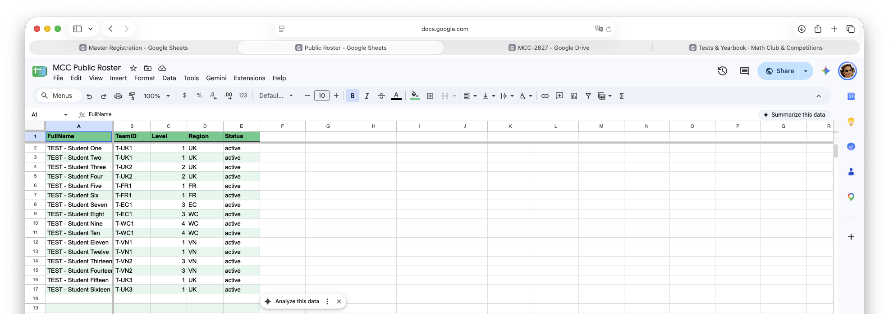
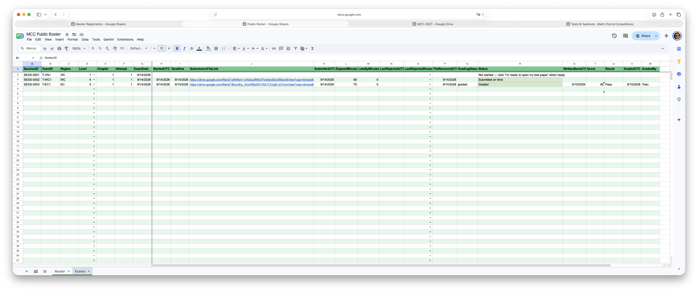
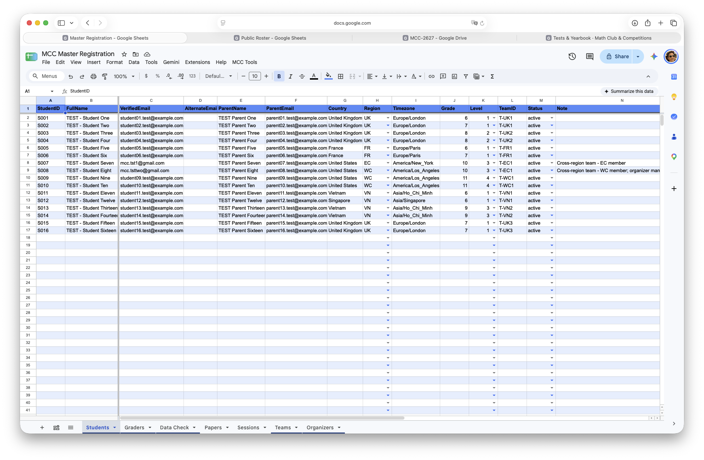
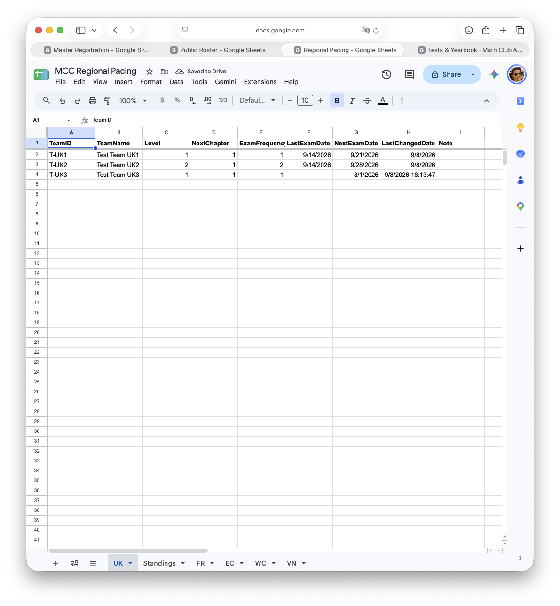

# Current Standings

This page is the club's live index, for every role: where the roster and every team's exam status can be seen by anyone, exactly what happens on an actual test day and what each column and status message means, and where the coordinator and organizer spreadsheets live for the people who run the club.

**Jump to:** [Start here](#start-here) · [Where the data lives](#where-the-clubs-data-lives) · [Glossary](#glossary) · [The public roster](#the-public-roster) · [For Parents & Students](#for-parents--students) · [Coordinator & organizer resources](#coordinator--organizer-resources) · [For Graders](#for-graders) · [Test suites](#test-suites)

## Start here

A first-time checklist, in order, for whichever role brings you here. Everything below is explained in full further down this page.

<strong>1.</strong> Bookmark your one link: the <strong>Test Paper Open/Submit Form</strong> (see the <a href="#for-parents--students">For Parents &amp; Students</a> section for it). It never changes — the same link, all year, for every test your team takes.

<strong>2.</strong> Find your team on the public <strong>MCC Roster</strong> (see the <a href="#the-public-roster">public roster</a> section) and check your name, team, level, and region are right. If anything's wrong, tell your regional coordinator — it isn't something you can fix yourself.

<strong>3.</strong> When a test is coming up, your team's row on the public <strong>Exams & Standing</strong> sheet will read <em>"Scheduled for &lt;date&gt;."</em> You don't need to do anything until then — no action is needed to "accept" a scheduled test.

<strong>4.</strong> On test day, once you're actually ready to sit down and start: sign in with <strong>your team's registered email</strong> (not a parent's personal one) and choose <strong>"I'm ready to open my test paper."</strong> That's what starts your clock and grants access to the paper — a minute or two later, check your Google Drive for it.

<strong>5.</strong> Work the paper together at home, then come back to the same Form and choose <strong>"Submit my solution"</strong> — one PDF, nothing else. You can resubmit if you catch a mistake and you're still within time; the newer file simply replaces the older one as your official submission.

<strong>6.</strong> The Form's confirmation message never tells you whether your click actually worked — that's deliberate, not a bug. To actually check, look at your row on the <strong>Exams & Standing</strong> sheet: <em>"In progress,"</em> <em>"Submitted on time,"</em> or one of the other plain-language statuses the <a href="#for-parents--students">For Parents &amp; Students</a> section lists in full.

<strong>7.</strong> Once graded, that same row fills in <code>Score</code>, <code>Result</code>, and a <code>Comment</code> from your grader — text, or a clickable link if they attached a PDF. A Fail isn't the end of it: your team gets up to three attempts (two retakes) per chapter, and a new session for a retake is created automatically — your coordinator will reach out to arrange it.

🇻🇳 Tiếng Việt — Bắt đầu từ đây (click to expand)

Danh sách các bước đầu tiên, theo thứ tự, cho bất kỳ vai trò nào đưa bạn đến trang này. Mọi thứ bên dưới đã được giải thích đầy đủ ở các phần sau của trang.

1. Lưu lại một đường link duy nhất: **Test Paper Open/Submit Form** (xem mục [dành cho Phụ huynh & Học sinh](#for-parents--students)). Link này không đổi — dùng suốt năm, cho mọi bài thi của đội.
2. Tìm đội của mình trên **MCC Roster** công khai (xem mục [The public roster](#the-public-roster)) và kiểm tra tên, đội, level, khu vực có đúng không. Nếu có gì sai, báo quản lý vùng — đây không phải điều tự sửa được.
3. Khi sắp đến ngày thi, dòng của đội trên bảng **Exams & Standing** công khai sẽ hiện *"Scheduled for &lt;ngày&gt;."* Không cần làm gì cho đến lúc đó — không có bước nào để "xác nhận" một bài thi đã lên lịch.
4. Đến ngày thi, khi thực sự sẵn sàng bắt đầu: đăng nhập bằng **email đã đăng ký của đội** (không phải email cá nhân của phụ huynh) và chọn **"I'm ready to open my test paper."** Đây là thao tác bắt đầu tính giờ và cấp quyền mở đề thi — một, hai phút sau, kiểm tra Google Drive để thấy file đề.
5. Cùng làm bài ở nhà, rồi quay lại đúng Form đó và chọn **"Submit my solution"** — một file PDF, không gì khác. Có thể nộp lại nếu phát hiện sai sót và vẫn còn thời gian; file mới sẽ thay cho file cũ làm bài nộp chính thức.
6. Thông báo xác nhận của Form không bao giờ cho biết thao tác vừa bấm có thành công hay không — đây là chủ ý, không phải lỗi. Muốn biết chắc, xem dòng của đội trên bảng **Exams & Standing**: *"In progress,"* *"Submitted on time,"* hoặc một trong các thông báo khác mà mục [dành cho Phụ huynh & Học sinh](#for-parents--students) liệt kê đầy đủ.
7. Sau khi được chấm, cùng dòng đó sẽ điền `Score`, `Result`, và `Comment` từ người chấm — chữ thường, hoặc một đường link có thể bấm nếu người chấm gắn file PDF. Một lần Fail không phải là hết: đội được tối đa ba lần thi (hai lần thi lại) cho mỗi chương, và một buổi thi lại mới sẽ được tạo tự động — quản lý vùng sẽ liên hệ để sắp xếp.

---

## For a new coordinator

This assumes you're already familiar with [Organization](./organization.md)'s regional-coordinator role.

<strong>1.</strong> Get access to the two spreadsheets you'll use all year: <strong>Master Registration</strong> and <strong>Regional Pacing</strong> (links and full schema under <a href="#coordinator--organizer-resources">Coordinator &amp; organizer resources</a> below). If a link prompts Google to request access, that's normal the first time.

<strong>2.</strong> On Master Registration's <code>Teams</code> tab, find the teams assigned to you (your <code>CoordinatorID</code> matches their <code>Region</code>, or they're assigned to you directly). On Regional Pacing, find those same teams' rows — that's where you'll watch and edit <code>NextExamDate</code> and <code>ExamFrequencyWeeks</code> going forward.

<strong>3.</strong> Click <strong>MCC Tools → Check my data</strong> (top of Master Registration, next to File/Edit/View). The first time, Google may show a permission screen — click <strong>Allow</strong>. A <strong>Data Check</strong> tab appears; green rows are fine, red rows tell you exactly what to fix. Safe to run any time — it only reports, never changes anything.

<strong>4.</strong> You don't need to do anything to actually schedule a test: once a team's <code>NextExamDate</code> enters the next 7 days, the system locks a session in automatically, overnight. If you've just changed a date and don't want to wait, <strong>MCC Tools → Lock in changed exam dates</strong> runs that same check immediately.

<strong>5.</strong> Once a result comes in, <code>NextExamDate</code>, <code>LastExamDate</code>, and (on a Pass) <code>NextChapter</code> all update themselves. On a Fail with attempts left, a retake is created automatically and the family's row tells them to expect you to reach out. On a third failed attempt, the system stops and waits for your decision — repeat the chapter, move the team on, or whatever fits.

<strong>6.</strong> If a family ever genuinely needs their current test reset, <strong>MCC Tools → Reset my test suite</strong> can do it yourself (when Nghia has this turned on) — see <a href="#coordinator--organizer-resources">Coordinator &amp; organizer resources</a> below for exactly what it does and doesn't cover.

<strong>7.</strong> Day to day: a family that says the Form "isn't working" almost always signed in with the wrong Google account. A late submission (within 30 minutes) is accepted automatically; past that, it's rejected and the family is told on the sheet itself. Both are covered in full under <a href="#coordinator--organizer-resources">Coordinator &amp; organizer resources</a> below.

🇻🇳 Tiếng Việt — Dành cho quản lý vùng mới (click to expand)

Phần này giả định đã quen với vai trò quản lý vùng ở trang [Organization](./organization.md).

1. Xin quyền truy cập hai bảng tính sẽ dùng suốt năm: **Master Registration** và **Regional Pacing** (đường link và toàn bộ cấu trúc cột ở mục [Tài nguyên cho quản lý vùng & ban tổ chức](#coordinator--organizer-resources)). Nếu link yêu cầu xin quyền, đó là điều bình thường ở lần đầu.
2. Trên tab `Teams` của Master Registration, tìm các đội được giao cho mình (`CoordinatorID` trùng với `Region` của đội, hoặc đội được giao trực tiếp). Trên Regional Pacing, tìm đúng các dòng của những đội đó — đây là nơi theo dõi và sửa `NextExamDate` và `ExamFrequencyWeeks` về sau.
3. Bấm **MCC Tools → Check my data** (trên cùng Master Registration, cạnh File/Edit/View). Lần đầu, Google có thể hiện màn hình xin quyền — bấm **Allow**. Một tab **Data Check** sẽ xuất hiện; dòng xanh là ổn, dòng đỏ cho biết chính xác cần sửa gì. An toàn để chạy bất cứ lúc nào — chỉ báo cáo, không bao giờ thay đổi gì.
4. Không cần làm gì để thực sự lên lịch một bài thi: khi `NextExamDate` của một đội rơi vào trong 7 ngày tới, hệ thống sẽ tự khóa lịch một buổi thi qua đêm. Nếu vừa đổi ngày và không muốn chờ, **MCC Tools → Lock in changed exam dates** sẽ chạy đúng việc kiểm tra đó ngay lập tức.
5. Khi có kết quả, `NextExamDate`, `LastExamDate`, và (nếu Pass) `NextChapter` sẽ tự cập nhật. Nếu Fail mà vẫn còn lượt, một buổi thi lại được tạo tự động và dòng của gia đình sẽ báo là quản lý vùng sẽ liên hệ. Đến lần thi thứ ba không đạt, hệ thống dừng lại và chờ quyết định của quản lý vùng — thi lại chương đó, chuyển sang chương khác, hay bất cứ cách nào phù hợp.
6. Nếu một gia đình thực sự cần reset lại bài thi hiện tại, **MCC Tools → Reset my test suite** có thể tự làm được (khi thầy Nghĩa đã bật tính năng này) — xem mục [Tài nguyên cho quản lý vùng & ban tổ chức](#coordinator--organizer-resources) để biết chính xác chức năng này làm được gì và không làm được gì.
7. Ngày qua ngày: một gia đình báo Form "không hoạt động" hầu như luôn là do đăng nhập sai tài khoản Google. Một bài nộp trễ (trong vòng 30 phút) được tự động chấp nhận; quá thời gian đó sẽ bị từ chối và gia đình được thông báo ngay trên bảng. Cả hai điều này được giải thích đầy đủ ở mục [Tài nguyên cho quản lý vùng & ban tổ chức](#coordinator--organizer-resources).

---

## For a new grader

This is for Toan and Nghia, the two people who actually grade submissions each week.

<strong>1.</strong> Each week has its own shared spreadsheet, <code>MCC Grading — &lt;ISO week&gt;</code>, created automatically the first time it's needed — check "Shared with me" in Drive, or search for "MCC Grading."

<strong>2.</strong> For each submission: fill in <code>Score</code> (0–100), <code>Comments</code> (whatever you want the family to see), and <code>GradedBy</code>. Check <code>Done</code> only once a row is genuinely finished — a half-graded row should stay unchecked, since only <code>Done</code> rows ever get pulled in.

<strong>3.</strong> Once your rows are marked <code>Done</code>, pull them in yourself — <strong>MCC Tools → Grader tools → Pull weekly grading</strong> now works for any real grader, not just Nghia. Click it any time after marking a batch <code>Done</code>; they'll then flow onto the public sheet automatically, with your comment landing in that row's <code>Comment</code> column — plain text, or a clickable link if you pasted one.

🇻🇳 Tiếng Việt — Dành cho người chấm bài mới (click to expand)

Phần này dành cho thầy Toàn và thầy Nghĩa, hai người trực tiếp chấm bài mỗi tuần.

1. Mỗi tuần có một bảng tính chia sẻ riêng, `MCC Grading — <số tuần ISO>`, được tạo tự động khi cần lần đầu — kiểm tra mục "Shared with me" trên Drive, hoặc tìm "MCC Grading".
2. Với mỗi bài nộp: điền `Score` (0–100), `Comments` (bất cứ nhận xét nào muốn gia đình thấy), và `GradedBy`. Chỉ đánh dấu `Done` khi dòng đó thực sự đã chấm xong — một dòng chấm dở nên để trống, vì chỉ những dòng `Done` mới được đưa vào hệ thống.
3. Sau khi đã đánh dấu `Done` các dòng của mình, tự đưa kết quả vào hệ thống được rồi — mục **MCC Tools → Grader tools → Pull weekly grading** giờ dùng được cho bất kỳ người chấm bài thật nào, không chỉ riêng thầy Nghĩa. Bấm vào đó bất cứ lúc nào sau khi đánh dấu `Done` một loạt bài; kết quả sẽ tự động chuyển vào bảng công khai, với nhận xét vào đúng cột `Comment` của dòng đó — chữ thường, hoặc một đường link có thể bấm nếu đã dán link.

---

## Where the club's data lives

The club runs on three Google Sheets and one Form, kept deliberately separate so that what's safe for everyone to see, what's editable by the people who run pacing, what's family-private, and what a student uses to actually take a test never share a file:

| Spreadsheet / Form | What it holds | Who can open it |
|---|---|---|
| **MCC Public Roster** | Every active team — name, team, level, region, status — plus a live row per test: placed, submitted, graded. | Anyone with the link |
| **MCC Master Registration** | Full student and parent details, team assignments, and the club's coordinator and grader lists. | Coordinators (edit) & club organizers (view only) |
| **MCC Regional Pacing** | One tab per region (UK, FR, EC, WC, VN) — each team's next chapter, testing frequency, and next test date — hand-edited by that region's coordinator. | Coordinators (edit) & club organizers (view only) |
| **Test Paper Open/Submit Form** | Where a student opens their test paper and, later, submits their solution — one permanent link, used all year for every team and every test. | Students only, identified by their own verified Google account |

**Coordinators** are the volunteers who directly schedule and pace each region's teams — they get edit access to both Master Registration and Regional Pacing. **Club organizers** is a separate, broader, read-only role for volunteers who run club activities day to day; they can see rosters, standings, and family/team data (Master Registration and Regional Pacing, both view-only) but never edit anything. **Students** never open either spreadsheet at all — the Test Paper Form is the only thing they (or their parents) ever touch. See [Organization](./organization.md) for who's who.

(There's a separate registration Form — the one families use to register for a team in the first place — that isn't part of this page; a coordinator is the one who takes what it collects and enters it into Master Registration.)

🇻🇳 Tiếng Việt — Dữ liệu của câu lạc bộ nằm ở đâu (click to expand)

Câu lạc bộ vận hành trên ba bảng tính Google Sheets và một Form, được tách riêng có chủ đích để những gì công khai an toàn cho mọi người xem, những gì chỉnh sửa được bởi người phụ trách nhịp độ, những gì riêng tư cho từng gia đình, và những gì học sinh dùng để thực sự làm bài thi không bao giờ nằm chung một file:

| Bảng tính / Form | Chứa gì | Ai được mở |
|---|---|---|
| **MCC Public Roster** | Mọi đội đang hoạt động — tên, đội, level, khu vực, trạng thái — cùng một dòng theo dõi mỗi bài thi: đã mở đề, đã nộp, đã chấm. | Bất kỳ ai có link |
| **MCC Master Registration** | Đầy đủ thông tin học sinh và phụ huynh, phân đội, và danh sách quản lý vùng, người chấm bài của câu lạc bộ. | Quản lý vùng (chỉnh sửa) & ban tổ chức (chỉ xem) |
| **MCC Regional Pacing** | Mỗi khu vực một tab (UK, FR, EC, WC, VN) — chương kế tiếp, tần suất thi, và ngày thi kế tiếp của từng đội — do quản lý vùng đó tự tay chỉnh sửa. | Quản lý vùng (chỉnh sửa) & ban tổ chức (chỉ xem) |
| **Test Paper Open/Submit Form** | Nơi học sinh mở đề thi và, sau đó, nộp bài giải — một link cố định, dùng suốt năm cho mọi đội và mọi bài thi. | Chỉ học sinh, xác định qua tài khoản Google đã xác thực của chính mình |

**Quản lý vùng** là các tình nguyện viên trực tiếp lên lịch và điều chỉnh nhịp độ cho từng đội trong khu vực của mình — họ có quyền chỉnh sửa cả Master Registration lẫn Regional Pacing. **Ban tổ chức** là một vai trò riêng, rộng hơn, chỉ xem, dành cho tình nguyện viên vận hành hoạt động hàng ngày của câu lạc bộ; họ xem được danh sách, bảng xếp hạng, và dữ liệu gia đình/đội (cả Master Registration và Regional Pacing, đều chỉ xem) nhưng không bao giờ chỉnh sửa được gì. **Học sinh** không bao giờ mở bất kỳ bảng tính nào cả — Test Paper Form là thứ duy nhất các em (hoặc phụ huynh) từng chạm tới. Xem [Organization](./organization.md) để biết ai là ai.

(Có một Form đăng ký riêng — Form mà các gia đình dùng để đăng ký một đội lần đầu — không thuộc phạm vi trang này; quản lý vùng là người lấy thông tin từ đó và nhập vào Master Registration.)

## Glossary

Quick reference for terms and column names used throughout this page and the sheets it links to. Most readers won't need this — the sections below already explain things in plain language as they come up — but it's here if you ever see one of these words on a sheet, in a URL, or in a message from your coordinator and want to know exactly what it means.

**Where things live**

| Term | Meaning |
|---|---|
| **MCC Roster** (Public Roster) | The public spreadsheet listing every registered student and team — name, team, level, region, status. See [The public roster](#the-public-roster) below for the link. |
| **Exams & Standing** | A tab on that same spreadsheet (internally called `Exams`) — one row per test occurrence; this is where `Status` and everything else below lives. The **Standings** tab next to it is a separate, coordinator-only summary (one row per *team*, not per test) — see "A new Standings tab" below. |
| **Session** | One row on the Exams & Standing sheet — one team's one test occurrence, for one chapter and attempt. Internally each has its own ID (`SessionID`, e.g. `SESS-0001`), created automatically the week of the test; you'll never need to type one yourself. |

**Columns on the Exams & Standing sheet, per test**

| Column | Meaning |
|---|---|
| `Status` | The plain-language summary everyone actually reads — see the table under "Checking your status" below for every message it can show. Computed automatically from all the columns below; you shouldn't need the raw columns to understand your own row. |
| `StartedUTC` | The moment "I'm ready to open my test paper" was clicked. Blank until then. |
| `Deadline` | Computed automatically: start time + that level's time limit + a 10-minute buffer. Never a fixed clock time set in advance. |
| `SubmissionFileLink` | A link to the latest accepted submission PDF. Visible to anyone who can see the row, but the file itself is only actually open-able by a grader — see "Submitting your solution" below. |
| `SubmittedUTC` | When the latest *accepted* submission arrived. A rejected attempt (see below) never changes this. |
| `ElapsedMinutes` | How long the team actually took: `SubmittedUTC` − `StartedUTC`. |
| `LateByMinutes` | Minutes past `Deadline` the accepted submission arrived — `0` if on time. |
| `LastRejectedUTC` / `LastRejectedReason` | The most recent Submit attempt that was refused (no Start recorded, or too late), and why. Never overwrites a valid, already-accepted submission. |
| `FileRemovedUTC` | When the team's own access to the exam paper file was switched off — right after a successful submit, or automatically if 30 minutes pass with nothing submitted. |

**Once a test is graded**

| Column | Meaning |
|---|---|
| `GradingStatus` | Set only by a grader. Once set, that session is closed — no further Start or Submit changes anything about it. |
| `Score` | 0–100, filled in once a grader's weekly batch is pulled in. |
| `Result` | `Pass` (51 or above) or `Fail`, computed from `Score`. |
| `GradedBy` / `GradedUTC` | Who graded it, and when. |
| `Comment` | A grader's note, in its own column — plain text, or a clickable link when the grader attached a PDF. |

*(Coordinators: `NextExamDate`, `ExamFrequencyWeeks`, `NextChapter`, `LastExamDate`, and `Active` are covered where they're used, under "Changing a team's pace or date" and "Pausing vs. skipping" below — they live on the separate Regional Pacing sheet, not Exams & Standing.)*

🇻🇳 Tiếng Việt — Bảng thuật ngữ (click to expand)

Tài liệu tham khảo nhanh cho các thuật ngữ và tên cột dùng trong trang này và các bảng tính liên quan. Phần lớn người đọc sẽ không cần đến phần này — các mục bên dưới đã giải thích bằng ngôn ngữ đơn giản ngay khi thuật ngữ xuất hiện — nhưng nếu có lúc bạn thấy một trong các từ này trên bảng tính, trong đường link, hay trong tin nhắn từ quản lý vùng và muốn biết chính xác nghĩa là gì, đây là nơi tra cứu.

**Mọi thứ nằm ở đâu**

| Thuật ngữ | Ý nghĩa |
|---|---|
| **MCC Roster** (Public Roster) | Bảng tính công khai liệt kê mọi học sinh và đội đã đăng ký — tên, đội, level, khu vực, trạng thái. Xem mục [The public roster](#the-public-roster) ở dưới để lấy link. |
| **Exams & Standing** | Một tab trên cùng bảng tính đó (tên nội bộ là `Exams`) — mỗi dòng là một bài thi, đây là nơi chứa cột `Status` và mọi thuật ngữ khác bên dưới. Tab **Standings** bên cạnh là một bảng tổng hợp riêng, chỉ dành cho quản lý vùng (mỗi dòng một đội, không phải mỗi bài thi) — xem "Tab Standings mới" bên dưới. |
| **Session** (bài thi/phiên thi) | Một dòng trên bảng Exams & Standing — một bài thi cụ thể của một đội, cho một chương và một lần thi. Nội bộ mỗi dòng có mã riêng (`SessionID`, ví dụ `SESS-0001`), được tạo tự động vào tuần có bài thi; không bao giờ cần tự gõ mã này. |

**Các cột trên bảng Exams & Standing, theo từng bài thi**

| Cột | Ý nghĩa |
|---|---|
| `Status` | Dòng tóm tắt bằng câu chữ rõ nghĩa mà mọi người thực sự đọc — xem bảng ở mục "Theo dõi tình trạng bài thi" bên dưới để biết từng thông báo có thể hiện ra. Được tính tự động từ tất cả các cột bên dưới; không cần hiểu các cột thô để biết tình trạng dòng của mình. |
| `StartedUTC` | Thời điểm bấm "I'm ready to open my test paper" (mở đề thi). Để trống cho đến lúc đó. |
| `Deadline` (hạn nộp) | Tính tự động: thời điểm bắt đầu + thời lượng bài thi của level đó + 10 phút bù. Không bao giờ là một mốc giờ cố định định sẵn. |
| `SubmissionFileLink` | Đường link tới file PDF bài nộp được chấp nhận gần nhất. Ai xem được dòng đó cũng thấy link, nhưng chỉ người chấm bài mới thực sự mở được file — xem "Nộp bài giải" bên dưới. |
| `SubmittedUTC` | Thời điểm bài nộp *được chấp nhận* gần nhất đến. Một lần nộp bị từ chối (xem bên dưới) không bao giờ làm thay đổi giá trị này. |
| `ElapsedMinutes` | Thời gian đội thực sự đã làm bài: `SubmittedUTC` − `StartedUTC`. |
| `LateByMinutes` | Số phút trễ so với `Deadline` của bài nộp được chấp nhận — `0` nếu đúng giờ. |
| `LastRejectedUTC` / `LastRejectedReason` | Lần nộp bài gần nhất bị từ chối (chưa từng mở đề, hoặc quá trễ), và lý do. Không bao giờ ghi đè lên một bài nộp hợp lệ đã được chấp nhận trước đó. |
| `FileRemovedUTC` | Thời điểm quyền truy cập của đội vào file đề thi bị tắt — ngay sau khi nộp bài thành công, hoặc tự động nếu quá 30 phút mà chưa nộp gì. |

**Sau khi bài thi được chấm**

| Cột | Ý nghĩa |
|---|---|
| `GradingStatus` | Chỉ do người chấm bài thiết lập. Khi đã thiết lập, bài thi đó coi như đóng — không có thao tác Start hay Submit nào làm thay đổi được nữa. |
| `Score` | 0–100, được điền vào khi kết quả chấm bài hàng tuần được đưa vào hệ thống. |
| `Result` | `Pass` (từ 51 điểm trở lên) hoặc `Fail`, tính từ `Score`. |
| `GradedBy` / `GradedUTC` | Ai chấm, và chấm lúc nào. |
| `Comment` (nhận xét) | Ghi chú của người chấm bài, nằm trong cột riêng của chính nó — chữ thường, hoặc một đường link có thể bấm vào nếu người chấm gắn kèm file PDF. |

*(Dành cho quản lý vùng: `NextExamDate`, `ExamFrequencyWeeks`, `NextChapter`, `LastExamDate`, và `Active` đã được giải thích ở phần "Thay đổi nhịp độ hoặc ngày thi của một đội" và "Tạm ngưng so với bỏ qua một lần" bên dưới — các cột này nằm trên bảng Regional Pacing riêng, không phải Exams & Standing.)*

---

## The public roster

The **MCC Public Roster** is the one spreadsheet anyone — student, parent, or visitor — can open directly. The `Roster` tab lists every active team; the `Exams` tab shows, for each test session, whether the paper has been placed, submitted, or graded, updated automatically as the pipeline runs.

**Roster columns:** `FullName`, `TeamID`, `Level`, `Region`, `Status` — a filtered, public-safe copy of `Students`.

**`Exams` columns** (one row per test session) — see the [Glossary](#glossary) above for what each one means, including `Comment` and every message `Status` can show.

If anything on your row looks wrong — a misspelled name, the wrong team, level, or region — tell your regional coordinator; it isn't something you can edit yourself.

**[Open the MCC Public Roster →](https://docs.google.com/spreadsheets/d/1m_CzWRfQxUt7puw1mVBqAZCpm1zvYDrxievSJXKGGFI/edit?usp=sharing)**

<figure class="screenshot">

<figcaption>The <code>Roster</code> tab — every active team, at a glance.</figcaption>
</figure>

<figure class="screenshot">

<figcaption>The <code>Exams</code> tab — one row per test, updated as each one is placed, submitted, and graded. (Cropped to the identifying and status columns; the full row also tracks timestamps and Drive links in between.)</figcaption>
</figure>

🇻🇳 Tiếng Việt — Bảng công khai (Public Roster) (click to expand)

**MCC Public Roster** là bảng tính duy nhất mà bất kỳ ai — học sinh, phụ huynh, hay khách — có thể mở trực tiếp. Tab `Roster` liệt kê mọi đội đang hoạt động; tab `Exams` cho biết, với mỗi bài thi, đề đã được cấp, đã nộp, hay đã chấm chưa, tự động cập nhật khi hệ thống chạy.

**Các cột trên `Roster`:** `FullName`, `TeamID`, `Level`, `Region`, `Status` — một bản sao đã lọc, an toàn để công khai, của tab `Students`.

**Các cột trên `Exams`** (mỗi dòng là một bài thi) — xem mục [Bảng thuật ngữ](#glossary) ở trên để biết ý nghĩa từng cột, kể cả `Comment` và mọi thông báo mà `Status` có thể hiện ra.

Nếu có gì trên dòng của mình trông không đúng — tên viết sai, sai đội, sai level, hay sai khu vực — hãy báo quản lý vùng; đây không phải điều tự sửa được.

## For Parents & Students

### The one Form you need

Every family bookmarks the same Form link at the start of the year — it doesn't change, and it's the only thing you need to remember. It asks one question with two choices:

* **"I'm ready to open my test paper"** — use this to start a test.
* **"Submit my solution"** — use this once you have a finished PDF.

You'll sign in with your registered Google account first. That's how the system knows which team you're on — **the click only works if you're signed in with the email your family registered**, not a parent's personal address or any other account. If you're not sure which one that is, ask your regional coordinator (see below).

**[Open the Test Paper Open/Submit Form →](https://docs.google.com/forms/d/e/1FAIpQLSdrDdmflJ9K6IR7BCAlTU_7ziffSilCjkywuVJT_MoEoDFPGg/viewform)**

If you ever lose this link, it's always here on this page — no need to wait on a coordinator to resend it.

**The Form's confirmation message is always the same, whether your click worked or not.** That's deliberate, not a bug — it never reveals to a stranger whether an email is registered. It means a "nothing happened" report from a family is never actually nothing; check their row on the Exams & Standing sheet (see "Checking your status" below) rather than trusting the confirmation screen either way.

### Opening your paper starts the clock

Click **"I'm ready to open my test paper"** only when you're actually about to sit down and take the test — that click is what grants your team access to the paper file, and it's also what starts the timer. There's no separate "unlock" step before this; before you click it, nobody on your team can open the paper at all.

Either team member can click it — you don't both need to. A second click from your teammate (or an accidental repeat click) does nothing extra; it won't reset or restart the clock.

**How much time you actually get:** your level's test duration, plus 10 extra minutes to cover the real gap between clicking and actually starting to read (loading the file, printing it, settling in — not extra working time). So a Level 3 test (150 minutes, see [Tests & Yearbook](./tests.md)) gives you until 160 minutes after you click.

### Submitting your solution

Once you're done, come back to the same Form and choose **"Submit my solution."** As always: **one PDF file, nothing else** — no photos, no multiple files, no email submissions (see [Tests & Yearbook](./tests.md#submitting-work) for why).

* You can submit more than once. If you realize something's wrong 10 minutes after submitting and you're still within time, submit again — the newer file replaces the older one as your official submission. Nothing is lost either way; if it ever matters, earlier files aren't deleted, only the link to "the" submission moves.
* Once a submission is accepted, your team's access to the paper file is automatically removed. That's expected, not an error.

### If you're late

Submitting after your deadline is still accepted, automatically, up to **30 minutes** past it — you'll just be marked as late by however many minutes. **Past 30 minutes, a submission is not accepted automatically.** This isn't a judgment call the system makes about your work; it's a hard line so that the record of who submitted what, and when, stays honest. If this happens to you, contact your regional coordinator — don't just keep trying to resubmit through the Form.

### If you submit without ever clicking "open my test paper"

This is rejected too, for the same honesty-of-the-record reason — the system has no starting point to measure your time from. Nothing is lost (Google keeps your uploaded file regardless), but you'll need to actually click **"I'm ready to open my test paper"** first, then submit again.

### If you never come back at all

Life happens — a team sometimes opens a paper and, for whatever reason, never submits anything. You don't need to do anything special in that case, and there's no penalty beyond what your coordinator decides for a missed test. What does happen automatically: once your 30-minute grace window fully closes with nothing submitted, the system removes your team's access to that paper on its own — you don't need to remember to "close it out," and nobody needs to chase down a forgotten open file. Your row on the Exams & Standing sheet keeps showing the plain "grace period has ended" message either way, so you'll always know where things stand.

**Neither rejection costs you a valid submission you already have.** If you already have an accepted, on-time submission on record and a later resubmission attempt gets rejected (too late, or some mix-up), your earlier good submission still stands — it's never overwritten by a rejected attempt.

### Checking your status

The team's current state — for every test, every team — lives on the public **Exams & Standing** sheet (see [The public roster](#the-public-roster) above for the link). You don't need a password to view it; anyone can check it any time. Look for your team's row and its `Status` column, which is always in plain language and color-coded:

| You'll see | Meaning |
|---|---|
| *Scheduled for \<date\>* | Your next test is locked in but hasn't opened yet. |
| *Not started — click 'I'm ready to open my test paper' when ready* | Today's your day; whenever you're ready. |
| *In progress — N min remaining* | Clock's running. |
| *Almost out of time — N min left* | Inside the last stretch (amber). |
| *Overdue by N min — submit now, you have M min left before it's too late* | Past your deadline but still inside the 30-minute grace window. |
| *Overdue — the grace period has ended, contact your coordinator* | Past the 30-minute window with nothing submitted. |
| *Submitted on time* / *Submitted — N min late* | Your accepted submission is on record (green). |
| *Your submission wasn't accepted — no start was recorded...* / *...too late to be accepted automatically...* | One of the two rejection cases above — the message itself tells you what to do. |
| *Graded* | The result is in. |

The sheet updates itself within a few minutes of your click, and refreshes on its own every 5 minutes even if nobody's acted — so if you click Submit and the row doesn't change instantly, give it a moment before assuming something's wrong.

### If something looks wrong

Almost always, it's one of two things:

1. **You're signed into the wrong Google account.** Double-check you used your team's registered email, not a parent's or a sibling's.
2. **You haven't clicked "open my test paper" yet this session**, and are trying to submit — see above.

If you've checked both and it's still not working, contact your regional coordinator rather than repeatedly retrying the Form.

🇻🇳 Tiếng Việt — Dành cho Phụ huynh & Học sinh (click to expand)

### Mẫu (Form) duy nhất cần dùng

Mỗi gia đình chỉ cần lưu (bookmark) một đường link Form duy nhất từ đầu năm học — link này không đổi, và là điều duy nhất cần nhớ. Form chỉ có một câu hỏi với hai lựa chọn:

* **"I'm ready to open my test paper"** *(Con đã sẵn sàng mở đề thi)* — dùng khi bắt đầu làm bài.
* **"Submit my solution"** *(Nộp bài giải)* — dùng khi đã có file PDF bài giải hoàn chỉnh.

Trước tiên các em sẽ đăng nhập bằng tài khoản Google đã đăng ký. Đây là cách hệ thống biết mình thuộc đội nào — **việc bấm nút chỉ có tác dụng nếu đăng nhập bằng đúng email gia đình đã đăng ký**, không phải email cá nhân của phụ huynh hay bất kỳ tài khoản khác. Nếu không chắc là email nào, hãy hỏi quản lý vùng (xem phần dưới).

**[Mở Test Paper Open/Submit Form →](https://docs.google.com/forms/d/e/1FAIpQLSdrDdmflJ9K6IR7BCAlTU_7ziffSilCjkywuVJT_MoEoDFPGg/viewform)**

Nếu có lúc nào lỡ mất link này, nó luôn có ở đây trên trang này — không cần chờ quản lý vùng gửi lại.

### Mở đề thi là bắt đầu tính giờ

Chỉ bấm **"I'm ready to open my test paper"** khi đã thực sự sẵn sàng ngồi vào làm bài — cú bấm này vừa cấp quyền cho đội mở file đề thi, vừa bắt đầu tính giờ. Không có bước "mở khóa" riêng trước đó; trước khi bấm, không ai trong đội có thể mở đề thi.

Bất kỳ thành viên nào trong đội cũng bấm được — không cần cả hai người cùng bấm. Nếu bạn cùng đội bấm thêm lần nữa (hoặc bấm nhầm lần hai), sẽ không có gì thay đổi thêm; đồng hồ không bị đặt lại từ đầu.

**Các em thực sự có bao nhiêu thời gian:** bằng thời lượng bài thi của level, cộng thêm 10 phút để bù cho khoảng thời gian thực từ lúc bấm đến lúc thực sự bắt đầu đọc đề (tải file, in ra, ổn định chỗ ngồi — không phải thời gian làm bài thêm). Vậy bài thi Level 3 (150 phút, xem [Tests & Yearbook](./tests.md)) cho các em đến 160 phút sau khi bấm.

### Nộp bài giải

Khi làm xong, quay lại đúng Form đó và chọn **"Submit my solution"** *(Nộp bài giải)*. Như mọi khi: **chỉ một file PDF, không gì khác** — không ảnh chụp, không nhiều file, không nộp qua email (xem [Tests & Yearbook](./tests.md#submitting-work) để biết lý do).

* Có thể nộp lại nhiều lần. Nếu 10 phút sau khi nộp phát hiện sai sót và vẫn còn thời gian, cứ nộp lại — file mới sẽ thay cho file cũ làm bài nộp chính thức. Không mất gì cả trong mọi trường hợp; nếu cần, file nộp trước đó vẫn còn, chỉ có đường link "bài nộp chính thức" chuyển sang file mới.
* Sau khi một bài nộp được chấp nhận, quyền truy cập của đội vào file đề thi sẽ tự động bị thu hồi. Đây là điều bình thường, không phải lỗi.

### Nếu nộp trễ

Nộp sau hạn vẫn được tự động chấp nhận, trong vòng **30 phút** sau hạn — chỉ bị ghi nhận trễ bao nhiêu phút. **Quá 30 phút, bài nộp sẽ không còn được tự động chấp nhận.** Đây không phải là hệ thống đang đánh giá bài làm của các em; đây chỉ là một mốc cố định để đảm bảo hồ sơ nộp bài — ai nộp, nộp gì, lúc nào — luôn chính xác. Nếu rơi vào trường hợp này, hãy liên hệ quản lý vùng — không nên cứ thử nộp lại qua Form.

### Nếu nộp bài mà chưa từng bấm "mở đề thi"

Trường hợp này cũng bị từ chối, cùng lý do giữ hồ sơ trung thực — hệ thống không có điểm mốc nào để tính thời gian làm bài. Không mất gì cả (Google vẫn giữ file đã tải lên), nhưng cần thực sự bấm **"I'm ready to open my test paper"** *(mở đề thi)* trước, rồi nộp lại.

### Nếu không bao giờ trở lại nộp bài

Đôi khi có chuyện xảy ra — một đội mở đề thi rồi vì lý do nào đó không nộp bài. Không cần làm gì đặc biệt trong trường hợp này, và không có hình phạt nào ngoài quyết định của quản lý vùng về một bài thi bị bỏ lỡ. Điều tự động xảy ra: khi hết 30 phút gia hạn mà chưa nộp gì, hệ thống sẽ tự thu hồi quyền truy cập file đề thi của đội — không cần nhớ "đóng" lại, và không ai phải đi tìm một file đang mở bị bỏ quên. Dòng của đội trên bảng Exams & Standing vẫn hiển thị đúng thông báo "hết thời gian gia hạn" để lúc nào cũng biết tình trạng của mình.

**Một lần bị từ chối không làm mất bài nộp hợp lệ đã có.** Nếu đã có một bài nộp được chấp nhận, đúng hạn, và sau đó một lần nộp lại bị từ chối (quá trễ, hoặc nhầm lẫn), bài nộp tốt trước đó vẫn được giữ nguyên — không bao giờ bị ghi đè bởi một lần nộp bị từ chối.

### Theo dõi tình trạng bài thi

Tình trạng hiện tại của đội — cho mọi bài thi, mọi đội — nằm trên bảng công khai **Exams & Standing** (xem mục [The public roster](#the-public-roster) ở trên để lấy link). Không cần mật khẩu để xem; ai cũng xem được bất cứ lúc nào. Tìm dòng của đội mình và cột `Status`, luôn hiển thị bằng câu chữ rõ nghĩa và có màu:

| Nội dung hiển thị | Ý nghĩa |
|---|---|
| *Scheduled for \<date\>* | Bài thi kế tiếp đã được lên lịch nhưng chưa mở. |
| *Not started — click 'I'm ready to open my test paper' when ready* | Hôm nay là ngày thi; sẵn sàng lúc nào thì bấm. |
| *In progress — N min remaining* | Đồng hồ đang chạy. |
| *Almost out of time — N min left* | Sắp hết giờ (màu vàng cam). |
| *Overdue by N min — submit now, you have M min left before it's too late* | Đã quá hạn nhưng vẫn còn trong 30 phút gia hạn. |
| *Overdue — the grace period has ended, contact your coordinator* | Đã hết 30 phút gia hạn mà chưa nộp gì. |
| *Submitted on time* / *Submitted — N min late* | Bài nộp đã được chấp nhận (màu xanh). |
| *Your submission wasn't accepted — no start was recorded...* / *...too late to be accepted automatically...* | Một trong hai trường hợp bị từ chối ở trên — thông báo tự nói rõ cần làm gì. |
| *Graded* | Đã có kết quả chấm. |

Bảng tự cập nhật trong vòng vài phút sau khi bấm, và tự làm mới mỗi 5 phút dù không ai vừa thao tác — nên nếu bấm nộp bài mà dòng chưa đổi ngay, hãy chờ một chút trước khi nghĩ có gì sai.

### Nếu thấy có gì không đúng

Hầu như luôn là một trong hai điều này:

1. **Đang đăng nhập sai tài khoản Google.** Kiểm tra lại đã dùng đúng email đội đã đăng ký, không phải email của phụ huynh hay anh/chị/em.
2. **Chưa bấm "mở đề thi" trong lần này** mà đã cố nộp bài — xem phần trên.

Nếu đã kiểm tra cả hai mà vẫn không được, hãy liên hệ quản lý vùng, đừng cứ thử lại nhiều lần qua Form.

---

## Coordinator & organizer resources

**Restricted access.** The two spreadsheets below hold family contact details and hand-edited pacing data, so they're shared individually, not with the public. Both go to coordinators (edit access) and organizers (view-only access). Opening a link below without access will prompt Google to request it; if you should have access and don't, get in touch through the [Organization](./organization.md) page.

**MCC Master Registration** — `Students`, `Teams`, `Coordinators`, `Graders`, and `Organizers` tabs, plus a `Data Check` tab that flags anything inconsistent before it causes a problem downstream. (The `Organizers` tab is just the contact list for that role — it's Nghia's record of who's an organizer, not something organizers themselves ever open; their own access to this spreadsheet, like Regional Pacing below, is view-only, never edit.)

**`Students`** — one row per student.

| Column | Meaning |
|---|---|
| `StudentID` | `S` + a zero-padded number (`S0142`). Assigned once, never derived from name or email — both can change; this never does. |
| `FullName` | As given. |
| `VerifiedEmail` | The email the registration Form itself captured from the signed-in respondent — never something typed into a text field. This is the one identity value every script trusts, including matching a Test Paper Form submission back to the right student. |
| `AlternateEmail` | A typed backup contact only — never used to identify anyone. |
| `ParentName` / `ParentEmail` | As given. |
| `Country` / `Region` / `Timezone` | Region is one of `UK`/`FR`/`EC`/`WC`/`VN`, defaulted from Country but overridable; Timezone likewise. |
| `Grade` | 1–12. |
| `Level` | 1–4. |
| `TeamID` | Blank if not yet on a team, otherwise must match a real row on `Teams` — never a note like "N/A" or "pending". |
| `Status` | `pending-team` / `active` / `withdrawn`. |
| `Note` | Free text — where any operational comment belongs, rather than jammed into `TeamID` or `Level`. |

**`Teams`** — one row per team; this is where a `TeamID` is created.

| Column | Meaning |
|---|---|
| `TeamID` | e.g. `T1a`. |
| `TeamName` | Optional. |
| `Level` | 1–4. |
| `Member1ID`…`Member3ID` | Up to 3 `StudentID`s. |
| `Region` | The team's "home" region, used to look up its default coordinator. |
| `CoordinatorID` | Defaults to whoever covers `Region`, but always overridable by hand — this is how a team with members in two different regions (say, one East Coast, one West Coast) still gets one clear coordinator. |
| `FolderID` | Not used — leave blank. An early design idea (a per-team folder of files) that was replaced before it ever shipped; teams get temporary access to the one shared paper file directly instead. |
| `Active` | TRUE/FALSE. |

**`Coordinators`** — `CoordinatorID` (e.g. `O01`), `Name`, `Email`, `RegionsCovered` (e.g. `EC, WC` — the *default* assignment only, never a hard restriction), `Note`. Every coordinator has edit access to every region's pacing, not just their own, so coordinators can always stand in for each other.

**`Organizers`** — `OrganizerID` (e.g. `CO01`), `Name`, `Email`, `Note`. This tab is simply the contact list for that read-only role; it doesn't grant anything by itself.

**`Graders`** — `GraderID`, `Name`, `Email`, `Note`.

**`Papers`** — one row per test paper that exists.

| Column | Meaning |
|---|---|
| `Level` | 1–4 |
| `Chapter` | integer |
| `Attempt` | 1, 2, 3… — a retake is a genuinely *different* uploaded file from a reserve pool, never the same paper reused |
| `DriveFileID` | The Drive file ID of the one canonical copy of this paper |
| `Note` | Free text |

`(Level, Chapter, Attempt)` is the lookup key everything else joins against to find the right file. There's exactly one Drive file per combination, shared with nobody by default — when a team starts that test, they get temporary Viewer access to that one file for their access window, then it's revoked. No per-team copies are ever made.

How to get a <code>DriveFileID</code> and add a new paper — nothing in the automation generates this for you

1. Prepare the PDF and upload it to Drive yourself, into the papers folder.
2. Name the file exactly `MCC-L<level>-Ch<chapter>-A<attempt>.pdf` — e.g. `MCC-L3-Ch7-A1.pdf` (the original), `MCC-L3-Ch7-A2.pdf` (first retake), `MCC-L3-Ch7-A3.pdf` (second retake). The `MCC-` prefix makes every paper easy to find with one Drive search regardless of which folder it's in; the rest matches the `Papers` columns exactly, so matching a physical file to its row is never a guessing game.
3. Get that file's Drive ID. Right-click the file in Drive → **Share** → **Copy link** (or just open the file and look at your browser's address bar). Either way you get a URL that looks like `https://drive.google.com/file/d/1AbCdEfGhIjKlMnOpQrStUvWxYz/view?usp=sharing` — the file ID is the long string of letters/numbers between `/d/` and the next `/` (here, `1AbCdEfGhIjKlMnOpQrStUvWxYz`). Paste just that string into the row's `DriveFileID` cell on the `Papers` tab — not the whole URL.
4. In that same row's `Note` cell, spell out which attempt this is, e.g. `Level 3, Chapter 7, Attempt 2 (retake 1 of 2)` — so nobody miscounts the "at most 2 retakes" limit by reading `Attempt` alone.

That's the entire process — no script call is needed to "register" a paper beyond adding that one row.

**[Open the Master Registration Spreadsheet →](https://docs.google.com/spreadsheets/d/13byGPiBQW00egpC2GIZenAsKhMCS7qbCykZSUtbE7jk/edit?usp=sharing)**

<figure class="screenshot">

<figcaption>The <code>Students</code> tab on the Master Registration Spreadsheet.</figcaption>
</figure>

**MCC Regional Pacing** — one tab per region, plus a `Standings` tab recomputed automatically from graded results.

Same columns on every region tab:

| Column | Meaning |
|---|---|
| `TeamID` / `TeamName` | Join key back to Master Registration; `TeamName` is copied at seed time, for readability only. |
| `Level` | Copied from Master Registration when the team's row was first added here — **not kept in sync afterward.** If a team is promoted a level mid-year, this column needs a manual edit too. |
| `NextChapter` | Which chapter the team tests next. Advances automatically once a test is graded (regardless of pass/fail — a coordinator who wants a team to redo a chapter still edits this by hand). |
| `ExamFrequencyWeeks` | 1, 2, or 3 — the column families most often ask to change. Editable any time. |
| `LastExamDate` | Set automatically once a test is graded. |
| `NextExamDate` | `LastExamDate` + `ExamFrequencyWeeks` × 7 days, recomputed automatically after every graded test. This is the date a coordinator actually watches. |
| `LastChangedDate` | Informational only — when this row was last hand-edited. |
| `Note` | Free text. |

*(What this means day to day — when a date actually locks, what a graded result changes automatically, retakes, pausing a team, and the Standings tab — is covered in full below, under [Coordinator & organizer resources](#coordinator--organizer-resources).)*

**[Open the Regional Pacing Spreadsheet →](https://docs.google.com/spreadsheets/d/1BsRd05S7tK1lnr83vxidwDA87qAd1NWEMTFKvDfRkDg/edit?usp=sharing)**

<figure class="screenshot">

<figcaption>One region's tab on the Regional Pacing Spreadsheet — the <code>Standings</code> tab sits alongside it, recomputed from graded results.</figcaption>
</figure>

### Day to day, as a coordinator

The rest of this section assumes you're already familiar with [Organization](./organization.md)'s regional-coordinator role and the Regional Pacing sheet above, where you set each team's cadence.

### Tests now lock in — and clean up — on their own

Once a family's `NextExamDate` is within a week, the system creates that test occurrence automatically overnight — no action needed from you. It skips (and logs why) any team that's inactive, already has an unresolved test pending, or has a stale/past date that needs a fresh one from you first.

A team that opens its paper and never submits is also handled automatically: once their 30-minute grace window fully closes, their access to that paper is revoked on its own — you don't need to go clean anything up. Their row still needs your attention in one way, though: an abandoned test doesn't grade itself, so it'll keep showing as unresolved (blocking a fresh session for that team) until you record a result for it, most likely a no-show or a zero, the same way you'd handle any missed test.

Before trusting this for a family whose team is about to test a new chapter for the first time, it's worth a quick sanity check that a paper actually exists for it — ask Nghia to run the club-wide readiness check if you're ever unsure a chapter is covered.

### Locking in a changed date right away

You don't have to wait for the overnight run. If you've just changed a team's `NextExamDate` and want that session created immediately -- to double-check it landed correctly, or because the family wants to see it reflected right away -- open the Master Registration Spreadsheet, click **MCC Tools**, then **Lock in changed exam dates**. It runs the exact same check the nightly process does, just on demand: any team whose `NextExamDate` has entered the next 7 days and doesn't already have a session gets one locked in right there. It's safe to click any time -- a team with nothing due yet is simply skipped, and it won't create a duplicate for a team that's already locked in. Same access as everything else here: you (any regional coordinator listed on the `Coordinators` tab) or Nghia can use it; if your email isn't confirmed there, the menu tells you rather than running.

### Grades now update a team's pacing automatically -- and a failed team gets an automatic retake

Once a result is recorded for a test — Toan/Nghia grade a week's
submissions in the shared weekly grading spreadsheet, mark the
finished rows Done, and pull them in — the system updates that team's
Regional Pacing row on its own, usually within seconds: `LastExamDate`
is set to the date the test actually happened, and `NextExamDate` is
recalculated from there using whatever `ExamFrequencyWeeks` is already
on the row. What happens to `NextChapter` depends on the result:

* **Pass** (at any attempt) — `NextChapter` moves forward, exactly as
  before. You don't need to touch it yourself.
* **Fail, with attempts remaining** — `NextChapter` stays put, and a
  new test occurrence is created automatically for the *same* chapter
  (their next attempt). Their row on the Exams & Standing sheet reads
  something like *"Not passed — Attempt 1 of 3. Contact your
  coordinator to schedule a retake"* — that's your cue to reach out to
  the family; the system itself never emails anyone. A team gets up to
  three attempts total (two retakes) per chapter.
* **Fail, on the 3rd and final attempt** — `NextChapter` stays put and
  no further retake is created. Their row reads *"...This chapter
  needs your coordinator's decision"* — from here it's genuinely up to
  you: repeat the chapter by hand, move them on anyway, or whatever
  fits that family's situation. The system deliberately doesn't guess.

Family-visible comments from grading show up in their own row's
`Comment` column — plain text, or a clickable link straight to the
grader's PDF feedback if that's what they attached — without opening
the (coordinator-only) grading spreadsheet.

### A new Standings tab shows progress at a glance

The Regional Pacing workbook now also has a **Standings** tab —
one row per team, across all five regions, showing level, next
chapter, chapters completed so far, sessions completed, and their
last test date. It's generated automatically (refreshes itself
whenever a grade is recorded) — nobody needs to fill it in or keep it
current by hand. This is for coordinators only, for now — not shared
with families.

### Checking your own data for problems

You don't need to wait for Nghia to tell you something looks off. Open the Master Registration Spreadsheet (the one you already use to add students and teams), and look for a menu called **MCC Tools** at the top, next to File/Edit/View. Click it, then **Check my data**.

The first time you do this, Google may show you a permission approval screen — this is expected, not a sign anything is wrong; click **Allow** to continue, and the check will run.

A new **Data Check** tab appears (or updates, if it's already there), with one row per thing checked. Green rows mean that part is fine. Any red row explains exactly what to look at and what to do about it — for example, a student listing a team that doesn't exist yet, or a team whose coordinator isn't set up. You can run this any time, as often as you want; it never changes any of your data, it only reports on it.

### If a family needs their current test reset

**MCC Tools → Reset my test suite** lets you reset one of your own teams' *current* test attempt yourself — back to a fresh, unstarted attempt (undoing a Pass if one already advanced them), with a new session locked in immediately. It only ever touches your own team, never anyone else's, and if you cover more than one team it asks which `TeamID` you mean before doing anything.

This is turned off by default — click it and you may see *"Self-service reset isn't turned on for this round"* rather than a reset happening. That's not a bug; message Nghia directly in that case and he'll reset the team's current test for you. If the team's Regional Pacing row has been deleted outright rather than just needing a reset, this can't rebuild it — that's also a case for Nghia, not this menu item.

### Changing a team's pace or date

Two fields, two separate effects:

* **`ExamFrequencyWeeks`** only affects tests *after* the next one — it's the cadence going forward.
* **`NextExamDate`** is the literal next test date, and you can move it freely — **right up until it locks** (inside the one-week window and a test occurrence has been created for it). After that, editing `NextExamDate` no longer moves that specific, already-locked test.

**If a family genuinely needs an already-locked test date changed** — a real emergency, not routine pacing — that's a direct edit on the `Exams` sheet's `ExamDate` cell for that row, not the Regional Pacing sheet. This is deliberate: it keeps a last-minute pacing edit from ever colliding with a test that's effectively already started.

### Pausing vs. skipping

* **One skipped week, otherwise continuing normally:** just move `NextExamDate` out — the cadence resumes from wherever the real next test lands, nothing to fix afterward.
* **Indefinite pause** (family doesn't know when they'll resume): set the team `Active = FALSE` on the Regional Pacing sheet, not just a date edit. When they're ready to resume, flip it back to `TRUE` and set a fresh `NextExamDate` yourself — the system won't guess one.

### Where test papers come from

You don't need to upload or manage test paper files — Nghia prepares and uploads every paper ahead of time. Your role is entirely about team pacing and being the first point of contact when a family hits a snag.

**Known gap:** if a team's next chapter genuinely has no paper prepared yet, clicking "I'm ready to open my test paper" currently fails silently — no error to the family, nothing to the coordinator either. This is exactly why the readiness check mentioned above matters more than it might seem.

### If a family says the Form "isn't working"

Almost always: they're signed into an unregistered Google account. Confirm which email their team registered with, and have them try again signed in as that account. If that's not it and their team's `Exams` sheet row genuinely isn't updating after a real click, that's worth flagging to Nghia directly rather than guessing further.

### A late or rejected submission

The system automatically accepts a late submission up to 30 minutes past deadline (flagged, not penalized further by the system itself — see [Tests & Yearbook](./tests.md) for how grading works). Past that window, or a submission with no recorded start, is rejected outright and the family is told, on the sheet itself, exactly what to do. If a family reaches out to you about one of these, the fix is almost always what the `Status` message on their row already says — check that first.

🇻🇳 Tiếng Việt — Tài nguyên cho quản lý vùng & ban tổ chức (click to expand)

**Quyền truy cập giới hạn.** Hai bảng tính dưới đây chứa thông tin liên hệ gia đình và dữ liệu nhịp độ tự tay chỉnh sửa, nên được chia sẻ riêng lẻ, không công khai. Cả hai đều cấp cho quản lý vùng (quyền chỉnh sửa) và ban tổ chức (chỉ xem). Mở một link bên dưới mà chưa có quyền sẽ khiến Google tự động xin quyền; nếu đáng lẽ có quyền mà không có, liên hệ qua trang [Organization](./organization.md).

**MCC Master Registration** — các tab `Students`, `Teams`, `Coordinators`, `Graders`, và `Organizers`, cùng một tab `Data Check` báo trước bất kỳ điều gì không nhất quán trước khi nó gây ra vấn đề về sau. (Tab `Organizers` chỉ là danh sách liên hệ cho vai trò đó — là hồ sơ của thầy Nghĩa về ai là ban tổ chức, không phải thứ ban tổ chức tự mở; quyền của họ trên bảng tính này, cũng như Regional Pacing bên dưới, chỉ để xem, không bao giờ chỉnh sửa.)

**`Students`** — mỗi dòng một học sinh: `StudentID` (mã cố định, không đổi dù tên hay email thay đổi), `FullName`, `VerifiedEmail` (email mà chính Form đăng ký ghi nhận từ người đăng nhập — giá trị duy nhất mọi kịch bản tự động tin tưởng), `AlternateEmail` (chỉ để liên hệ dự phòng), `ParentName`/`ParentEmail`, `Country`/`Region`/`Timezone`, `Grade` (1–12), `Level` (1–4), `TeamID` (để trống nếu chưa vào đội, nếu không phải trùng với một dòng thật trên `Teams`), `Status` (`pending-team`/`active`/`withdrawn`), và `Note` để ghi chú tự do.

**`Teams`** — mỗi dòng một đội, đây là nơi một `TeamID` được tạo ra: `TeamID`, `TeamName` (tùy chọn), `Level`, `Member1ID`…`Member3ID` (tối đa 3 `StudentID`), `Region` (khu vực "nhà" của đội, dùng để tìm quản lý vùng mặc định), `CoordinatorID` (mặc định theo `Region`, nhưng luôn có thể sửa tay — đây là cách một đội có thành viên ở hai khu vực khác nhau vẫn có một quản lý vùng rõ ràng), `FolderID` (không dùng — để trống), và `Active` (TRUE/FALSE).

**`Coordinators`** — `CoordinatorID`, `Name`, `Email`, `RegionsCovered` (chỉ là phân công *mặc định*, không phải giới hạn cứng), `Note`. Mọi quản lý vùng đều có quyền chỉnh sửa nhịp độ của mọi khu vực, không chỉ khu vực của mình, để có thể thay thế cho nhau khi cần.

**`Organizers`** — `OrganizerID`, `Name`, `Email`, `Note`. Tab này chỉ là danh sách liên hệ cho vai trò chỉ-xem đó; tự nó không cấp quyền gì.

**`Graders`** — `GraderID`, `Name`, `Email`, `Note`.

**`Papers`** — mỗi dòng một đề thi đang tồn tại: `Level` (1–4), `Chapter` (số nguyên), `Attempt` (1, 2, 3… — một lần thi lại luôn là một file thực sự khác, lấy từ kho đề dự trữ, không bao giờ dùng lại đề cũ), `DriveFileID` (mã Drive của bản chính đề đó), `Note`. Bộ ba `(Level, Chapter, Attempt)` là khóa tra cứu để tìm đúng file — chỉ có đúng một file Drive cho mỗi tổ hợp, mặc định không chia sẻ cho ai; khi một đội bắt đầu bài thi đó, họ được cấp quyền xem tạm thời cho đúng file đó trong thời gian truy cập, rồi quyền đó bị thu hồi. Không bao giờ có bản sao riêng cho từng đội.

*(Mục "How to get a DriveFileID and add a new paper" ngay bên dưới là việc riêng của thầy Nghĩa khi thêm đề thi mới, không phải việc của quản lý vùng, nên không dịch chi tiết ở đây.)*

**MCC Regional Pacing** — mỗi khu vực một tab, cùng một tab `Standings` tự động tính lại từ kết quả đã chấm.

Cùng các cột trên mọi tab khu vực: `TeamID`/`TeamName` (khóa nối lại với Master Registration), `Level` (chỉ sao chép lúc thêm dòng lần đầu — **không tự cập nhật sau đó**; nếu một đội lên level giữa năm, cột này cần sửa tay), `NextChapter` (chương kế tiếp đội sẽ thi, tự động tiến sau khi một bài thi được chấm, dù pass hay fail — quản lý vùng muốn đội làm lại một chương vẫn cần tự sửa cột này), `ExamFrequencyWeeks` (1, 2, hoặc 3 tuần — cột các gia đình hay xin đổi nhất, sửa được bất cứ lúc nào), `LastExamDate` (tự động cập nhật sau khi chấm), `NextExamDate` (= `LastExamDate` + `ExamFrequencyWeeks` × 7 ngày, tự tính lại sau mỗi lần chấm — đây là ngày quản lý vùng thực sự cần theo dõi), `LastChangedDate` (chỉ để tham khảo — lần cuối dòng này bị sửa tay), và `Note`.

Phần còn lại của mục này giả định đã quen với vai trò quản lý vùng ở trang [Organization](./organization.md) và bảng Regional Pacing ở trên, nơi thiết lập nhịp độ của từng đội.

### Bài thi tự động được khóa lịch — và tự dọn dẹp

Khi `NextExamDate` của một gia đình còn trong vòng một tuần, hệ thống tự tạo buổi thi đó vào ban đêm — không cần quản lý vùng làm gì. Hệ thống sẽ bỏ qua (và ghi rõ lý do) bất kỳ đội nào đang ngưng hoạt động, đã có một buổi thi chưa xử lý xong, hoặc có ngày thi đã cũ/quá hạn cần quản lý vùng cập nhật lại trước.

Một đội mở đề thi rồi không nộp bài cũng được xử lý tự động: khi hết 30 phút gia hạn, quyền truy cập đề thi của đội đó tự động bị thu hồi — không cần quản lý vùng dọn dẹp gì thêm. Tuy vậy dòng đó vẫn cần quản lý vùng chú ý một việc: một bài thi bị bỏ dở không tự chấm được, nên sẽ tiếp tục hiển thị là "chưa xử lý xong" (và chặn một buổi thi mới cho đội đó) cho đến khi quản lý vùng ghi nhận kết quả — nhiều khả năng là vắng thi hoặc điểm 0, giống cách xử lý mọi buổi thi bị bỏ lỡ khác.

Trước khi yên tâm rằng điều này sẽ tự động đúng cho một gia đình sắp thi chương mới lần đầu, nên kiểm tra nhanh xem đề thi cho chương đó đã có chưa — nếu không chắc một chương đã có đề hay không, nhờ thầy Nghĩa chạy kiểm tra sẵn sàng cho toàn câu lạc bộ.

### Khóa lịch ngay, không cần chờ qua đêm

Không cần chờ đến lượt chạy tự động ban đêm. Nếu vừa đổi `NextExamDate` của một đội và muốn buổi thi đó được tạo ngay -- để kiểm tra lại cho chắc, hoặc vì gia đình muốn thấy cập nhật ngay lập tức -- mở Master Registration Spreadsheet, bấm **MCC Tools**, rồi chọn **Lock in changed exam dates**. Menu này chạy đúng việc kiểm tra mà quy trình ban đêm vẫn làm, chỉ khác là chạy ngay theo yêu cầu: đội nào có `NextExamDate` rơi vào 7 ngày tới và chưa có buổi thi nào được tạo sẽ được khóa lịch ngay lúc đó. Có thể bấm bất cứ lúc nào cũng an toàn -- đội nào chưa đến hạn sẽ tự động được bỏ qua, và sẽ không tạo trùng cho đội đã được khóa lịch rồi. Quyền sử dụng giống mọi phần khác ở đây: quản lý vùng đã có tên trên tab `Coordinators`, hoặc thầy Nghĩa, đều dùng được; nếu email chưa có trên tab đó, menu sẽ báo cho biết thay vì chạy.

### Kết quả chấm bài giờ tự động cập nhật nhịp độ — và một đội không đạt sẽ tự động có buổi thi lại

Khi một kết quả bài thi được ghi nhận — thầy Toàn/thầy Nghĩa chấm bài của cả tuần trên bảng chấm điểm dùng chung, đánh dấu Done cho các dòng đã xong, rồi kéo kết quả vào hệ thống — hệ thống tự cập nhật dòng Regional Pacing của đội đó, thường chỉ trong vài giây: `LastExamDate` được đặt thành ngày thi thực tế, và `NextExamDate` được tính lại dựa trên `ExamFrequencyWeeks` đang có sẵn trên dòng đó. Còn `NextChapter` thay đổi hay không thì tùy vào kết quả:

* **Đạt** (ở bất kỳ lần thi nào) — `NextChapter` chuyển sang chương kế tiếp, như trước đây. Quản lý vùng không cần tự tay sửa.
* **Không đạt, còn lượt thi lại** — `NextChapter` giữ nguyên, và một buổi thi mới cho CÙNG chương đó (lần thi kế tiếp) được tạo tự động. Dòng của đội trên bảng Exams & Standing sẽ hiện thông báo dạng *"Not passed — Attempt 1 of 3. Contact your coordinator to schedule a retake"* — đây là dấu hiệu để quản lý vùng chủ động liên hệ gia đình; hệ thống không tự gửi email cho ai cả. Mỗi chương, một đội được tối đa ba lần thi (hai lần thi lại).
* **Không đạt, ở lần thi thứ 3 (cuối cùng)** — `NextChapter` giữ nguyên và không có buổi thi lại nào được tạo thêm. Dòng của đội sẽ hiện *"...This chapter needs your coordinator's decision"* — từ đây là quyết định của quản lý vùng: cho thi lại chương đó bằng tay, vẫn cho đội tiến lên, hay tùy theo hoàn cảnh gia đình. Hệ thống cố tình không tự đoán.

Nhận xét của người chấm mà gia đình được phép xem sẽ hiện trong cột `Comment` riêng của đúng dòng đội đó — chữ thường, hoặc một đường link bấm được thẳng tới file PDF nhận xét nếu người chấm gắn kèm — mà không cần mở bảng chấm điểm (chỉ dành cho ban tổ chức).

### Tab Standings mới — nhìn nhanh tiến độ tất cả các đội

Bảng tính Regional Pacing giờ có thêm một tab **Standings** — mỗi đội một dòng, gộp cả năm khu vực, hiển thị level, chương kế tiếp, số chương đã hoàn thành, số buổi thi đã hoàn thành, và ngày thi gần nhất. Bảng này tự động tạo ra (tự làm mới mỗi khi có kết quả được ghi nhận) — không ai cần tự điền hay cập nhật bằng tay. Hiện tại chỉ dành cho các quản lý vùng/thầy Nghĩa — chưa chia sẻ cho gia đình.

### Kiểm tra dữ liệu của mình xem có vấn đề gì không

Quản lý vùng không cần chờ thầy Nghĩa báo có gì đó không ổn. Mở bảng tính Master Registration Spreadsheet (bảng vẫn dùng để thêm học sinh và đội), tìm menu tên **MCC Tools** ở trên cùng, cạnh File/Edit/View. Bấm vào đó, rồi chọn **Check my data**.

Lần đầu làm việc này, Google có thể hiện một màn hình xin quyền truy cập — đây là điều bình thường, không phải dấu hiệu có gì sai; bấm **Allow** để tiếp tục, việc kiểm tra sẽ chạy.

Một tab mới tên **Data Check** sẽ xuất hiện (hoặc cập nhật, nếu đã có sẵn), mỗi dòng là một mục được kiểm tra. Dòng màu xanh nghĩa là phần đó ổn. Dòng màu đỏ sẽ giải thích chính xác cần xem gì và cần làm gì — ví dụ một học sinh ghi tên đội chưa tồn tại, hoặc một đội chưa có quản lý phụ trách. Có thể chạy kiểm tra này bất cứ lúc nào, bao nhiêu lần cũng được; nó không bao giờ thay đổi dữ liệu, chỉ báo cáo về dữ liệu thôi.

### Nếu một gia đình cần reset bài thi hiện tại

**MCC Tools → Reset my test suite** cho phép tự reset lại lần thi *hiện tại* của một trong các đội mình phụ trách — đưa về một lần thi mới, chưa bắt đầu (hủy một kết quả Pass nếu đã lỡ tiến lên), với một buổi thi mới được khóa lịch ngay lập tức. Chỉ tác động đến đội của chính mình, không bao giờ đụng đến đội khác, và nếu phụ trách nhiều hơn một đội, hệ thống sẽ hỏi rõ `TeamID` nào trước khi làm bất cứ điều gì.

Tính năng này mặc định đang tắt — bấm vào có thể thấy *"Self-service reset isn't turned on for this round"* thay vì được reset ngay. Đây không phải lỗi; trong trường hợp đó, nhắn trực tiếp cho thầy Nghĩa và thầy sẽ reset lại bài thi hiện tại cho đội đó. Nếu dòng Regional Pacing của đội đã bị xóa hẳn chứ không chỉ cần reset, mục này không thể khôi phục lại được — cũng là trường hợp cần nhờ thầy Nghĩa, không phải mục menu này.

### Thay đổi nhịp độ hoặc ngày thi của một đội

Hai cột, hai tác dụng riêng biệt:

* **`ExamFrequencyWeeks`** chỉ ảnh hưởng đến các bài thi *sau* bài kế tiếp — đây là nhịp độ về sau.
* **`NextExamDate`** là ngày thi kế tiếp thật, có thể thay đổi tự do — **cho đến khi bị khóa** (vào trong tuần cuối và buổi thi đã được tạo). Sau đó, sửa `NextExamDate` không còn ảnh hưởng đến buổi thi cụ thể đã bị khóa đó nữa.

**Nếu một gia đình thực sự cần đổi ngày một buổi thi đã bị khóa** — trường hợp khẩn cấp thật sự, không phải điều chỉnh nhịp độ thông thường — cần sửa trực tiếp ô `ExamDate` của dòng đó trên bảng `Exams`, không sửa trên bảng Regional Pacing. Đây là chủ ý: để một lần sửa nhịp độ vào giờ chót không bao giờ va vào một buổi thi đã coi như đang diễn ra.

### Tạm ngưng so với bỏ qua một lần

* **Bỏ một tuần, sau đó tiếp tục bình thường:** chỉ cần dời `NextExamDate` ra — nhịp độ sẽ tiếp tục tính từ ngày thi thật kế tiếp, không cần sửa gì thêm sau đó.
* **Tạm ngưng không rõ ngày trở lại:** đặt `Active = FALSE` cho đội đó trên bảng Regional Pacing, không chỉ sửa ngày. Khi gia đình sẵn sàng trở lại, đổi lại thành `TRUE` và tự đặt một `NextExamDate` mới — hệ thống sẽ không tự đoán ngày.

### Đề thi lấy từ đâu

Quản lý vùng không cần tải lên hay quản lý file đề thi — thầy Nghĩa chuẩn bị và tải lên mọi đề thi từ trước. Vai trò của quản lý vùng hoàn toàn là về nhịp độ của từng đội và là đầu mối liên hệ đầu tiên khi gia đình gặp trục trặc.

### Nếu một gia đình báo Form "không hoạt động"

Hầu như luôn là do đăng nhập bằng tài khoản Google chưa đăng ký. Xác nhận lại email đội đã đăng ký, và để gia đình thử lại bằng đúng tài khoản đó. Nếu không phải vậy và dòng của đội trên bảng `Exams` thực sự không cập nhật sau một lần bấm thật, nên báo trực tiếp cho thầy Nghĩa thay vì đoán thêm.

### Bài nộp trễ hoặc bị từ chối

Hệ thống tự động chấp nhận bài nộp trễ trong vòng 30 phút sau hạn (được ghi nhận là trễ, không bị hệ thống tự trừ điểm thêm — xem [Tests & Yearbook](./tests.md) về cách chấm điểm). Quá thời hạn đó, hoặc một bài nộp mà không có ghi nhận đã bắt đầu làm bài, sẽ bị từ chối ngay và gia đình được thông báo ngay trên bảng cần làm gì tiếp theo. Nếu một gia đình liên hệ về việc này, cách xử lý hầu như luôn đúng như thông báo `Status` trên dòng của họ đã nêu — kiểm tra đó trước.

---

## For Graders

English only -- this section is for Toan and Nghia, the two people who actually grade submissions each week. It's a distinct role from coordinating a region: grading is a judgment call on the math itself, not team pacing or being a family's first point of contact.

### Where the weekly grading spreadsheet comes from

There's one shared spreadsheet per week, `MCC Grading — <ISO week>` (e.g. `MCC Grading — 2026-W37`) -- Editor access for graders only, never shared with families. It's created automatically the first time it's needed for a given week; you don't create or name it yourself. Once it exists, it stays available in your Google Drive ("Shared with me," or just search for "MCC Grading") for as long as that week's grading is in progress.

### What to fill in, and when to mark a row Done

Each row is one graded submission: fill in `Score` (0-100, the club's usual point system), `Comments` (whatever feedback you want the family to see -- per-problem or overall, your call), and `GradedBy` (your name). Check the `Done` box only once a row is genuinely finished. **A half-graded row should stay unchecked** -- the automation only ever reads rows marked `Done`, specifically so a score you're still second-guessing never gets pulled into a family's row by accident. There's no rush; grade at your own pace across the week. **You pull the results in yourself** — the "MCC Tools → Grader tools → Pull weekly grading" menu item now works for any real grader, not just Nghia; once you've marked your rows `Done`, click it and they'll be pulled in.

### What happens automatically once you mark a row Done and pull results in

Once a row is `Done` and the results are pulled in, the matching family's row on the public Exams & Standing sheet updates itself: `Score`, `Result` (`Pass` if the score is 51 or above, `Fail` otherwise -- the club's existing documented pass mark, nothing new), and a timestamp all get written automatically. Your `Comments` land in their own `Comment` column on that row -- plain text, or, if you pasted a link to a PDF, a clickable link straight to it -- so yes, your comments really do reach the family, without you needing to tell them separately or share anything new. A row you never marked `Done` is simply left alone; running the pull again later, once you do mark it, picks it up then.

### What a Fail means from here

A failing result doesn't mean you need to do anything else yourself. The family's row automatically shows a message like *"Not passed — Attempt 1 of 3. Contact your coordinator to schedule a retake"* -- a new test occurrence for the same chapter is created for them automatically. It's the family's regional coordinator, not you, who reaches out and arranges the actual retake timing; the system itself never emails anyone. A team gets up to three attempts total (two retakes) per chapter.

### What happens at the third failed attempt

If a team fails their third attempt at a chapter, nothing further happens automatically -- no new retake is created. Their row instead reads *"...This chapter needs your coordinator's decision."* That's deliberate: at that point it's a real judgment call for the family's coordinator (repeat the chapter, move on anyway, or whatever fits), not something this system should guess at on its own.

🇻🇳 Tiếng Việt — Dành cho người chấm bài (click to expand)

### Bảng chấm bài hàng tuần lấy từ đâu

Mỗi tuần có một bảng tính chia sẻ riêng, `MCC Grading — <số tuần ISO>` (ví dụ `MCC Grading — 2026-W37`) — chỉ cấp quyền chỉnh sửa cho người chấm bài, không bao giờ chia sẻ cho gia đình. Bảng được tạo tự động khi cần lần đầu cho một tuần cụ thể; không cần tự tạo hay đặt tên. Sau khi đã có, bảng vẫn nằm trong Google Drive ("Shared with me", hoặc tìm "MCC Grading") suốt thời gian chấm bài tuần đó còn tiếp diễn.

### Điền gì, và khi nào đánh dấu Done

Mỗi dòng là một bài đã chấm: điền `Score` (0–100, theo thang điểm quen thuộc của câu lạc bộ), `Comments` (bất kỳ nhận xét nào muốn gia đình thấy — theo từng bài hay tổng quát, tùy ý), và `GradedBy` (tên mình). Chỉ đánh dấu `Done` khi dòng đó thực sự đã xong. **Một dòng chấm dở nên để trống ô Done** — hệ thống chỉ đọc những dòng đã đánh dấu `Done`, để một điểm số còn đang phân vân không bao giờ vô tình lọt vào dòng của một gia đình. Không cần vội, có thể chấm theo tốc độ của riêng mình trong tuần. **Tự đưa kết quả vào hệ thống được** — mục "MCC Tools → Grader tools → Pull weekly grading" giờ dùng được cho bất kỳ người chấm bài thật nào, không chỉ riêng thầy Nghĩa; sau khi đã đánh dấu `Done` các dòng của mình, bấm vào đó là kết quả sẽ được đưa vào.

### Điều gì tự động xảy ra sau khi đánh dấu Done và kết quả được đưa vào hệ thống

Khi một dòng đã `Done` và kết quả được đưa vào, dòng tương ứng của gia đình trên bảng Exams & Standing công khai sẽ tự cập nhật: `Score`, `Result` (`Pass` nếu từ 51 điểm trở lên, `Fail` nếu không — thang điểm đã có từ trước, không có gì mới), và một mốc thời gian đều được ghi tự động. `Comments` của mình sẽ vào đúng cột `Comment` riêng trên dòng đó — chữ thường, hoặc nếu dán một đường link PDF, một link có thể bấm thẳng vào — nên đúng là nhận xét sẽ đến tay gia đình, không cần báo riêng hay chia sẻ gì thêm. Một dòng chưa đánh dấu `Done` sẽ được để yên; lần đưa kết quả sau, khi đã đánh dấu, sẽ tự động lấy dòng đó.

### Một lần Fail nghĩa là gì từ đây

Một kết quả Fail không có nghĩa là cần tự làm thêm gì. Dòng của gia đình sẽ tự động hiện một thông báo như *"Not passed — Attempt 1 of 3. Contact your coordinator to schedule a retake"* — một buổi thi lại mới cho cùng chương đó được tạo tự động. Chính quản lý vùng của gia đình, không phải người chấm bài, là người liên hệ và sắp xếp thời gian thi lại thực tế; hệ thống không tự gửi email cho ai cả. Một đội được tối đa ba lần thi (hai lần thi lại) cho mỗi chương.

### Điều gì xảy ra ở lần thi thứ ba không đạt

Nếu một đội fail lần thi thứ ba của một chương, sẽ không có gì tự động xảy ra thêm — không có buổi thi lại mới nào được tạo. Dòng của đội thay vào đó sẽ hiện *"...This chapter needs your coordinator's decision."* Đây là chủ ý: đến lúc đó là một quyết định thực sự của quản lý vùng gia đình đó (thi lại chương, cho qua, hay bất cứ cách nào phù hợp), không phải điều hệ thống nên tự đoán.


---

## Test suites

**Live this week only.** These are the same 14-case walkthrough Nghia runs himself, and each coordinator's own version of it, now with Mr. Toan grading end to end -- live for this week's re-test (through Sunday night), then hidden again the same way they were hidden before. If you're reading this after that and these links are gone, that's expected -- nothing was deleted, see [Organization](./organization.md) if you'd like to help with the next round.

The conventions used below -- what **[Coordinator]**/**[Student 1]**/**[Student 2]**/**[Grader]** mean, how to reset between tests, how to switch Google accounts -- are the same ones already explained in ["Start here,"](#start-here) ["For a new coordinator,"](#for-a-new-coordinator) and ["For a new grader"](#for-a-new-grader) above; nothing below re-explains them.

- **[Nghia's own test suite: Testing the pipeline](./testing-the-pipeline.md)** -- the full 14-case walkthrough every coordinator's suite below is drawn from.
- **[Son Ho's test suite](./uat-son-ho.md)**
- **[Anh Tran's test suite](./uat-anh-tran.md)**
- **[Thoa Mai's test suite](./uat-thoa-mai.md)**
- **[Tuan Le's test suite](./uat-tuan-le.md)**
- **[Toan To's test suite (grader)](./uat-toan-to.md)**


