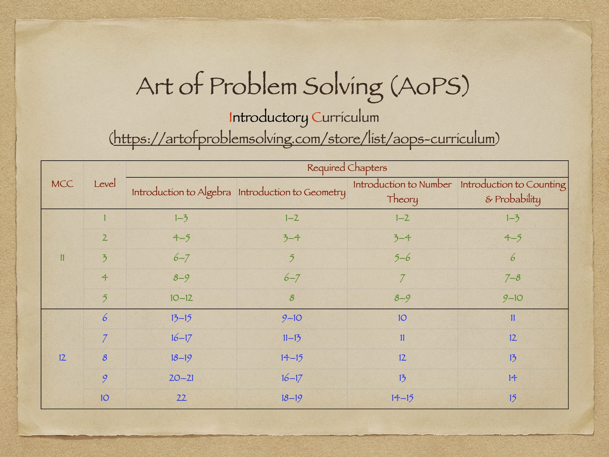

# [I1 – Individual Track Level 1](#i1--individual-track-level-1)

## 1. What it is / Who it’s for  
I1 is the entry-level track for students new to mathematical problem solving.  

It is intended for independent learners who prefer a self-paced approach, without live lectures or teammates.  

Students are expected to commit about **0.5 hours per day, 5 days per week** (~2.5 hours per week).  

This steady pace is suitable for students who want to build learning habits while gradually developing problem-solving skills.  

---

## 2. Curriculum  
Students in I1 learn from the **Art of Problem Solving (AoPS) Introductory Curriculum**:  
- Introduction to Algebra  
- Introduction to Geometry  
- Introduction to Number Theory  
- Introduction to Counting & Probability  

🔗 [AoPS Introductory Curriculum](https://artofproblemsolving.com/store/list/all-products)  

- **Textbooks** provide theory, worked examples, exercises, problems, and challenges.  
- **Solution manuals** include full solutions for all exercises, problems, and challenges.  

⚠ **Important**: Students who do not use the solution manuals often struggle to understand solutions or make progress. Serious learners should work with both the textbook and the solution manual.  

See below for chapters targeted in I1, which correspond to **ICLT Levels 1–5**.  

---

## 3. Timetable (32 weeks, 2 semesters)  
- Each chapter: about **2–4 weeks**  
  - Week 1: Read theory, study examples, begin exercises  
  - Week 2: Continue exercises, deepen understanding  
  - Week 3: Work on review problems  
  - Week 4: Attempt challenge problems  

---

## 4. Testing Timeline  
- **Assessment Test (first week):**  
  - Students select a level (L1–L5) to be assessed on.  
  - Two 90-minute tests over the first weekend (Saturday and Sunday):  
    + September 6 and September 7  
  - Students register test times using this online form:  
    [Registration for IC Assessment/Level Test](https://forms.gle/enEpBMuf6xjagpVj6)  
  - Purpose: to determine the correct starting level.  

- **Bi-Monthly Level Tests (every 2 months):**  
  - After the assessment, students register for two bi-monthly tests using the same form.  
  - Each level test consists of two 90-minute tests (Saturday and Sunday):  
    + October 18 and October 19  
    + December 13 and December 14  
  - Purpose: to measure progress at the student’s chosen level.  
  - Test weekends are listed in the official **[Individual Tracks Calendar](https://calendar.google.com/calendar/u/0?cid=YjM0NjZjY2UyMDRiYmQ4Njc1NGJmMTNiMTNkNmRiZTZhYmUyN2QxMDI3MDBlMDU1M2NjZTEyNjlhYzA5MWJjMUBncm91cC5jYWxlbmRhci5nb29nbGUuY29t)**.  

All tests are graded with detailed comments and recommendations.  
Optional Sunday live review sessions are available after tests (students must register):  
  + September 14  
  + October 26  
  + December 21  

---

## 5. Targets  
- Each student must **set personal IC Level goals**, choosing which of Levels 1–5 to complete within the year.  
- By the end of I1, students should be confident in:  
  - understanding problem statements  
  - identifying first steps and approaches  
  - applying strategies from algebra, geometry, number theory, and combinatorics  
- Success in I1 prepares students to advance to **I2** (Levels 6–10) and/or to **team training (T1/T2)**.  