# MCC at Purple Comet 2026

## A decade of excellence · a global achievement

We proudly present the achievements and the voices of our students at the [Purple Comet! Math Meet 2026](https://purplecomet.org/results/2026), as we also celebrate **ten years of MCC participation** in the competition.

  
<b>4,804</b>competing teams

  
<b>86</b>countries

  
<b>3</b>MCC teams ranked #1 worldwide

  
<b>10</b>years of MCC at Purple Comet

On this scale, our teams showed not only excellence but discipline, collaboration, and a real love for the subject.

[Official results](https://purplecomet.org/results/2026){: .btn} — search for *Math, Codding & Chess Club (MCC)*

## Results

| Team | Result | Score |
|---|---|---|
| 🥇 **MS ONE** | World Champion (tie) | 20 / 20 |
| 🥇 **MS TWO** | World Champion (tie) | 20 / 20 |
| 🌟 **MS THREE** | Honorable Mention | 19 / 20 |
| 🥇 **HS ONE** | World Champion (tie) | 30 / 30 |

## The teams

  

    🥇 World Champion · 20/20
    <h3>MS ONE</h3>
    <table>
      <tr><th>Role</th><th>Name</th><th>Grade</th></tr>
      <tr><td>Captain</td><td>Jason To</td><td>8</td></tr>
      <tr><td>Vice Captain</td><td>Linh Le</td><td>8</td></tr>
      <tr><td>Member</td><td>Alex Tran</td><td>7</td></tr>
      <tr><td>Member</td><td>Chi Pham</td><td>8</td></tr>
      <tr><td>Member</td><td>Mailys Phung Khac</td><td>8</td></tr>
      <tr><td>Member</td><td>Nam Phong Nguyen</td><td>8</td></tr>
    </table>
  

  

    🥇 World Champion · 20/20
    <h3>MS TWO</h3>
    <table>
      <tr><th>Role</th><th>Name</th><th>Grade</th></tr>
      <tr><td>Captain</td><td>Luan Tran</td><td>8</td></tr>
      <tr><td>Vice Captain</td><td>Nam Nguyen</td><td>8</td></tr>
      <tr><td>Member</td><td>Long Vo Duc Tran</td><td>8</td></tr>
      <tr><td>Member</td><td>Anna Dao</td><td>8</td></tr>
      <tr><td>Member</td><td>Minh Vo Duc Tran</td><td>7</td></tr>
      <tr><td>Member</td><td>Nguyen Trung Kien</td><td>8</td></tr>
    </table>
  

  

    🌟 Honorable Mention · 19/20
    <h3>MS THREE</h3>
    <table>
      <tr><th>Role</th><th>Name</th><th>Grade</th></tr>
      <tr><td>Captain</td><td>Henry Ho</td><td>7</td></tr>
      <tr><td>Vice Captain</td><td>Helen Vien</td><td>8</td></tr>
      <tr><td>Member</td><td>Claire Bao Tran Luu</td><td>5</td></tr>
      <tr><td>Member</td><td>Gia Minh Nguyen</td><td>6</td></tr>
      <tr><td>Member</td><td>Harry Vien</td><td>6</td></tr>
      <tr><td>Member</td><td>Michael Le</td><td>5</td></tr>
    </table>
  

  

    🥇 World Champion · 30/30
    <h3>HS ONE</h3>
    <table>
      <tr><th>Role</th><th>Name</th><th>Grade</th></tr>
      <tr><td>Captain</td><td>Karl Le</td><td>11</td></tr>
      <tr><td>Vice Captain</td><td>Linh Le</td><td>8</td></tr>
      <tr><td>Member</td><td>Antoine Dao</td><td>11</td></tr>
      <tr><td>Member</td><td>Chi Pham</td><td>8</td></tr>
      <tr><td>Member</td><td>Jake Cao</td><td>9</td></tr>
      <tr><td>Member</td><td>Jason To</td><td>8</td></tr>
    </table>
  

## Student profiles

  

    <h3>Anna Dao</h3>
    
<strong>G8 · Age 13</strong> MS TWO · Member

    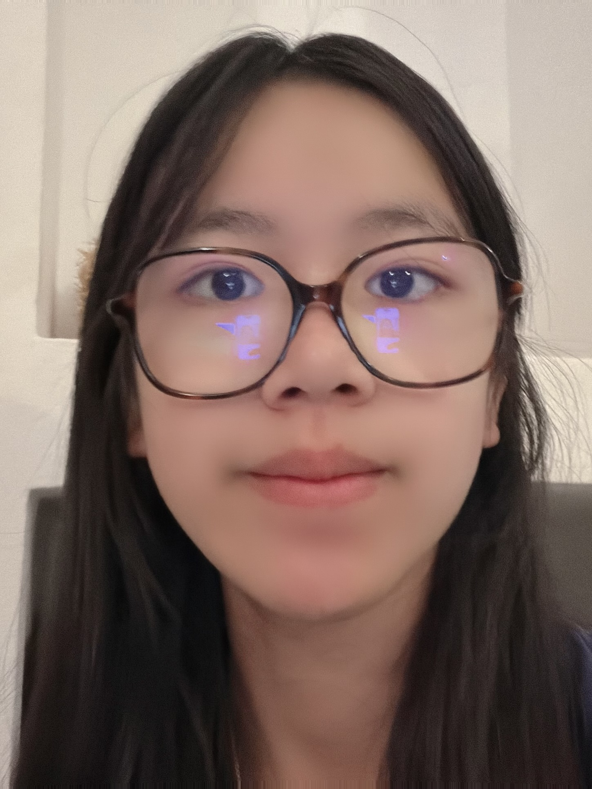
    
<strong>Who I am.</strong> Hello, my name is Anna. I am 13 years old and in Grade 8. I live in France.

    
<strong>MCC journey.</strong> I have been attending MCC for 2 years.

    
<strong>Purple Comet.</strong> I took part in the Purple Comet competition for 2 years. I really appreciate the teamwork, and I was very happy to receive the first award.

    
<strong>Parent thought.</strong> Anna has participated in the club for the past two years. She has started to make progress, becoming more focused and gradually improving her reasoning and teamwork.

  

  

    <h3>Antoine Dao</h3>
    
<strong>G11 · Age 16</strong> HS ONE · Member

    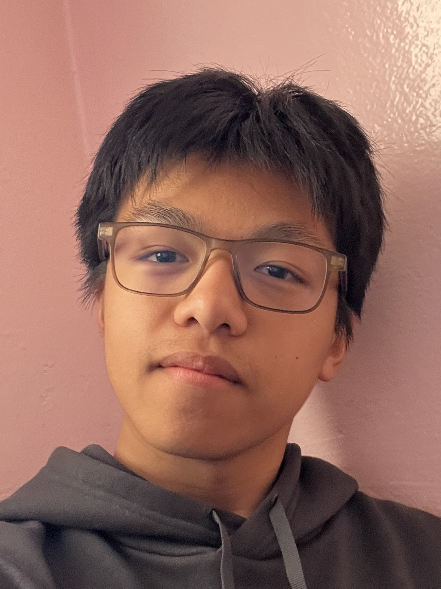
    
<strong>Who I am.</strong> My name is Antoine Dao, and I am 16 years old.

    
<strong>MCC journey.</strong> I started MCC 5 years ago and have seen a lot of progress through the years.

    
<strong>Purple Comet.</strong> I have taken part in 4 Purple Comet competitions, and this year is the first time our team achieved a perfect score of 30/30.

    
<strong>Parent thought.</strong> We have seen great progress in his autonomy, mathematical knowledge, and reasoning.

  

  

    <h3>Chi Pham</h3>
    
<strong>G8 · Age 13</strong> MS ONE, HS ONE · Member

    
    
<strong>Who I am.</strong> I am Chi Pham. I am in 8th grade and live in Washington, USA.

    
<strong>MCC journey.</strong> I have been attending MCC for 3 years.

    
<strong>Purple Comet.</strong> I took part in both MS ONE and HS ONE. Purple Comet was a nice challenge and helped develop teamwork within the club.

    
<strong>Parent thought.</strong> Chi has improved significantly since joining the club. She started as a beginner, and now she is solid and able to work well in a team.

  

  

    <h3>Claire Bao Tran Luu</h3>
    
<strong>G5 · Age 10</strong> MS THREE · Member

    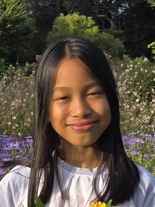
    
<strong>Who I am.</strong> I am Claire, a fifth grader living in Washington. I love playing the violin and piano, and I enjoy swimming.

    
<strong>MCC journey.</strong> I have been attending MCC for 2 years.

    
<strong>Purple Comet.</strong> I took part in the 2026 Middle School Purple Comet as part of Team 3. The training sessions were very helpful, and the problems were similar to what we practised, which helped me understand how to approach them.

    
<strong>Parent thought.</strong> Claire has improved tremendously. She can now write solutions in a logical and precise way, and has benefited greatly from teamwork.

  

  

    <h3>Gia Minh Nguyen</h3>
    
<strong>G6 · Age 11</strong> MS THREE · Member

    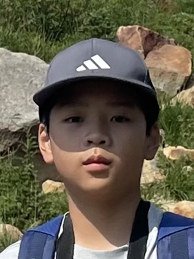
    
<strong>Who I am.</strong> I am in 6th grade and live in Washington state.

    
<strong>MCC journey.</strong> I have been attending MCC for 2 years.

    
<strong>Purple Comet.</strong> I took part in the 2026 Middle School competition. It was my first time. I received lectures and practice materials beforehand. My teammates were kind, and we all did our best.

    
<strong>Parent thought.</strong> Minh has learned many new concepts and now explains ideas much more clearly. He also collaborates very well with teammates.

  

  

    <h3>Harry Vien</h3>
    
<strong>G6 · Age 11</strong> MS THREE · Member

    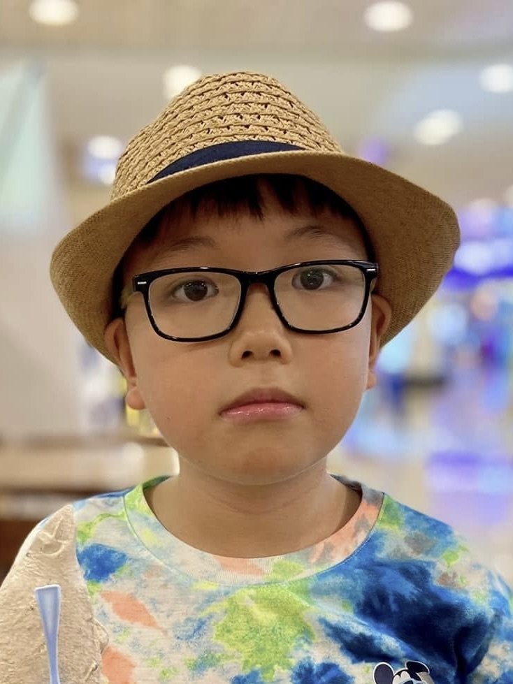
    
<strong>Who I am.</strong> I am Harry. I am 11 years old and will be attending Queen Elizabeth's School for Boys. I have taken part in several maths competitions.

    
<strong>MCC journey.</strong> I have been attending MCC for 2 years.

    
<strong>Purple Comet.</strong> This was my first time at Purple Comet. I found it a great opportunity to test my skills and to understand what I need to improve.

    
<strong>Parent thought.</strong> Harry has made significant progress in mathematical thinking and problem-solving skills.

  

  

    <h3>Helen Vien</h3>
    
<strong>G8 · Age 13</strong> MS THREE · Vice Captain

    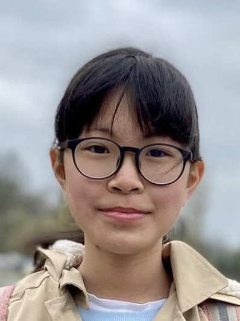
    
<strong>Who I am.</strong> I am 13 years old and study at the Henrietta Barnett School in the UK.

    
<strong>MCC journey.</strong> I have been attending MCC for 2 years.

    
<strong>Purple Comet.</strong> This was my first time taking part. It was very helpful in improving my problem-solving skills.

    
<strong>Parent thought.</strong> Helen has made excellent progress and achieved outstanding results in competitions.

  

  

    <h3>Henry Ho</h3>
    
<strong>G7 · Age 13</strong> MS THREE · Captain

    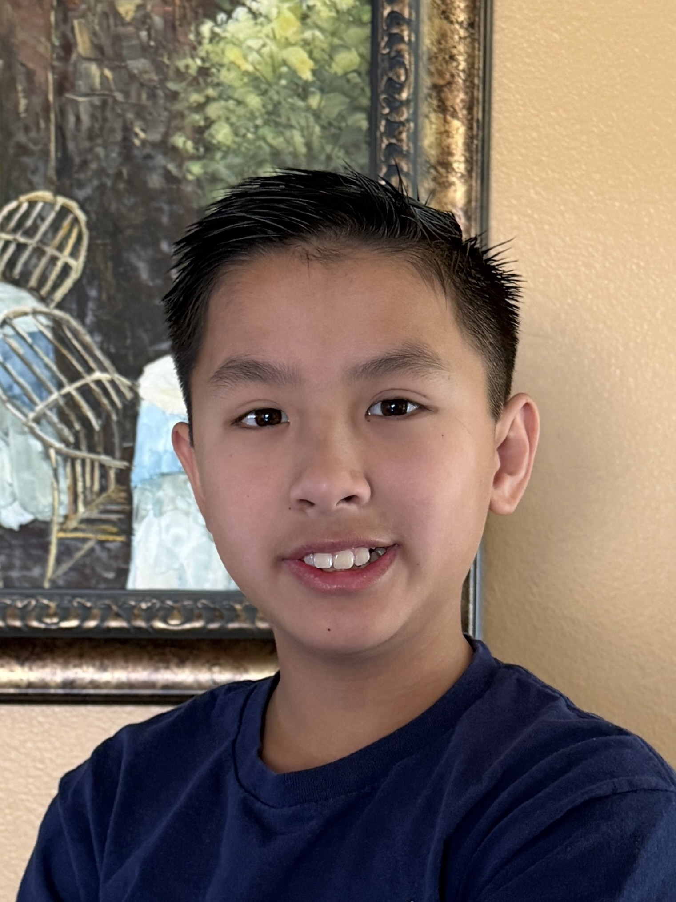
    
<strong>Who I am.</strong> My name is Henry Ho. I am 13 years old and in 7th grade.

    
<strong>MCC journey.</strong> This is my second year at MCC.

    
<strong>Purple Comet.</strong> I took part this year. The problems were solvable, but they took time and thinking.

    
<strong>Parent thought.</strong> Henry has made strong progress in strengthening his fundamentals.

  

  

    <h3>Jake Cao</h3>
    
<strong>G9 · Age 15</strong> HS ONE · Member

  

  

    <h3>Jason To</h3>
    
<strong>G8 · Age 14</strong> MS ONE (Captain), HS ONE (Member)

    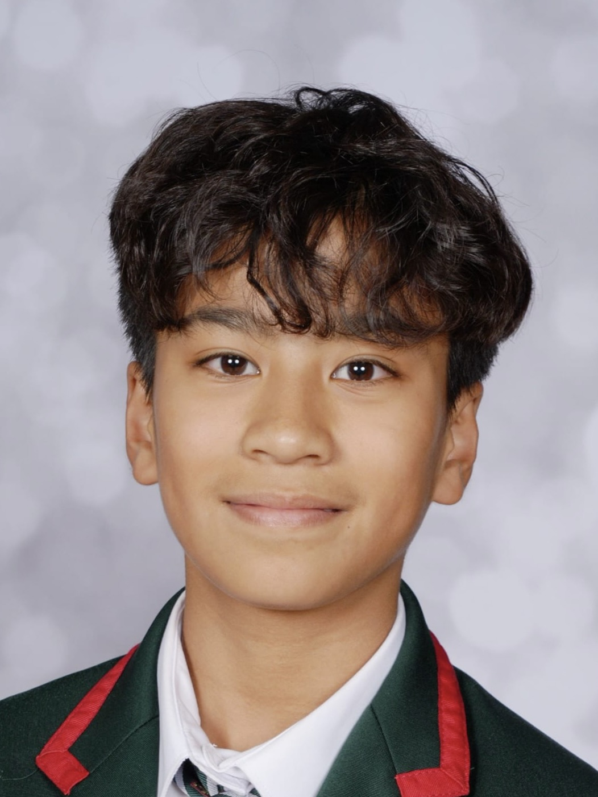
    
<strong>Who I am.</strong> My name is Jason To, a dedicated member of MCC.

    
<strong>MCC journey.</strong> I have been attending MCC for 3 years.

    
<strong>Purple Comet.</strong> I took part in both the Middle School and High School competitions and achieved full marks. It was a proud moment, but the teamwork and focus mattered most.

    
<strong>Parent thought.</strong> Jason has grown in confidence, maturity, and passion for mathematics.

  

  

    <h3>Karl Le</h3>
    
<strong>G11 · Age 16</strong> HS ONE · Captain

    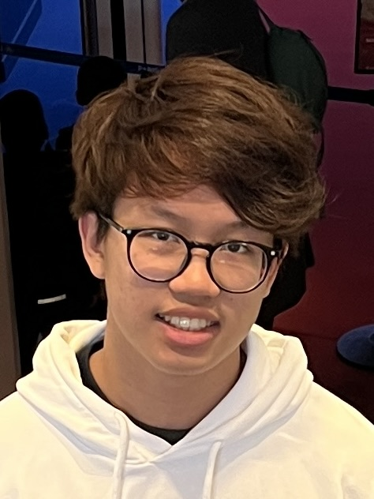
    
<strong>Who I am.</strong> Karl Le, 16 years old, living in France near Paris, currently in 11th grade.

    
<strong>MCC journey.</strong> I have been attending MCC for 5 years.

    
<strong>Purple Comet.</strong> I have taken part for 3–4 years. It is a good competition, and this year's was even better, especially looking at the results.

    
<strong>Parent thought.</strong> Good.

  

  

    <h3>Linh Le</h3>
    
<strong>G8 · Age 14</strong> MS ONE, HS ONE · Vice Captain of both

    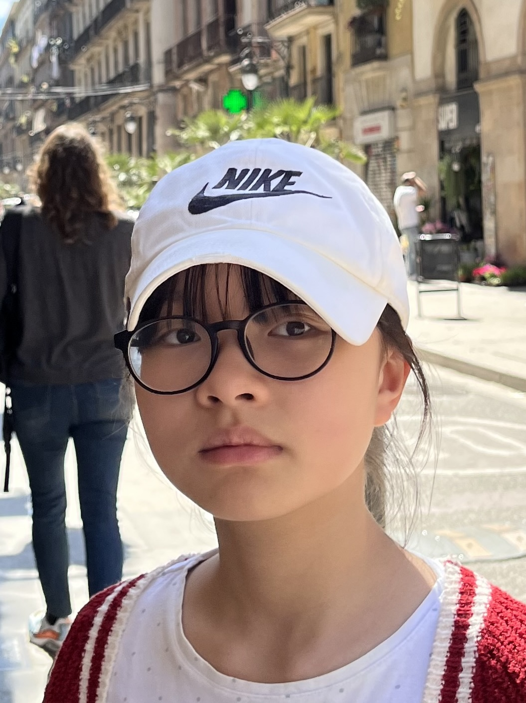
    
<strong>Who I am.</strong> Hi! My name is Linh, and I am a Year 9 student from the UK.

    
<strong>MCC journey.</strong> I have been attending MCC for 2 years.

    
<strong>Purple Comet.</strong> I took part in 2025 and 2026. This year I was on both the Middle School and High School teams, and both achieved full marks and top scores. It was an unforgettable experience, intense and rewarding at once.

    
<strong>Parent thought.</strong> Linh has developed a deeper passion for mathematics, and stronger problem-solving skills, teamwork, and discipline.

  

  

    <h3>Long Vo Duc Tran</h3>
    
<strong>G8 · Age 13</strong> MS TWO · Member

    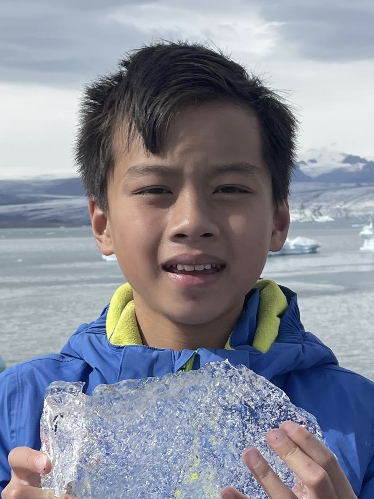
    
<strong>Who I am.</strong> My name is Long Vo Duc Tran. I am 13 years old and in Year 9 in the UK.

    
<strong>MCC journey.</strong> I have been attending MCC for almost 2 years.

    
<strong>Purple Comet.</strong> I took part in the Middle School Purple Comet as part of Team 2. I thought it was challenging, and actually harder than the practice, but it was fun.

    
<strong>Parent thought.</strong> Long has gone from needing encouragement to being genuinely excited about learning. He now appreciates the beauty of mathematics and expresses his reasoning clearly.

  

  

    <h3>Luan Tran</h3>
    
<strong>G8 · Age 14</strong> MS TWO · Captain

  

  

    <h3>Mailys Phung Khac</h3>
    
<strong>G8 · Age 13</strong> MS ONE · Member

  

  

    <h3>Michael Le</h3>
    
<strong>G5 · Age 11</strong> MS THREE · Member

    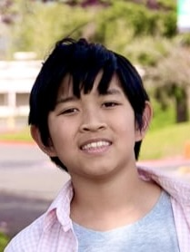
    
<strong>Who I am.</strong> Michael Le, a 5th grader in Washington, USA. I enjoy building LEGO, creating music sheets, and playing video games with my brothers.

    
<strong>MCC journey.</strong> I have been attending MCC for 1 year.

    
<strong>Purple Comet.</strong> I took part in Purple Comet 2026. My teammates worked hard on the problems and helped review each other's solutions. The training and materials were very effective.

    
<strong>Parent thought.</strong> Michael has improved in critical thinking and teamwork.

  

  

    <h3>Minh Vo Duc Tran</h3>
    
<strong>G7 · Age 12</strong> MS TWO · Member

    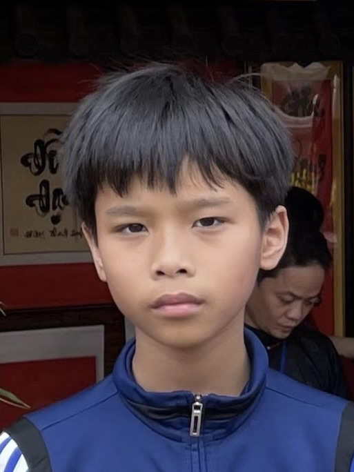
    
<strong>Who I am.</strong> My name is Minh Vo Duc Tran, and I am 12 years old. I am in Year 7 in the UK.

    
<strong>MCC journey.</strong> I have been attending MCC for almost 2 years.

    
<strong>Purple Comet.</strong> The competition was more challenging than anything I had done before. I was on the second Middle School team.

    
<strong>Parent thought.</strong> Minh has learned persistence and improved his ability to explain his solutions clearly.

  

  

    <h3>Nam Nguyen</h3>
    
<strong>G8 · Age 13</strong> MS TWO · Vice Captain

    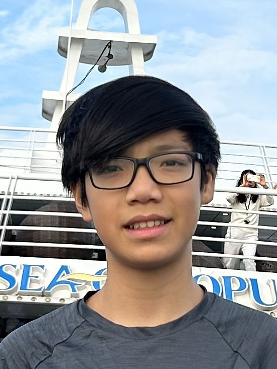
    
<strong>Who I am.</strong> I am a Year 9 student at the Perse Upper in Cambridge. Maths is my favourite subject, and I also play piano and table tennis.

    
<strong>MCC journey.</strong> I have been attending MCC for 2 years.

    
<strong>Purple Comet.</strong> I took part in the Middle School competition. The questions were interesting and challenging.

    
<strong>Parent thought.</strong> My son finds the MCC Club both useful and motivating for his maths learning.

  

  

    <h3>Nam Phong Nguyen</h3>
    
<strong>G8 · Age 13</strong> MS ONE · Member

    
    
<strong>Who I am.</strong> I am 13 years old and study at Lakanal Middle School in Sceaux, France. I enjoy sport, especially tennis.

    
<strong>MCC journey.</strong> I have been attending MCC for about 1.5 years.

    
<strong>Purple Comet.</strong> I was on MS ONE this year. The competition was very interesting and required strong collaboration between all the team members.

    
<strong>Parent thought.</strong> He has become more independent and focused when solving maths problems, and his motivation has improved as well.

  

  

    <h3>Nguyen Trung Kien</h3>
    
<strong>G8 · Age 13</strong> MS TWO · Member

    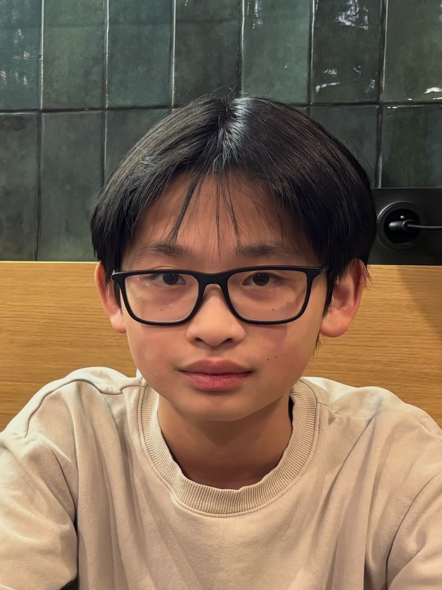
    
<strong>Who I am.</strong> My name is Trung Kien. I live in France and am in 8th grade. I enjoy maths, chess, and playing.

    
<strong>MCC journey.</strong> I have been attending MCC since 2024.

    
<strong>Purple Comet.</strong> It was my first time taking part, and I really loved working as a team.

    
<strong>Parent thought.</strong> More time working on maths.

  

---

## From an alumnus

> It is clear how much the club has grown into something truly special. Over the years it has brought together students who share a curiosity for mathematics and a desire to challenge themselves. Your commitment to creating engaging problems and fostering a supportive, stimulating environment has made the club a place where learning is both demanding and deeply rewarding.
>
> On a personal level, the impact of the club has been especially meaningful during my studies. The rigour of the problems, combined with your guidance, helped me develop the discipline, precision, and perseverance required to succeed. Beyond improving my mathematical skills, it shaped the way I think, reason, and approach difficulty in general. The habits and confidence I gained through the club continue to guide me every day, and I am truly grateful for its lasting influence.

— **Albert Dinh-Le**, MCC alumnus, twice Purple Comet Honourable Mention (2022, 2025)

---

This competition is not just about winning. It is about developing discipline and perseverance, learning to think deeply and clearly, and growing through teamwork and challenge.

💙 **MCC continues to build not only strong mathematicians, but confident thinkers.**

[Our results since 2019](./history.md){: .btn} [The 2025 teams](./purple-comet.md){: .btn .secondary}
