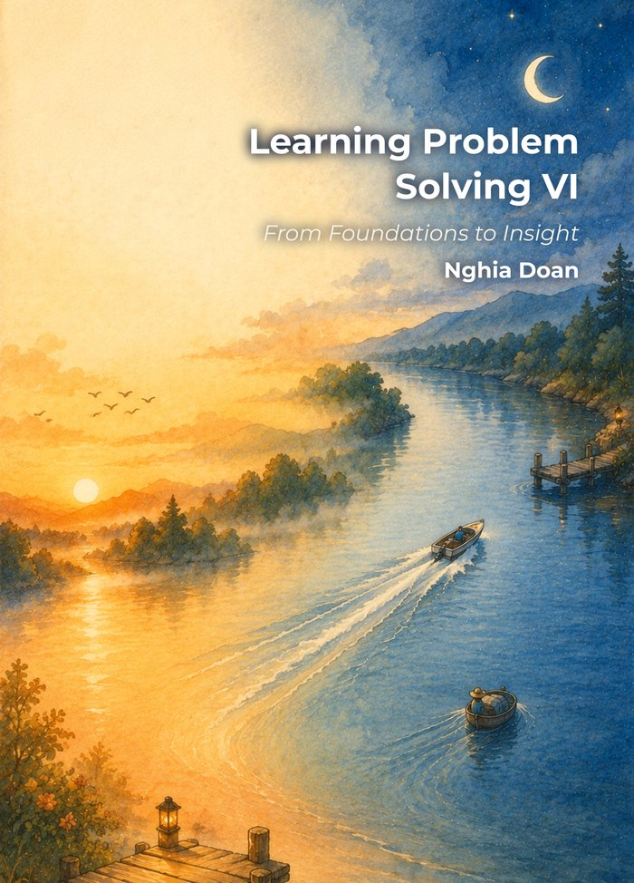

# T1 — Team Track Level 1

**The entry point into collaborative contest training.** Students work in teams of two and learn how to take a multi-step contest problem apart: read it properly, decide what is actually being asked, choose an approach, and write the whole thing down so that someone else is convinced.

## Who it is for

* Students who have worked through Beast Academy or the AoPS Introductory series, or the equivalent, and are ready for contest-style training.
* Students who enjoy arguing about a problem with a partner rather than sitting alone with it.
* Students who can commit **5–7 hours a week**.

You will need a teammate before you register — see [Teams](./programs.md).

## Curriculum

T1 follows the club's textbook **[Learning Problem Solving VI — From Foundations to Insight](./books.md)**.

The volume has **54 chapters**, each opening four themed sections, with about **1,400 problems** across Algebra, Combinatorics, Geometry, and Number Theory. T1 is the **first pass** through the book: the easier problems in each section, worked thoroughly. T2 makes the second pass through the same chapters at a higher difficulty — the book is built to be climbed twice.

What T1 emphasises:

* Reading a problem statement precisely, and noticing what it does *not* say.
* Naming the goal before choosing a method.
* Building a solution in steps that each follow from the last.
* Checking the answer, and reviewing it together as a team.

Problems are grouped into smaller sub-questions, which is how systematic thinking gets taught rather than assumed.

## The two-week cycle

**Week 1** — Study the chapter: theory, then the worked examples. Work the first half of the team assignment and submit it by Sunday. From the second cycle onward, this is also the week when official solutions to the previous assignment appear (Monday), grading and feedback from the previous test come back (Monday–Thursday), and selected teams prepare on Friday to present on Sunday.

**Week 2** — Work the second half of the assignment and submit by Sunday. Official solutions are released Monday; go through them carefully as a team. **Sunday: the team test.**

## Tests

Each chapter has its own test. Three of the six problems examine the chapter you have just studied; the other three come from the remaining areas, so nothing you learned in October is allowed to fade by March.

| Band | Problems | Points each | Questions per problem |
|---|---|---|---|
| **E — Easy** | 2 | 10 | 1 |
| **M — Medium** | 2 | 15 | 2 |
| **H — Hard** | 2 | 25 | 3 |

**Total 100 points. The pass mark is 51. Duration: 90 minutes.**

The multi-part structure is not there to make the paper longer — it is there to give you somewhere to go. The questions inside a problem lead toward the result, so a team that cannot see the whole path can still walk the first part of it and show what they know.

Every problem is drawn from an international competition and rewritten to be clearer and more enjoyable to read. Solutions are published step by step, which makes the papers straightforward for parents to grade and to go through afterwards with their child.

Teams choose their testing pace — weekly, every two weeks, or one test per chapter — and can change it during the year. See [Programs](./programs.md).

## Submitting and grading

One PDF per submission, through the form. No email, no photographs, no multiple files; submissions in the wrong format lose points.

All assignments and tests are graded with comments. Selected teams present their solutions live at the Sunday session, or send a recording if both members are away. Results and individual evaluations are published on the site.

## What you should be able to do by the end

* Read, analyse, and genuinely understand a contest-style problem.
* Develop a systematic approach and write a complete, step-by-step solution.
* Work as a team — dividing the work, arguing productively, checking each other.
* Present a solution to other people and take feedback on it.

Students who finish T1 well are ready for **[T2](./t2.md)**, where the problems reach AMC 8/10 and national qualifier level.
