# Making Sure Testing Works

Here's what actually happens when a real team takes a test, start to finish. A coordinator (or the family itself) schedules the team's next test date. When that date arrives, the system creates the student's test session on its own — no one has to remember to do it. The student visits the sign-up form, confirms they're ready, and the test paper appears shared on their Google Drive within moments. The student solves it and uploads their answer as a PDF through that same form. A grader marks it and records the score, and the team's standing updates to reflect the result. No one emails a PDF around, and no coordinator has to update a spreadsheet by hand.

This page walks through every link in that chain, one at a time, to make sure it actually works before any real family's test depends on it — 14 numbered checks in all, **Test 1 through Test 14**. Each one walks through a specific, real situation: the ordinary path where everything goes right (Test 1), a family missing a deadline (Test 4 and Test 5), a team failing three times in a row (Test 3), someone signed into the wrong email (Test 14), and so on. Nghia runs through all 14 himself, using the club's standing **practice teams** (`T-EC1` and `T-WC1` — stand-ins for a real East Coast team and a real West Coast team, MCC's two regions so far) and two dedicated **practice accounts** instead of real students — see "Roles, accounts, and how each test is written" just below for exactly which account plays which role. No real student data is touched by any of this.

**Why coordinators and organizers should read this, not just Nghia.** Before a real test day, you'll likely want to run a quick check of your own — smaller than this, maybe just "Check my data" and a glance at the roster. Your own check is really a *smaller version* of this full walkthrough. Reading through all 14 first shows you exactly what a complete check looks like and why each piece matters, so you can see how your own shorter routine relates to it — and borrow any pieces of it you want. **The situation** at the top of each one explains what real-world moment it's standing in for, and every **what you should see** line tells you exactly what should appear on screen if everything is working.

  

    Your progress through these 14 tests: <strong id="tc-progress-count">0 of 14</strong> checked off.
    <button type="button" class="tc-progress-reset" id="tc-progress-reset">Start over</button>
  

  

  
Checking off a test as you go just helps you keep your place. It's saved in this browser only — it won't follow you to another device, and it doesn't report anything to anyone.

## Roles, accounts, and how each test is written

### The accounts used below

Every step below is tagged with who does it — really, which Google account needs to be signed in when it happens:

| Tag | Who | Account used |
|---|---|---|
| **[Coordinator]** | The person scheduling and pacing the practice team | Nghia's own account, `nghia71@gmail.com` — coordinator code `O02` |
| **[Student 1]** | The first practice "student" | `mcc.tst1@gmail.com` — shows in Google's account switcher as **Student 1 MCC** |
| **[Student 2]** | The second practice "student" | `mcc.tsttwo@gmail.com` — shows in Google's account switcher as **Student 2 MCC** |
| **[Grader]** | Whoever marks the submitted test | Nghia's own account — in real life, this would be a volunteer grader's own account instead |
| **[Admin]** | A step only Nghia can do directly, using the system's own technical tools — not something any coordinator has a button for yet | Nghia's own account |
| **[Anyone]** | Deliberately *not* one of the two practice accounts, to check what happens with an email the system doesn't recognize | Nghia's own account, used here only because it isn't registered to `T-EC1` |

Coordinator, Grader, and Admin are really all the same person — Nghia — signed into the same account, since he's the one running through all 14 tests by himself. The two Student tags are genuinely two separate accounts, so the system can tell "who's on the team" apart the same way it would for two real family members.

### Switching between accounts in Chrome

Most steps below need you signed into a specific one of the accounts above before you do anything. In Chrome:

1. Click your profile picture in the top-right corner of any Google page — Drive, Sheets, the sign-up form all show it in the same spot.
2. If the account you need is already listed in that menu, click its name — Chrome switches to it instantly, no password needed.
3. If it isn't listed yet, click **Add another account**, sign in with that account's email and password once, and from then on it stays in the list — you'll never need to type that password again, just click the name.
4. Before doing anything that matters (opening the test form, clicking "Check my data"), glance at the profile picture in the corner first, to make sure you're actually signed in as the account the step calls for. It's easy to click straight through a step as the wrong account, since Google won't warn you either way.

### How each test is laid out

Each one below is labeled **Test #** with a short plain-English title, then:

- **The situation** — one or two sentences on the real, everyday situation this test stands in for, and what's supposed to happen if the system handles it correctly.
- **Before you start** — the one thing that has to be true before the numbered steps start. Almost always this is just "click the reset button" (explained in "Resetting between tests," just below); a few tests need one extra manual step first, and that's spelled out there in full.
- A numbered list of **steps**. Each one opens with a bracketed tag — see the accounts table above — naming who does it, then what to actually click or check.
- *Why it matters* — appears under some steps, in plain words, to explain why that particular check is worth doing at all — not how the system is built, but what would actually go wrong for a real family if this step were broken.
- *What you should see* — what you should literally see on screen or in the spreadsheet if everything worked. Compare it to what you actually see; a mismatch is a real problem worth reporting.

## Resetting between tests

Most tests below start from the same clean slate. **As coordinator**, signed into `nghia71@gmail.com`, open the <a href="https://docs.google.com/spreadsheets/d/13byGPiBQW00egpC2GIZenAsKhMCS7qbCykZSUtbE7jk/edit?usp=sharing">Master Registration Spreadsheet</a> and click **MCC Tools → Reset my test team(s)**. One click resets `T-EC1` and `T-WC1` back to chapter 1 with a fresh test date of today, clears their test history, and immediately schedules a new session for each — this is genuinely the same button a real coordinator would use to retest anything, any time, not a special test-only shortcut.

Each test below says, in its own **Before you start** line, whether it needs anything beyond this one click.

For Nghia (system admin) only — the manual recovery sequence, if the reset button itself seems broken

This manual sequence is the fallback only if the reset button above stops working, or if every region needs resetting at once, not just the practice team's own regions. From the system's technical control panel, run these steps by hand, in this exact order: rebuild the regional pacing data, reseed it, reseed the test papers, clear out the practice team's test rows, then run the nightly scheduling step. Don't skip the regional-pacing rebuild — skipping it is exactly what caused the "start time and deadline never fill in" problem Test 7 documents.

### Test 1 — A test that goes right, start to finish

<label class="tc-done-toggle"><input type="checkbox" class="tc-done-checkbox" data-test="1"> I've run through Test 1</label>

**The situation:** this is what a completely ordinary test looks like, start to finish — a test paper becomes available, a student opens and submits it, a grader marks it, and the team's standing updates. Every other test below is really a variation on this one: something arriving late, someone signed into the wrong account, a team failing instead of passing. If this baseline doesn't work end to end, none of those other tests mean anything yet.

**Before you start:** the standard reset (see "Resetting between tests" above).

<strong>1. [Coordinator]</strong> Open the <a href="https://docs.google.com/spreadsheets/d/13byGPiBQW00egpC2GIZenAsKhMCS7qbCykZSUtbE7jk/edit?usp=sharing">Master Registration Spreadsheet</a>'s <code>Teams</code> tab, and find <code>T-EC1</code>'s row. 
<em>Why it matters:</em> the nightly scheduling run only creates a test for a team marked Active and assigned to a real coordinator — get either one wrong, and this team would simply never be scheduled, with nothing anywhere to say so. 
<em>What you should see:</em> <code>Active</code> reads <code>TRUE</code>, and <code>CoordinatorID</code> reads <code>O02</code> (Nghia's own coordinator code).

<strong>2. [Coordinator]</strong> Still on the Master Registration Spreadsheet, click <strong>MCC Tools → Check my data</strong>. 
<em>Why it matters:</em> this is what a real coordinator should do before trusting anything else that day — it catches a broken reference or a missing team before it turns into a confusing problem later. 
<em>What you should see:</em> a <code>Data Check</code> tab appears, with every row green.

<a href="./img/current-standings/master-tools-menu.png" target="_blank" rel="noopener" class="tc-step-shot-link">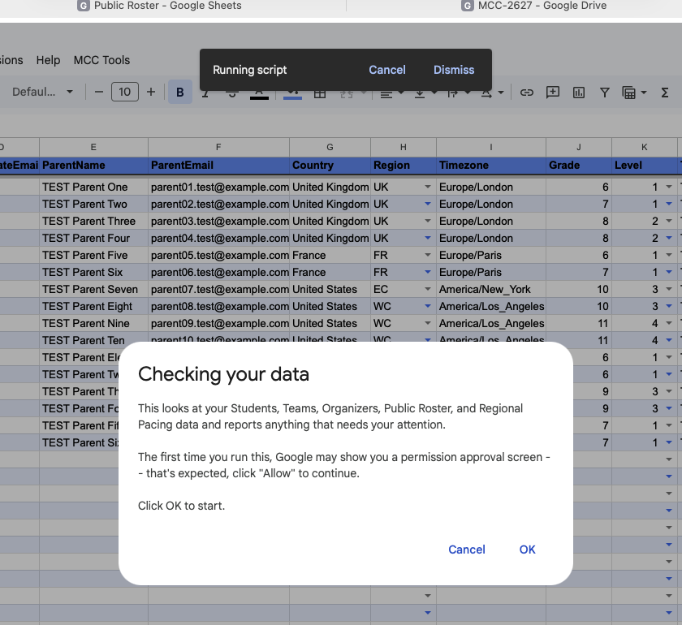</a>

The prompt that appears the moment you click — the green Data Check tab opens once you click OK.

<strong>3. [Coordinator]</strong> Open the <a href="https://docs.google.com/spreadsheets/d/1m_CzWRfQxUt7puw1mVBqAZCpm1zvYDrxievSJXKGGFI/edit?usp=sharing">Public Roster</a>'s <code>Exams</code> tab, and find the row the reset just created for <code>T-EC1</code>. 
<em>Why it matters:</em> confirms the reset genuinely created a brand-new test session, rather than just clearing the old one and stopping there. 
<em>What you should see:</em> a session ID is filled in, the exam date reads today, and the status column reads something like "Not started."

<strong>4. [Student 1]</strong> Signed into <code>mcc.tst1@gmail.com</code>, open the Test Paper Open/Submit Form, choose <strong>"I'm ready to open my test paper,"</strong> and submit. 
<em>Why it matters:</em> this is the actual moment a real family starts their test. The form checks whichever email is signed in against the student's registered email — sign in as the wrong account, and it won't work (see Test 14). 
<em>What you should see:</em> the form's own plain confirmation message.

<a href="./img/current-standings/form-landing.png" target="_blank" rel="noopener" class="tc-step-shot-link">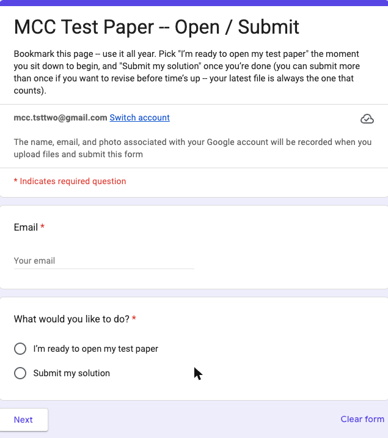</a>

What step 4 looks like.

<strong>5. [Student 1]</strong> Still signed into <code>mcc.tst1@gmail.com</code>, check the <code>Exams</code> row again. 
<em>Why it matters:</em> the form's confirmation message alone doesn't actually tell you whether starting the test worked — see Test 7, where it looks identical even when it silently fails. The spreadsheet is always the real source of truth. 
<em>What you should see:</em> a start time and a deadline are now filled in, and the status reads "In progress."

<strong>6. [Student 1]</strong> Still signed into <code>mcc.tst1@gmail.com</code>, open that account's Google Drive. 
<em>Why it matters:</em> actually being able to open the test paper is the whole point of starting it — access should appear on its own, without anyone needing to manually share a file. 
<em>What you should see:</em> the test paper PDF appears, and opens. (This access is temporary — it's removed automatically again once the deadline plus a short grace period has passed.)

<strong>7. [Student 2]</strong> Switch to <code>mcc.tsttwo@gmail.com</code>, open the same form, choose <strong>"Submit my solution,"</strong> upload any small PDF, and submit. 
<em>Why it matters:</em> confirms either team member can submit for the team — it isn't locked to whoever happened to click "start." 
<em>What you should see:</em> the form's plain confirmation message, same as any submission.

<a href="./img/current-standings/form-upload.png" target="_blank" rel="noopener" class="tc-step-shot-link">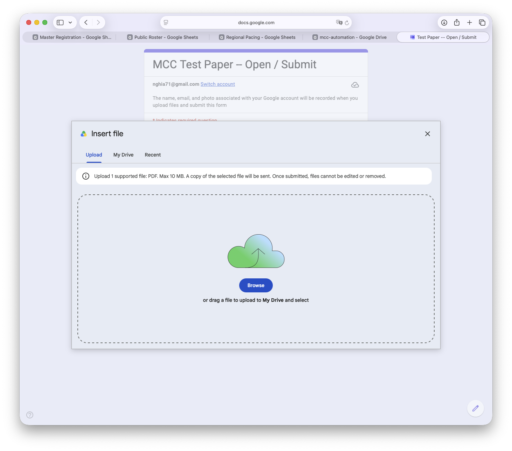</a>

What step 7 looks like.

<strong>8. [Student 2]</strong> Still signed into <code>mcc.tsttwo@gmail.com</code>, check the <code>Exams</code> row once more. 
<em>What you should see:</em> a link to the submitted file and a submission time are now filled in, and the status reads "Submitted on time."

<strong>9. [Grader]</strong> Signed into <code>nghia71@gmail.com</code>, using the system's technical control panel, set up this week's grading spreadsheet (no need to enter anything — it defaults to the current week). 
<em>Why it matters:</em> grading is currently the one step in this whole chain that still needs a direct, by-hand technical step — there's no click-a-menu option for it yet, unlike everything else a coordinator does. 
<em>What you should see:</em> this week's grading spreadsheet is created (or found, if it already exists) and shared automatically with everyone on the graders list.

<strong>10. [Grader]</strong> On the <code>Exams</code> row, click the link to the submitted file. 
<em>Why it matters:</em> confirms a grader — not just a coordinator — genuinely has access to open the real file a student submitted. 
<em>What you should see:</em> the submitted PDF opens normally.

<strong>11. [Grader]</strong> On the weekly grading spreadsheet's <code>Grading</code> tab, add a row by hand: this session's ID, team <code>T-EC1</code>, a score of 51 or higher (a Pass), any comments, your own name as grader, and mark it done. 
<em>What you should see:</em> the row saves normally, the same as typing into any spreadsheet.

<a href="./img/current-standings/grading-sheet.png" target="_blank" rel="noopener" class="tc-step-shot-link">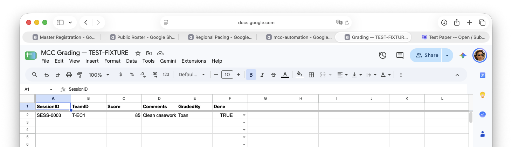</a>

What step 11 looks like.

<strong>12. [Grader]</strong> Using the system's technical control panel, pull this week's grading results back into the system. 
<em>What you should see:</em> a confirmation that the row was read and written back to the <code>Exams</code> tab.

<strong>13. [Grader]</strong> Check the <code>Exams</code> row. 
<em>What you should see:</em> the score, the result ("Pass"), the grading time, and the grader's name are all filled in, and the status now reads "Graded."

<strong>14. [Coordinator]</strong> Hover your mouse over the score cell. 
<em>Why it matters:</em> a grader's written comments are deliberately kept as a private note on the cell, not turned into a new shared file — worth actually confirming that boundary holds. 
<em>What you should see:</em> the grader's comment text appears as a small note, without opening or sharing any new file.

<strong>15. [Coordinator]</strong> Check <code>T-EC1</code>'s row on the <a href="https://docs.google.com/spreadsheets/d/1BsRd05S7tK1lnr83vxidwDA87qAd1NWEMTFKvDfRkDg/edit?usp=sharing">Regional Pacing Spreadsheet</a>'s <code>EC</code> tab, then its <code>Standings</code> tab. 
<em>What you should see:</em> the team's next chapter has moved forward by one, the last-test date is updated, and <code>Standings</code> now reflects the new result.

---

### Test 2 — A team doesn't pass, but still has retakes left

<label class="tc-done-toggle"><input type="checkbox" class="tc-done-checkbox" data-test="2"> I've run through Test 2</label>

**The situation:** simulates a team that doesn't pass on a given attempt. A Fail shouldn't just sit there waiting for someone to notice — the system should schedule a retake at the same chapter on its own, without a coordinator having to catch it and act by hand.

**Before you start:** the standard reset, then repeat Test 1's steps, but with step 11's score under 51 (a Fail) instead of a Pass.

<strong>1. [Coordinator]</strong> After the Fail is recorded, check <code>T-EC1</code>'s <code>Exams</code> history on the Public Roster — there are now two rows for this team. 
<em>Why it matters:</em> confirms a retake was actually created automatically, not just that the Fail itself got written down. 
<em>What you should see:</em> the original row shows Result: Fail; a second row exists on its own, marked Attempt 2, same chapter, with a fresh date.

<strong>2. [Coordinator]</strong> Check the Regional Pacing row for <code>T-EC1</code>. 
<em>What you should see:</em> the next-chapter number is unchanged — a retake doesn't move the team forward; only a Pass does.

---

### Test 3 — A team fails for the third time in a row

<label class="tc-done-toggle"><input type="checkbox" class="tc-done-checkbox" data-test="3"> I've run through Test 3</label>

**The situation:** simulates a team that keeps failing. The system shouldn't keep retrying forever — it needs to stop at a defined limit (three attempts) and hand the decision back to a person, rather than looping endlessly or quietly giving up.

**Before you start:** the standard reset, then repeat Test 2's Fail sequence twice more, so <code>T-EC1</code> reaches Attempt 3. (Faster alternative: after the first Fail, hand-edit the new retake row's Attempt number to 3 directly on the spreadsheet, before grading it.)

<strong>1. [Grader]</strong> Grade the Attempt 3 session as a Fail (a score under 51), the same grading steps as Test 1. 
<em>What you should see:</em> grading itself completes exactly as normal — nothing about it looks different from grading a Pass. The retry limit only shows up in step 2, below.

<strong>2. [Coordinator]</strong> Check <code>T-EC1</code>'s <code>Exams</code> history. 
<em>Why it matters:</em> this is the exact point where "the system just handles it automatically" stops being true — worth knowing precisely where that line is. 
<em>What you should see:</em> Result: Fail on the Attempt 3 row; no Attempt 4 row gets created automatically.

<strong>3. [Coordinator]</strong> Check the Regional Pacing row. 
<em>What you should see:</em> the next-chapter number is still unchanged. This team genuinely needs a coordinator's own judgment now — a conversation with the family, a manually scheduled makeup, or moving on — the system won't take any further action on its own.

---

### Test 4 — A submission comes in a little late

<label class="tc-done-toggle"><input type="checkbox" class="tc-done-checkbox" data-test="4"> I've run through Test 4</label>

**The situation:** simulates a family with slow internet, or a last-minute scramble. A slightly-late submission shouldn't be rejected outright — it should just be flagged as late, and still count.

**Before you start:** the standard reset, start the test (Test 1 steps 1-6), then submit a little after the deadline, but still within 30 minutes of it.

<strong>1. [Student 2]</strong> Signed into <code>mcc.tsttwo@gmail.com</code>, submit as in Test 1, but a few minutes after the deadline. 
<em>What you should see:</em> the form's ordinary confirmation message — identical to an on-time submission. (Worth noticing: the system itself does track late vs. on-time; the confirmation screen the student sees doesn't show the difference either way.)

<strong>2. [Coordinator]</strong> Check the <code>Exams</code> row. 
<em>What you should see:</em> the submission is accepted — the file link and submission time are filled in, and the status reads "Submitted — N minutes late," not rejected.

---

### Test 5 — A submission comes in too late to count

<label class="tc-done-toggle"><input type="checkbox" class="tc-done-checkbox" data-test="5"> I've run through Test 5</label>

**The situation:** confirms there's a real cutoff. Grace is generous but not infinite — a genuinely too-late submission needs to be rejected outright, rather than accepted with a scary-looking "very late" status that still secretly counts.

**Before you start:** the standard reset, start the test (Test 1 steps 1-6), then submit well past the deadline plus 30 minutes.

<strong>1. [Student 2]</strong> Signed into <code>mcc.tsttwo@gmail.com</code>, submit past the grace period. 
<em>What you should see:</em> the form's ordinary confirmation message — the student still sees nothing indicating rejection. This is the sharpest version of a pattern worth remembering: the confirmation screen never tells a student whether something actually went wrong.

<strong>2. [Coordinator]</strong> Check the <code>Exams</code> row. 
<em>What you should see:</em> no submission was recorded at all — no file link, nothing. A real family in this situation needs to be told directly — a message, a phone call — that their submission didn't go through; the system will not tell them on its own.

---

### Test 6 — A student submits a corrected file

<label class="tc-done-toggle"><input type="checkbox" class="tc-done-checkbox" data-test="6"> I've run through Test 6</label>

**The situation:** simulates a family correcting a mistake — the wrong file, or second thoughts. Their first attempt shouldn't be lost, and the system should always reflect whichever file they submitted most recently.

**Before you start:** the standard reset, run Test 1 through its first submission (step 7).

<strong>1. [Student 2]</strong> Signed into <code>mcc.tsttwo@gmail.com</code>, open the form again, choose "Submit my solution" again, and upload a different file. 
<em>What you should see:</em> the form's ordinary confirmation message, same as any submission.

<strong>2. [Coordinator]</strong> Check the <code>Exams</code> row's submitted-file link. 
<em>What you should see:</em> it now points at the new file.

<strong>3. [Coordinator]</strong> Check Google Drive directly, not through the spreadsheet link. 
<em>Why it matters:</em> confirms the first file wasn't deleted, only superseded — families sometimes want their original attempt back. 
<em>What you should see:</em> both the first and second uploaded files still exist.

---

### Test 7 — A student tries to start before their test paper is ready (a real gap we found)

<label class="tc-done-toggle"><input type="checkbox" class="tc-done-checkbox" data-test="7"> I've run through Test 7</label>

**The situation:** this genuinely happened once, for real, the very first time this walkthrough was ever run — kept permanently as its own test so it's never a surprise again. It's a real, still-open gap: right now, nothing tells a student when this specific thing goes wrong.

**Before you start:** get a team into a state where its next chapter is ahead of what's actually been prepared on the Papers list (paper prep always starts at chapter 1). The fastest way: on the Regional Pacing <code>EC</code> tab, hand-edit <code>T-EC1</code>'s <code>NextChapter</code> cell up by one and set <code>NextExamDate</code> to today, then let the nightly scheduling run create the session. Running Test 1 all the way through to a Pass, so the team advances normally, works too — it just takes longer.

<strong>1. [Student 1]</strong> Signed into <code>mcc.tst1@gmail.com</code>, open the form, choose "I'm ready to open my test paper," and submit. 
<em>What you should see:</em> the form's ordinary confirmation message — indistinguishable from a real success. This is the entire problem: right now, there's no student-facing error message for this specific situation.

<a href="./img/current-standings/tc7-step1-form-confirmation.png" target="_blank" rel="noopener" class="tc-step-shot-link">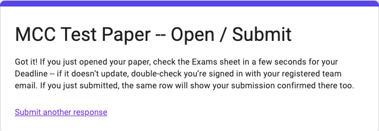</a>

The confirmation looks exactly like a normal success — nothing here hints at the missing-paper problem.

<strong>2. [Coordinator]</strong> Check the <code>Exams</code> row. 
<em>What you should see:</em> the start time and deadline are still blank. Nothing actually happened behind the scenes, and nothing on the student's screen showed that anything had gone wrong.

<a href="./img/current-standings/tc7-step2-exams-no-start.png" target="_blank" rel="noopener" class="tc-step-shot-link">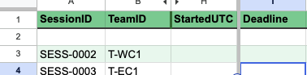</a>

T-EC1's row after the "open" attempt — StartedUTC and Deadline are still empty.

<strong>3. [Coordinator]</strong> What to actually do about it: before each test window opens — the day you expect students to start testing — click <strong>MCC Tools → Check my data</strong> as a standing habit, not just when something already seems wrong. 
<em>Why it matters:</em> this check exists specifically to catch this situation in advance, by comparing every active team's next-due chapter against what's actually prepared on the Papers list. Catching it here, ahead of time, is the entire point — don't wait for a family to report "nothing happened when I clicked start," because nothing on their screen will ever tell them that. 
<em>What you should see:</em> a red row naming the exact team and the exact chapter that's missing a paper.

<a href="./img/current-standings/tc7-step3-data-check-flag.png" target="_blank" rel="noopener" class="tc-step-shot-link">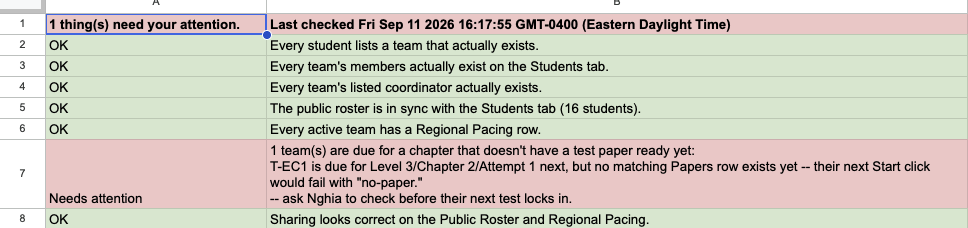</a>

The real Data Check output from this run — it names T-EC1 and the exact missing chapter, and warns their next Start click would fail with &quot;no-paper.&quot;

---

### Test 8 — A team never submits their test

<label class="tc-done-toggle"><input type="checkbox" class="tc-done-checkbox" data-test="8"> I've run through Test 8</label>

**The situation:** confirms that access to a test paper doesn't stay open forever. Once there's no realistic chance a legitimate submission is still coming, the system should revoke access on its own, without a coordinator needing to remember to do it.

**Before you start:** the standard reset, then start the test (Test 1 steps 1-6), then hand-edit the <code>Exams</code> row's <code>Deadline</code> cell to a time well in the past — this stands in for actually waiting out the real grace period.

<strong>1. [Admin]</strong> The nightly access-cleanup run happens on its own, on schedule (Nghia can also run it directly by hand, any time, from the system's technical control panel). 
<em>Why it matters:</em> this is what actually makes "access is temporary" true in practice, not just something written down. 
<em>What you should see:</em> the team's <code>Exams</code> row is marked expired, and its shared access to the test paper is revoked.

<a href="./img/current-standings/tc8-step1-sweep.png" target="_blank" rel="noopener" class="tc-step-shot-link">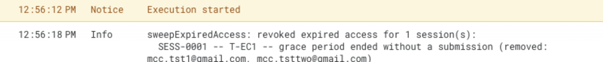</a>

A real sweep — names the exact session and the exact accounts it removed.

<strong>2. [Student 1]</strong> Still signed into <code>mcc.tst1@gmail.com</code>, check Drive access to the test paper again. 
<em>What you should see:</em> viewer access is now gone — the file no longer opens.

<a href="./img/current-standings/tc8-step2-drive-404.png" target="_blank" rel="noopener" class="tc-step-shot-link">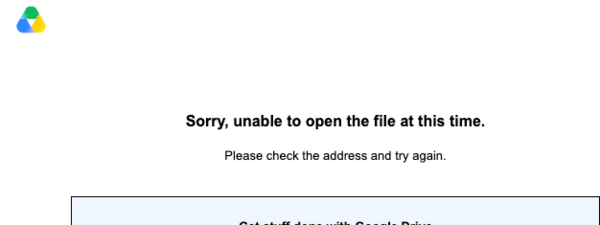</a>

The file is really gone for them — Drive returns a plain 404, not even a "request access" screen.

<strong>3. [Coordinator]</strong> Check the <code>Exams</code> row's status column. 
<em>What you should see:</em> it reads "Overdue — the grace period has ended, contact your coordinator." This is the cue for a coordinator to actually reach out to the family directly — unlike a graded Fail, nothing retries a no-show automatically.

<a href="./img/current-standings/tc8-step3-status-overdue.png" target="_blank" rel="noopener" class="tc-step-shot-link">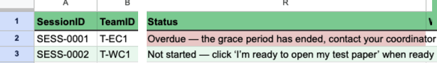</a>

The exact wording a coordinator sees, word for word.

---

### Test 9 — A student clicks "I'm ready" twice by accident

<label class="tc-done-toggle"><input type="checkbox" class="tc-done-checkbox" data-test="9"> I've run through Test 9</label>

**The situation:** simulates an accidental double-click, or a student who genuinely isn't sure their first click registered. Either way, it shouldn't restart the clock or create any confusing duplicate state.

**Before you start:** the standard reset, then start the test once (Test 1 steps 1-4).

<strong>1. [Student 1]</strong> Still signed into <code>mcc.tst1@gmail.com</code>, open the form again, choose "I'm ready to open my test paper" a second time, and submit. 
<em>What you should see:</em> the form's ordinary confirmation message, identical to the first time — nothing visibly different.

<a href="./img/current-standings/tc9-step1-second-click.png" target="_blank" rel="noopener" class="tc-step-shot-link">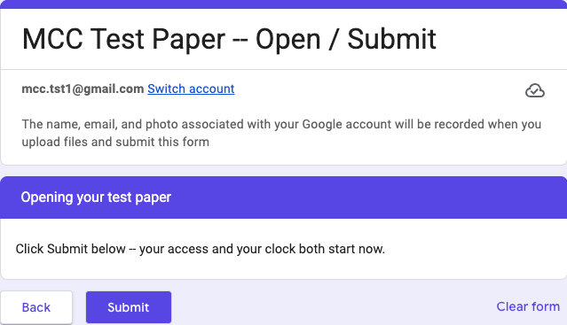</a>

The second click looks exactly like the first — nothing warns the student either way.

<strong>2. [Coordinator]</strong> Check the <code>Exams</code> row. 
<em>What you should see:</em> the start time and deadline are completely unchanged from the first click — the clock did not restart.

<a href="./img/current-standings/tc9-step2-unchanged-row.png" target="_blank" rel="noopener" class="tc-step-shot-link">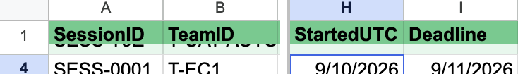</a>

Same StartedUTC, same Deadline — the double-click changed nothing.

---

### Test 10 — A team on break doesn't get scheduled

<label class="tc-done-toggle"><input type="checkbox" class="tc-done-checkbox" data-test="10"> I've run through Test 10</label>

**The situation:** confirms that deactivating a team — a family taking a break, or a team disbanding — actually stops new tests from being scheduled for them, without anyone needing to also delete their data.

**Before you start:** the standard reset, then on the <code>Teams</code> tab set <code>T-EC1</code>'s <code>Active</code> column to <code>FALSE</code> before the next scheduling run.

<strong>1. [Coordinator]</strong> With <code>T-EC1</code> inactive, trigger scheduling again — clicking <strong>Reset my test team(s)</strong> still runs scheduling as its last step. 
<em>What you should see:</em> the result dialog still names <code>T-EC1</code> in its opening line, but the "fresh session(s) locked in" list names only <code>T-WC1</code> — <code>T-EC1</code> gets no new session, and its Regional Pacing row is left completely untouched.

<a href="./img/current-standings/tc10-step1-done-dialog.png" target="_blank" rel="noopener" class="tc-step-shot-link">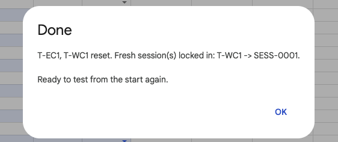</a>

A real result — T-EC1 is named, but gets no fresh session because it's inactive.

<strong>2. [Coordinator]</strong> Set <code>Active</code> back to <code>TRUE</code> and trigger scheduling again. 
<em>What you should see:</em> now it schedules normally, exactly as in Test 1.

<a href="./img/current-standings/tc10-step2-reactivated-dialog.png" target="_blank" rel="noopener" class="tc-step-shot-link">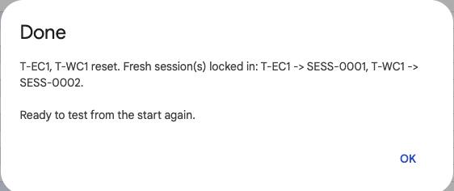</a>

Reactivated — T-EC1 gets a fresh session again, same as any other team.

---

### Test 11 — A team's next test date is stuck in the past

<label class="tc-done-toggle"><input type="checkbox" class="tc-done-checkbox" data-test="11"> I've run through Test 11</label>

**The situation:** confirms that a stale or mistyped date doesn't get quietly auto-corrected, or silently skipped forever — it should be flagged as something a coordinator actually needs to look at and fix.

**Before you start:** the standard reset, then clear <code>T-EC1</code>'s freshly-created row from the <code>Exams</code> sheet (the reset always locks in a fresh session as its last step, and that session has to be cleared first, or it would mask this problem). Then, on the Regional Pacing <code>EC</code> tab, hand-set <code>T-EC1</code>'s next test date to well before today. (Don't use the reset button for this step — it always sets the date to today and immediately locks in a session; edit the date by hand instead.)

<strong>1. [Admin]</strong> Trigger scheduling. 
<em>What you should see:</em> the system's activity log names <code>T-EC1</code> as skipped because its next test date is in the past, and shows that date so a coordinator can see exactly what's stale. It's flagged by name on every run until it's fixed — never scheduled, but never silently dropped either. (<code>T-WC1</code> shows up too, skipped for the unrelated reason that it still has its own unresolved session from the reset.)

<a href="./img/current-standings/tc11-step1-past-date-skip.png" target="_blank" rel="noopener" class="tc-step-shot-link">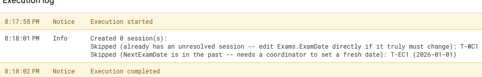</a>

A real run — T-EC1 flagged by name with the stale date it's still carrying.

<strong>2. [Coordinator]</strong> Set the next test date to today, then trigger scheduling again. 
<em>What you should see:</em> now it schedules normally — a fresh session is created for <code>T-EC1</code>. (<code>T-WC1</code> still shows as skipped, for that same unrelated leftover session.)

<a href="./img/current-standings/tc11-step2-normal-scheduling.png" target="_blank" rel="noopener" class="tc-step-shot-link">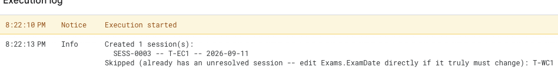</a>

Fixed — T-EC1 schedules normally again once its date is current.

---

### Test 12 — Making sure "Check my data" actually catches problems

<label class="tc-done-toggle"><input type="checkbox" class="tc-done-checkbox" data-test="12"> I've run through Test 12</label>

**The situation:** confirms the self-check isn't just a formality that always comes back green — it needs to actually catch a real broken state, which is the entire reason it exists.

**Before you start:** the standard reset, then deliberately break something small — for example, delete <code>T-EC1</code>'s Regional Pacing row entirely.

<strong>1. [Coordinator]</strong> Click <strong>MCC Tools → Check my data</strong>. 
<em>What you should see:</em> two red rows, both naming <code>T-EC1</code> specifically — one explaining it's active but has no Regional Pacing row and so won't be scheduled, the other that it's due for a chapter with no Regional Pacing row, so the nightly scheduling run will never pick it up. Not a generic "something's wrong" — the exact team and the exact consequence, stated twice.

<a href="./img/current-standings/tc12-step1-check-data.png" target="_blank" rel="noopener" class="tc-step-shot-link">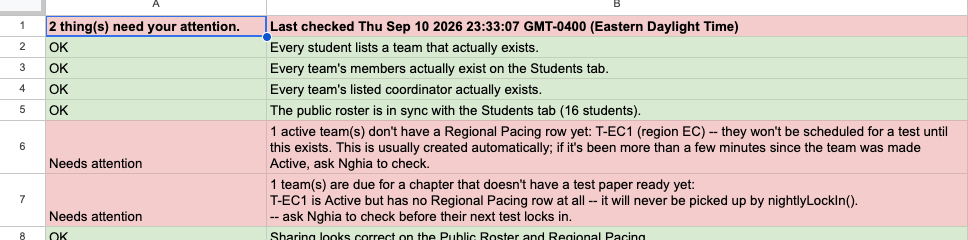</a>

A real check — two rows, same root cause, both naming T-EC1 by name.

<strong>2. [Coordinator]</strong> Click <strong>Reset my test team(s)</strong>. 
<em>Why it matters:</em> confirms the self-service reset can actually recover from this, not just reset an already-clean state. 
<em>What you should see:</em> it should complete normally — or, if it doesn't, that itself is a real finding worth reporting. In practice, it's the latter: the result dialog names only <code>T-WC1</code> in its "fresh session(s) locked in" list, silently leaving out <code>T-EC1</code>, and checking the Regional Pacing tab afterward confirms why — <code>T-EC1</code>'s row is still entirely missing. The self-service button can't recover from a Regional Pacing row that's gone completely; a coordinator hitting this needs to ask for help rather than trust the "Ready to test from the start again" message.

<a href="./img/current-standings/tc12-step2-reset-incomplete.png" target="_blank" rel="noopener" class="tc-step-shot-link">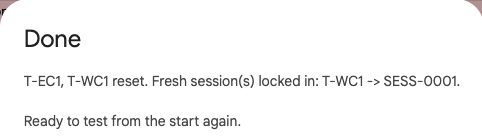</a>

A real finding — T-EC1 is quietly left behind; the button doesn't say so.

---

### Test 13 — Making sure the everyday reset button really works

<label class="tc-done-toggle"><input type="checkbox" class="tc-done-checkbox" data-test="13"> I've run through Test 13</label>

**The situation:** this is genuinely the button a coordinator would click to retest something right now — worth confirming end to end on its own, not just trusting it because every test above happened to use it along the way.

**Before you start:** run Test 1 all the way through first, so there's real state — a graded, advanced team — to reset away.

<strong>1. [Coordinator]</strong> Click <strong>MCC Tools → Reset my test team(s)</strong>. 
<em>What you should see:</em> a confirmation dialog names both <code>T-EC1</code> and <code>T-WC1</code> — every team coordinator <code>O02</code> covers — and explains what it's about to do.

<a href="./img/current-standings/tc13-reset-confirm.png" target="_blank" rel="noopener" class="tc-step-shot-link">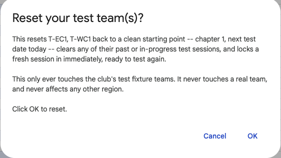</a>

The confirmation dialog after clicking Reset my test team(s).

<strong>2. [Coordinator]</strong> Check the result dialog after confirming. 
<em>What you should see:</em> a fresh session ID is named for each team — confirming the reset and the re-scheduling both actually happened in one click.

A real result — a fresh session locked in for each team.

<strong>3. [Coordinator]</strong> Check <code>T-EC1</code>'s Regional Pacing row and its test history. 
<em>What you should see:</em> the next chapter is back to 1, the next test date is today, the old test rows are gone, and exactly one fresh row exists for today.

<a href="./img/current-standings/tc13-step3-pacing-and-history.png" target="_blank" rel="noopener" class="tc-step-shot-link">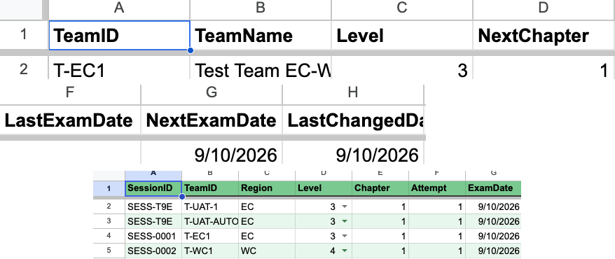</a>

T-EC1 back to chapter 1 (top), with exactly one fresh Exams row (bottom).

<strong>4. [Coordinator]</strong> Check a team in a region <code>O02</code> doesn't cover — for example <code>T-UK1</code>. 
<em>Why it matters:</em> this is the whole safety property this button exists for — a coordinator resetting their own teams must never be able to touch anyone else's. 
<em>What you should see:</em> completely untouched, identical to before the click.

<a href="./img/current-standings/tc13-step4-uk1-unchanged.png" target="_blank" rel="noopener" class="tc-step-shot-link">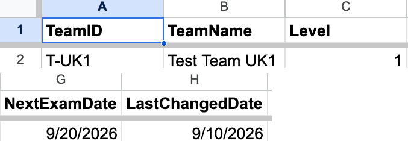</a>

T-UK1 — a team O02 doesn't coordinate — completely untouched.

---

### Test 14 — Someone is signed into the wrong email

<label class="tc-done-toggle"><input type="checkbox" class="tc-done-checkbox" data-test="14"> I've run through Test 14</label>

**The situation:** simulates the single most common real mix-up — a parent using their own email instead of the student's registered one, or a typo'd address. The form shouldn't misattribute the submission to the wrong team, or show a confusing error — it should simply not recognize the person, and (consistent with every other exception above) tell them nothing either way.

**Before you start:** the standard reset.

<strong>1. [Anyone]</strong> Signed in as an account that isn't registered to <code>T-EC1</code> — <code>nghia71@gmail.com</code> works fine for this — open the form, choose "I'm ready to open my test paper," and submit. 
<em>What you should see:</em> the form's ordinary confirmation message — again, no visible error of any kind.

<a href="./img/current-standings/tc14-step1-form-confirmation.png" target="_blank" rel="noopener" class="tc-step-shot-link">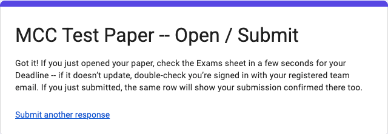</a>

A real submission — the same friendly confirmation, whether or not the email was actually recognized.

<strong>2. [Coordinator]</strong> Check the <code>Exams</code> sheet. 
<em>What you should see:</em> nothing changed anywhere — no row was touched. If a real family ever reports "nothing happened when I clicked start," this is the first thing to check, ahead of Test 7's missing-paper situation — most often, it's simply the wrong email signed in.

<a href="./img/current-standings/tc14-step2-exams-unchanged.png" target="_blank" rel="noopener" class="tc-step-shot-link">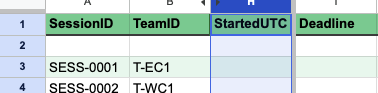</a>

Confirmed — T-EC1's row is exactly as it was; the unrecognized email touched nothing.

---

### Cleanup afterward

**[Coordinator]** Click **MCC Tools → Reset my test team(s)** one more time, to leave a clean baseline for next time.

### What this walkthrough does and doesn't prove

Every test above exercises the same underlying system that gets checked automatically every time something changes. Running through it by hand like this isn't a hunt for new problems — it's confirming what a real coordinator, a real family, and a real grader each actually experience, using only the access each of them would really have. Test 7 and Test 14 in particular are worth re-reading even after they pass cleanly: they're not bugs waiting to be fixed, they're **real, permanent gaps** — no student-facing error message exists yet for either situation — that every coordinator should know about, because the system itself will never mention them.

**Coming next.** Once this practice-account walkthrough is fully illustrated with screenshots for every step (and a short walkthrough video at the end for anyone who'd rather watch than read), the same 14 tests become the template for real testing with real people — real coordinators, real families, and real graders, volunteering to run a smaller slice of this walkthrough themselves against their own accounts. See [Organization](./organization.md) if you'd like to help.

